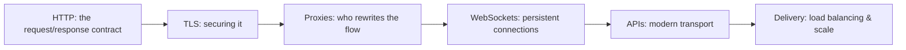

# 🕸️ Web & Application Protocols

> [!abstract] Application branch
> The layer users actually touch, and where most breaches now happen. This branch treats the web as a set of protocols and infrastructure — the request/response contract, the encryption that protects it, the proxies that rewrite it, and the delivery machinery in front of every real service — rather than as a catalogue of vulnerabilities, which live in the offensive and appsec domains.

## 🗺️ Zero-to-Mastery Learning Path

1. [[HTTP Fundamentals]]
2. [[HTTPS & the TLS Handshake]]
3. [[Web Architecture & Proxies]]
4. [[WebSockets & Real-Time Protocols]]
5. [[REST & Modern API Transport]]
6. [[Application Delivery & Load Balancing]]

---
> 🔼 Up: [[Networking]]
