# 🏗️ Web Architecture & Proxies

> [!abstract] Note of [[Web & Application Protocols]]
> A request to a modern website rarely reaches "the server" — it passes through a chain of proxies, caches, and load balancers, each of which may read, rewrite, cache, or reject it. This note maps that chain, explains why the client's true identity is hard to establish behind it, and why the boundaries between these components are where request smuggling and cache poisoning live.

## Parent Learning Order
HTTP Fundamentals -> HTTPS & the TLS Handshake -> Web Architecture & Proxies -> WebSockets & Real-Time Protocols -> REST & Modern API Transport -> Application Delivery & Load Balancing

## Start at Zero: There Is No Single Server

A beginner imagines a browser talking to one web server. Reality is a chain, and each hop has a job:

```mermaid
flowchart LR
    B["Browser"] --> CDN["CDN / edge cache"]
    CDN --> WAF["WAF / reverse proxy"]
    WAF --> LB["Load balancer"]
    LB --> APP["Application server"]
    APP --> DB["Database"]
    style B fill:#1a3a5a
    style APP fill:#3a5a1a
```



Two proxy types with opposite orientations anchor everything.

A **forward proxy** sits in front of *clients* and represents them to the outside world. Users on a corporate network reach the Internet through it; it enforces policy, caches, and logs on the client's behalf. The servers it contacts see the proxy, not the user.

A **reverse proxy** sits in front of *servers* and represents them to the world. Clients connect to it believing it is the website; it terminates TLS, caches responses, filters malicious requests, and distributes load to backends. The clients see the proxy, not the real server.

```text
Forward proxy:  many clients -> [proxy] -> the Internet   (protects/represents clients)
Reverse proxy:  the Internet -> [proxy] -> many servers   (protects/represents servers)
```

Everything in front of the application — CDN, WAF, load balancer — is a form of reverse proxy. This is why "the server" is a simplification: the address a client connects to is almost always an intermediary.

## The Identity Problem

Because a reverse proxy terminates the client's connection and opens a new one to the backend, **the backend sees the proxy's address as the source, not the client's.** Every backend log would attribute all traffic to the proxy, which is useless for security and analytics.

The workaround is a header the proxy adds:

```text
X-Forwarded-For: 203.0.113.55, 198.51.100.9
Forwarded: for=203.0.113.55; proto=https; host=shop.example.com
```

`X-Forwarded-For` accumulates client addresses as the request passes through proxies. The standardized `Forwarded` header does the same more robustly.

Here is the critical security subtlety: **these headers are trivially forged.** A client can send `X-Forwarded-For: 127.0.0.1` in its very first request, and if any component trusts that header uncritically, the client has just spoofed its own source address at the application layer. Applications that make security decisions on `X-Forwarded-For` — allowlisting "internal" addresses, rate-limiting by client IP, logging for attribution — can be bypassed by forging it.

The correct handling: a proxy must **overwrite**, not append to, the header for untrusted inbound requests, and the application must only trust the header when the immediate connection came from a known proxy. The real client address is "the last address added by a proxy you trust," counting from the right — never the leftmost value a client supplied. Getting this wrong is a recurring, high-impact configuration error.

```bash
curl -H 'X-Forwarded-For: 10.0.0.1' https://<lab app>/whoami
```

Expected excerpt from a misconfigured app:

```text
{"client_ip":"10.0.0.1"}
```

That output is the vulnerability: the app believed a header the client wrote.

## HTTP Versions Change the Wire, Not the Semantics

The request/response model is constant, but how it travels evolved, and the differences matter for both performance and security.

| Version | Transport | Framing | Key property |
| --- | --- | --- | --- |
| **HTTP/1.1** | TCP | Text, one request at a time per connection | Simple; head-of-line blocking; keep-alive reuses connections |
| **HTTP/2** | TCP | Binary, multiplexed streams | Many streams per connection; still one TCP stream underneath |
| **HTTP/3** | QUIC (UDP) | Binary, independent streams | No TCP head-of-line blocking; encrypted transport |

HTTP/1.1 sends human-readable text and handles one request at a time per connection (with keep-alive to reuse the connection). HTTP/2 makes the framing binary and multiplexes many logical streams over one connection, but they share one TCP byte stream, so a lost packet still stalls all of them. HTTP/3 moves onto QUIC to escape that, as covered in the transport branch.

The security relevance is at the **boundaries between versions**. A chain often speaks HTTP/2 at the edge and HTTP/1.1 to the backend, and the translation between framings is where parsing discrepancies arise — the foundation of request smuggling, below.

## Where the Boundaries Leak

**Request smuggling** exploits disagreement between two servers in a chain about where one request ends and the next begins. HTTP/1.1 offers two ways to state a body's length — `Content-Length` and `Transfer-Encoding: chunked` — and if a front-end proxy and a back-end server resolve a conflicting or ambiguous combination differently, an attacker can craft a request that the front-end sees as one message and the back-end sees as two. The smuggled portion is then prepended to the *next* client's request, poisoning it. The vulnerability is not in either server alone; it is in the **disagreement** between them, which is why it is an architecture problem.

**Cache poisoning** exploits the cache in the chain. If a cache stores a response keyed on parts of the request it should have included in the key but did not — say it ignores a header that the backend uses to build the response — an attacker can craft a request that causes a malicious response to be cached and then served to every subsequent user. Again, the flaw lives at the boundary: the cache and the application disagree about what makes a response unique.

Both share a lesson: **each component parses and keys requests slightly differently, and every difference is an attack surface.** This is the web-layer version of the fragment-reassembly and tag-stacking ambiguities seen lower in the stack — wherever two implementations may interpret the same bytes differently, that gap is exploitable.

## Security Implications

**The chain is both defense in depth and a larger attack surface.** Each proxy can enforce a control — the WAF filters, the CDN absorbs floods, the load balancer terminates TLS — but each is also code parsing untrusted input, and each boundary between them is a potential smuggling or poisoning point. More components mean more enforcement and more seams.

**Trust boundaries must be explicit.** The single most important architectural decision is which components are trusted and where the untrusted Internet ends. Headers like `X-Forwarded-For`, the real client identity, and internal-only endpoints are all safe only if the boundary between "outside" and "inside" is precisely defined and enforced. A backend that assumes it is only reachable through the proxy, but is actually reachable directly, is a bypass.

**Logging must span the chain with a correlation identifier.** Because a request touches many components, investigating it requires correlating logs across all of them, ideally with a request ID injected at the edge and carried through. Without it, a single request appears as unrelated entries in several systems, and the true client — established only at the trusted edge — cannot be tied to backend activity.

**The edge is the right place for broad controls, the app for specific ones.** Rate limiting, TLS termination, geo-filtering, and volumetric absorption belong at the edge where they scale; authorization and business logic belong at the application where the context exists. Pushing app-specific decisions to the edge (or broad ones to the app) tends to produce both gaps and bottlenecks.

All testing described here must target only systems within an authorized scope. Header forgery, smuggling, and cache-poisoning techniques are intrusive and must be confined to systems you are authorized to assess.

## Authorized Lab: Trace a Request Through the Chain

Use a lab with a reverse proxy in front of a backend application, plus a cache, all under your control.

1. **Establish the chain.** Configure a reverse proxy forwarding to a backend, and confirm the client connects to the proxy while the backend receives the forwarded request.
2. **Observe the identity change.** On the backend, log the connection's source address and confirm it is the proxy's, not the client's. Then have the proxy add `X-Forwarded-For` and confirm the backend can now recover the client address from it.
3. **Forge the header.** From the client, send a request with a spoofed `X-Forwarded-For` and confirm whether the backend believes it. Then configure the proxy to overwrite the header for inbound requests and confirm the forgery no longer works — the difference between appending and overwriting made concrete.
4. **Compare HTTP versions.** Request the same resource over HTTP/1.1 and HTTP/2 and capture both; confirm the text versus binary framing while the semantics are identical.
5. **Demonstrate a caching key gap.** Configure the cache to ignore a header that the backend uses to vary its response. Send a request that causes an attacker-influenced response to be cached, then request as a normal user and confirm the poisoned response is served. Fix the cache key and confirm the poisoning stops.
6. **Add correlation.** Inject a request ID at the proxy and confirm it appears in both proxy and backend logs, letting one request be traced end to end.
7. **Cleanup.** Restore the cache configuration, remove any forged-header trust, and confirm the baseline behaviour.

Expected interpretation:

```text
Backend source = proxy   -> the reverse proxy terminated and re-originated the connection
X-Forwarded-For appended -> client identity recoverable, but forgeable if trusted blindly
Proxy overwrites header  -> forgery defeated; trust only what a known proxy set
Cache ignores vary header-> poisoned response served to later users (boundary disagreement)
Request ID               -> one request correlated across every component in the chain
```

## Crook → Operator → Root Checkpoint

- **Crook:** Distinguish a forward proxy from a reverse proxy by what each represents, and explain why "the server" a browser reaches is usually an intermediary.
- **Operator:** Explain why the backend sees the proxy's address and how `X-Forwarded-For` recovers the client identity; configure a proxy to set it safely and demonstrate the forgery it prevents.
- **Root:** Explain how request smuggling and cache poisoning arise from parsing and keying disagreements between components rather than from any single server; argue why trust boundaries must be explicit and why cross-chain correlation is required to attribute activity.

---
> 🔼 Up: [[Web & Application Protocols]]
