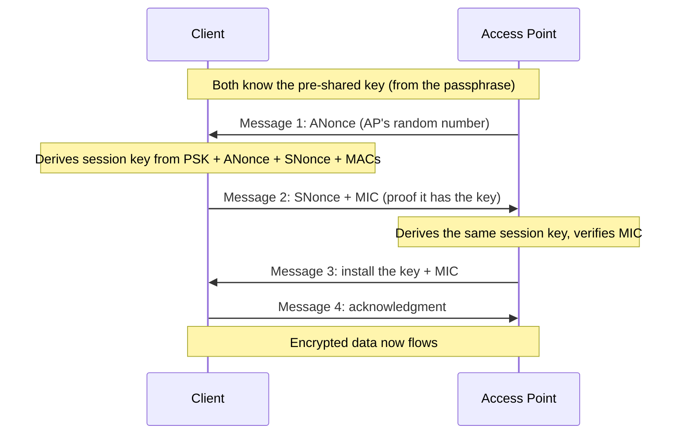

# 🔐 Wi-Fi Security & WPA

> [!abstract] Note of [[Wireless Networking]]
> Because anyone in range hears every frame, wireless security lives or dies on its encryption, and that encryption has been broken and rebuilt three times. This note traces WEP to WPA3, explains the four-way handshake that everything hinges on, and distinguishes personal from enterprise authentication — the single most important design choice for an organization's Wi-Fi.

## Parent Learning Order
Wireless Fundamentals & 802.11 -> Wi-Fi Security & WPA -> Wireless Attacks & Rogue Infrastructure -> Cellular & Long-Range Wireless -> Bluetooth & Personal-Area Networks -> Wireless Reconnaissance & Defense

## Start at Zero: Why the Encryption Is Everything

On the shared radio medium, a passive listener captures every frame. The only thing standing between that listener and your traffic is encryption. If the encryption is weak, the physical exposure becomes a full compromise; if it is strong, the listener gets ciphertext. This is why Wi-Fi security *is* Wi-Fi encryption, and why the history of Wi-Fi is a history of encryption schemes being broken and replaced.

| Scheme | Era | Status |
| --- | --- | --- |
| **WEP** | 1997 | Catastrophically broken — crackable in minutes |
| **WPA** | 2003 | Interim fix, also weak, deprecated |
| **WPA2** | 2004 | Long-standing standard; strong but with known weaknesses |
| **WPA3** | 2018 | Current; fixes WPA2's core handshake weakness |

**WEP (Wired Equivalent Privacy)** promised, by its name, wired-equivalent security and failed completely. Its flaws let an attacker recover the key by passively collecting enough traffic — crackable in minutes with commodity tools. WEP is a museum piece, and its lesson is permanent: an encryption scheme is only as good as its cryptographic design, and "we use encryption" means nothing if the scheme is broken.

**WPA2** became the workhorse for over a decade, using strong AES-based encryption. It is genuinely strong for the data, but its *handshake* has a weakness that WPA3 was created to fix, examined below.

**WPA3** is the current standard, and its central improvement is replacing the vulnerable handshake with one that resists the offline attacks that plague WPA2.

## The Four-Way Handshake

Everything in WPA2 security depends on one exchange: the **four-way handshake** that occurs after association, establishing the encryption keys for the session.

The starting point is a shared secret. In **WPA2-Personal**, that secret derives from the network **passphrase** everyone knows. The handshake uses it to derive a unique per-session key without ever sending the passphrase over the air.



The design is clever — the passphrase never crosses the air, and each session gets a fresh key. But there is a fatal exposure: **the handshake contains enough information for an offline attack.** An attacker who captures the four-way handshake can take it away and, offline, guess passphrases — for each candidate, derive what the key would be and check whether it produces the captured handshake's verification value. No further interaction with the network is needed.

This is the defining WPA2 weakness. The attacker does not need to break the encryption; they need to capture one handshake and then guess the passphrase offline, at whatever speed their hardware allows, forever, with no lockout. A weak or common passphrase falls quickly. To capture a handshake, an attacker often forces a connected client to reconnect using a forged deauthentication frame (the management-frame weakness from the previous leaf), then captures the resulting handshake — the two flaws chaining together.

WPA3 fixes exactly this. It replaces the handshake with **SAE (Simultaneous Authentication of Equals)**, a design that does not expose a capturable value an attacker can guess against offline. Each guess requires a fresh interaction with the network, which is slow, rate-limitable, and detectable — turning an unlimited offline attack into a bounded online one. WPA3 also provides forward secrecy, so capturing traffic and later learning the passphrase does not decrypt past sessions.

## Personal Versus Enterprise: The Real Decision

The passphrase model has a structural problem no encryption strength fixes: **everyone shares one secret.** In WPA2/WPA3-Personal, every device uses the same passphrase, which means:

- A departing employee still knows it.
- A compromised device exposes it.
- Changing it requires reconfiguring every device.
- One captured handshake plus that shared passphrase compromises everyone.

**WPA-Enterprise** solves this by giving every user or device **individual credentials**, validated against a central **RADIUS** server using the **802.1X** framework from the security-architecture branch. There is no shared passphrase. Each user authenticates with their own identity (a username and password, or a certificate), the RADIUS server validates it, and each session's keys are unique to that authenticated identity.

```text
Personal:    one passphrase, everyone shares it, offline-crackable if captured
Enterprise:  per-user credentials via 802.1X/RADIUS, individually revocable, no shared secret
```

The consequences are decisive for any organization:

- **Revocation** — disable one user without touching anyone else's access.
- **Attribution** — sessions tie to identities, so logs name a person, not just a device.
- **No shared secret to capture and crack** — the personal-mode offline attack does not apply.
- **Posture and policy** — RADIUS can enforce device health and assign VLANs by identity, exactly as in wired 802.1X.

The trade-off is infrastructure: Enterprise requires a RADIUS server and a credential system, which is why homes and small offices use Personal. For any organization of size, Enterprise is the correct choice, and Personal is a liability that scales badly.

```bash
# capture the handshake type in use (enterprise shows EAP frames)
sudo tcpdump -i wlan0 -nn 'ether proto 0x888e'
```

Expected excerpt (Enterprise):

```text
EAPOL (802.1X), Request, Identity
EAP, Response, Identity
EAP, Request, TLS
```

The presence of EAP/identity exchange distinguishes Enterprise (individual authentication) from Personal (the four-way handshake alone).

## Security Implications

**Passphrase strength is the whole game in Personal mode.** Because the handshake is offline-crackable in WPA2-Personal, the only defense is a passphrase strong enough to resist offline guessing — long and random, not a dictionary word or a predictable pattern. A weak passphrase on WPA2-Personal is effectively no security once a handshake is captured, which takes seconds. WPA3 raises this bar dramatically by making guessing require online interaction.

**Deprecate WEP and WPA absolutely, and move off WPA2-Personal where feasible.** WEP and original WPA are broken and must never be used. WPA2 remains widely deployed and acceptable with a strong passphrase and Protected Management Frames, but WPA3 is the target, and the handshake weakness is the concrete reason. Networks offering a WPA2 fallback for compatibility retain the WPA2 weakness for those clients.

**Enterprise is the architectural answer for organizations.** The shared-secret problem of Personal mode is not a strength issue but a management and blast-radius issue, and only per-user credentials solve it. This connects wireless directly to the identity-based, zero-trust direction of the security-architecture branch: access should be per-identity and revocable, on wireless exactly as on wired.

**Transition modes reintroduce old weaknesses.** WPA3 networks that also accept WPA2 clients for compatibility ("transition mode") can be downgraded by an attacker forcing WPA2, reopening the handshake attack. Where the client base allows, WPA3-only is stronger than a mixed mode.

**Encryption protects the data, not the metadata.** Even strong Wi-Fi encryption leaves management frames and traffic patterns observable. Who is connected, when, and how much they transmit remains visible, which is why the reconnaissance and defense leaf treats metadata as its own concern.

All handshake capture and cracking described here must target only networks you own or are explicitly authorized to test. Capturing and attacking handshakes on networks you do not control is unlawful interception.

## Authorized Lab: Capture and Compare

Use a monitor-capable adapter and lab APs you control, configured for WPA2-Personal, WPA3, and (if available) WPA-Enterprise.

1. **Capture a WPA2 handshake.** On your WPA2-Personal lab AP, capture the four-way handshake as a client connects; if needed, force a reconnection with a deauthentication frame (on your own network) and capture the resulting handshake.
2. **Attempt an offline guess.** Against the captured handshake, run a passphrase guess using a small wordlist that includes your lab passphrase, and confirm a weak passphrase is recovered offline — no further network interaction needed. Then set a long random passphrase and confirm the same wordlist fails, demonstrating that strength is the only defense.
3. **Observe WPA3 resistance.** On the WPA3 lab AP, confirm the SAE handshake does not yield a capturable value that supports the same offline attack, and that guessing would require repeated online interaction.
4. **Distinguish Enterprise.** On the WPA-Enterprise AP, capture the association and confirm the EAP/802.1X identity exchange, showing per-user authentication rather than a shared passphrase.
5. **Demonstrate revocation.** On the Enterprise setup, disable one user's credentials and confirm that user can no longer connect while others are unaffected — the capability Personal mode lacks.
6. **Show transition-mode downgrade.** On a WPA3 AP in transition mode, confirm a client can be pushed to WPA2 and the handshake weakness reappears; set the AP to WPA3-only and confirm the downgrade fails.
7. **Cleanup.** Restore lab AP configurations and stop all captures.

Expected interpretation:

```text
WPA2 handshake   -> captured; a weak passphrase falls to offline guessing
Strong passphrase-> the same attack fails; strength is the only Personal defense
WPA3 SAE         -> no capturable value for offline guessing; attacks must go online
Enterprise EAP   -> per-user identity, not a shared passphrase
Revocation       -> one user disabled without affecting others
Transition mode  -> downgradable to WPA2; WPA3-only prevents it
```

## Crook → Operator → Root Checkpoint

- **Crook:** Explain why Wi-Fi security is fundamentally about encryption, name the WEP→WPA3 progression, and state what the four-way handshake establishes.
- **Operator:** Capture a WPA2 handshake and explain the offline attack it enables; distinguish Personal from Enterprise by the presence of an 802.1X/EAP exchange and explain why the shared passphrase is a management liability.
- **Root:** Explain precisely why the WPA2 handshake is offline-crackable and how WPA3's SAE removes that exposure; argue Enterprise as the organizational answer for revocation and attribution, and why transition modes and WPA2 fallback reintroduce the old weakness.

---
> 🔼 Up: [[Wireless Networking]]
