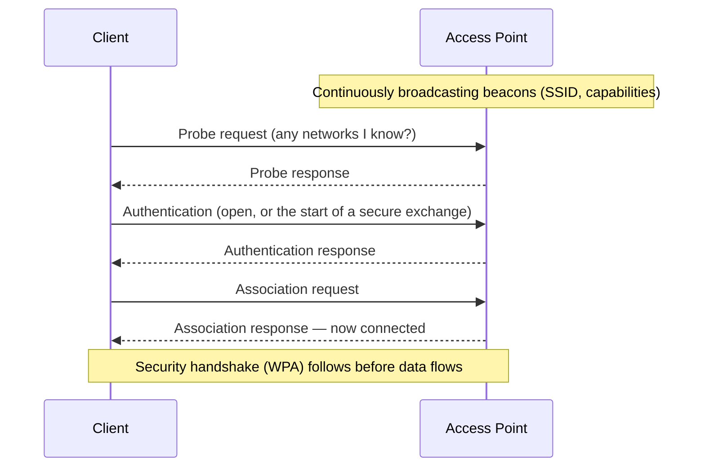

# 📡 Wireless Fundamentals & 802.11

> [!abstract] Note of [[Wireless Networking]]
> Wi-Fi replaces a wire with radio, and that single change removes the physical boundary every wired control assumed. This note builds 802.11 from the radio up — bands, channels, frames, and association — so a reader understands why the medium is shared with anyone in range, and why that is the root fact behind every wireless security concern.

## Parent Learning Order
Wireless Fundamentals & 802.11 -> Wi-Fi Security & WPA -> Wireless Attacks & Rogue Infrastructure -> Cellular & Long-Range Wireless -> Bluetooth & Personal-Area Networks -> Wireless Reconnaissance & Defense

## Start at Zero: A Wire You Cannot See or Contain

On a wired network, a frame travels down a cable to a switch that delivers it only where it should go. To intercept it, an attacker must physically tap the cable. The wire is a boundary.

Wireless has no wire. **802.11** — the family of standards marketed as **Wi-Fi** — transmits frames as radio waves that propagate in all directions, through walls, past property lines, into the parking lot. Every device within range receives every transmission at the physical layer; the network relies on addressing and encryption, not physics, to keep frames private.

This is the foundational fact of wireless security: **the medium is shared and uncontainable.** A wired attacker needs physical access to a cable; a wireless attacker needs only to be within radio range, which extends far beyond the walls. Every topic in this branch descends from that difference.

Wi-Fi operates in unlicensed radio **bands**:

| Band | Character | Trade-off |
| --- | --- | --- |
| **2.4 GHz** | Longer range, penetrates walls | Crowded, slower, few non-overlapping channels |
| **5 GHz** | Faster, more channels | Shorter range, weaker through walls |
| **6 GHz** (Wi-Fi 6E) | Much more spectrum, clean | Newest, shortest range |

Each band is divided into **channels**. The classic gotcha is in 2.4 GHz: its channels overlap, and only channels 1, 6, and 11 do not interfere with each other. Neighbouring access points on overlapping channels degrade each other, which is why a congested apartment building has terrible Wi-Fi regardless of equipment quality — a physical-layer interference problem, not a configuration one.

## The Network's Identity and Structure

An **access point (AP)** bridges the wireless medium to the wired network. The network it offers is named by an **SSID (Service Set Identifier)** — the human-readable network name you select.

The AP announces itself by broadcasting **beacon frames** many times per second, advertising the SSID, supported rates, and security capabilities. This beaconing is why networks appear in your device's list without any action — the AP is continuously shouting "I am here, this is my name, here is how to join." It is also why "hiding" an SSID by not including it in beacons provides almost no security: the name still travels in other frames whenever a client connects, and is trivially captured.

```bash
sudo iw dev wlan0 scan | grep -E "SSID|freq|signal" | head -12
```

Expected excerpt:

```text
	freq: 2437
	signal: -42.00 dBm
	SSID: CorpNet
	freq: 5180
	signal: -67.00 dBm
	SSID: CorpNet-5G
	freq: 2412
	signal: -71.00 dBm
	SSID: Guest
```

`freq: 2437` is channel 6; `signal: -42 dBm` is strong (closer to zero is stronger, so -42 beats -71). Reading signal strength in dBm is basic wireless literacy: roughly, -30 is excellent, -67 is usable for most things, -80 is marginal, -90 is unusable.

## How Frames Share the Air

Wired Ethernet detects collisions after they happen. Radio cannot — a transmitting device cannot simultaneously listen for a collision on the same frequency. So 802.11 uses **CSMA/CA (Carrier Sense Multiple Access with Collision Avoidance)**: a device listens first, and if the medium is busy, waits a random interval before trying, actively *avoiding* collisions rather than detecting them.

This has a performance consequence people find counterintuitive: **wireless bandwidth is shared among all devices on a channel, and it degrades as more devices join**, because they must take turns on one medium. A wired switch gives each port its own collision domain; a wireless AP is more like an old hub, with everyone sharing the air.

802.11 also defines three frame types, and the distinction matters enormously for security:

- **Data frames** carry actual traffic — these are encrypted when security is enabled.
- **Control frames** manage medium access (acknowledgments, clear-to-send).
- **Management frames** handle the network relationship — beacons, association, authentication, and **deauthentication**.

Here is the critical historical weakness: in the original standards, **management frames were not authenticated or encrypted**. That means an attacker can forge a deauthentication frame telling a client it has been disconnected, and the client obeys. This one gap enables a whole class of attacks and is addressed only by the later **Protected Management Frames** feature.

## Association: Joining a Network



The sequence shows that joining a network is a conversation of management frames *before* any encryption is established. That pre-encryption window — beacons, probes, authentication, association — is visible to anyone listening and is where much wireless reconnaissance and attack occurs. Note the **probe request**: a client actively asks for networks it knows, which means a device's probe requests leak the names of networks it has previously joined — a privacy and tracking concern examined in the reconnaissance leaf.

## Security Implications

**No physical boundary means no perimeter.** Every wired security assumption that relied on controlling physical access fails for wireless. An attacker in the parking lot is, from the radio's perspective, on your network's doorstep. This is why wireless demands strong encryption and authentication as a baseline rather than as an enhancement — there is no wall doing the work.

**Unauthenticated management frames are a design flaw with lasting consequences.** Because deauthentication and other management frames were forgeable, an attacker can disconnect clients at will (denial of service) and force reconnections that expose the security handshake to capture. Protected Management Frames, mandatory in the latest standards, close this, but it took decades and vast numbers of devices remain vulnerable.

**Hidden SSIDs and MAC filtering are not security.** Not broadcasting the SSID hides it from casual view but not from anyone capturing frames, and it makes clients *more* trackable because they must probe for it explicitly. MAC address filtering is defeated by spoofing an observed allowed address, exactly as at the link layer. Both are obscurity, not control, and relying on them is a common mistake.

**Signal reach is an attack surface to be measured.** Because the signal extends beyond the intended area, part of securing wireless is knowing how far it actually reaches. An AP whose usable signal extends into a public street has enlarged its attack surface, and reducing transmit power or positioning APs to contain the signal is a genuine, if partial, control.

**Shared medium enables passive collection.** Anyone in range can capture all wireless frames at the physical layer without joining the network. Data is protected only by encryption, so the strength of that encryption — the subject of the next leaf — is what stands between a passive listener and your traffic.

All scanning and capture described here must target only networks you own or are explicitly authorized to assess. Capturing wireless frames intercepts other parties' communications, and doing so on networks you do not own is unlawful.

## Authorized Lab: Read the Air

Use a wireless adapter capable of monitor mode and a lab AP you control. Do not capture traffic from networks you do not own.

1. **Scan for networks.** Use the scan command above and identify your lab AP's SSID, channel (from frequency), and signal strength. Note other networks' channels and observe 2.4 GHz overlap.
2. **Enter monitor mode** and capture management frames on your AP's channel:

```bash
sudo iw dev wlan0 set type monitor
sudo tcpdump -i wlan0 -nn -c 20 'type mgt'
```

3. **Identify beacons.** Confirm your AP's beacon frames appear many times per second, advertising the SSID and capabilities — the continuous "I am here."
4. **Watch an association.** Connect a lab client and capture the probe, authentication, and association exchange, confirming these management frames are visible before any encryption.
5. **Observe probe leakage.** Capture a client's probe requests and confirm it reveals names of networks it has previously joined — the tracking concern.
6. **Demonstrate the shared medium.** Connect several clients and observe throughput per client fall as more devices contend for the channel, confirming bandwidth is shared, not per-device.
7. **Cleanup.** Return the adapter to managed mode and stop the capture.

Expected interpretation:

```text
Scan            -> SSIDs, channels, signal in dBm; 2.4 GHz channels overlap
Beacons         -> the AP continuously advertises itself and its security
Association     -> management frames visible before encryption begins
Probe requests  -> a client leaks names of networks it remembers
Shared medium   -> per-client throughput drops as devices contend for the air
```

## Crook → Operator → Root Checkpoint

- **Crook:** Explain why wireless has no physical boundary, what an SSID and a beacon frame are, and why bandwidth is shared among devices on a channel.
- **Operator:** Scan for networks and read channel and signal strength; capture management frames and identify beacons, probes, and the association exchange, explaining what is visible before encryption.
- **Root:** Explain why unauthenticated management frames enable deauthentication and handshake-capture attacks and what Protected Management Frames fix; argue why hidden SSIDs and MAC filtering are obscurity rather than control, and why signal reach is a measurable attack surface.

---
> 🔼 Up: [[Wireless Networking]]
