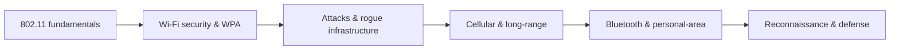

# 📶 Wireless Networking

> [!abstract] Wireless branch
> Wireless replaces the cable with a shared medium anyone within range can hear, which changes the threat model completely: there is no physical boundary to defend. This branch covers how radio networks work, how their security evolved from broken to strong, and the attacks that exploit the one thing wireless cannot hide — that its signal reaches beyond the wall.

## 🗺️ Zero-to-Mastery Learning Path

1. [[Wireless Fundamentals & 802.11]]
2. [[Wi-Fi Security & WPA]]
3. [[Wireless Attacks & Rogue Infrastructure]]
4. [[Cellular & Long-Range Wireless]]
5. [[Bluetooth & Personal-Area Networks]]
6. [[Wireless Reconnaissance & Defense]]

---
> 🔼 Up: [[Networking]]
