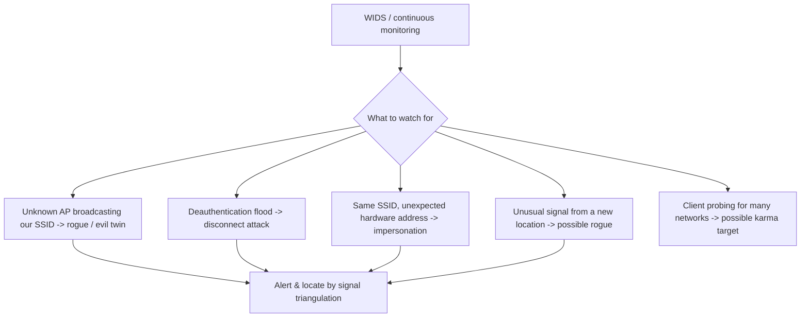

# 🛰️ Wireless Reconnaissance & Defense

> [!abstract] Note of [[Wireless Networking]]
> This leaf closes the wireless branch by turning its attacks into a defensive program: knowing what your own airspace looks like, detecting the rogue APs and attacks the earlier leaves described, and hardening the network against them. The recurring truth is that a rogue transmitter must broadcast to function, which means the defender who listens can find it.

## Parent Learning Order
Wireless Fundamentals & 802.11 -> Wi-Fi Security & WPA -> Wireless Attacks & Rogue Infrastructure -> Cellular & Long-Range Wireless -> Bluetooth & Personal-Area Networks -> Wireless Reconnaissance & Defense

## Start at Zero: You Cannot Defend Airspace You Have Not Mapped

Wired security starts from a known topology — you have the cable map. Wireless security starts from ignorance: the airspace contains your APs, your clients, your neighbours' networks, and potentially an attacker's rogue infrastructure, all mixed together on shared channels. **The first act of wireless defense is reconnaissance of your own airspace** — discovering what is actually transmitting, so that "normal" is defined and anomalies stand out.

This is the same principle as sensor placement and blind-spot mapping in the security-architecture branch: you cannot detect what deviates from normal until you know what normal is, and for wireless, normal is a map of transmitters.

**Wardriving** is the technique, named for driving an area while scanning, and it is dual-use: an attacker maps target networks and their security, and a defender maps their own airspace to know what is there. The tools and the act are identical; only the authorization and the purpose differ.

```bash
sudo iw dev wlan0 scan | grep -E "SSID|signal|freq|WPA|RSN|Privacy" | head -20
```

Expected excerpt:

```text
	freq: 2437
	signal: -45.00 dBm
	SSID: CorpNet
	RSN:	 * Pairwise ciphers: CCMP
	freq: 2412
	signal: -78.00 dBm
	SSID: CorpNet          <-- same SSID, weaker signal, different location?
	Privacy: (no RSN/WPA)  <-- open! an evil twin?
```

That excerpt is a rogue-AP hunt in miniature: two APs claiming `CorpNet`, one properly secured with strong encryption and one open — the second is a candidate evil twin worth investigating. Reading security capabilities (RSN/WPA present or `Privacy` absent) alongside SSID and signal is how a defender distinguishes their real network from an impostor.

## The Site Survey: Defining Normal

A **wireless site survey** systematically maps an organization's airspace: which APs exist, their SSIDs and hardware addresses, their channels, their coverage, and their signal reach. It produces the baseline against which anomalies are detected and answers defensive questions the earlier leaves raised:

- **Signal reach** — does usable signal extend into the parking lot or street? That is attack surface to reduce with power and placement.
- **Channel usage** — are APs on non-overlapping channels, or interfering?
- **Coverage gaps** — where is signal weak enough that users might connect to a rogue AP offering better signal?
- **The authorized-AP inventory** — the definitive list of hardware addresses that *should* be broadcasting your SSIDs, so anything else claiming them is rogue.

That last item is the linchpin of rogue detection. Once you have an authoritative list of your legitimate APs' hardware addresses, any AP broadcasting your SSID with a different address is, by definition, not yours.

## Detecting the Attacks

Each attack from the earlier leaves has a detectable signature, and a **WIDS (Wireless Intrusion Detection System)** watches for them continuously.



The defender's structural advantage is decisive: **a rogue AP or an active attack must transmit to function, and transmitting is detectable.** An evil twin has to broadcast the SSID to lure clients; a deauth attack has to send deauth frames; a karma AP has to answer probes. None can operate silently, so continuous monitoring of the airspace catches them — and signal strength from multiple sensors can even triangulate the rogue's physical location. Unlike many attacks, wireless attacks announce themselves by their nature.

Deauthentication floods are especially clear: a burst of deauth frames far exceeding normal is an unmistakable signature, and detecting it is straightforward for any monitor watching management frames.

## Hardening the Wireless Network

Reconnaissance and detection feed a hardening program that applies the earlier leaves' lessons:

- **Use WPA3, or WPA2 with strong configuration** — the encryption is the foundation; deprecate WEP and WPA absolutely, and prefer WPA3-only over transition mode.
- **Enable Protected Management Frames** — this closes the unauthenticated-management-frame hole, defeating deauthentication attacks at their root rather than merely detecting them.
- **Use WPA-Enterprise with enforced server-certificate validation** — per-user credentials for revocation and attribution, and the client-side certificate check that defeats Enterprise evil twins.
- **Deploy a WIDS** — continuous detection of rogue APs and attacks, with alerting and ideally location.
- **Manage signal reach** — tune power and AP placement to contain usable signal within the intended area.
- **Maintain the authorized-AP inventory** — the baseline that makes rogue detection possible.
- **Segment wireless from sensitive systems** — treat wireless as an untrusted entry point, placing it behind the same segmentation and zero-trust controls as any other access, so that even a compromised wireless client reaches little.

That last point ties the wireless branch back to the security-architecture branch: wireless is just another access method, and it should be subject to the same identity verification, least privilege, and segmentation as everything else. A guest wireless network with a route into internal systems is the wireless version of a flat network.

## Security Implications

**Airspace awareness is the prerequisite for every wireless control.** Without a baseline of what should be transmitting, rogue detection is impossible and anomalies are invisible. The site survey and authorized-AP inventory are not one-time setup; airspace changes, so periodic re-survey is what keeps the baseline valid — exactly as blind-spot mapping is ongoing.

**Prevention beats detection where a root fix exists.** Protected Management Frames *prevent* deauthentication attacks; a WIDS only *detects* them. Where a protocol-level fix exists, deploying it is stronger than monitoring for the attack it prevents. Detection covers what prevention cannot — rogue APs, novel attacks — and the two layer, but the root fix comes first.

**The defender's listening advantage is real and should be used.** Because attacks must transmit, the defender who continuously monitors the airspace has a genuine structural edge. Many organizations do not use it — they secure their APs but never watch their airspace — leaving rogue APs and active attacks undetected. Continuous monitoring converts the physics of wireless from a pure liability into a detection opportunity.

**Wireless is an access method, not a separate security domain.** The strongest posture treats wireless connectivity as just another way onto the network, subject to the same authentication, segmentation, and monitoring as wired and remote access. Isolating wireless behind identity verification and least privilege means the uncontainable medium grants no more than any other untrusted entry point.

**The encryption backstop closes the branch.** Every wireless attack that achieves an on-path position — evil twin, IMSI catcher, Bluetooth MITM — is defeated at the content level by properly validated end-to-end encryption. Wireless defense reduces the likelihood and scope of interception; encryption removes its payoff. This is the domain's unifying thesis, and it holds from ARP spoofing on a wired segment to a rogue cell tower: secure the endpoints and the payload, because you cannot always secure the path.

All reconnaissance and monitoring described here must target only airspace and networks you own or are explicitly authorized to assess. Wardriving that captures others' networks, and any active testing, require authorization.

## Authorized Lab: Map, Detect, Harden

Use a monitor-capable adapter, your own lab APs, and an attacker radio, all in an isolated environment you control.

1. **Survey your airspace.** Scan and build an inventory of your lab APs — SSIDs, hardware addresses, channels, security, and signal strength. This is your baseline of "normal."
2. **Map signal reach.** Measure signal strength at increasing distances from an AP and identify where usable signal ends, assessing whether it extends beyond the intended area.
3. **Introduce a rogue AP.** Stand up an evil twin (from the attacks leaf) and confirm your survey now shows an extra AP claiming your SSID with an unexpected hardware address — the rogue signature. Locate it by comparing signal strength from different positions.
4. **Detect a deauth attack.** Run a deauthentication burst against your own client and confirm a monitor watching management frames flags the abnormal deauth volume immediately.
5. **Apply the root fix.** Enable Protected Management Frames on your AP and confirm the deauthentication attack no longer disconnects the client — prevention succeeding where detection only alerted.
6. **Verify hardening.** Confirm WPA3 (or strong WPA2), enforced Enterprise certificate validation, and that the wireless segment is isolated from a simulated sensitive system.
7. **Cleanup.** Remove the rogue AP, restore configurations, and stop monitoring.

Expected interpretation:

```text
Baseline survey  -> the authorized-AP inventory that defines normal
Signal reach     -> usable signal beyond the intended area is attack surface
Rogue AP         -> extra AP with your SSID and an unexpected address, locatable by signal
Deauth flood     -> abnormal management-frame volume, immediately detectable
Protected Mgmt Frames -> deauth prevented at the root, not merely detected
Segmentation     -> compromised wireless client reaches little
```

## Crook → Operator → Root Checkpoint

- **Crook:** Explain why mapping your own airspace is the first act of wireless defense, and what wardriving and a site survey produce.
- **Operator:** Build an authorized-AP inventory, detect a rogue AP by SSID and hardware-address mismatch, and recognize a deauthentication attack by its management-frame signature.
- **Root:** Explain the defender's listening advantage and why a rogue transmitter cannot hide; argue why Protected Management Frames (prevention) beats WIDS (detection) for deauthentication, why wireless should be treated as an access method under the same segmentation and zero-trust controls, and how the encryption backstop closes the wireless threat exactly as it does the rest of the domain.

---
> 🔼 Up: [[Wireless Networking]]
