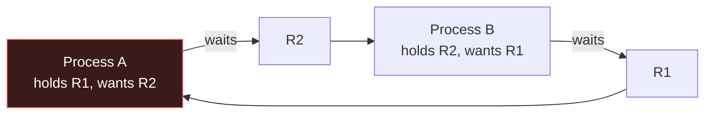

# 🧠 CPU Scheduling Algorithms

> [!abstract] Note of [[OS Theory and Architecture]]
> The **scheduler** decides which ready process runs next on a finite number of cores. Its policy determines fairness, responsiveness — and whether a hostile process can **starve** the system of CPU. Availability (the "A" in the CIA triad) is decided here.

## The goal & the metrics
The scheduler juggles competing objectives: maximise **CPU utilisation** and **throughput**, minimise **turnaround**, **waiting**, and **response** time. **Preemptive** schedulers can interrupt a running task (time-slicing); **non-preemptive** ones run a task to completion or block.

## The classic algorithms
| Algorithm | Idea | Weakness (security-relevant) |
| --- | --- | --- |
| **FCFS** (First-Come-First-Served) | run in arrival order | **convoy effect** — one long job blocks all; trivially DoS'd |
| **SJF / SRTF** (Shortest Job First) | run the shortest next | **starvation** of long jobs; needs unknowable burst prediction |
| **Round Robin** | fixed **time quantum**, cycle through ready queue | small quantum → context-switch overhead; large → poor response |
| **Priority** | run highest priority first | **starvation** of low-priority; **priority inversion** |
| **MLFQ** (Multi-Level Feedback Queue) | multiple queues, jobs move by behaviour | tunable but gameable — a job that yields just before its quantum stays "interactive" |

Real kernels use sophisticated variants — Linux's **CFS** (Completely Fair Scheduler, now EEVDF) tracks per-task "virtual runtime"; Windows uses **32 priority levels** with boosts.

## Starvation, aging, and deadlock
- **Starvation:** a process never gets the CPU (or a resource) because others keep winning. **Aging** — gradually raising a waiting task's priority — is the standard fix.
- **Priority inversion:** a high-priority task waits on a resource held by a low-priority task that never gets scheduled (the Mars Pathfinder bug). Fixed by **priority inheritance**.
- **Deadlock:** processes each hold a resource and wait for another's, forever. Requires all four **Coffman conditions**: *mutual exclusion, hold-and-wait, no preemption, circular wait* — break any one to prevent it.

## Where this becomes an attack
> [!warning] Resource exhaustion & DoS (authorized study)
> The scheduler is a finite resource, so exhausting it is a **denial-of-service** primitive:
> - **Fork bomb** — `:(){ :|:& };:` spawns processes exponentially until the process table and scheduler collapse. **Defense:** `ulimit -u`, cgroup **`pids.max`** (see the kernel-internals material), and per-user process caps.
> - **CPU starvation / busy loops** — a tight `while(1)` or crypto-miner monopolises cores; a spawned flood of high-priority threads starves legitimate work. **Defense:** cgroup **`cpu.max`** quotas, `nice`/`renice`, container CPU limits.
> - **Algorithmic complexity attacks** — feeding worst-case input (hash collisions → O(n²), "ReDoS" catastrophic regex backtracking) so a small request consumes disproportionate CPU. **Defense:** randomised hashing, input limits, regex timeouts.
> - **Deadlock/lock exhaustion** — crafting requests that make a service deadlock or exhaust its thread pool.

**Scheduler side-channels:** because scheduling is timing, contention on shared cores leaks information (SMT/hyper-threading leaks, `PortSmash`) — a reason security-sensitive workloads disable SMT or pin cores.

> [!tip] Crook → Root
> **Root** treats CPU time as an asset to be exhausted or protected: caps every workload with **cgroups/ulimits**, watches for fork bombs and busy loops, and knows a "slow request" bug can be an algorithmic-complexity DoS, not just bad code.

---
> 🔼 Up: [[OS Theory and Architecture]]
