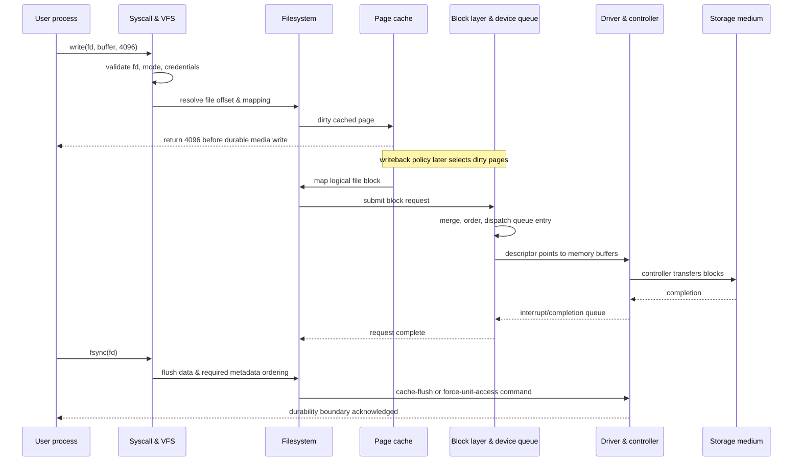

# 🧠 I/O & File System Paradigms

> [!abstract] Note of [[OS Theory and Architecture]]
> I/O connects software abstractions to devices that are asynchronous, failure-prone, and much slower than CPUs. The VFS, inodes, page cache, device queues, interrupts, DMA, IOMMUs, and journals form one end-to-end protocol. Security failures occur wherever identity, ordering, durability, or device authority is misunderstood.

## Parent Learning Order
Theory of Processes & Threads -> CPU Scheduling Algorithms -> Memory Management & Paging -> I-O & File System Paradigms

## Prerequisites & First Mental Model

**Input/output (I/O)** is how a program exchanges data with anything outside its immediate CPU instructions: files, disks, keyboards, displays, network interfaces, sensors, and other processes. Devices are much slower and less predictable than CPUs, so the operating system hides hardware differences behind stable abstractions and lets threads wait while devices work asynchronously.

Begin with this vocabulary:

- A **file** is a named or referenced byte stream plus metadata exposed through a filesystem interface; not every file-like object is stored on disk.
- A **filesystem** defines how names, directories, metadata, allocation, and persistence are represented.
- A **path** is a sequence of names used to locate an object. It is not the object itself.
- A **file descriptor** is a process-local integer referring to an open kernel file object.
- A **system call** such as `open()`, `read()`, or `write()` crosses from user mode into the kernel.
- A **buffer** temporarily holds data while producers and consumers run at different rates.
- A **cache** retains data likely to be reused; unlike a durable store, it may be discarded or lost.
- A **block device** supports addressable blocks, while a **character device** generally exposes a stream or device-specific operations.
- An **interrupt** is an asynchronous notification to the CPU. **DMA** lets a device transfer data to or from RAM without the CPU copying every byte.
- **Durability** means data survives the failure model being considered. A successful `write()` does not necessarily mean power-loss durability.
- **Consistency** means related metadata and application records obey their invariants after normal operation or recovery.

When a program executes `write(fd, buffer, 4096)`, at least four distinct events may follow: the kernel validates the descriptor and credentials, copies or maps bytes into kernel-managed memory, marks cached pages dirty, and later sends device requests. The call may return after the second or third event. A subsequent `fsync()` asks the filesystem and device stack to establish a stronger persistence boundary, but even then guarantees depend on hardware, firmware, filesystem, mount options, and the exact object synchronized.

This note should therefore be read end to end. At Crook level, trace a pathname into an open object and a read/write into kernel state. At Operator level, distinguish cache activity from device I/O and collect inode, descriptor, queue, interrupt, and journal evidence. At Root level, reason about crash ordering, namespace races, DMA authority, IOMMU boundaries, and forensic uncertainty across SSDs, snapshots, encryption, and remote storage.

## 1. The I/O Stack

An application sees calls such as `open()`, `read()`, `write()`, `fsync()`, and `ioctl()`. The kernel translates them through several layers: descriptor lookup, VFS objects, a concrete filesystem, page cache, block layer, device driver, controller, and physical medium. Network and character devices use different lower layers, but the same themes remain—queues, completion, buffering, and access control.



The first `write()` returning successfully normally means bytes were accepted into kernel state—not necessarily that they survived power loss. Correct software must know its required durability boundary.

## 2. VFS Objects & Path Resolution

The **Virtual File System (VFS)** gives diverse filesystems a common object model. Conceptually:

- A **superblock** represents a mounted filesystem and its global metadata.
- An **inode** identifies a filesystem object and stores type, owner, mode, timestamps, size, link count, and mappings to data.
- A **dentry** caches a name-to-inode relationship within a directory.
- An open **file object** stores access mode, current offset, and operation methods.
- A process **file-descriptor table** maps small integers to open file objects.

The pathname is not stored in a Unix inode. A directory is a mapping from names to inode numbers. Multiple names can point to one inode through hard links. A symbolic link instead stores another path for subsequent resolution. Mount points cross from one filesystem namespace to another.

Path resolution walks components under credentials and namespace rules. Security depends on every component, not just the final file. A writable ancestor directory permits replacement attacks; symlinks can redirect lookup; mount namespaces can present different objects at the same text path. Descriptor-relative APIs provide a stable directory anchor. Robust privileged code opens the target once, uses flags that constrain symlinks and creation races, validates the resulting object, then operates through the descriptor.

Mandatory and discretionary access controls may be checked during lookup and access. Network filesystems add server-side identity mapping and cache coherency. A local check cannot authorize an operation that the remote server interprets under different credentials.

## 3. Inodes, Extents & Deletion Semantics

An inode maps logical file offsets to physical storage. Historical filesystems used direct and indirect block pointers; modern designs often use **extents**, which encode a contiguous range compactly. Sparse files have logical regions with no allocated blocks and read as zeros. Extended attributes may store labels, access-control data, origin metadata, or application state.

Unlinking removes a directory entry and decrements the inode's link count. If the count reaches zero but a process still has the file open, the inode and data remain reachable through that open file object until the final reference closes. This explains the classic observation:

```bash
printf 'C2R evidence\n' > /tmp/open-evidence
tail -f /tmp/open-evidence >/dev/null & watcher=$!
rm /tmp/open-evidence
lsof +L1 | head
kill "$watcher"
```

Representative output:

```text
COMMAND  PID USER  FD TYPE DEVICE SIZE/OFF NLINK NODE NAME
tail    8421 lab    3r REG  253,0       13     0 9102 /tmp/open-evidence (deleted)
```

“Deleted” therefore describes namespace state, not immediate byte destruction. Recovery depends on filesystem behavior, subsequent allocation, SSD translation layers, encryption, snapshots, and trim/discard. On modern encrypted or flash storage, simplistic assumptions about overwriting a sector are unreliable.

Forensic artifacts include inode timestamps, directory entries, allocation metadata, extended attributes, journals, logs, snapshots, file slack, and unallocated blocks. Timestamp semantics matter: modification time tracks content, change time tracks inode metadata, and access time may be disabled or coarsened for performance. Creation/birth time exists on many modern filesystems but is not universal.

## 4. Page Cache, Buffering & Memory-Mapped I/O

The **page cache** stores file data in memory. Reads may be satisfied without device access; writes usually dirty cached pages and return quickly. Background writeback later submits changes. Readahead predicts sequential access, while direct-I/O modes may bypass parts of the cache for specialized workloads.

`mmap()` maps file-backed pages into a process. Loads and stores then trigger faults and dirty tracking rather than explicit read/write calls. Shared mappings can propagate modifications to the file; private mappings use copy-on-write. Memory mapping does not automatically make application-level records crash-safe.

Buffers exist at multiple layers: language runtime, libc, kernel page cache, controller cache, and physical device. `fflush()` drains a userspace stream into the kernel; `fsync()` asks the kernel and filesystem to make file data and necessary metadata durable; directory synchronization may be required after rename or creation. Devices must honor flush and write-order commands correctly.

From a security perspective, cached secrets may remain in RAM after the application logically discards them. Memory dumps, hibernation, swap, and core files can preserve copies. Sensitive programs minimize copies, lock selected pages where justified, disable unnecessary dumps, overwrite buffers carefully, and rely on full-disk encryption for data at rest.

## 5. Interrupts, Exceptions & Deferred Work

Polling repeatedly checks a device; interrupts let the device notify the CPU. An **interrupt request (IRQ)** arrives asynchronously. The processor records enough context, changes privilege level as needed, selects a handler through an interrupt vector, and executes a tightly bounded **interrupt service routine**.

Top-half handlers acknowledge hardware and capture minimal state. Slower work is deferred to bottom halves, soft interrupts, tasklets, work queues, or threaded handlers depending on the OS. Long handlers increase interrupt latency and can delay unrelated devices. High-rate network or storage devices may use interrupt moderation and hybrid polling to avoid interrupt storms.

Exceptions such as page faults are synchronous consequences of the current instruction, unlike external device interrupts. System calls are deliberate controlled transitions. All three enter privileged code, but their origin and restart semantics differ.

Observe interrupts in a lab:

```bash
head -n 12 /proc/interrupts
vmstat 1 5
```

Typical columns show per-CPU counts and controller/vector names:

```text
           CPU0       CPU1       CPU2       CPU3
  31:      1842       9013       1764       8821  PCI-MSI  nvme0q1
  42:     42817      40112      43606      39890  PCI-MSI  eth0-rx
```

Unexpectedly concentrated counts can indicate poor affinity; rapidly increasing counts with little useful work may indicate a device fault or interrupt-amplification condition.

## 6. DMA, Descriptor Rings & the IOMMU

Without **Direct Memory Access (DMA)**, the CPU would copy each byte between devices and RAM. Instead, a driver prepares memory buffers and descriptors, programs a controller, and the device transfers data. Modern devices use submission and completion queues or descriptor rings. The CPU and device coordinate ownership bits, producer/consumer indexes, and memory barriers.

DMA creates authority: a bus-mastering device can initiate memory transactions. An **IOMMU** translates device-visible I/O virtual addresses to approved physical pages, analogous to an MMU for peripherals. It enables isolation, remapping, and safer device assignment to virtual machines. Interrupt remapping prevents a device from targeting arbitrary interrupt vectors.

A missing or misconfigured IOMMU can let a malicious or compromised peripheral read credentials, alter kernel data, or escape a VM boundary. Thunderbolt/PCIe hot-plug policy, kernel DMA protection, trusted-device inventory, firmware security, and IOMMU fault monitoring are therefore part of endpoint security.

DMA does not eliminate CPU coordination. The driver must pin pages, map them for the device, synchronize caches on non-coherent systems, issue memory barriers, and avoid freeing memory before completion. A stale descriptor referencing reused memory becomes a device-assisted use-after-free.

## 7. Device Queues & I/O Scheduling

Block requests enter queues where the kernel may merge adjacent operations, prioritize latency-sensitive work, and dispatch to hardware queues. Rotational disks reward minimizing seek distance; SSDs and NVMe support deep parallel queues but can suffer tail-latency spikes under saturation.

Queue depth is both performance control and availability boundary. An unbounded producer can consume memory in queued requests and make legitimate operations wait. Backpressure, per-tenant weights, deadlines, and request cancellation prevent one workload from monopolizing the device.

Inspect a disposable block device workload:

```bash
iostat -xz 1 5
cat /sys/block/nvme0n1/queue/scheduler
```

Representative fields:

```text
Device       r/s   w/s  await  aqu-sz  %util
nvme0n1     82.0 410.0   4.21     1.74   67.2
[none] mq-deadline kyber bfq
```

High queue depth plus increasing `await` indicates contention even if CPU remains idle. In incident response, correlate this with process-level I/O, filesystem errors, device resets, and workload identities.

## 8. Journaling & Crash Consistency

A multi-step filesystem operation can fail between steps. Creating a file may allocate an inode, update a directory, allocate data blocks, and update free-space metadata. Power loss after only some writes could corrupt structure. A **journal** records an intended transaction so recovery can replay committed changes or discard incomplete ones.

Common modes distinguish metadata-only journaling from data journaling. **Write-ahead logging** requires journal records to reach stable storage before protected metadata is updated in place. A commit record marks transaction completion. Filesystems may also use copy-on-write trees, checksums, snapshots, and log-structured designs.

Filesystem consistency does not equal application consistency. A database transaction spans application records and needs its own write-ahead log, checksums, and ordering. An application that writes a temporary file, calls `fsync()`, renames it atomically, then synchronizes the directory follows a stronger update protocol than one that overwrites in place.

Security logs face the same problem. Local journaling can reconstruct metadata transitions, but an attacker with administrative access may alter local evidence. Append-only policy, authenticated forwarding, remote storage, immutable snapshots, and trustworthy time sources increase evidentiary value.

## 9. Forensic Interpretation & Anti-Forensic Limits

An investigator should reconstruct events from independent artifacts rather than treating one timestamp as truth. Compare filesystem metadata, journal transactions, application logs, shell history, audit records, endpoint telemetry, backups, and remote logs. Clock skew, timestamp granularity, mount options, and application behavior affect interpretation.

File carving from unallocated space can recover recognizable content without original metadata, but fragmentation and encryption limit results. SSD garbage collection and TRIM may make unallocated content disappear rapidly. Snapshots can preserve prior versions even after live deletion. Open-but-deleted files can be copied from process descriptors while the process is running.

Authorized anti-forensic testing should validate defensive resilience with harmless canary files and approved scope. The goal is to determine whether remote evidence and snapshots survive local manipulation—not to erase operational logs.

## 10. Hands-On I/O & Crash Lab

Use a disposable VM and a dedicated test directory. First compare buffered and synchronized writes with `strace`:

```bash
strace -o buffered.trace -e openat,write,fsync,fdatasync,rename ./atomic-writer /tmp/c2r-state
grep -E 'write|fsync|rename' buffered.trace
stat /tmp/c2r-state
```

Expected sequence for a robust writer:

```text
write(3, "version=42\n", 11) = 11
fsync(3)                      = 0
rename("/tmp/.c2r-state.tmp", "/tmp/c2r-state") = 0
```

Extend the program to synchronize the containing directory and explain why this protects the rename across a crash. Next, create a file, keep it open, unlink it, and find it with `lsof +L1`. Record inode and link-count changes with `stat` before deletion. Finally, run a small sequential read while observing `/proc/interrupts` and `iostat`; distinguish cache hits from actual device I/O by repeating the read. Do not perform power-cut tests on a host filesystem or production data.

## 11. Troubleshooting & Evidence Interpretation

I/O troubleshooting must identify the layer at which progress or correctness fails. An application timeout may originate in userspace buffering, a lock, VFS path resolution, filesystem writeback, a block queue, a driver reset, controller firmware, the physical medium, or a remote server. Start at the application and move downward only when evidence justifies it.

| Symptom | Candidate layer | Evidence | Misleading shortcut |
| --- | --- | --- | --- |
| `write()` succeeded but data vanished after crash | durability protocol or device cache | syscall order, `fsync`, rename, directory sync, mount/device guarantees | equating successful return with stable storage |
| Disk appears full after deletion | open-but-deleted file, snapshot, reserved blocks | `lsof +L1`, filesystem usage, snapshot inventory | repeatedly deleting pathname entries |
| High latency with low throughput | queue saturation, errors, writeback stalls, remote wait | `iostat`, PSI, kernel log, per-process I/O | blaming CPU utilization |
| Permission denied despite mode bits | ancestor lookup, ACL, MAC policy, namespace, remote identity | `namei`, ACLs, labels, mount namespace, server log | inspecting only the final inode mode |
| Corruption after restart | incomplete application transaction or storage faults | journal/recovery log, checksums, write ordering | assuming filesystem journaling protects application records |

Use a bounded evidence set in a disposable or authorized environment:

```bash
namei -l /path/to/object
stat /path/to/object
lsof +L1
iostat -xz 1 5
cat /proc/pressure/io
dmesg --level=err,warn | tail -n 50
```

Representative pressure and device output:

```text
some avg10=12.18 avg60=5.42 avg300=1.70 total=11882291
full avg10=3.09 avg60=1.11 avg300=0.34 total=2992011
Device       r/s    w/s  await aqu-sz %util
nvme0n1     18.0  622.0  31.84  20.17  99.4
```

This combination indicates tasks stalled for I/O while the device queue remained deep and nearly continuously busy. It does not alone distinguish legitimate saturation from retry storms, failing media, or one noisy tenant. Add per-process attribution, filesystem errors, controller health, request sizes, and a timeline.

For pathname failures, remember that access is checked while traversing every directory component and may be further constrained by ACLs, mandatory access control, mount options, namespaces, and server-side identity mapping. For durability failures, reconstruct the exact order of `write`, `fsync`, `rename`, and directory synchronization calls. For suspected deletion, separate four questions: is the name gone, is the inode still referenced, have blocks been reallocated, and do snapshots or remote copies retain the content? Expert analysis states which layer made which guarantee—and which guarantee was never present.

## Crook → Operator → Root Checkpoint

- **Crook:** Trace `open/read/write/close` through VFS; distinguish inode, dentry, file object, and descriptor; explain polling, interrupts, and DMA.
- **Operator:** Interpret page-cache behavior, open-but-deleted files, device queues, interrupt distribution, IOMMU purpose, journal recovery, and `fsync()` boundaries using practical evidence.
- **Root:** Design crash-consistent updates; reason about descriptor-ring ownership, DMA isolation, namespace races, SSD forensic limits, and multi-layer buffering; reconstruct an incident timeline from independent filesystem, device, and remote artifacts.

---
> 🔼 Up: [[OS Theory and Architecture]]
