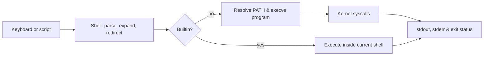

# ⌨️ Linux CLI & Core Commands

> [!abstract] Master Note of [[Linux]]
> A complete command-line reference grouped by operational purpose, with examples, output, failure modes, and security context. Drill the starred commands until they become muscle memory.

## Parent Learning Order
Linux Introduction & Distributions -> Linux CLI & Core Commands -> Linux I-O Redirection & Piping -> Linux File System Hierarchy & Editors -> Linux Boot Process & systemd -> Linux Permissions & Process Management -> Linux Memory & Storage Internals -> Linux Networking, Transfers & Curl -> Linux Security Controls & Hardening -> Linux Observability, Logging & Forensics -> Linux Advanced Mechanics & Privilege Escalation -> Linux Kernel Internals -> Linux Documentation & Note-Taking

## Start from zero — terminal, shell, command & session

A **terminal** is the text interface carrying your keystrokes and displaying program output. A terminal emulator is an application that provides that interface in a graphical desktop. A **shell**—commonly Bash—runs inside the terminal, parses the line you type, performs expansions and redirections, and launches programs. A **command** may be a shell builtin, function, alias, script, or executable file. A **session** is the environment around that shell: identity, current directory, variables, terminal device, job table, and resource limits.

The prompt is not part of the command. In examples, `$` means an unprivileged prompt and `#` means a root prompt; type only what follows it. Linux is case-sensitive: `Report.txt` and `report.txt` are different names. A command normally reports success with exit status `0` and failure with a nonzero value. Read output before copying the next command, and inspect `echo $?` when correctness matters.

Begin in a disposable account or VM. Practice with a directory created by `mktemp -d`, use absolute paths when ambiguity would be dangerous, and do not prefix commands with `sudo` merely to make errors disappear. The objective is not memorizing a dictionary: it is learning to predict which identity, path, input, output, and system object a command will affect.

## Anatomy of a command
```
   sudo   apt   install   -y   nmap
    │      │      │        │     └─ argument (what to act on)
    │      │      │        └─────── option / flag (modifies behaviour)
    │      │      └──────────────── sub-command
    │      └─────────────────────── the program
    └────────────────────────────── run it as root
```
Short flags combine (`ls -l -a` → `ls -la`); long flags are `--all`. The shell splits on spaces, so **quote** anything with spaces: `cat "my file.txt"`.



## 1 · Orientation & identity
| Command | Does |
| --- | --- |
| ⭐ `pwd` | print working directory |
| ⭐ `whoami` | current username |
| ⭐ `id` | UID/GID + groups (privilege at a glance) |
| `who` / `w` | who is logged in / + what they're doing |
| `users` | list logged-in usernames |
| `last` / `lastlog` | login history / each user's last login |
| `tty` | which terminal am I on |
| `logname` | the login name |

## 2 · System & hardware info
| Command | Does |
| --- | --- |
| ⭐ `uname -a` | kernel, version, architecture (match kernel exploits) |
| ⭐ `hostname` / `hostnamectl` | machine name / rich host+OS info |
| `cat /etc/os-release` | distro & version |
| `uptime` | how long up + load average |
| `date` / `cal` | time / calendar |
| `lscpu` · `lsblk` · `lsusb` · `lspci` | CPU · block devices · USB · PCI |
| `free -h` | RAM/swap usage |
| `df -h` / `du -sh *` | disk free per FS / size of each item here |
| `dmesg` | kernel ring buffer (hardware/driver messages) |
| `arch` · `nproc` | CPU arch · number of CPUs |
| `lsb_release -a` | distribution details |

## 3 · Navigating the filesystem
| Command | Does |
| --- | --- |
| ⭐ `ls -la` / `ls -lh` | list all incl. hidden + details / human sizes |
| ⭐ `cd DIR` · `cd ..` · `cd ~` · `cd -` | change dir / up / home / **previous** dir |
| `tree -L 2` | visual directory tree, 2 levels |
| `pushd` / `popd` | push/pop the directory stack |
| `stat file` | full metadata (perms, size, inode, MAC times) |
| `realpath file` · `readlink -f` | resolve to an absolute / canonical path |
| `basename` / `dirname` | strip path to filename / to directory |

## 4 · Reading & viewing files
| Command | Does |
| --- | --- |
| ⭐ `cat f` · `tac f` | dump file / dump reversed |
| ⭐ `less f` | page a big file (`/`search, `q`quit) — `more` is the older cousin |
| ⭐ `head -n20 f` / `tail -n20 f` | first / last 20 lines |
| ⭐ `tail -f log` | **follow** a log live as it grows |
| `nl f` | dump with line numbers |
| `wc -l f` | count lines (`-w` words, `-c` bytes) |
| `column -t` | align columns prettily |
| `strings bin` | printable strings in a binary (creds, URLs) |
| `xxd f` / `hexdump -C f` | hex + ASCII dump |

## 5 · Creating & manipulating files
```shell-session
$ mkdir -p loot/creds        # make dirs (‑p makes parents)
$ rmdir emptydir             # remove an EMPTY dir
$ touch notes.md             # create empty file / update timestamp
$ echo "text" > f  ;  echo "more" >> f   # write / append
$ cp -r src/ dst/            # copy (‑r recursive, ‑p preserve attrs)
$ mv old new                 # move / rename
$ rm -rf junk/               # delete recursively  (⚠ irreversible)
$ ln -s /opt/tool /usr/local/bin/tool    # symbolic link
$ shred -u secret            # securely overwrite + delete
$ rename 's/.txt/.md/' *.txt # bulk rename
$ mktemp                     # safe unique temp file
```
> [!danger] `rm -rf` has no undo
> There is no recycle bin on the CLI. A stray space — `rm -rf / tmp` instead of `/tmp` — can wipe a system. Read the path twice.

## 6 · Searching — files & content
`find` (⭐) is the powerhouse — it walks the live filesystem by any attribute:
```shell-session
$ find / -name "*.conf" 2>/dev/null          # by name
$ find /home -type f -mtime -1               # files changed in last 24h
$ find / -size +100M 2>/dev/null             # bigger than 100 MB
$ find / -perm -4000 -type f 2>/dev/null     # SUID (privesc — see PrivEsc note)
$ find . -name "*.log" -exec grep -l err {} \;   # run a command per hit
```
| Command | Does |
| --- | --- |
| `locate NAME` | instant search of a prebuilt DB (`sudo updatedb` first) |
| ⭐ `which cmd` | path of a command on `$PATH` |
| `whereis cmd` | binary + source + man locations |
| `type cmd` | is it a builtin, alias, or file? |
| ⭐ `grep -rniE "pat" .` | search inside files: recursive/ignore-case/line-nums |
| `rg` / `ag` | ripgrep / silver-searcher — much faster `grep` |
| `file mystery` | identify a file's real type by content |
| `fzf` | interactive fuzzy finder |

## 7 · Text processing (the pipe toolkit)
These shine when piped together — full treatment in **I/O Redirection & Piping**.
| Command | Does |
| --- | --- |
| `cut -d: -f1` | slice columns by delimiter |
| `awk '{print $1}'` | field-aware processing |
| `sed 's/a/b/g'` | stream find-and-replace |
| `sort` / `uniq -c` | order / count duplicates |
| `tr 'A-Z' 'a-z'` | translate/delete characters |
| `tee file` | write to file **and** screen |
| `xargs` | turn stdin into command arguments |
| `paste` · `join` · `comm` | merge/relate columns & files |
| `diff` / `cmp` | compare files line-by-line / byte-by-byte |
| `jq '.key'` | parse & query **JSON** |
| `rev` · `fold` | reverse lines / wrap width |

## 8 · Permissions & ownership
Deep dive (with the SUID privesc angle) in **Permissions & Process Management**.
| Command | Does |
| --- | --- |
| ⭐ `chmod 750 f` / `chmod +x f` | set permissions (numeric / add execute) |
| ⭐ `chown user:grp f` | set owner:group (root only) |
| `chgrp grp f` | set group |
| `umask 027` | default-permission mask for new files |
| `getfacl` / `setfacl` | fine-grained **ACL**s beyond rwx |
| `lsattr` / `chattr +i` | list / set file attributes (`+i` = immutable) |
| `getcap` / `setcap` | file **capabilities** (`cap_setuid` = privesc) |

## 9 · Users & groups
| Command | Does |
| --- | --- |
| ⭐ `sudo CMD` · `sudo -l` | run one command as root · **what may I run as root** |
| ⭐ `su - user` | become another user (full login shell) |
| ⭐ `passwd` | change a password |
| `useradd` / `adduser` | create a user (low-level / friendly) |
| `userdel` · `usermod -aG grp u` | delete user · add user to a group |
| `groupadd` / `groups` | create group / show my groups |
| `chsh` / `chfn` | change login shell / finger info |

## 10 · Processes & jobs
Deep dive in **Permissions & Process Management**.
| Command | Does |
| --- | --- |
| ⭐ `ps aux` / `ps -ef` | every process + owner + full command line |
| ⭐ `top` / `htop` | live, sorted resource view |
| `pstree -p` | the process tree with PIDs |
| `pgrep -af name` | find PIDs by name |
| ⭐ `kill PID` · `kill -9 PID` | signal / force-kill a process |
| `pkill -f name` · `killall name` | kill by pattern / exact name |
| `jobs` · `fg` · `bg` · `nohup` · `disown` | job control & backgrounding |
| `nice` / `renice` | set/adjust process priority |
| `lsof` · `fuser` | list open files / who's using a file/port |
| `watch -n2 CMD` | re-run a command every 2s |
| `timeout 10 CMD` | kill a command after 10s |

## 11 · Services, scheduling & power (systemd)
| Command | Does |
| --- | --- |
| ⭐ `systemctl status\|start\|stop\|restart svc` | control a service |
| ⭐ `systemctl enable\|disable svc` | (don't) autostart at boot |
| `systemctl list-units --type=service` | all services |
| ⭐ `journalctl -u svc -f` | follow a service's logs (systemd journal) |
| `service svc status` | legacy service control |
| ⭐ `crontab -l` / `crontab -e` | list / edit scheduled jobs (see **PrivEsc**) |
| `at 'now + 1h'` | one-off scheduled job |
| `shutdown -h now` · `reboot` · `poweroff` | power control · `init 6` = reboot (legacy) |

## 12 · Package management
| Family | Install / remove / search |
| --- | --- |
| **Debian/Kali/Ubuntu** | `apt update && apt install X` · `apt remove X` · `apt search X` · low-level `dpkg -i pkg.deb` |
| **Arch/BlackArch** | `pacman -S X` · `pacman -R X` · `pacman -Ss X` |
| **Fedora/RHEL** | `dnf install X` · `dnf remove X` · low-level `rpm -i` |
| **Cross-distro** | `snap install X` · `flatpak install X` |
| **Language** | `pip install X` (Python) · `gem install X` (Ruby) · `npm i -g X` (Node) |

## 13 · Networking
Deep dive (and the `curl` masterclass) in **Networking, Transfers & Curl**.
| Command | Does |
| --- | --- |
| ⭐ `ip a` / `ifconfig` | interfaces & IPs (`ip r` = routes) |
| ⭐ `ss -tulnp` / `netstat -tulnp` | listening ports + owning PID |
| ⭐ `ping -c4 host` | reachability test |
| `traceroute` / `mtr` | path to a host / live path stats |
| ⭐ `dig` · `nslookup` · `host` | DNS lookups |
| `whois domain` | registration/OSINT data |
| ⭐ `ssh user@host` | remote shell (`-i key`, `-p port`) |
| `arp -a` · `route -n` | ARP cache · routing table |
| `nc -lvnp 4444` | netcat listener (shells, transfers) |
| `tcpdump -i eth0` | packet capture |
| `iptables -L` / `nft list ruleset` | firewall rules |

## 14 · File transfer
| Command | Does |
| --- | --- |
| ⭐ `wget URL` · `curl -O URL` | download over HTTP(S) |
| ⭐ `scp f user@host:/path` | secure copy over SSH (both directions) |
| `sftp user@host` | interactive secure FTP |
| ⭐ `rsync -avz src/ host:/dst/` | efficient sync (only changed blocks) |
| `git clone URL` | pull a repo |
| `python3 -m http.server 80` | serve the current dir instantly |

## 15 · Disk & filesystem
| Command | Does |
| --- | --- |
| ⭐ `mount` / `umount` | attach / detach a filesystem |
| `findmnt` | what's mounted where, as a tree |
| `lsblk` · `blkid` | block devices · their UUID/type |
| `fdisk -l` · `parted` | partition tables |
| `mkfs.ext4 /dev/sdX` · `fsck` | make filesystem · check/repair |
| ⭐ `dd if=/dev/sda of=disk.img` | raw block copy (imaging, forensics — careful!) |
| `ncdu` | interactive disk-usage explorer |
| `sync` | flush disk write buffers |

## 16 · Compression & archives
| Task | Command |
| --- | --- |
| ⭐ **tar** bundle | `tar -cvf out.tar dir/` · extract `-xvf` · list `-tvf` |
| ⭐ tar **+gzip** | `tar -czvf out.tar.gz dir/` · extract `-xzvf` |
| **gzip / bzip2 / xz** | `gzip f` · `bzip2 f` · `xz f` (+ `gunzip`/`bunzip2`/`unxz`) |
| ⭐ **zip / unzip** | `zip -r out.zip dir/` · `unzip out.zip` · list `-l` |
| **rar / unrar** | `rar a out.rar dir/` · `unrar x out.rar` |
| **7-zip** | `7z a out.7z dir/` · `7z x out.7z` |
| view compressed | `zcat`, `zless`, `zgrep` |

Mnemonic for `tar`: **c**reate e**x**tra **v**erbose **f**iles **z**ipped → `-czvf`.

## 17 · Environment & shell
| Command | Does |
| --- | --- |
| ⭐ `echo $VAR` · `printf` | print a variable / formatted output |
| ⭐ `export VAR=val` | set an environment variable (e.g. `export PATH=...`) |
| `env` / `set` | show environment / all shell vars |
| `unset VAR` | remove a variable |
| ⭐ `alias ll='ls -la'` | make a shortcut (persist in `~/.bashrc`) |
| ⭐ `history` · `!42` · `!!` | command history · rerun #42 · rerun last |
| `source ~/.bashrc` (`. file`) | reload/execute a file in the current shell |
| `read VAR` | read input into a variable |
| `sleep 5` · `seq 1 10` · `yes` | pause · number sequence · repeat a string |
| `clear` / `reset` | clear screen / fix a broken terminal |
| ⭐ `tmux` / `screen` / `terminator` | multiplex & split terminals; survive disconnects |

## 18 · Help & documentation
| Command | Does |
| --- | --- |
| ⭐ `man cmd` | full manual (`man 5 passwd` = file-format section) |
| ⭐ `cmd --help` / `-h` | quick flag summary |
| `whatis cmd` · `apropos kw` | one-liner · find commands by keyword |
| `tldr cmd` | community cheat-sheet of common uses |
| `info cmd` | GNU hypertext docs |
| `help` (builtins) | help for shell builtins like `cd`, `export` |

## 19 · Binary inspection & analysis utilities
| Command | Does |
| --- | --- |
| `strings` · `file` · `xxd` | strings / type / hex of a binary |
| `md5sum` · `sha256sum` | integrity hashes |
| `base64` / `base64 -d` | encode / decode |
| `ldd bin` | shared-library dependencies |
| `strace` / `ltrace` | trace syscalls / library calls |
| `objdump -d` · `readelf -a` | disassemble · ELF headers |
| `gdb` | the debugger |
| `bc` · `expr` | command-line calculators |

## Speed: shortcuts that separate ninjas from tourists
| Key / token | Effect |
| --- | --- |
| `Tab` | **auto-complete** paths & commands (twice = list) |
| `Ctrl+R` | **reverse-search** command history |
| `!!` · `!$` | last command · last argument of it (`sudo !!`) |
| `Ctrl+C` / `Ctrl+Z` | kill / suspend the foreground command |
| `Ctrl+A` / `Ctrl+E` | jump to start / end of line |
| `Ctrl+L` | clear the screen |

## Troubleshooting commands systematically

Classify the failure before changing privileges. `command not found` means shell resolution failed: inspect `type -a`, `command -v`, `PATH`, spelling, and package presence. `Permission denied` may mean missing execute permission, an untraversable parent directory, a `noexec` mount, a policy denial, or an interpreter problem. `No such file or directory` can describe a missing script interpreter or dynamic loader even when the named executable exists. `Operation not permitted` often points to capabilities, seccomp, namespaces, immutable attributes, or mandatory access control rather than ordinary mode bits.

Use a reproducible diagnostic envelope:

```shell-session
$ printf 'user=%s dir=%s shell=%s\n' "$(id -un)" "$PWD" "$SHELL"
user=analyst dir=/srv/lab shell=/bin/bash
$ type -a inventory; file "$(command -v inventory)"; inventory --version
inventory is /usr/local/bin/inventory
/usr/local/bin/inventory: ELF 64-bit LSB pie executable, x86-64
inventory 2.4.1
$ inventory --check; rc=$?; printf 'exit=%d\n' "$rc"
configuration /etc/inventory.yml: line 18: unknown key "destinatoin"
exit=78
```

Read the program's own diagnostics and exit status first, then consult `--help`, the relevant manual page, service logs, and `strace` only when the failing boundary remains unclear. Preserve the original command, quoting, environment, and working directory; changing several simultaneously destroys causality.

## Hands-on lab — a 20-minute operator circuit

Create a disposable directory with `mktemp -d`. Record identity and system data; create nested files; search by name, content, owner, mode, and modification time; archive the result; calculate a SHA-256 hash; start a local HTTP server; inspect its process, listener, open files, and journal; then terminate it with `SIGTERM`. Use `man`, `whatis`, `type`, `which`, and `--help` at least once rather than guessing flags.

Expected output must demonstrate each state transition: the matched log line, a stable archive hash, the listener's owning PID, and a final non-running process. Compare values rather than expecting identical PIDs or hashes across machines.

```shell-session
$ lab=$(mktemp -d); cd "$lab"; mkdir -p input/output
$ printf 'alpha\nerror:42\nbeta\n' > input/app.log
$ grep -n error input/app.log | tee output/findings.txt
2:error:42
$ tar -czf evidence.tar.gz input output && sha256sum evidence.tar.gz
51c4c7d4c0d7...  evidence.tar.gz
$ python3 -m http.server 8000 >/tmp/linux-cli-lab.log 2>&1 & server=$!
$ ss -lntp | grep :8000
LISTEN 0 5 0.0.0.0:8000 0.0.0.0:* users:(("python3",pid=24118,fd=3))
$ kill -TERM "$server"; wait "$server"; echo "status=$?"
status=143
```

## Security implications

Command fluency includes restraint. Quote variables, inspect paths before recursive operations, prefer package signatures, avoid secrets in arguments or history, validate downloads by hash/signature, and understand the privilege of every command. `sudo`, raw disk tools, firewall changes, ownership recursion, and force deletion can cross irreversible boundaries. Test destructive syntax against disposable paths and capture evidence before altering a system.

### Crook → Operator → Root checkpoint

- **Crook:** navigate, inspect, edit, search, archive, and request help without copying unknown commands blindly.
- **Operator:** compose commands safely, interpret outputs and exit status, manage users/processes/services/networking, and preserve artifacts.
- **Root:** select the smallest correct utility, predict shell expansion and kernel effects, automate repeatably, and recognize when a command crosses a security or recovery boundary.

> [!tip] Crook → Root
> **Crook** memorises a handful of commands. **Root** knows this whole map *exists*, reaches for the right tool instantly, composes them into one-liners (see **I/O Redirection & Piping**), and never types a full path when `Tab` and `Ctrl+R` will do it.

---
> 🔼 Up: [[Linux]]
