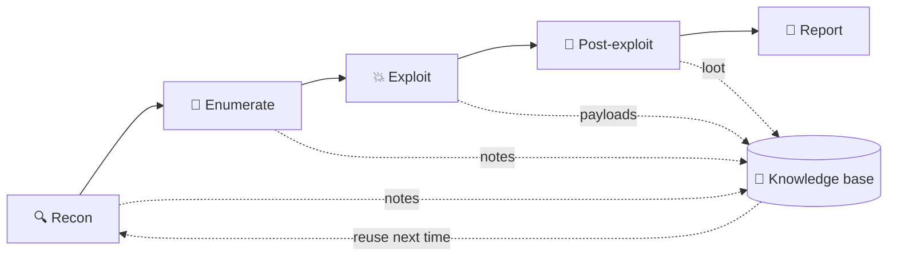
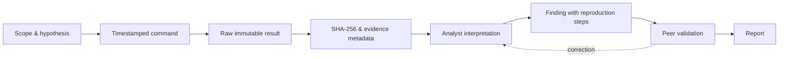

# 📝 Linux Documentation & Note-Taking

> [!abstract] Master Note of [[Linux]]
> The most underrated skill in security. A hacker who documents beats a smarter hacker who doesn't — because the win isn't finding a technique once, it's *never having to rediscover it*. Your notes are the difference between guessing and recalling.

## Parent Learning Order
Linux Introduction & Distributions -> Linux CLI & Core Commands -> Linux I-O Redirection & Piping -> Linux File System Hierarchy & Editors -> Linux Boot Process & systemd -> Linux Permissions & Process Management -> Linux Memory & Storage Internals -> Linux Networking, Transfers & Curl -> Linux Security Controls & Hardening -> Linux Observability, Logging & Forensics -> Linux Advanced Mechanics & Privilege Escalation -> Linux Kernel Internals -> Linux Documentation & Note-Taking

## Start from zero — memory is not evidence

A useful technical note converts a fleeting action into something another person can understand, reproduce, challenge, and safely repeat. Begin by separating four record types. An **observation** states what a source directly showed. An **interpretation** explains what the observation may mean. A **procedure** lists actions and prerequisites. **Evidence** is preserved source material with provenance and integrity. Mixing these produces confident but unauditable stories.

You do not need a specialized application to start. A UTF-8 text file, clear headings, UTC timestamps, exact commands, verbatim output, and cryptographic hashes are enough. Record identity, host, current directory, version, scope, and time because command behavior depends on context. Mark secrets and personal data at capture time so storage, sharing, and retention follow policy.

The beginner objective is reliable recall; the operator objective is reproducibility and handoff; the expert objective is institutional knowledge that survives personnel, platform, and version changes. Never paste a command without its purpose, safety boundary, expected success result, expected failure result, and cleanup. A polished screenshot without raw context is illustration, not a complete technical record.

## Why notes decide the outcome
- **Engagements** — record every host, credential, command, and finding *as you go*. The deliverable of a pentest is the **report**; disciplined notes make writing it possible (and repeatable when a client asks "how did you get in?").
- **Legal & scope safety** — timestamps and command logs prove you stayed in scope. If it isn't written down, it didn't happen.
- **Labs & simulations** — you'll revisit a system hours later; notes on observations, tested hypotheses, and dead ends stop you looping.
- **Research & learning** — turning "I read about SUID once" into a searchable, linked knowledge base is how a Crook compounds into a Root. *This vault is that principle applied.*



## A structured method — capture per target
1. **Scope & rules** — IPs/domains in scope, timing window, contacts. *Before anything else.*
2. **Recon** — Nmap output, open ports, service versions.
3. **Enumeration** — users, directories, interesting files, versions to research.
4. **Exploitation** — the exact payload/command that worked (copy-pasteable).
5. **Post-exploitation** — creds found, privesc path, loot locations, pivots.
6. **Screenshots** — proof for the report (`flameshot gui`, `scrot`, `gnome-screenshot`).

A simple, repeatable per-box skeleton:
```markdown
# 10.10.10.5 — "Blocky"
## Ports (nmap)
- 22 ssh OpenSSH 7.2 · 80 http Apache 2.4 · 3306 mysql
## Enumeration
- /wp-content/... → WordPress; creds in wp-config.php
## Foothold
- ssh notch:<pass from config>  → user.txt
## PrivEsc
- sudo -l → (ALL) NOPASSWD  → sudo su  → root.txt
## Loot
- notch:8bap... (mysql root)
```

## The tools
| Tool | Character |
| --- | --- |
| **Obsidian** | Markdown + **`**wikilinks**`** + a **graph view** — an interlinked *second brain* (exactly what you're reading). Local files, plugins, offline. The modern favourite. |
| **CherryTree** | Hierarchical, tree-structured notebook, rich text + per-node syntax highlighting; single encrypted file — a long-time pentest staple. |
| **Joplin** | Open-source Markdown notebooks with end-to-end encryption and sync. |
| **Notion** | Cloud, collaborative, database-style pages — great for teams, weaker for offline/air-gapped work. |
| **Standard editors** | `vim`/VS Code + plain Markdown, version-controlled with `git` — always available, zero setup. |
| **Sysreptor / Pwndoc** | Purpose-built pentest **reporting** platforms that turn findings into client deliverables. |

## Why a knowledge base makes a red teamer *fast*
The pro difference isn't memory — it's a **personal, searchable arsenal**:
- A **payload library** (reverse shells, SQLi strings, SUID one-liners) you paste in seconds instead of re-deriving.
- A **methodology checklist** so you never skip a step under time pressure.
- **Linked cross-references** — "this box's misconfig is the same class as one three engagements ago."
- **Report acceleration** — findings written once, reused as templates.

## Evidence, observation & interpretation

A professional notebook separates what the system produced from what the analyst concluded. Record the **command**, **timestamp**, **execution identity**, **working directory**, **target**, **raw output location**, **exit status**, and **interpretation**. Never silently edit raw evidence. Store a normalized excerpt in the narrative and preserve the complete artifact with a cryptographic hash.



Use UTC for machine correlation while retaining the local timezone in case metadata. Shell history alone is insufficient: it may omit timestamps, outputs, aliases, environment, commands with leading spaces, or activity from other terminals. A lightweight engagement wrapper can record a session and timing information:

```shell-session
$ export CASE_ID=IR-204 TARGET=web-07
$ mkdir -p "$CASE_ID"/{raw,notes,hashes}
$ script --log-out "$CASE_ID/raw/${TARGET}-terminal.log" \
         --log-timing "$CASE_ID/raw/${TARGET}-terminal.time" --flush
Script started, output log file is 'IR-204/raw/web-07-terminal.log'.
$ date -u +'%FT%TZ'; id; hostname -f; pwd
2026-07-31T13:22:10Z
uid=1000(analyst) gid=1000(analyst) groups=1000(analyst)
web-07.lab.example
/home/analyst
$ exit
Script done.
$ sha256sum "$CASE_ID"/raw/* | tee "$CASE_ID/hashes/SHA256SUMS"
91cb...  IR-204/raw/web-07-terminal.log
```

Terminal capture can collect secrets, tokens, and personal data. Encrypt case storage, restrict access, mark sensitivity, and define retention and deletion dates. Redact only presentation copies; keep originals under evidence controls when policy requires them.

## A reproducible finding model

Every finding should answer: **what asset**, **what precondition**, **what exact action**, **what observed result**, **why it proves the claim**, **what business impact**, **what remediation**, and **how to verify the fix**. Keep certainty explicit: observed, inferred, or unverified. Distinguish the affected instance from the root cause so the fix scales beyond one host.

```markdown
## Finding: writable systemd environment file
- Asset: app-03 (10.20.30.23)
- Scope authorization: ROE-2026-17 §4.2, local configuration review
- Observation time: 2026-07-31T13:44:12Z
- Identity: uid=1001(appops), no sudo
- Command: stat -c '%U:%G %A %n' /etc/app/runtime.env
- Result: appops:appops -rw-rw---- /etc/app/runtime.env
- Consumer: app.service runs as root and reads EnvironmentFile=/etc/app/runtime.env
- Validation: approved canary variable appeared in service environment after controlled restart
- Root cause: privileged service trusts a lower-privilege writable configuration source
- Impact: arbitrary environment influence in a root process
- Remediation: root ownership, mode 0640, fixed group, service sandboxing
- Retest: lower-privilege write fails; canary absent after restart
- Raw evidence: raw/app-03-20260731T134412Z.txt (SHA-256 ...)
```

Screenshots support but do not replace text evidence: they are hard to search, diff, and reproduce. Include enough surrounding UI to establish context, remove unrelated sensitive data, and retain the source image. For command-line work, copied text plus raw session logs are usually stronger.

## Knowledge architecture without graph sprawl

Use stable atomic concepts, controlled vocabulary, and explicit parentage. Separate evergreen knowledge from case notes and reusable finding templates. Frontmatter can carry owner, status, sensitivity, review date, operating system, and source confidence. Links should represent a deliberate relationship; excessive lateral links create a visually dense graph without improving retrieval. Tags support broad filtering, while indexes define learning or operational order.

Version changes invalidate instructions. Record tested distribution, kernel, package version, date, and expected output. A command reference without a validation environment is a memory aid, not evidence. Schedule reviews for high-volatility content and mark deprecated techniques rather than silently deleting historical context.

## Troubleshooting an unreproducible note

Treat a failed reproduction as a documentation defect until the cause is known. Compare operating system, kernel, architecture, package version, identity, groups, shell, working directory, environment, locale, timezone, network context, input hashes, and prerequisite state. Check whether copied typography changed quotes or hyphens, whether a command relied on an alias, whether output was truncated, and whether an earlier undocumented action created the required state.

Reduce the note to a minimal reproducible procedure. Mark each step with purpose, command, expected output, expected failure, exit status, side effects, cleanup, and evidence path. Have a second operator execute it without oral hints. If behavior is nondeterministic, record timing, concurrency, random seeds, retries, and the observed distribution instead of presenting one successful run as guaranteed.

```text
Reproduction result: FAILED at step 4
Expected: service state "inactive (dead)", exit=0
Observed: "Unit inventory-lab.service not found", exit=4
Environment difference: package inventory-lab 2.4 absent on reviewer VM
Documentation fix: add signed-package prerequisite and verification command
```

Do not rewrite raw evidence to fit the narrative. Amend the interpretation, retain the original artifact and hash, record who changed the note and why, and schedule revalidation when versions or assumptions change.

## Hands-on lab — produce an auditable mini-case

1. Define a harmless scope: inspect a local user service and one configuration file.
2. Create a case directory with raw, notes, screenshots, and hashes.
3. Capture a terminal session containing UTC time, identity, hostname, commands, output, and exit status.
4. Write one observation and one inference, explicitly labeled.
5. Hash the raw artifacts, make the raw directory read-only, and generate a sanitized report excerpt.
6. Give the case to another operator. They must reproduce the observation from your steps without asking what you meant.

Expected inventory:

```text
IR-204/
├── hashes/SHA256SUMS
├── notes/timeline.md
├── notes/finding-systemd-env.md
└── raw/web-07-terminal.log

$ sha256sum -c IR-204/hashes/SHA256SUMS
IR-204/raw/web-07-terminal.log: OK
```

## Review, handoff & knowledge decay

A note is complete only when another qualified person can act on it. Peer review should verify scope, commands, expected output, assumptions, safety boundaries, evidence references, and remediation tests. Resolve contradictions explicitly; never overwrite uncertainty with a cleaner story. Handoffs need current status, open hypotheses, credentials or keys through an approved secret channel, changes made, cleanup remaining, and the next safe action.

Technical knowledge decays as kernels, distributions, defaults, tools, and business architecture change. Add `tested_on`, `last_reviewed`, `owner`, and `status` metadata where the vault convention allows it. Retest high-risk procedures after major releases. Mark a note **superseded** with a reason and replacement rather than deleting context that may explain older systems.

Use a simple quality gate:

```text
[ ] Scope and authorization cited
[ ] Preconditions and destructive risk stated
[ ] Commands are exact, quoted, and version-tested
[ ] Expected output demonstrates success and failure
[ ] Raw evidence path and SHA-256 recorded
[ ] Sensitive data classification and retention assigned
[ ] Cleanup and rollback verified
[ ] Peer can reproduce without oral context
```

This discipline turns personal memory into institutional capability while preventing stale snippets from becoming unsafe operational folklore.

## Security implications

Weak notes create legal, operational, and technical risk: scope cannot be demonstrated, destructive actions cannot be reconstructed, findings become irreproducible, and secrets leak into unmanaged notebooks. Strong documentation is evidence engineering. It preserves provenance, minimizes sensitive collection, supports peer review, and turns one operator's observation into a repeatable organizational control.

### Crook → Operator → Root checkpoint

- **Crook:** capture scope, commands, output, timestamps, and conclusions in a consistent structure.
- **Operator:** preserve raw artifacts and hashes, separate observation from inference, write reproducible findings, and handle sensitive data safely.
- **Root:** design a reviewable knowledge architecture, evidence lifecycle, versioning policy, and reporting workflow that another operator can independently validate.

> [!tip] Crook → Root
> **Crook** keeps everything in their head and re-Googles the same command weekly. **Root** built a knowledge base years ago, links every new finding into it, and pastes a working payload from memory-on-disk while others are still searching. Document relentlessly — it's the cheapest force-multiplier in the field.

---
> 🔼 Up: [[Linux]]
