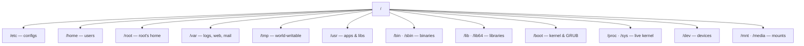

# 🗂️ LNX.4 · File System Hierarchy & Editors

> [!abstract] Master Note of [[Linux]]
> Linux is a single inverted tree rooted at `/` — no drive letters. The layout follows the **Filesystem Hierarchy Standard (FHS)**, and knowing *what lives where* is the difference between fumbling and going straight for the loot on a compromised box.



## Every top-level directory
| Path | Function & contents | Why an attacker cares |
| --- | --- | --- |
| `/boot` | Kernel image, initramfs, GRUB config | Kernel version → match kernel exploits |
| `/etc` | System-wide **config**: `passwd`, `shadow`, `sudoers`, `crontab`, service configs | Users, hashes, cron privesc, DB creds in app configs |
| `/bin` | Essential user **binaries** (`ls`,`cp`,`cat`) — usually symlinked into `/usr/bin` | Core tools present even in minimal shells |
| `/sbin` | Essential **system/admin** binaries (`fdisk`,`ip`,`iptables`) | Network/firewall recon & tampering |
| `/lib`,`/lib32`,`/lib64` | Shared **libraries** (`.so`) for `/bin`,`/sbin`; 32- & 64-bit variants | `LD_PRELOAD`/library-hijack privesc |
| `/usr` | The big one: `/usr/bin` (most apps), `/usr/sbin`, `/usr/lib`, `/usr/share` (docs/data), `/usr/local` (self-installed) | Where installed tooling & SUID binaries live |
| `/opt` | Optional / **third-party** software as self-contained bundles | Vendor apps with weak perms & configs |
| `/srv` | Data **served** by the system (web, ftp) | Served content, source, uploads |
| `/home` | Regular users' homes: dotfiles, `~/.ssh/`, `~/.bash_history` | SSH keys → lateral movement; creds in history/dotfiles |
| `/root` | The **root** user's home (only root enters) | The prize — root's keys, history, notes |
| `/var` | **Variable** data: `/var/log`, `/var/www`, mail, spool, `/var/backups` | Creds in logs, webshell drops, **log-clearing** (anti-forensics) |
| `/tmp` | World-writable temp, wiped on reboot (also `/dev/shm`, in RAM) | Stage tools/payloads when `$HOME` is locked |
| `/media` | **Auto**-mounted removable media (USB, CD) | Data on plugged-in devices |
| `/mnt` | **Manual** mount point for temporary filesystems | Mounted shares/disks during an engagement |
| `/dev` | **Device** files: `/dev/sda` (disk), `/dev/null`, `/dev/tcp` (shells) | Raw disk access; `/dev/tcp` reverse shells |
| `/proc` | Virtual FS of **live process/kernel** state: `/proc/<pid>/environ`, `cmdline` | Secrets in env vars, running-process recon |
| `/sys` | Virtual FS exposing **kernel & hardware** settings | Hardware/driver state |

### Two "not-real" filesystems worth knowing
`/proc` and `/sys` don't exist on disk — the kernel synthesises them live. That's why you can read `/proc/version` (kernel), `/proc/<pid>/environ` (a process's secrets), or `cat /proc/net/tcp` (open sockets) with ordinary file tools. **Everything is a file** in action.

```shell-session
$ cat /proc/version                     # kernel build
Linux version 6.6.9-amd64 (gcc 13.2) ...
$ mount | column -t                     # what is mounted where, and how
$ df -h                                 # disk usage per filesystem
$ ls -la /home/*/.ssh/ 2>/dev/null      # hunt SSH keys across users
```

> [!tip] Root move
> On any foothold, three areas pay off fastest: **`/etc`** (passwd/shadow/cron/configs), **`/home` + `/root`** (keys, history, dotfiles), and **`/var/log` + `/var/www`** (creds & web source). Memorise that triage order.

## Text editors — edit anywhere, anytime
You will land on boxes with no GUI, so terminal editors are non-negotiable.

| Editor | Type | When to use |
| --- | --- | --- |
| **nano** | Terminal, beginner-friendly | Quick edits — shortcuts on-screen (`^O` save, `^X` exit). The safe default. |
| **vi** | Terminal, ubiquitous | Present on *every* Unix, even minimal/rescue systems. Modal. |
| **vim** | Terminal, `vi` improved | The power tool — modal editing, plugins, syntax highlighting. Worth the curve. |
| **leafpad** / gedit | **GUI** | Simple graphical editing when a desktop is available. |

### Surviving vi/vim (the classic beginner trap)
`vim` is **modal** — it starts in *Normal* mode (keys are commands, not text).

| Key | Does |
| --- | --- |
| `i` | enter **Insert** mode (now you can type) |
| `Esc` | back to **Normal** mode |
| `:w` | write (save) |
| `:q` | quit · `:q!` quit **without** saving |
| `:wq` or `ZZ` | save **and** quit |
| `dd` / `yy` / `p` | delete line / copy line / paste |
| `/text` then `n` | search, next match |

> The million-session rescue: **`Esc`** then type **`:q!`** and Enter to escape a `vim` you got stuck in.

```shell-session
$ nano /etc/hosts          # add a target hostname mapping
$ vim exploit.py           # i → edit → Esc → :wq
```

---
> 🔼 Up: [[Linux]]
