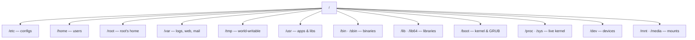
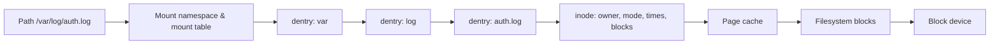

# 🗂️ Linux File System Hierarchy & Editors

> [!abstract] Master Note of [[Linux]]
> Linux is a single inverted tree rooted at `/` — no drive letters. The layout follows the **Filesystem Hierarchy Standard (FHS)**, and knowing *what lives where* is the difference between fumbling and going straight for the loot on a compromised box.

## Parent Learning Order
Linux Introduction & Distributions -> Linux CLI & Core Commands -> Linux I-O Redirection & Piping -> Linux File System Hierarchy & Editors -> Linux Boot Process & systemd -> Linux Permissions & Process Management -> Linux Memory & Storage Internals -> Linux Networking, Transfers & Curl -> Linux Security Controls & Hardening -> Linux Observability, Logging & Forensics -> Linux Advanced Mechanics & Privilege Escalation -> Linux Kernel Internals -> Linux Documentation & Note-Taking

## Start from zero — names, paths, filesystems & mounts

A **file** is a kernel-managed object containing data and metadata. A **directory** maps names to filesystem objects. A **path** is a sequence of directory names used to locate an object: an absolute path begins at `/`, while a relative path begins at the process's current working directory. `.` means the current directory, `..` means its parent, and `~` is shell shorthand for a user's home. Names are case-sensitive and may contain spaces or newlines, which is why safe quoting matters.

The visible tree is not one physical disk. A **filesystem** defines how objects and metadata are stored; a **mount** attaches a filesystem at a directory in the unified namespace. Traversing that directory crosses into the mounted filesystem without changing path syntax. Pseudo-filesystems such as `/proc` and `/sys` expose live kernel state rather than persistent disk blocks. The Filesystem Hierarchy Standard describes conventional purpose, not an unbreakable security boundary.

Before proceeding, be able to run `pwd`, `ls -la`, `cd`, `stat`, and `file`. Draw `/` at the top of a page, then place configuration, variable data, user data, executables, devices, and runtime state beneath it. The expert skill is not merely recalling directories: it is resolving a path through namespace, mount, dentry, inode, permissions, and backing storage.



## Every top-level directory
| Path | Function & contents | Why an attacker cares |
| --- | --- | --- |
| `/boot` | Kernel image, initramfs, GRUB config | Kernel version → match kernel exploits |
| `/etc` | System-wide **config**: `passwd`, `shadow`, `sudoers`, `crontab`, service configs | Users, hashes, cron privesc, DB creds in app configs |
| `/bin` | Essential user **binaries** (`ls`,`cp`,`cat`) — usually symlinked into `/usr/bin` | Core tools present even in minimal shells |
| `/sbin` | Essential **system/admin** binaries (`fdisk`,`ip`,`iptables`) | Network/firewall recon & tampering |
| `/lib`,`/lib32`,`/lib64` | Shared **libraries** (`.so`) for `/bin`,`/sbin`; 32- & 64-bit variants | `LD_PRELOAD`/library-hijack privesc |
| `/usr` | The big one: `/usr/bin` (most apps), `/usr/sbin`, `/usr/lib`, `/usr/share` (docs/data), `/usr/local` (self-installed) | Where installed tooling & SUID binaries live |
| `/opt` | Optional / **third-party** software as self-contained bundles | Vendor apps with weak perms & configs |
| `/srv` | Data **served** by the system (web, ftp) | Served content, source, uploads |
| `/home` | Regular users' homes: dotfiles, `~/.ssh/`, `~/.bash_history` | SSH keys → lateral movement; creds in history/dotfiles |
| `/root` | The **root** user's home (only root enters) | The prize — root's keys, history, notes |
| `/var` | **Variable** data: `/var/log`, `/var/www`, mail, spool, `/var/backups` | Creds in logs, webshell drops, **log-clearing** (anti-forensics) |
| `/tmp` | World-writable temp, wiped on reboot (also `/dev/shm`, in RAM) | Stage tools/payloads when `$HOME` is locked |
| `/media` | **Auto**-mounted removable media (USB, CD) | Data on plugged-in devices |
| `/mnt` | **Manual** mount point for temporary filesystems | Mounted shares/disks during an engagement |
| `/dev` | **Device** files: `/dev/sda` (disk), `/dev/null`, `/dev/tcp` (shells) | Raw disk access; `/dev/tcp` reverse shells |
| `/proc` | Virtual FS of **live process/kernel** state: `/proc/<pid>/environ`, `cmdline` | Secrets in env vars, running-process recon |
| `/sys` | Virtual FS exposing **kernel & hardware** settings | Hardware/driver state |

### Two "not-real" filesystems worth knowing
`/proc` and `/sys` don't exist on disk — the kernel synthesises them live. That's why you can read `/proc/version` (kernel), `/proc/<pid>/environ` (a process's secrets), or `cat /proc/net/tcp` (open sockets) with ordinary file tools. **Everything is a file** in action.

```shell-session
$ cat /proc/version                     # kernel build
Linux version 6.6.9-amd64 (gcc 13.2) ...
$ mount | column -t                     # what is mounted where, and how
$ df -h                                 # disk usage per filesystem
$ ls -la /home/*/.ssh/ 2>/dev/null      # hunt SSH keys across users
```

> [!tip] Root move
> On any foothold, three areas pay off fastest: **`/etc`** (passwd/shadow/cron/configs), **`/home` + `/root`** (keys, history, dotfiles), and **`/var/log` + `/var/www`** (creds & web source). Memorise that triage order.

## Text editors — edit anywhere, anytime
You will land on boxes with no GUI, so terminal editors are non-negotiable.

| Editor | Type | When to use |
| --- | --- | --- |
| **nano** | Terminal, beginner-friendly | Quick edits — shortcuts on-screen (`^O` save, `^X` exit). The safe default. |
| **vi** | Terminal, ubiquitous | Present on *every* Unix, even minimal/rescue systems. Modal. |
| **vim** | Terminal, `vi` improved | The power tool — modal editing, plugins, syntax highlighting. Worth the curve. |
| **leafpad** / gedit | **GUI** | Simple graphical editing when a desktop is available. |

### Surviving vi/vim (the classic beginner trap)
`vim` is **modal** — it starts in *Normal* mode (keys are commands, not text).

| Key | Does |
| --- | --- |
| `i` | enter **Insert** mode (now you can type) |
| `Esc` | back to **Normal** mode |
| `:w` | write (save) |
| `:q` | quit · `:q!` quit **without** saving |
| `:wq` or `ZZ` | save **and** quit |
| `dd` / `yy` / `p` | delete line / copy line / paste |
| `/text` then `n` | search, next match |

> The million-session rescue: **`Esc`** then type **`:q!`** and Enter to escape a `vim` you got stuck in.

```shell-session
$ nano /etc/hosts          # add a target hostname mapping
$ vim exploit.py           # i → edit → Esc → :wq
```

## VFS, dentries, inodes & mounts

The **Virtual File System (VFS)** gives applications one syscall interface—`openat`, `read`, `write`, `stat`—across ext4, XFS, Btrfs, NFS, tmpfs, procfs, and many others. A pathname is not the file itself. The kernel resolves each component through mount points and **dentries** to an inode-like object containing type, owner, mode, timestamps, size, and block mapping. Directory entries bind names to inode numbers. A hard link creates another name for the same inode; a symbolic link stores a path that must be resolved again.



Deleting a filename removes a directory entry and decrements the link count. Data remains accessible while another hard link or open file descriptor exists. That is why a deleted log can still consume disk space and remain readable through `/proc/<pid>/fd/<n>` until the process closes it. `lsof +L1` finds open files whose link count is zero.

```shell-session
$ stat -c 'inode=%i links=%h mode=%A owner=%U:%G' /etc/hosts
inode=1048848 links=1 mode=-rw-r--r-- owner=root:root
$ findmnt -T /var/log/auth.log
TARGET SOURCE         FSTYPE OPTIONS
/      /dev/dm-0      ext4   rw,relatime,errors=remount-ro
$ sudo lsof +L1 | head
COMMAND PID USER FD TYPE DEVICE SIZE/OFF NLINK NAME
rsyslogd 721 syslog 7w REG 253,0 10485760 0 /var/log/app.log (deleted)
```

Mount options are security controls. `nosuid` ignores SUID/SGID execution, `nodev` blocks interpretation of device nodes, `noexec` blocks direct binary execution, and read-only mounts reject writes. These are defense-in-depth, not absolute sandboxes: interpreters may still read scripts from a `noexec` filesystem. Namespaces can give processes different mount trees, so inspect the target process's view with `nsenter` or `/proc/<pid>/mountinfo` when containers are involved.

## Metadata, time & evidence

Linux commonly tracks modification time (`mtime`, file content), change time (`ctime`, inode metadata), access time (`atime`), and birth time where supported. `ctime` is not creation time. `stat` shows nanosecond-resolution values, but filesystem, mount options, copy tools, and clock quality affect interpretation. Extended attributes store ACLs, capabilities, SELinux labels, and application metadata:

```shell-session
$ getfattr -d -m- /usr/bin/ping 2>/dev/null
security.capability=0sAQAAAgAgAAAAAAAAAAAAAAAAAAA=
$ getfacl -p /srv/shared/report.txt
user::rw-
user:analyst:r--
group::r--
mask::r--
other::---
```

During forensics, work from an image or read-only mount when possible. Preserve hashes, acquisition times, timezone, mount options, and command history. Avoid tools that silently change access times or rewrite metadata.

## Editor safety & privileged changes

Editors create swap, backup, and temporary files. Those artifacts can disclose secrets or change ownership when a privileged file is edited incorrectly. Prefer `sudoedit /etc/service.conf` over `sudo vim ...`: `sudoedit` copies the file to a user-owned temporary location, launches the configured editor without elevated privileges, then validates and writes it back. Always validate syntax before restarting a service.

```shell-session
$ sudoedit /etc/ssh/sshd_config
$ sudo sshd -t
$ echo $?
0
$ sudo systemctl reload ssh
```

In Vim, use `:set number`, `:set paste`, `:%s/old/new/gc`, and `:w !sudo tee % >/dev/null` only when you understand the ownership consequences. Nano provides `Alt+U` undo, `Ctrl+W` search, and `Ctrl+O` write. On rescue media, plain `vi` may be the only editor available.

## Troubleshooting path & filesystem failures

For `ENOENT`, do not assume the final filename is absent. Resolve the path component by component with `namei -l`, inspect symlinks with `readlink`, and confirm the process's mount namespace through `/proc/<pid>/mountinfo`. For `EACCES`, record identity and test traversal on every parent; then inspect ACLs, mount flags, inode attributes, and mandatory-access-control labels. For `Read-only file system`, determine whether the mount is intentionally read-only or was remounted after an error by checking `findmnt` and kernel messages.

When disk usage disagrees, compare `df` (filesystem allocation) with `du` (reachable directory entries). Deleted-but-open files, hidden data beneath a mount point, reserved blocks, snapshots, or sparse files explain most gaps. Use `lsof +L1`, `findmnt`, filesystem-specific snapshot tools, and `du --apparent-size` versus `du --block-size=1` without modifying evidence.

```shell-session
$ namei -l /srv/reports/q3.txt
f: /srv/reports/q3.txt
drwxr-xr-x root root /
drwxr-x--- root audit srv
                     reports - Permission denied
$ findmnt -T /srv/reports
TARGET SOURCE    FSTYPE OPTIONS
/srv   /dev/vdb1 xfs    ro,nodev,nosuid
```

This output describes two separate blockers: parent traversal and a read-only mount. Repair only the control that conflicts with the documented requirement.

## Hands-on lab — map a filesystem safely

1. Create a temporary directory, a regular file, a hard link, and a symbolic link. Compare `ls -li`, `stat`, and `readlink`.
2. Open the file with `tail -f`, delete its final name in another terminal, then inspect `lsof +L1` and `/proc/<pid>/fd`.
3. Use `findmnt`, `df -T`, `lsblk -f`, and `/proc/self/mountinfo` to map path → filesystem → block device.
4. Inspect `/proc/self/status`, `/sys/class/net`, and `/dev/null` and classify each as process state, kernel object, or device interface.
5. Edit a copied service configuration with `sudoedit`, validate it, and restore the original without restarting a production service.

Expected hard-link evidence:

```text
1049120 -rw-r----- 2 analyst analyst 12 Jul 31 15:00 evidence.txt
1049120 -rw-r----- 2 analyst analyst 12 Jul 31 15:00 evidence.hardlink
1049121 lrwxrwxrwx 1 analyst analyst 12 Jul 31 15:00 evidence.symlink -> evidence.txt
```

## Security implications

Path traversal, symlink races, unsafe temporary files, writable service paths, exposed pseudo-filesystems, and permissive mount options all arise from misunderstanding pathname resolution. Secure code uses directory-relative operations such as `openat`, rejects unexpected symlinks, creates temporary files atomically, and applies least privilege. Investigators distinguish namespace views and preserve metadata rather than assuming the host's `/` is the process's `/`.

### Crook → Operator → Root checkpoint

- **Crook:** navigate the FHS, explain every major top-level directory, and survive Nano or Vi.
- **Operator:** trace a path through mounts and inodes, inspect links, attributes, ACLs, and pseudo-filesystems, and make validated privileged edits.
- **Root:** reason about VFS lookup, deleted-open files, mount namespaces, evidence timestamps, and filesystem controls when diagnosing security boundaries or reconstructing events.

---
> 🔼 Up: [[Linux]]
