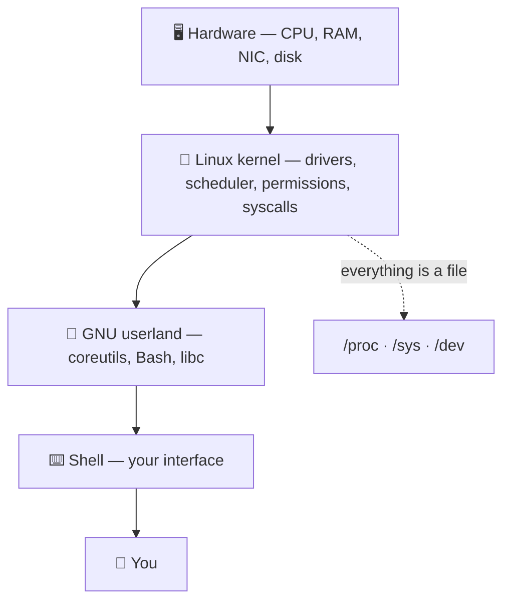
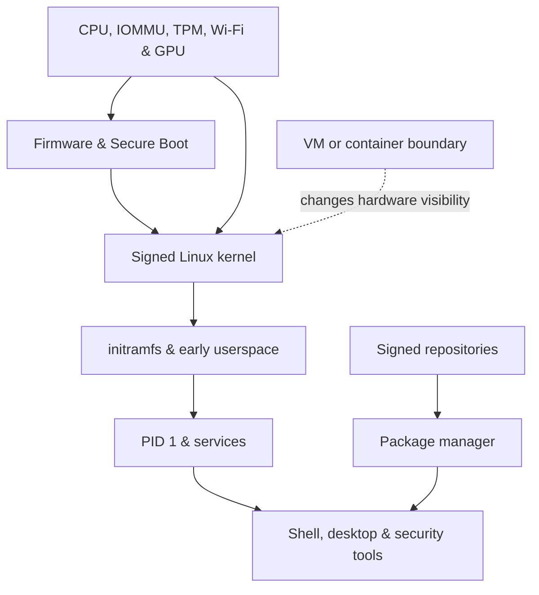

# 🐧 Linux Introduction & Distributions

> [!abstract] Master Note of [[Linux]]
> Before a single command, understand *why* nearly all offensive and defensive security runs on Linux — and which flavour to run, where, and on what hardware. This is the Crook's first step onto solid ground.

## Parent Learning Order
Linux Introduction & Distributions -> Linux CLI & Core Commands -> Linux I-O Redirection & Piping -> Linux File System Hierarchy & Editors -> Linux Boot Process & systemd -> Linux Permissions & Process Management -> Linux Memory & Storage Internals -> Linux Networking, Transfers & Curl -> Linux Security Controls & Hardening -> Linux Observability, Logging & Forensics -> Linux Advanced Mechanics & Privilege Escalation -> Linux Kernel Internals -> Linux Documentation & Note-Taking

## Start from zero — the machine, the operating system & the distribution

A computer begins as physical components: a processor executes instructions, memory holds the working state, storage retains bytes after power loss, and devices move data to displays, networks, disks, and peripherals. Hardware alone does not know what a user, file, window, or network connection is. An **operating system** coordinates those components and presents stable abstractions so applications do not have to control each device directly. The Linux **kernel** is the privileged coordinator; user-space programs provide commands, services, libraries, and graphical interfaces.

Keep five terms separate from the beginning. The **kernel** controls hardware and isolation. A **userland** is the collection of ordinary programs around it. A **shell** reads commands and launches programs. A **distribution** integrates a kernel, userland, package repositories, defaults, and an update policy. A **desktop environment** is an optional graphical layer. Ubuntu and Arch are distributions; Bash is a shell; GNOME is a desktop; none of them is the kernel itself.

No prior Linux knowledge is required for this note. You should only be comfortable identifying CPU, RAM, storage, and a network interface. By the end, you should be able to justify a platform choice from workload, trust, support lifetime, hardware access, isolation, and recovery requirements instead of choosing a distribution because of branding.

## What "Linux" actually is
"Linux" is precisely the **kernel** — the core that talks to hardware, schedules processes, and enforces permissions. A usable system wraps that kernel in the **GNU** userland (coreutils, Bash), a package manager, and optionally a desktop. A **distribution ("distro")** is a specific bundle of those pieces.



## Why Linux dominates cybersecurity
- **Open-source & auditable.** The entire kernel and userland source is public — you can read exactly what a tool does, patch it, and trust it. It's also free, so a full lab costs nothing.
- **Complete system control.** Linux hands you the whole machine: raw sockets, kernel modules, every process and file, and the almighty **`root`** account. Packet crafting, ARP spoofing, and Wi‑Fi monitor mode are impossible on a locked-down consumer OS.
- **The CLI *is* the system.** Everything is scriptable, pipeable, and remotable over **SSH**. Automation, chained tooling, and headless servers all flow from a first-class command line.
- **"Everything is a file."** Devices (`/dev/sda`), processes (`/proc`), and kernel state (`/sys`) are exposed as files, so a handful of tools (`cat`, `grep`, `find`) inspect the entire system.
- **It runs everything.** ~90% of the public cloud, most web servers, Android, routers, and IoT are Linux — so the systems you attack and defend *are* Linux.

## The security distributions
| Distro | Base · Package mgr | Release model | Character |
| --- | --- | --- | --- |
| **Ubuntu** | Debian · `apt` | Fixed (6-mo / LTS) | The friendly on-ramp — stable, huge community, the default for **servers** and beginners. Learn Linux here. |
| **Kali Linux** | Debian · `apt` | Rolling | The industry-standard pentest distro — 600+ tools preinstalled; the common language of CTFs and courses. |
| **Parrot OS** | Debian · `apt` | Rolling | Kali's lighter, privacy-focused cousin — sandboxing, anonymity tooling, gentler on low-spec hardware. |
| **Arch Linux** | Independent · `pacman` | Rolling | Minimal, build-it-yourself. Total control and bleeding-edge packages via the **AUR**; you learn the system by assembling it. |
| **BlackArch** | Arch · `pacman` | Rolling | Arch + **2800+** security tools as an overlay repo — the Arch user's pentest arsenal. |

> **Rolling vs fixed release:** a *rolling* distro (Arch, Kali) continuously ships the newest packages — latest tools, occasional breakage. A *fixed* release (Ubuntu LTS) freezes versions for stability — ideal for servers you can't babysit.

```shell-session
# The same job, three package managers:
$ sudo apt install nmap        # Debian / Ubuntu / Kali / Parrot
$ sudo pacman -S nmap          # Arch / BlackArch
$ sudo dnf install nmap        # Fedora / RHEL
```

## Where to run it — four installs
| Method | Best for | Trade-off |
| --- | --- | --- |
| **Bare-metal** | Daily driver, wireless & GPU work | Commit the whole disk |
| **VM** (VirtualBox/VMware) | Learning, disposable targets, snapshots | Hardware is emulated/limited |
| **Dual-boot** | Native performance + keep another OS | Reboot to switch |
| **WSL2** (on Windows) | Quick Linux CLI on a Windows host | No raw hardware, limited for offence |
| **Live USB** | Forensics, try-before-install, amnesic use | Nothing persists (by default) |

## Bare-metal vs virtual machine
Running your attack OS **natively on the hardware** instead of inside a VM matters more than beginners think:
- **Raw performance.** No hypervisor tax — full CPU, full RAM, no disk/IO translation. A long **Hashcat** crack or a big Nmap sweep runs meaningfully faster.
- **Direct hardware access** (the big one). A VM hides or emulates hardware; bare-metal gives the OS the *real* device:
  - **Wi‑Fi adapters** get true **monitor mode** and **packet injection** — essential for wireless attacks; USB pass-through to a VM is flaky and often breaks capture.
  - **GPUs** are fully available for password cracking; VM GPU pass-through is fragile and lossy.
  - **USB, Bluetooth, SDR, Proxmark** devices "just work" without pass-through gymnastics.
- **Trade-off:** VMs win on **snapshots, isolation, and disposability** — perfect for detonating malware or throwaway targets.

> [!info] The pro setup
> Often **both**: bare-metal Kali/Arch as the daily attack host for real wireless + GPU cracking, and VMs for sacrificial targets and risky samples. Use a VM to *learn* safely; go bare-metal when you need real hardware or maximum performance.

> [!tip] Crook → Root
> **Crook** installs Kali because a tutorial said so. **Root** picks the tool for the job — Kali/Parrot for a ready arsenal, Arch/BlackArch for a lean custom rig, Ubuntu for a rock-solid server — and can rebuild any of them from memory.

## Architecture choices that matter in security

A distribution is not merely a wallpaper and package list. It chooses a kernel configuration, C library, init system, compiler hardening defaults, repository trust model, update cadence, and support lifetime. Those choices change the attack surface. Ubuntu LTS favors predictable ABI compatibility, signed packages, unattended security updates, AppArmor profiles, and long maintenance windows. Arch exposes newer kernels and toolchains quickly, which is valuable for research but demands closer attention to breaking changes and package provenance. Kali and Parrot prioritize a reproducible assessment workstation; they are not automatically safer than a carefully maintained general-purpose distribution. BlackArch is an Arch repository layered over a normal installation, so the operator inherits Arch's responsibility model.

The userland also matters. GNU/Linux commonly combines the Linux kernel with glibc, GNU coreutils, Bash, systemd, and distribution packaging. Alpine instead uses musl and BusyBox, producing smaller containers with different libc behavior and fewer conveniences. A command that works on a full Debian host may fail on BusyBox because flags differ. During incident response or authorized assessment, identify the actual environment before assuming syntax:

```shell-session
$ uname -srm
Linux 6.8.0-45-generic x86_64
$ . /etc/os-release; printf '%s %s\n' "$NAME" "$VERSION_ID"
Ubuntu 24.04
$ getconf GNU_LIBC_VERSION 2>/dev/null || ldd --version | head -1
glibc 2.39
$ readlink -f /sbin/init
/usr/lib/systemd/systemd
```

CPU architecture determines binary compatibility and exploitation assumptions. `x86_64`, `aarch64`, and `riscv64` have different instruction sets, calling conventions, page-table features, and mitigations. A binary's format must match the host unless emulation is present. Secure Boot, TPM-backed measured boot, IOMMU support, and firmware quality are hardware properties that influence platform trust far below the package manager.



## Native, virtualized, containerized, or remote

Bare metal removes the hypervisor from the performance and device path. That gives predictable CPU counters for profiling, direct PCIe/USB access, reliable Wi-Fi monitor mode, and native GPU acceleration. It also means a kernel panic takes down the workstation and an untrusted kernel module has access to the real machine. Full-disk encryption, verified installation media, a tested recovery key, and separate work/client data are therefore essential.

A virtual machine provides snapshots, isolated virtual networking, disposable disks, and the ability to model multiple hosts on one laptop. It is ideal for destructive kernel experiments. Its limitations are timing distortion, emulated devices, shared-folder exposure, and imperfect USB/GPU pass-through. Containers are lighter still, but share the host kernel: they isolate processes, not kernels. A container is excellent for pinning tool dependencies, but it is not a safe boundary for arbitrary hostile kernel-facing code.

Remote Linux hosts are often the best answer for repeatable builds or long-running workloads. A dedicated lab server can expose GPU or high-memory resources while the laptop remains a thin client. Treat SSH keys, host verification, firewall policy, and encrypted storage as part of the platform design.

## Package trust & lifecycle operations

Never solve routine software installation by piping an unknown network response into a privileged shell. Distribution repositories provide signatures, dependency resolution, update history, and a removal path. Verify what repository a package comes from and inspect candidate versions before installing:

```shell-session
$ apt-cache policy openssh-server
openssh-server:
  Installed: 1:9.6p1-3ubuntu13.8
  Candidate: 1:9.6p1-3ubuntu13.8
  500 http://security.ubuntu.com/ubuntu noble-security/main amd64 Packages
$ pacman -Si openssh | sed -n '1,8p'
Repository      : core
Name            : openssh
Version         : 9.9p2-1
Packager        : Arch Linux
```

Rolling systems should be upgraded as a coherent unit rather than cherry-picking core libraries. Fixed releases need timely security updates and planned major-version migration. A security workstation should be reproducible: record package sources, configuration, hardware firmware, encryption layout, and recovery procedure.

## Troubleshooting a platform mismatch

When software behaves differently from its documentation, identify the platform before changing it. Confirm distribution and release with `/etc/os-release`, kernel and architecture with `uname -srm`, libc with `ldd --version` or `getconf`, init with `readlink -f /sbin/init`, and virtualization with `systemd-detect-virt`. An `Exec format error` usually means the binary architecture or format is wrong; `GLIBC_2.xx not found` means its dynamic-library requirement is newer than the host; a command with missing options may be a BusyBox rather than GNU implementation.

For missing hardware, compare `lspci -nnk`, `lsusb`, `dmesg`, and `ip link`. In a VM, confirm that the hypervisor presented or passed through the device before searching for drivers. For package failures, inspect repository origin, release compatibility, signature status, and system clock before bypassing verification. Never “fix” a trust error with unauthenticated downloads. The diagnostic outcome should name the incompatible layer—CPU, kernel feature, libc, package source, device exposure, or release policy—not merely state that the distribution is unsupported.

## Hands-on lab — identify & justify a platform

1. Run `uname -a`, `cat /etc/os-release`, `lscpu`, `lsblk -f`, `systemd-detect-virt`, and `mokutil --sb-state` where available.
2. Record kernel, architecture, init system, virtualization status, filesystem, encryption state, and Secure Boot state.
3. List enabled repositories and verify the signing-key mechanism used by the distribution.
4. Compare a native host and VM with `lspci`, `lsusb`, `ip link`, and `nproc`; explain each missing or virtualized device.
5. Write a one-paragraph platform decision for an assessment workstation, a production server, and a malware-analysis sandbox.

Expected evidence resembles:

```text
Virtualization: kvm
SecureBoot enabled
/dev/nvme0n1p3  crypto_LUKS
Architecture: x86_64
Network controller: Intel Corporation Wi-Fi 6E AX210
```

## Security implications

The strongest distribution choice is the one that can be patched, audited, rebuilt, and operated correctly. Preinstalled tools do not replace repository hygiene, disk encryption, least privilege, or isolation. Native hardware expands capability and blast radius simultaneously; virtualization reduces blast radius but can hide hardware behavior. The professional decision is explicit, documented, and matched to the workload.

### Crook → Operator → Root checkpoint

- **Crook:** distinguish kernel, userland, shell, distribution, and desktop; identify the host accurately.
- **Operator:** choose native, VM, container, or remote execution based on isolation, timing, and device requirements; verify package provenance.
- **Root:** design a reproducible, encrypted, measured, recoverable Linux platform and explain how hardware, kernel configuration, libc, and release policy alter security.

---
> 🔼 Up: [[Linux]]
