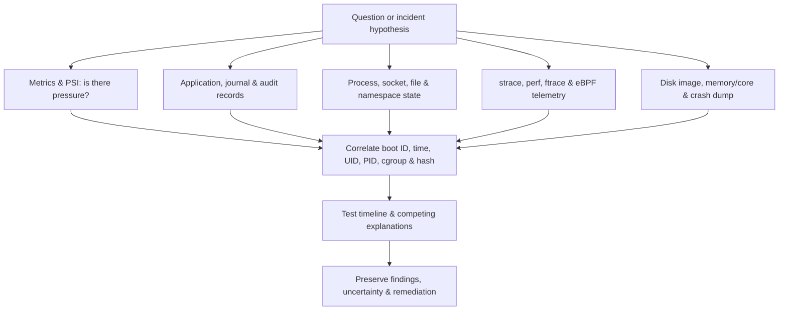

# 🔭 Linux Observability, Logging & Forensics

> [!abstract] Master Note of [[Linux]]
> Observability asks what the system is doing now; logging records selected events; forensics reconstructs what happened while preserving evidence. Linux exposes each layer—from application records and process syscalls to scheduler events and crash memory—but every source has blind spots and collection cost.

## Parent Learning Order
Linux Introduction & Distributions -> Linux CLI & Core Commands -> Linux I-O Redirection & Piping -> Linux File System Hierarchy & Editors -> Linux Boot Process & systemd -> Linux Permissions & Process Management -> Linux Memory & Storage Internals -> Linux Networking, Transfers & Curl -> Linux Security Controls & Hardening -> Linux Observability, Logging & Forensics -> Linux Advanced Mechanics & Privilege Escalation -> Linux Kernel Internals -> Linux Documentation & Note-Taking

## Start from zero — event, telemetry, evidence & inference

An **event** is something that happened; **telemetry** is a recorded representation of activity; **evidence** is information preserved with enough provenance and integrity to support a conclusion; an **inference** is the analyst's interpretation. These are not interchangeable. A missing log line does not prove an event did not occur, and a process name does not prove the process contained the expected code.

**Logging** records selected messages. **Metrics** aggregate numeric behavior over time. **Tracing** follows execution or requests across operations. **Observability** uses these signals to infer internal state. **Digital forensics** acquires, preserves, examines, and reports artifacts while controlling alteration. Every source has a producer, clock, format, retention period, privilege boundary, and failure mode. Trust must be evaluated, not assumed.

Prerequisites are files, processes, services, time, and hashes. Begin with a single known action in a disposable lab: record UTC time, perform it, locate its application, service, audit, and kernel traces, and note what each source can and cannot prove. Keep collection commands separate from interpretation. At expert level, you should explain visibility gaps, source tampering risk, clock skew, buffering, rotation, namespace boundaries, and the evidence changes caused by your own acquisition.

## Build an evidence hierarchy

Start with the least invasive source that can answer the question. Metrics reveal trends, logs provide discrete records, traces connect operations, profiles aggregate cost, and forensic artifacts preserve historical state. A single source is rarely authoritative. Correlate wall clock, monotonic time, boot ID, PID reuse, container namespace, cgroup, UID, executable identity, network tuple, and host identity.



Before analysis, record UTC time and synchronization state. Clock changes, suspended VMs, timezone assumptions, and log forwarding delay distort timelines. `timedatectl`, chrony tracking, and journal boot IDs provide context. Prefer original timestamps plus normalized UTC rather than replacing source values.

## systemd-journald & conventional logs

journald collects service stdout/stderr, syslog messages, kernel records, and structured fields. Records can carry `_PID`, `_UID`, `_SYSTEMD_UNIT`, `_COMM`, `_EXE`, `_BOOT_ID`, cgroup, capabilities, and transport. Storage may be volatile under `/run/log/journal` or persistent under `/var/log/journal`. Rotation and vacuum settings bound retention. Forwarding to a remote collector protects against local loss but introduces transport and ingestion considerations.

```shell-session
$ journalctl --list-boots | tail -3
 -2 75fd... Tue 2026-07-29 08:11:03 +03—Tue 2026-07-29 18:02:41 +03
 -1 294a... Wed 2026-07-30 08:09:12 +03—Wed 2026-07-30 20:44:27 +03
  0 9e10... Thu 2026-07-31 08:04:55 +03—Thu 2026-07-31 17:34:12 +03
$ journalctl -u ssh -b -1 -o json-pretty --no-pager | sed -n '1,14p'
{
    "_SYSTEMD_UNIT" : "ssh.service",
    "_COMM" : "sshd",
    "_PID" : "812",
    "MESSAGE" : "Accepted publickey for analyst from 192.0.2.40 port 54122 ssh2"
}
```

Useful filters include `-b`, `--since`, `--until`, `-u`, `_PID=`, `_UID=`, executable path, priority range, and kernel mode (`-k`). `journalctl --verify` checks journal file structure and sealing where configured. Absence is not proof: rate limits, volatile storage, rotation, service routing, namespace isolation, or collection failure may explain missing records.

Traditional text logs still matter. Distribution and service determine whether authentication appears in `/var/log/auth.log`, `/var/log/secure`, only the journal, or a remote destination. Logrotate renames/compresses files and signals services to reopen descriptors. Copy-truncate can lose records under load; rename/create is usually safer when applications support reopen.

## Linux Audit Framework

The audit subsystem records selected security-relevant kernel events. Rules can watch paths or filter syscalls and fields such as architecture, UID, audit UID, executable, success, and exit value. The **login UID** (`auid`) persists across many identity transitions and helps attribute actions to the original authenticated session. Audit records for one event may span SYSCALL, EXECVE, CWD, PATH, SOCKADDR, and PROCTITLE entries linked by a serial number.

```shell-session
$ sudo auditctl -s
enabled 1
failure 1
pid 694
rate_limit 0
lost 0
backlog 0
$ sudo ausearch -m EXECVE -ts recent -i | sed -n '1,14p'
type=PROCTITLE proctitle=636174002F6574632F736861646F77
type=PATH name="/etc/shadow" inode=1048821 mode=0100640 ouid=root ogid=shadow
type=SYSCALL arch=x86_64 syscall=openat success=no exit=EACCES a0=AT_FDCWD auid=analyst uid=analyst exe=/usr/bin/cat
```

Rules should answer defined questions. Overbroad syscall auditing can flood the backlog and degrade a host. Watch high-value policy/configuration files, identity databases, privilege tools, module/BPF operations, time changes, and relevant service paths. Monitor `lost` and backlog health. Immutable audit configuration can resist runtime changes but complicates emergency operations and requires planned reboot procedures.

## Syscall tracing, profiling & eBPF

`strace` follows syscall entry and return, arguments, timing, child processes, and errors. It is ideal for “which file is missing?” or “where does this connection fail?” It perturbs timing and requires ptrace permissions. Attach to production processes only with authorization.

```shell-session
$ strace -ff -ttT -e trace=file,network -o /tmp/web.trace curl -sS http://127.0.0.1:8080/health
{"status":"ok"}
$ tail -4 /tmp/web.trace.*
17:40:01.104201 socket(AF_INET, SOCK_STREAM, IPPROTO_TCP) = 5 <0.000021>
17:40:01.104312 connect(5, {sin_port=htons(8080), sin_addr=inet_addr("127.0.0.1")}, 16) = 0 <0.000072>
17:40:01.105004 recvfrom(5, "HTTP/1.1 200 OK...", 102400, 0, NULL, NULL) = 126 <0.000481>
```

`perf stat` counts hardware/software events; `perf record` samples stacks for hotspot analysis; `perf trace` provides a syscall-oriented view. Frame pointers or DWARF data improve call stacks. Sampling gives statistical evidence rather than a record of every event.

eBPF attaches to stable tracepoints, kprobes, uprobes, network hooks, cgroups, and LSM hooks. A program filters in kernel context and emits compact events through ring buffers or maps. This can observe short-lived processes and high-volume events with less copying than full tracing. It also introduces privileged code, verifier/JIT behavior, lost-event risk, kernel-version portability concerns, and privacy obligations. Record program identity, attachment point, filters, map capacity, drop counters, and time source.

```shell-session
$ sudo bpftrace -e 'tracepoint:syscalls:sys_enter_execve { @[comm] = count(); } interval:s:10 { exit(); }'
Attaching 2 probes...
@[systemd]: 2
@[sshd]: 4
@[bash]: 13
@[curl]: 21
$ sudo perf stat -e task-clock,context-switches,page-faults -p 1841 sleep 5
       112.42 msec task-clock
          311      context-switches
          104      page-faults
```

## Live response & forensic preservation

Live response observes volatile state but changes it: commands execute processes, read files, alter access times on some filesystems, allocate memory, and write logs. Decide whether availability, volatile evidence, or pristine disk preservation has priority. In an active incident, capture time, users, sessions, process tree, network sockets, routes, namespaces, mounts, open/deleted files, loaded modules, eBPF objects, cgroups, scheduled tasks, and recent logs before shutdown if policy permits.

Store acquisition tools and outputs on controlled media. Hash artifacts, document tool versions and commands, and avoid writing to the suspected filesystem. For disks, acquire at the block layer to an approved destination, record device identity and partition map, and analyze copies. Copy-on-write filesystems, LVM snapshots, cloud volumes, RAID, thin provisioning, and encryption change acquisition semantics. A snapshot is crash-consistent unless the application or filesystem is quiesced.

Memory can contain keys, tokens, processes, sockets, injected code, and kernel state, but acquisition is platform-specific and highly privileged. Core dumps offer process-scoped memory and registers. systemd-coredump may store compressed cores and metadata; production policy often limits them because they can contain secrets.

```shell-session
$ coredumpctl list --since today | head
TIME                         PID UID GID SIG COREFILE EXE
Thu 2026-07-31 16:52:13 +03 8841 999 999  11 present  /usr/local/bin/parser
$ coredumpctl info 8841 | grep -E 'Signal|Command Line|Storage|Size'
Signal: 11 (SEGV)
Command Line: /usr/local/bin/parser --worker
Storage: /var/lib/systemd/coredump/core.parser...
Size on Disk: 3.8M
```

## Kernel crash evidence

An Oops or panic may persist in journal, pstore, serial console, BMC logs, or a kdump `vmcore`. Preserve the earliest warning, full call trace, registers, kernel command line, taint state, loaded modules, and exact kernel/debug symbols. Later faults often cascade from initial corruption. `crash` with matching `vmlinux` can inspect tasks, stacks, memory, mounts, and logs offline. Never test panic triggers on a production host.

## Troubleshooting visibility before interpreting evidence

When expected telemetry is absent, verify the collection path end to end. Confirm the event happened on the expected host and boot, the source was enabled beforehand, the producer had permission to emit, the collector accepted it, timestamps and timezones align, rotation or retention did not remove it, and your query includes the correct namespace, cgroup, UID, PID lifetime, and fields. Generate one harmless canary event to test the pipeline without assuming historical recovery is possible.

When sources disagree, preserve both. Process identifiers are reused; wall clocks jump; containers alter views; journald and conventional syslog may format or retain different subsets. Prefer boot ID plus monotonic time for within-boot ordering, correlate file hashes and executable identity, and document source confidence. If collection itself changes access time, cache state, logs, or process behavior, include that observer effect in the case record.

```shell-session
$ logger --tag c2r-canary 'case=IR-204 event=visibility-test'
$ journalctl -t c2r-canary -o json-pretty --since -1m | sed -n '1,12p'
{
  "MESSAGE" : "case=IR-204 event=visibility-test",
  "SYSLOG_IDENTIFIER" : "c2r-canary",
  "_BOOT_ID" : "1a42...",
  "__REALTIME_TIMESTAMP" : "1785502024000000"
}
```

If the canary appears but the original event does not, report a historical visibility gap rather than inventing certainty. If it does not appear, repair or document collection before drawing incident conclusions.

## Hands-on lab — investigate a synthetic service incident

In a disposable VM, run a service that intermittently fails to open a configuration file and consumes CPU. Establish UTC and boot ID. Use `systemctl status`, journal structured output, `ps`/`pstree`, `ss`, and `/proc` to establish identity and state. Trace only file/network syscalls briefly with `strace`. Profile for ten seconds with `perf`. Add a temporary audit rule for the test configuration path, reproduce one denial, export the linked audit event, then remove the rule. Hash every output and write a timeline separating observed facts from inference.

Expected synthesis:

```text
17:51:02Z journal  service entered activating state (PID 9214)
17:51:02Z audit    openat /etc/lab/parser.conf -> EACCES, auid=1000 uid=999
17:51:03Z strace   repeated openat failures followed by busy retry loop
17:51:13Z perf     91.4% CPU in retry_parse_config
Conclusion: permission regression triggers unbounded retry; no evidence of network dependency failure.
```

## Collection integrity & blind-spot testing

Continuously test the telemetry path. Generate an approved canary event, verify local capture, forwarding, parsing, indexing, timestamp normalization, field preservation, retention, and alert delivery. Monitor journal/audit drop counters, forwarder queues, disk pressure, eBPF ring-buffer loss, collector authentication, and ingestion delay. A healthy dashboard does not prove that high-value events survive every hop.

Record the expected negative space as well: container logs may bypass host files, encrypted traffic hides payloads, statically linked programs alter library visibility, kernel compromise can falsify host telemetry, and high-rate activity can force sampling or loss. Independent network, identity, hypervisor, and remote log sources reduce reliance on one potentially compromised observer.

## Security implications

Visibility has cost and power. Logs can contain credentials and personal data; tracing can expose application secrets; audit floods can drop records; profiling can perturb timing; live response changes state. Conversely, insufficient retention or local-only records let compromise erase context. Apply least privilege to collectors, encrypt transport/storage, monitor collection health, define retention, synchronize time, centralize high-value evidence, and test that detections and crash capture actually work.

### Crook → Operator → Root checkpoint

- **Crook:** query current/previous boots, inspect processes and sockets, and distinguish metrics, logs, traces, profiles, and artifacts.
- **Operator:** correlate journal/audit/syscalls/perf/eBPF evidence, measure collection loss and overhead, and produce a hashed, reproducible timeline.
- **Root:** design host observability and forensic acquisition around threat model, namespaces, time, retention, privacy, crash recovery, and independent evidence validation.

---
> 🔼 Up: [[Linux]]
