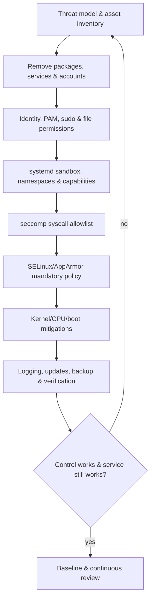

# 🛡️ Linux Security Controls & Hardening

> [!abstract] Master Note of [[Linux]]
> Linux security is a stack: identity and mode bits, capabilities, namespaces, syscall reduction, mandatory access control, authentication policy, compiler/CPU mitigations, service sandboxing, patching, and trustworthy operations. No single layer replaces the others.

## Parent Learning Order
Linux Introduction & Distributions -> Linux CLI & Core Commands -> Linux I-O Redirection & Piping -> Linux File System Hierarchy & Editors -> Linux Boot Process & systemd -> Linux Permissions & Process Management -> Linux Memory & Storage Internals -> Linux Networking, Transfers & Curl -> Linux Security Controls & Hardening -> Linux Observability, Logging & Forensics -> Linux Advanced Mechanics & Privilege Escalation -> Linux Kernel Internals -> Linux Documentation & Note-Taking

## Start from zero — hardening is controlled reduction

**Security hardening** means deliberately reducing the ways a system can be misused while preserving its required function. It is not a checklist of switches that always make a host safer. Every control starts from an asset, threat, trust boundary, required behavior, and failure consequence. The same restriction can be valuable on a single-purpose server and disruptive on a research workstation.

Distinguish prevention, containment, detection, recovery, and assurance. **Prevention** rejects an action. **Containment** limits blast radius after something runs. **Detection** creates evidence of unexpected behavior. **Recovery** restores a trusted state. **Assurance** provides justified confidence that controls remain effective. Least privilege narrows identity authority; attack-surface reduction removes unnecessary reachable code; defense in depth prevents one failed control from deciding the entire outcome.

Prerequisites are Linux identities, permissions, processes, services, and package updates. Establish a baseline before changing policy: record listening services, enabled units, accounts, capabilities, kernel command line, mandatory-access-control state, and expected workload. Apply one reversible change at a time, validate both permitted and denied behavior, capture logs, and maintain console or rollback access. A secure configuration that cannot be explained, tested, or recovered is operational debt.

## Start with threat model & attack surface

Hardening is not copying a checklist. Define assets, trust boundaries, users, network exposure, workloads, administrators, recovery requirements, and plausible adversaries. Inventory the actual system: installed packages, enabled services, listeners, scheduled tasks, kernel modules, boot state, local accounts, sudo policy, filesystems, containers, and external dependencies. Remove what the workload does not need before tuning what remains.



Baseline before changing. A control that silently breaks monitoring, backup, or recovery can reduce security. Apply changes in a staged environment, keep console/recovery access, validate syntax, use timed rollback for remote network/authentication changes, and preserve configuration history outside this exercise.

## Discretionary access, capabilities & `no_new_privs`

Traditional Unix discretionary access control uses UIDs, GIDs, mode bits, ACLs, and ownership. Minimize shared accounts, interactive root login, writable privileged paths, and supplementary groups such as `docker`, `libvirt`, `disk`, or `adm`. Use sudo for audited task-level delegation and purpose-built wrappers with fixed arguments rather than general shells or interpreters.

Capabilities decompose root but can still be broad. Services should begin with the smallest bounding set. systemd can remove capabilities, prevent future privilege gains, isolate temporary files, and make most of the filesystem read-only:

```ini
[Service]
User=websvc
Group=websvc
NoNewPrivileges=yes
CapabilityBoundingSet=
AmbientCapabilities=
PrivateTmp=yes
PrivateDevices=yes
ProtectSystem=strict
ProtectHome=yes
ProtectKernelTunables=yes
ProtectKernelModules=yes
ProtectControlGroups=yes
RestrictSUIDSGID=yes
LockPersonality=yes
MemoryDenyWriteExecute=yes
ReadWritePaths=/var/lib/websvc /run/websvc
```

`NoNewPrivileges=yes` causes `execve` to ignore privilege gains from SUID/SGID and file capabilities. It is foundational for sandboxed workloads. `MemoryDenyWriteExecute` obstructs mappings that are simultaneously writable and executable but can break JIT runtimes. `PrivateDevices` supplies a minimal device view. Validate each directive with `systemd-analyze security` and application tests.

## seccomp: reducing kernel API exposure

**seccomp-BPF** filters syscalls by number, architecture, and argument values. Actions include allow, errno, trap, kill, log, or user notification. It is not a full sandbox: a permitted syscall can still be dangerous, and seccomp does not understand pathnames after pointer dereference. It reduces kernel attack surface and constrains behavior after compromise.

Begin from observed workload behavior, then create an allowlist with room for startup, libraries, DNS, time, threading, signals, and shutdown. systemd's `SystemCallFilter=` provides maintained syscall groups. Avoid denylisting a handful of famous calls while leaving equivalent functionality.

```shell-session
$ systemd-analyze syscall-filter @system-service | sed -n '1,12p'
# Operating system service manager
@system-service
    @aio
    @basic-io
    @chown
$ systemctl show websvc -p SystemCallFilter -p NoNewPrivileges
SystemCallFilter=@system-service
NoNewPrivileges=yes
```

If a filter blocks a call, the application may receive `EPERM`, terminate with `SIGSYS`, or be killed depending on action. Diagnose with the journal, audit records, and controlled tracing; do not immediately disable the policy.

## Linux Security Modules: SELinux & AppArmor

The LSM framework places hooks at security-relevant kernel operations. SELinux labels subjects and objects with security contexts and evaluates type-enforcement policy. AppArmor primarily associates pathname-based profiles with programs. Both implement mandatory access control beyond owner discretion: a root process can still be denied.

SELinux modes are enforcing, permissive, and disabled. Permissive logs denials but allows operations; use it temporarily for policy development, not as the permanent fix. Contexts contain user, role, type, and level. Type enforcement is the dominant server mechanism. Relabel with policy-aware tools (`restorecon`, `semanage fcontext`) rather than arbitrary `chcon`, whose change may disappear during relabel.

```shell-session
$ getenforce
Enforcing
$ ls -Z /var/www/html/index.html
system_u:object_r:httpd_sys_content_t:s0 /var/www/html/index.html
$ ausearch -m AVC -ts recent | tail -4
type=AVC msg=audit(...): avc: denied { write } for pid=1841 comm="httpd" name="uploads" scontext=system_u:system_r:httpd_t:s0 tcontext=system_u:object_r:httpd_sys_content_t:s0 tclass=dir
```

The denial above may indicate the directory needs a designated writable type, not a broad allow rule. Understand intent before generating policy.

AppArmor profiles define file, capability, network, mount, signal, and execution rules. Enforce mode blocks and logs; complain mode logs without blocking. Profiles must account for aliases, mounts, and path changes. Use abstractions carefully and keep local overrides separate from packaged policy.

```shell-session
$ aa-status | sed -n '1,8p'
apparmor module is loaded.
42 profiles are loaded.
39 profiles are in enforce mode.
3 profiles are in complain mode.
$ journalctl -k -g 'apparmor="DENIED"' --since -1h
kernel: audit: apparmor="DENIED" operation="open" profile="/usr/sbin/websvc" name="/etc/shadow" requested_mask="r" denied_mask="r"
```

Do not run conflicting ad-hoc policy systems without understanding the distribution's supported LSM stacking and ordering. Confirm active modules with `/sys/kernel/security/lsm`.

## PAM, account policy & authentication

PAM provides pluggable stacks for authentication, account authorization, password changes, and session setup. Service-specific files under `/etc/pam.d` include or compose modules. Control flags (`required`, `requisite`, `sufficient`, `optional`, and bracket syntax) determine failure propagation; ordering changes security. A `sufficient` success can short-circuit later modules, while a `required` failure may be reported only after the stack completes.

PAM handles local login, sudo, SSH, screen lockers, and other services, but not every application. Hardening may include MFA, password quality where passwords exist, lockout/rate control designed to avoid denial-of-service, restricted `su`, session limits, and centralized identity. Test through a second session before closing the first; a syntax mistake can lock out administrators.

```shell-session
$ sudo pamtester login testuser authenticate
Password:
pamtester: successfully authenticated
$ faillock --user testuser
testuser:
When                Type  Source      Valid
2026-07-31 17:22:10 RHOST 192.0.2.44  V
```

SSH hardening should prefer strong keys or approved MFA, disable direct root login, constrain forwarding when unnecessary, restrict users/groups, and maintain host keys. Do not disable passwords until every required recovery and automation path has been tested.

## Kernel, CPU & boot mitigations

ASLR randomizes user-space layout; KASLR randomizes kernel placement. NX/W^X prevents execution from writable data pages. Stack canaries detect many stack overwrites. PIE makes executables relocatable. RELRO protects relocation structures. Fortify adds bounds checks to supported libc operations. At CPU/kernel level, SMEP blocks supervisor execution of user pages, SMAP limits supervisor access to user pages, PAN serves a similar role on ARM, and IOMMU constrains DMA-capable devices.

```shell-session
$ sysctl kernel.randomize_va_space kernel.kptr_restrict kernel.dmesg_restrict
kernel.randomize_va_space = 2
kernel.kptr_restrict = 2
kernel.dmesg_restrict = 1
$ grep -E 'smep|smap' /proc/cpuinfo | head -1
flags : ... smep ... smap ...
$ hardening-check /usr/sbin/sshd 2>/dev/null | head
 Position Independent Executable: yes
 Stack protected: yes
 Fortify Source functions: yes
```

These mitigations raise exploitation cost; they do not remove memory-safety bugs. Keep kernel, firmware, microcode, packages, and container images patched. Limit unprivileged user namespaces and eBPF according to workload and distribution guidance. Enforce signed modules and lockdown where the platform model supports it.

## Troubleshooting a control without disabling it

When hardening breaks a workload, identify the enforcing layer. Record the exact denied operation, process identity, object, time, and expected business function. Ordinary `EACCES` may come from DAC or ACLs; `EPERM` may indicate capabilities, seccomp, immutable state, namespace restrictions, or policy. Correlate service journal, audit records, SELinux AVCs, AppArmor messages, kernel lockdown, and systemd sandbox properties. Do not set SELinux permissive, remove an AppArmor profile, or grant broad capabilities as the first experiment.

Test the smallest hypothesis in a disposable environment. For systemd, `systemd-analyze security` inventories exposure but does not prove compatibility; `systemctl show` reveals effective settings. For seccomp, identify the denied syscall and why the application requires it. For MAC policy, fix labels or add a narrow rule only after validating intended data flow.

```shell-session
$ journalctl -u invoice.service --since -5m --no-pager | tail -2
invoice[4182]: open /home/invoice/template.html: Permission denied
$ systemctl show invoice.service -p ProtectHome -p ReadOnlyPaths -p ReadWritePaths
ProtectHome=yes
ReadOnlyPaths=/
ReadWritePaths=/var/lib/invoice /var/log/invoice
```

The service design and sandbox disagree about where templates live. Move required data into an approved service-owned path or declare the narrow read-only path; do not remove the entire home-directory boundary. Retest allowed behavior, denied behavior, restart, rollback, and evidence generation.

## Hands-on lab — harden one service without breaking it

Choose a disposable HTTP service. Record its user, ports, filesystem writes, capabilities, syscalls, LSM context, cgroup, and expected health check. Add systemd hardening one directive group at a time. Validate the unit, restart, run functional tests, inspect denials, and document exceptions. Apply a syscall filter based on observed behavior, then test startup, DNS, request handling, log rotation, reload, and shutdown. If SELinux or AppArmor is active, assign the intended writable path policy instead of suppressing all denials.

Expected before/after evidence:

```text
$ systemd-analyze security websvc.service | tail -1
→ Overall exposure level for websvc.service: 8.7 EXPOSED :(
# after tested hardening
→ Overall exposure level for websvc.service: 2.1 OK :)
$ curl --fail http://127.0.0.1:8080/health
{"status":"ok"}
```

## Supply-chain, integrity & configuration assurance

Host hardening depends on trustworthy inputs. Use signed distribution repositories, minimize third-party package sources, pin or approve sensitive dependencies, and inventory packages with their origin. Verify package-owned files through the distribution database, but recognize that expected configuration changes and generated state require separate baselines. Protect build pipelines, signing keys, deployment credentials, and update channels as production assets.

```shell-session
$ dpkg-query -W -f='${binary:Package}\t${Version}\n' | sort | sha256sum
5a9d...  -
$ sudo debsums -s 2>/dev/null | head
$ rpm -Va 2>/dev/null | head
$ systemd-delta
[EXTENDED] /usr/lib/systemd/system/sshd.service → /etc/systemd/system/sshd.service.d/hardening.conf
```

Configuration assurance asks whether intended state persists. Monitor privileged unit files, sudo/PAM policy, SSH configuration, bootloader entries, kernel command line, modules, sysctls, firewall rules, LSM policy, scheduled tasks, and trusted keys. Sign or hash approved baselines and store them where a compromised host cannot rewrite both evidence and reference. Treat drift as a review trigger, not automatically malicious activity.

Recovery is a security control. Test bare-metal or VM restoration, LUKS key recovery, boot rollback, configuration redeployment, and secret rotation. A hardened host that cannot be safely recovered will eventually be bypassed under operational pressure.

## Security implications

Hardening fails when controls are broad but untested, when administrators disable enforcement after the first denial, or when recovery is ignored. Effective defense combines minimal software, strong identity, safe delegation, reduced capabilities/syscalls, mandatory policy, exploit mitigations, verified boot, patching, encrypted backups, and observable change management. Measure both prevented behavior and retained business function.

### Crook → Operator → Root checkpoint

- **Crook:** inventory services/accounts, explain DAC versus MAC, and apply safe permissions and update practices.
- **Operator:** sandbox a service with systemd, capabilities, `no_new_privs`, seccomp, PAM, and active LSM policy while preserving function.
- **Root:** derive controls from a threat model, reason about kernel/CPU mitigations and policy composition, stage recovery, and prove hardening effectiveness with repeatable tests.

---
> 🔼 Up: [[Linux]]
