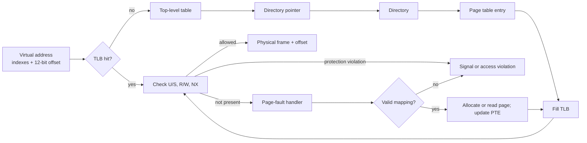

# 🧠 Memory Management & Paging

> [!abstract] Note of [[OS Theory and Architecture]]
> Memory management turns scarce physical RAM into protected virtual address spaces. Page tables, TLBs, demand paging, allocators, and NUMA policy determine both performance and the boundaries targeted by memory corruption, information disclosure, side channels, and resource exhaustion.

## Parent Learning Order
Theory of Processes & Threads -> CPU Scheduling Algorithms -> Memory Management & Paging -> I-O & File System Paradigms

## Prerequisites & First Mental Model

Start with two facts. Programs refer to bytes by **address**, and the machine has a finite amount of physical RAM. If every program used raw physical addresses, applications could overwrite one another and would need to know exactly where RAM was free. Virtual memory solves both problems by giving each process its own address space and translating its addresses through tables controlled by the kernel.

The beginner vocabulary is:

- A **byte** is the smallest commonly addressable unit; an **address** identifies a byte location.
- **Virtual memory** is the process-visible address space. **Physical memory** is installed RAM.
- A **page** is a fixed-size virtual-memory block; a **frame** is a same-sized block of physical memory.
- A **mapping** associates a virtual page with a frame, file region, zero-filled allocation, or other backing object.
- The **MMU** is CPU hardware that performs translation and enforces page permissions.
- A **page-table entry (PTE)** records a frame number and control bits such as present, writable, user-accessible, and non-executable.
- The **TLB** is a small translation cache inside the processor. A TLB miss requires a page-table walk; it is not automatically a page fault.
- A **page fault** is a controlled CPU exception raised when translation needs kernel assistance or an access violates policy.
- **Resident** memory currently occupies RAM. **Committed** memory has backing promised by the OS. **Reserved** virtual space may have neither physical pages nor immediate backing.
- **Locality** means programs tend to reuse nearby instructions and data over short periods. Paging and caches depend on this behavior.

Consider virtual address `0x00007f10abcd1234` in a system using 4 KiB pages. The low 12 bits (`0x234`) are the offset within the page; the remaining high bits identify the virtual page. Translation replaces the virtual page number with a physical frame number but preserves that offset. Permissions are checked during the same operation. Thus, “where are these bytes?” has at least three answers: the virtual address seen by the process, the current physical frame if resident, and the backing source from which the page can be reconstructed.

At Crook level, learn to distinguish virtual size, resident size, and valid access. At Operator level, interpret mappings, page-fault counters, core dumps, and sanitizer reports. At Root level, reason about translation hierarchies, allocator state, exploit primitives, NUMA placement, TLB coherence, and the security limits of mitigations such as ASLR and NX.

## 1. Address Spaces & the MMU

A process normally issues **virtual addresses**, not physical addresses. The CPU's **Memory Management Unit (MMU)** translates each virtual page number to a physical frame and checks access permissions. The page offset is unchanged by translation. With 4 KiB pages, the lower 12 address bits are the offset; the remaining bits identify the virtual page.

Virtual memory provides:

- **Isolation:** unrelated processes can use the same virtual address while mapping different physical frames.
- **Controlled sharing:** libraries, shared memory, and copy-on-write pages can map the same frames intentionally.
- **Sparse spaces:** a process can reserve large regions without immediately consuming RAM.
- **Protection:** page entries carry present, writable, user/supervisor, executable/NX, accessed, and dirty state.
- **Backing:** anonymous pages may be swapped; file mappings can be reconstructed from files.

Translation is a security decision made on every access. User/supervisor bits prevent ordinary code from reading kernel pages; NX/DEP prevents instruction fetch from data pages; read-only mappings protect code and constants. **W^X** policy avoids pages that are simultaneously writable and executable. These controls constrain exploitation, but they do not repair the originating memory-safety bug.

## 2. Multi-Level Page Tables

A flat table for every possible virtual page would be enormous. Architectures use a hierarchy and allocate lower levels only for populated regions. A representative 48-bit x86-64 address is divided into four 9-bit indexes plus a 12-bit offset. Newer modes may add another level.



Huge pages reduce page-table depth and TLB pressure by mapping larger regions, but internal fragmentation increases and coarse-grained mappings may complicate isolation. Kernel page-table isolation and address-space identifiers reduce either information exposure or TLB flush cost depending on the architecture and threat model.

## 3. TLBs & Translation Coherence

The **Translation Lookaside Buffer (TLB)** caches translations because a page-table walk may require several dependent memory reads before the requested data access occurs. Separate instruction and data TLBs may feed a larger shared level. A TLB miss is not necessarily a page fault: the mapping may be valid but absent from the cache.

When the kernel changes a mapping, stale translations on other cores must be invalidated through a **TLB shootdown**. Frequent map/unmap operations can therefore become cross-core scalability bottlenecks. Address-space tags such as PCID reduce flushes across context switches.

TLBs and caches also expose timing. An attacker who can measure access latency may infer whether a translation or cache line was recently used. Spectre-class attacks exploit speculative execution to create microarchitectural traces even when architectural permission checks ultimately deny the access. Mitigation layers include speculation barriers, isolation, microcode, compiler changes, and reducing secret-dependent memory patterns.

## 4. Demand Paging & Page Faults

**Demand paging** defers physical allocation or disk reads until a page is accessed. The fault handler classifies the event:

1. Was the virtual address inside a valid mapping?
2. Did the attempted read, write, or execute satisfy permissions?
3. Is the page resident, swapped, file-backed, zero-fill, or copy-on-write?
4. Can memory be allocated, or must another page be reclaimed?

A **minor fault** can be resolved without storage I/O, such as mapping a page already in the page cache or allocating a zero page. A **major fault** requires reading storage and is far slower. An invalid address or prohibited access produces a process-visible fault such as `SIGSEGV` or a Windows access violation.

Inspect a disposable process:

```bash
/usr/bin/time -v ./touch-pages 256
grep -E 'VmSize|VmRSS|VmSwap' /proc/$(pgrep -n touch-pages)/status
```

Representative output after touching 256 MiB of anonymously mapped memory:

```text
Major (requiring I/O) page faults: 0
Minor (reclaiming a frame) page faults: 65542
Maximum resident set size (kbytes): 263184
VmSize:   264712 kB
VmRSS:    263184 kB
VmSwap:        0 kB
```

The approximately 65,536 touched 4 KiB pages explain the minor-fault count. Reserving the mapping without touching it would increase virtual size while leaving resident size comparatively small.

## 5. Page Replacement & Thrashing

When free memory falls below thresholds, the kernel reclaims pages. The theoretical optimum evicts the page whose next use is farthest in the future, but future references are unknowable. Textbook and practical policies include:

- **FIFO:** evict oldest loaded page; simple but can exhibit Belady's anomaly, where more frames cause more faults.
- **Optimal/MIN:** benchmark with future knowledge; not implementable online.
- **LRU:** evict least recently used; accurate tracking is costly.
- **Clock/second chance:** circularly inspect reference bits, approximating LRU efficiently.
- **Working set:** retain pages used within a recent window, approximating active locality.
- **LFU variants:** favor frequently used pages but require aging to forget obsolete history.

Dirty anonymous pages need swap; dirty file-backed pages require writeback; clean file-backed pages can be discarded and reread. If active working sets exceed RAM, repeated eviction and refaulting causes **thrashing**. This is an availability risk: an authorized workload that touches memory with poor locality can consume I/O and CPU without allocating beyond its nominal limit. Per-service memory controls, working-set telemetry, swap policy, and pressure-stall metrics are more informative than free-memory percentage alone.

## 6. Copy-on-Write & Shared Pages

After `fork()`, eagerly copying the parent's entire address space would be expensive. **Copy-on-write (COW)** maps parent and child to the same read-only frames. A write triggers a protection fault; the kernel allocates a private frame, copies the content, and updates the writer's page table.

COW also supports private file mappings, snapshots, and deduplication. Correctness requires atomic coordination between reference counts, page-table entries, and write permissions. Historical kernel vulnerabilities have emerged when a write raced against COW state transitions. The defensive lesson is that “read-only” is a dynamic protocol, not merely one bit.

Shared memory deliberately maps the same frames into multiple processes. It requires application synchronization and careful cleanup. Residual data can outlive one participant, and permissions must prevent unrelated principals from attaching.

## 7. Stack, Heap & Memory Corruption

A typical process contains executable text, read-only data, initialized data, BSS, heap mappings, shared libraries, thread stacks, and kernel-provided helper pages. Exact placement varies because of ASLR.

The **stack** stores call frames: return state, saved registers, local variables, arguments, and alignment. Every thread needs its own stack. Excessive recursion or an oversized local allocation can cross a guard page and fault. A linear stack overflow may overwrite adjacent control data; canaries, shadow stacks, safe languages, and bounds checks reduce this risk.

The **heap** serves dynamic allocations whose lifetimes do not follow call nesting. User-space allocators obtain larger regions from the OS and divide them into objects. Bugs include out-of-bounds writes, double free, use-after-free, uninitialized read, and integer overflow in size calculation. Exploitation depends on converting corruption into a primitive—controlled read, write, allocation overlap, or control-flow influence—while mitigations attempt to detect or constrain that conversion.

**ASLR** randomizes placement of code, libraries, heap, stack, and sometimes kernel regions. Entropy depends on architecture and alignment. ASLR is weakened by address disclosures, partial pointer overwrites, repeated probing, shared mappings, and forked workers that retain one layout. **DEP/NX**, stack canaries, CFI, CET, pointer authentication, hardened allocators, and memory tagging are complementary layers. No single layer substitutes for memory-safe design.

## 8. NUMA & Placement

In a **Non-Uniform Memory Access (NUMA)** system, each CPU socket or node has local memory with lower latency than remote memory. First-touch policy often allocates a page near the thread that first writes it. Migrating threads without pages, or concentrating allocation on one node, can create remote traffic and uneven pressure.

NUMA is relevant to isolation and availability. A tenant can saturate a memory controller or interconnect even when CPU quotas appear fair. Security-sensitive workloads may use affinity and memory policy to reduce cross-tenant timing variation. Operators should observe per-node free memory, remote access, and migration rather than relying on host-wide totals.

```bash
numactl --hardware
numastat -p "$(pgrep -n database)"
```

Representative topology:

```text
available: 2 nodes (0-1)
node 0 cpus: 0 1 2 3
node 0 size: 16018 MB
node 1 cpus: 4 5 6 7
node 1 size: 16122 MB
```

## 9. Kernel Allocators: Buddy, Slab & SLUB

The kernel needs both page-sized blocks and small objects. The **buddy allocator** manages physically contiguous blocks in powers of two. Splitting a larger block produces two buddies; freeing can coalesce buddies when both are available. This is fast but can suffer fragmentation, especially when long-lived allocations pin scattered pages.

Object allocators sit above the page allocator. **Slab** caches pre-initialized objects by type, reducing construction cost and fragmentation. Linux's **SLUB** simplifies metadata and commonly provides per-CPU freelists for fast allocation. Security hardening can randomize freelists, add red zones, poison freed memory, validate metadata, and quarantine objects. These defenses make lifetime bugs more detectable or less deterministic but do not eliminate them.

Allocator telemetry helps distinguish leaks from cache growth:

```bash
head -n 8 /proc/slabinfo
slabtop -o
```

Expected fields include active objects, total objects, object size, and slabs. A steadily increasing object count tied to one cache during an authorized stress test suggests a missing release path.

## 10. Hands-On Memory Lab

In a disposable VM, write a small C program that `mmap()`s 256 MiB, prints its PID, waits, then touches one byte per page and waits again. At each stage record `/proc/PID/status`, `pmap -x PID`, and page-fault counts. Predict which fields change before running commands.

Next, call `fork()` after initializing 64 MiB. Measure resident memory before and after the child writes half the pages. The child's writes should produce minor faults and increase private resident memory through COW. Finally, run the program under an address sanitizer with a deliberate one-byte heap overflow and inspect the allocation and fault report:

```text
ERROR: AddressSanitizer: heap-buffer-overflow on address 0x602000000020
WRITE of size 1 at 0x602000000020 thread T0
0x602000000020 is located 0 bytes after 16-byte region
```

Do not disable host protections or use production secrets. The objective is to connect virtual mappings, page faults, COW, and allocator metadata to observable evidence.

## 11. Troubleshooting & Evidence Interpretation

Memory incidents require classification before remediation. “Out of memory” may mean process address-space exhaustion, cgroup limit enforcement, system-wide commit exhaustion, physical-memory pressure, kernel allocation failure, or fragmentation of a required contiguous order. “Segmentation fault” may mean an unmapped address, a write to read-only memory, execution from an NX page, stack exhaustion, or a lifetime bug.

| Symptom | First distinction | Evidence | Frequent mistake |
| --- | --- | --- | --- |
| Large `VmSize`, small `VmRSS` | reservation versus residency | mappings and per-region RSS | treating virtual size as consumed RAM |
| Rising major faults | storage-backed demand or thrashing | fault counters, I/O latency, PSI | assuming every fault is a crash |
| Process killed under pressure | OOM policy versus application fault | kernel log, cgroup events, exit status | restarting without finding the limit |
| RSS grows continuously | leak, cache, fragmentation, or workload growth | allocation profile and mapping categories | calling every cache a leak |
| `SIGSEGV` at stable address | permissions, bounds, lifetime | fault address, registers, mapping permissions, sanitizer | disabling ASLR as a “fix” |

A safe Linux triage sequence is:

```bash
grep -E 'VmPeak|VmSize|VmRSS|RssAnon|RssFile|VmSwap|Threads' /proc/$PID/status
pmap -x "$PID" | tail -n 20
cat /proc/$PID/smaps_rollup
cat /proc/pressure/memory
dmesg --level=err,warn | tail -n 40
```

Representative evidence might be:

```text
Rss:              1049920 kB
Pss:              1038424 kB
Private_Dirty:    1024016 kB
SwapPss:                0 kB
some avg10=21.37 avg60=11.52 avg300=3.04 total=19188421
full avg10=6.20 avg60=2.18 avg300=0.71 total=2931142
```

High private dirty memory points toward anonymous application allocations rather than a shared file cache. Nonzero memory PSI `full` indicates intervals in which every non-idle task was stalled by memory pressure. Neither output alone identifies the allocation site; correlate growth with allocator profiles, request identity, object counts, and deployment changes.

For a crash, record the faulting address, attempted operation, instruction pointer, register state, thread, and containing mapping. An address close to zero suggests—but does not prove—a null-derived access. An address immediately after an allocated object supports an out-of-bounds hypothesis; a freed allocation reused for another type suggests use-after-free. Sanitizer output is strongest when paired with source, allocation/free stacks, and a minimal reproducer. The final explanation should trace one invalid operation through virtual translation and object lifetime rather than merely naming the signal.

## Crook → Operator → Root Checkpoint

- **Crook:** Translate virtual page plus offset conceptually; distinguish TLB miss from page fault; identify stack, heap, text, data, and shared mappings.
- **Operator:** Interpret resident versus virtual memory, minor versus major faults, COW behavior, page-replacement pressure, and sanitizer output; explain ASLR, NX, canaries, and hardened allocators as layered controls.
- **Root:** Reason through multi-level translation, TLB coherence, NUMA placement, buddy/SLUB allocation, exploit primitives, side channels, and memory-exhaustion economics; design an experiment that proves where bytes reside and why a specific access succeeds or faults.

---
> 🔼 Up: [[OS Theory and Architecture]]
