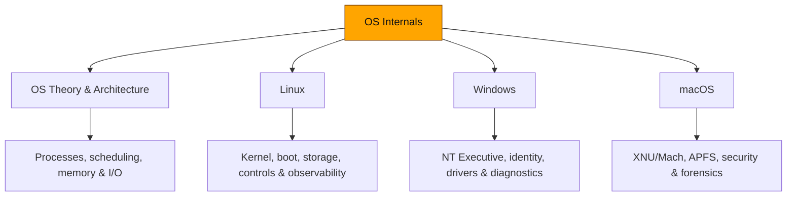

# 💻 OS Internals

> [!abstract] The Domain
> A zero-to-mastery study of how operating systems schedule execution, translate memory, move data, enforce identity, isolate workloads, expose hardware, and preserve evidence. The tree begins with platform-neutral computer science, then applies those primitives independently to Linux, Windows, and macOS.

## Why OS Internals Matters

Cybersecurity failures occur at boundaries maintained by the operating system: user mode versus kernel mode, virtual versus physical memory, process identity versus access token, pathname versus inode, request versus interrupt, and trusted code versus untrusted input. Command knowledge is useful, but mastery comes from predicting what the kernel must do after a command is issued and which artifacts that action leaves behind.

The domain deliberately separates shared theory from implementation. Learn the universal model once, then compare how Linux, Windows NT, and Darwin/XNU represent the same concepts. A process becomes `task_struct`, `EPROCESS`, or a Mach task; an authorization decision becomes Linux credentials and LSM hooks, a Windows access token and Security Reference Monitor check, or macOS credentials constrained by TCC, AMFI, and Seatbelt.

## 🗺️ Zero-to-Mastery Curriculum

1. [[OS Theory and Architecture]] — build the shared vocabulary: processes, threads, scheduling, synchronization, virtual memory, filesystems, interrupts, DMA, and crash consistency.
2. [[Linux]] — learn the open kernel/userland boundary, boot sequence, namespaces, cgroups, capabilities, storage stack, security modules, networking, and observability.
3. [[Windows]] — master NT architecture, objects and handles, memory, drivers, tokens, identity, boot, ETW, crash analysis, and enterprise diagnostics.
4. [[macOS]] — connect Mach and BSD through XNU, then study APFS, launchd/XPC, Apple security enforcement, Endpoint Security, and forensic artifacts.

## How to Study This Tree

- **Crook:** reproduce the commands and diagrams, define every object, and explain each privilege boundary in plain language.
- **Operator:** correlate user-space actions with kernel state, logs, process trees, memory mappings, handles, network flows, and filesystem artifacts.
- **Root:** debug failures across layers, reason about exploit prerequisites and mitigations, compare platform implementations, and design evidence-driven hardening or incident-response workflows.

Run experiments only in snapshots or disposable hosts. Record platform version, kernel/build number, architecture, command, expected output, actual output, and cleanup procedure. Operating-system behavior changes across builds; reproducibility is part of mastery.

---
> 🌐 Back to the domain map: [[Cyber Security]]
