# 🧠 Theory of Processes & Threads

> [!abstract] Note of [[OS Theory and Architecture]]
> A program is passive bytes; a **process** is those bytes executing inside an OS-managed protection domain. A **thread** is the schedulable execution stream inside that domain. This distinction explains isolation, concurrency, IPC, race conditions, deadlocks, thread hijacking, and many failures that become security vulnerabilities.

## Parent Learning Order
Theory of Processes & Threads -> CPU Scheduling Algorithms -> Memory Management & Paging -> I-O & File System Paradigms

## Prerequisites & First Mental Model

No operating-system knowledge is required before beginning this note. You only need to know that a **CPU** executes instructions, **memory** holds code and data, and an operating system mediates access to hardware. Begin with a simple distinction:

- A **program** is a file containing instructions, such as an executable stored on disk.
- A **process** is one running instance of a program, together with its memory, identity, open resources, and security authority.
- A **thread** is one sequence of instructions executing inside a process. Every process begins with at least one thread.
- The **kernel** is privileged operating-system code that creates processes, schedules threads, maps memory, and enforces access checks.
- **User mode** is the restricted environment in which ordinary application instructions run. A **system call** is a controlled request from user mode to the kernel.

Opening the same text editor twice usually creates two processes. They execute much of the same program code but have separate memory and resource tables. If one editor creates four worker threads, those threads share that editor process's heap and open files while retaining separate stacks and CPU register state. This gives the fundamental containment hierarchy:

```text
program file → process protection domain → one or more execution threads
```

Several terms recur throughout the note. **State** means the information required to describe an object at a particular instant. **Context** means the CPU-visible state needed to pause and later resume execution. A **resource** is an OS-managed object such as a file, socket, timer, or shared-memory region. **Concurrency** means tasks overlap in time; **parallelism** means they literally execute at the same instant on different CPU cores. **Synchronization** preserves an intended order when concurrent execution would otherwise make results unpredictable. An **invariant** is a rule that must remain true—for example, “the queue count equals the number of stored jobs.” Security bugs often appear when an unexpected interleaving breaks an invariant.

Read the note in three passes. At **Crook** level, follow ownership and lifecycle: who created the process, which resources it owns, and which state its threads occupy. At **Operator** level, inspect those claims using process listings, tracing, debuggers, and race detectors. At **Root** level, reason about happens-before relationships, object lifetime, memory ordering, lock graphs, and the exact kernel authority that permits one process to affect another.

## 1. From Program to Process

Launching a program causes the kernel to construct an execution environment. It maps executable segments and libraries, creates a virtual address space, initializes credentials and resource limits, opens inherited handles, builds an initial stack, and creates at least one thread. The process is therefore more than code: it is a **container of resources and authority**.

The kernel records that container in a **Process Control Block (PCB)**. Implementations differ—Linux distributes the abstraction across `task_struct`, `mm_struct`, file tables, and credential structures, while Windows uses objects such as `EPROCESS`—but the conceptual fields are stable:

| PCB category | Representative state | Security meaning |
| --- | --- | --- |
| Identity | PID, parent PID, session, process group | attribution and lifecycle relationships |
| Credentials | UID/GID, capability sets, access token, integrity level | effective authority at each security check |
| CPU context | instruction pointer, stack pointer, saved registers | exact point from which execution resumes |
| Scheduling | state, priority, affinity, consumed CPU time | who can run, where, and for how long |
| Memory | page-table root, mappings, protection metadata | process isolation and executable-memory policy |
| Resources | descriptors, handles, sockets, namespaces | reachable kernel objects and IPC channels |
| Accounting | limits, cgroup/job membership, audit identity | containment, billing, and investigation |

The executable's entry point is not necessarily the first user instruction. A dynamic loader may map libraries, apply relocations, initialize thread-local storage, and invoke constructors first. For defenders, this explains why execution provenance includes loaders and shared objects. For authorized security research, it explains why writable loader state, inherited handles, or unsafe library search paths can alter behavior before `main()` executes.

## 2. Process States & Lifecycle

A process does not continuously occupy a CPU. Its thread transitions through scheduler-visible states:

```mermaid
stateDiagram-v2
    [*] --> New: create PCB and address space
    New --> Ready: admission complete
    Ready --> Running: dispatcher selects thread
    Running --> Ready: quantum expires or preemption
    Running --> Blocked: wait for I/O, lock, timer, or IPC
    Blocked --> Ready: event or interrupt completes
    Running --> Stopped: debugger, signal, suspension
    Stopped --> Ready: continue
    Running --> Zombie: process exits; status retained
    Zombie --> Terminated: parent reaps status
    Terminated --> [*]
```



**Ready** means eligible but waiting for CPU time. **Running** means executing on a logical processor. **Blocked** means waiting for an event and therefore not competing for a CPU. Unix-like systems retain a **zombie** record after exit so the parent can collect status with `wait()`. An **orphan** is re-parented to a designated reaper. A large zombie population does not usually consume CPU, but it consumes process-table entries and signals broken lifecycle management. A process stuck in uninterruptible I/O sleep may indicate a failed device, network filesystem, or driver path.

Lifecycle operations are security boundaries. Creation must copy or deliberately change credentials; execution must apply set-ID, capability, sandbox, and code-signing policy; termination must release objects without use-after-free conditions. A leaked privileged handle inherited by a child may bypass an otherwise correct authorization design.

## 3. Threads, TCBs & Execution Models

Threads in one process share code, global data, heap, memory mappings, and most handles. Each thread owns an instruction pointer, register set, stack, scheduling state, signal mask, and thread-local storage. This private state is represented by a **Thread Control Block (TCB)** or equivalent kernel structure.

Sharing makes communication inexpensive: one thread writes memory and another reads it. It also removes process isolation. One memory-corruption bug can affect every thread, and unsynchronized access can produce state combinations that no sequential design intended.

Threading models include:

- **Many-to-one:** a user runtime multiplexes many user threads onto one kernel thread. Switching is cheap, but one blocking syscall may stop all work and no true multicore parallelism occurs.
- **One-to-one:** each user thread maps to a kernel thread. Linux pthreads and contemporary Windows threads generally follow this model. It enables parallelism but increases kernel bookkeeping and stack cost.
- **Many-to-many:** a runtime schedules many logical tasks over a pool of kernel threads. Languages with green threads, fibers, or async executors often approximate this design.

**Concurrency** means multiple tasks make progress during overlapping time intervals; **parallelism** means instructions execute simultaneously on different cores. A single core can expose a race through preemption. Multiple cores make the race window physically concurrent and introduce cache-coherence and memory-ordering concerns.

During a **context switch**, the kernel saves the current thread's registers and loads another's, changes address-space context if required, updates accounting, and may perturb caches, branch predictors, and the TLB. Context switches are essential but not free. Excessive runnable threads can spend significant time switching rather than completing work, creating a resource-exhaustion condition even before CPU utilization reaches an obvious limit.

## 4. Inter-Process Communication

Processes need explicit communication because their virtual address spaces are isolated. IPC mechanisms trade simplicity, throughput, trust, and attack surface:

| Mechanism | Semantics | Security questions |
| --- | --- | --- |
| Anonymous pipe | parent/child byte stream | who inherited each endpoint? |
| Named pipe/FIFO | filesystem or object-namespace endpoint | permissions, impersonation, name squatting |
| Unix-domain socket | local datagram or stream | peer credentials and path ownership |
| Network socket | remote communication | authentication, framing, replay, input parsing |
| Message queue | discrete kernel-managed messages | type confusion, queue limits, stale messages |
| Shared memory | same physical pages mapped into processes | synchronization, lifetime, information leakage |
| Signal/event | asynchronous notification | reentrancy and confused state transitions |
| Memory-mapped file | persistent or shared page-backed region | stale data, permissions, flush behavior |

IPC authorization must be checked at endpoint creation and use. A local socket in a world-writable directory can be replaced; a named pipe server may accidentally impersonate an untrusted client; shared-memory permissions may expose secrets. Message boundaries must be validated because a trusted local producer can still be compromised.

## 5. Synchronization Primitives

Synchronization establishes **mutual exclusion**, **ordering**, or **notification**. Choosing the wrong primitive can preserve correctness in a test yet fail under contention.

- A **mutex** permits one owner inside a critical section. Ownership matters: the locking thread is expected to unlock. Sleeping mutexes are suitable when waits may be long.
- A **semaphore** is a counter. A binary semaphore can resemble a mutex, while a counting semaphore represents N interchangeable resources such as queue slots.
- A **spinlock** repeatedly tests a lock instead of sleeping. It is appropriate only for very short kernel or low-level critical sections where sleeping is illegal or more expensive than waiting. Holding one across blocking I/O can freeze progress.
- A Linux **futex** provides a fast userspace path for uncontended locks and asks the kernel to sleep or wake waiters only under contention. It is a mechanism used to build mutexes and condition variables, not usually a high-level policy itself.
- A **condition variable** lets a thread sleep until a predicate may have changed. It must be paired with a mutex and checked in a loop because wakeups can be spurious or another thread can consume the condition first.
- A **barrier** waits until a defined number of participants reach the same phase.
- An **atomic operation** performs a read-modify-write indivisibly with respect to competing processors. Compare-and-swap can build lock-free structures, but atomicity alone does not solve object lifetime or multi-field invariants.

```c
pthread_mutex_lock(&queue_lock);
while (queue_empty())                 /* predicate, not notification, is truth */
    pthread_cond_wait(&not_empty, &queue_lock);
job = queue_pop();
pthread_mutex_unlock(&queue_lock);
```

Expected behavior under tracing is a userspace fast path until contention causes a futex syscall:

```text
$ strace -f -e futex ./bounded_queue
[pid 4217] futex(0x55b8c12050c0, FUTEX_WAIT_PRIVATE, 2, NULL) = 0
[pid 4216] futex(0x55b8c12050c0, FUTEX_WAKE_PRIVATE, 1) = 1
processed=100000 lost=0 duplicate=0
```

## 6. Atomics & Memory Ordering

Modern CPUs and compilers may reorder independent operations. Cache-coherence ensures eventual agreement about cache lines, but it does not automatically provide the ordering a high-level algorithm expects. A producer that stores `ready = 1` before its data becomes visible can let a consumer observe the flag and stale data.

Memory models therefore define orderings. **Relaxed** atomics guarantee atomicity but little ordering. **Acquire** prevents later operations from moving before a successful load; **release** prevents earlier operations from moving after a store. A release store observed by an acquire load creates a **happens-before** relationship. **Sequential consistency** provides the strongest, easiest-to-reason-about global order at a possible performance cost.

```c
atomic_store_explicit(&payload, 0xC2, memory_order_relaxed);
atomic_store_explicit(&ready, 1, memory_order_release);

while (!atomic_load_explicit(&ready, memory_order_acquire)) { }
assert(atomic_load_explicit(&payload, memory_order_relaxed) == 0xC2);
```

Security-sensitive lock-free code must also address the ABA problem and reclamation of objects still visible to another thread. Hazard pointers, epochs, and reference counting solve lifetime problems that compare-and-swap cannot.

## 7. Races, TOCTOU & Thread Manipulation

A **data race** occurs when threads access the same location concurrently, at least one access is a write, and synchronization is absent. In languages such as C and C++, a data race may be undefined behavior, allowing compiler transformations that make intuitive reasoning invalid. A broader **race condition** exists whenever correctness depends on event order.

The security archetype is **TOCTOU**: a privileged program checks a pathname, then later re-resolves and uses it. An authorized lab can demonstrate the flaw without touching privileged data:

```c
/* Deliberately vulnerable laboratory pattern */
if (access("/tmp/c2r-report", W_OK) == 0) {
    usleep(200000);                    /* widens the race for observation */
    int fd = open("/tmp/c2r-report", O_WRONLY | O_TRUNC);
    dprintf(fd, "validated\n");
    close(fd);
}
```

The repair is to open once with defensive flags, validate the resulting descriptor with `fstat()`, and operate on that stable object. On supported systems, directory-relative APIs and flags such as `O_NOFOLLOW`, `O_EXCL`, or constrained path-resolution facilities reduce namespace races.

Race discovery combines reasoning and instrumentation: repeated stress execution, randomized delays, sanitizers, syscall tracing, and invariant checks. A ThreadSanitizer-style result looks like:

```text
WARNING: ThreadSanitizer: data race
  Write of size 8 at counter.c:18 by thread T2
  Previous read of size 8 at counter.c:18 by thread T1
SUMMARY: ThreadSanitizer: data race counter.c:18 in increment
```

**Thread hijacking** changes a suspended thread's execution context or queued work so it resumes at attacker-controlled code. The underlying lesson is architectural: a thread context is mutable kernel state guarded by process-access rights. Defenses include least-privilege process handles, protected-process mechanisms, code-integrity policy, control-flow protections, and telemetry for unusual cross-process thread operations.

## 8. Deadlock, Livelock, Starvation & Priority Inversion

Deadlock requires the four Coffman conditions: mutual exclusion, hold-and-wait, no forced resource preemption, and circular wait. Prevention breaks at least one condition, commonly through a global lock order. Detection builds a wait-for graph and searches for cycles. Avoidance strategies such as the Banker's algorithm grant a request only if the resulting allocation remains in a safe state, although general-purpose kernels rarely know future maximum demand precisely.

**Livelock** means threads run and react but make no useful progress. **Starvation** means a participant waits indefinitely because policy continually favors others. **Priority inversion** occurs when a high-priority thread waits for a lock held by a low-priority thread while medium-priority work prevents the holder from running. **Priority inheritance** temporarily boosts the lock holder so it can release the resource; priority-ceiling protocols bound more complex cases.

For cybersecurity, these are availability and isolation concerns. An adversarial request can capture a coarse application lock, exhaust a worker queue, or trigger deadlocked code paths. Defenses include bounded queues, lock timeouts, cancellation, watchdogs, per-tenant quotas, lock-order assertions, and observability for wait duration rather than CPU alone.

## 9. Hands-On Debugging Lab

Create a disposable local program with two threads incrementing a shared counter one million times without synchronization. Build once normally and once with a race detector:

```bash
cc -O2 -pthread race.c -o race
cc -O1 -g -fsanitize=thread -pthread race.c -o race-tsan
./race
./race-tsan
```

Typical output from the unprotected version varies because increments are lost:

```text
expected=2000000 actual=1174632
```

Then protect the increment with a mutex and repeat until the output remains `expected=2000000 actual=2000000`. Use `strace -f -e clone,futex ./race-fixed` to distinguish thread creation from contended locking. Finally, draw the program's lock order and deliberately reverse two acquisitions in a laboratory copy. Attach a debugger, collect all thread backtraces, and identify the wait cycle. Do not run stress tests on production systems.

## 10. Troubleshooting & Evidence Interpretation

Do not diagnose concurrency from one symptom. A frozen application might be deadlocked, blocked on legitimate I/O, waiting on an empty queue, stopped by a debugger, or starved of CPU time. Build an evidence chain:

1. Confirm whether the process still exists and whether its thread count is stable.
2. Inspect every thread's scheduler state and wait channel.
3. Capture thread stacks more than once. Unchanging reciprocal lock waits suggest deadlock; changing stacks with no completed work suggest livelock.
4. Correlate CPU usage, context switches, queue depth, descriptor activity, and application progress counters.
5. Reproduce with symbols, assertions, and sanitizers in a disposable environment.

| Symptom | Likely explanations | Evidence to collect | Common mistake |
| --- | --- | --- | --- |
| High CPU, no progress | livelock, spin loop, retry storm | repeated thread stacks, performance profile, progress counter | calling every high-CPU hang a deadlock |
| Near-zero CPU, no progress | mutex/condition wait, blocking I/O, deadlock | wait channels, all-thread backtraces, syscall trace | examining only the main thread |
| Result changes between runs | data race, uninitialized state, lifetime bug | race sanitizer, invariant logging, stress repetition | assuming a timing delay fixes synchronization |
| Thousands of threads | unbounded creation, blocked worker leak | thread creation stacks, queue metrics, limits | increasing the limit without fixing ownership |
| Zombie processes | parent failed to reap children | parent PID, `wait()` behavior, process tree | trying to kill an already-dead zombie |

A useful Linux triage sequence is:

```bash
ps -eLo pid,ppid,tid,stat,wchan:24,pcpu,comm --sort=pid
strace -ff -p "$PID" -e trace=futex,clone,wait4,read,write
gdb -q -p "$PID" -ex 'set pagination off' -ex 'thread apply all bt' -ex detach -ex quit
```

Representative evidence from a lock wait may look like:

```text
TID   STAT WCHAN                    %CPU COMMAND
4216  Sl   futex_wait_queue_me       0.0 queue-lab
4217  Sl   futex_wait_queue_me       0.0 queue-lab

Thread 2: pthread_mutex_lock → transfer_a_to_b
Thread 3: pthread_mutex_lock → transfer_b_to_a
```

The stacks alone show waiting; they do not prove a cycle until lock ownership is identified. Record which thread owns each mutex and draw the wait-for graph. When a race disappears under a debugger, avoid concluding it was repaired: debugging changes timing. Prefer sanitizer instrumentation, deterministic barriers, event tracing, and many controlled repetitions. The final diagnosis should state the violated invariant, the interleaving that violates it, and the synchronization or ownership rule that prevents recurrence.

## Crook → Operator → Root Checkpoint

- **Crook:** Explain the difference between a program, process, and thread; identify PCB versus TCB state; recognize Ready, Running, Blocked, and Zombie states.
- **Operator:** Select mutexes, semaphores, condition variables, futex-backed locks, spinlocks, or atomics appropriately; inspect IPC permissions; reproduce and repair a race in an authorized lab.
- **Root:** Reason about happens-before relationships and memory ordering; prove a lock order is deadlock-free; diagnose priority inversion; connect process handles, thread context, object lifetime, and scheduler behavior to concrete offensive and defensive security controls.

---
> 🔼 Up: [[OS Theory and Architecture]]
