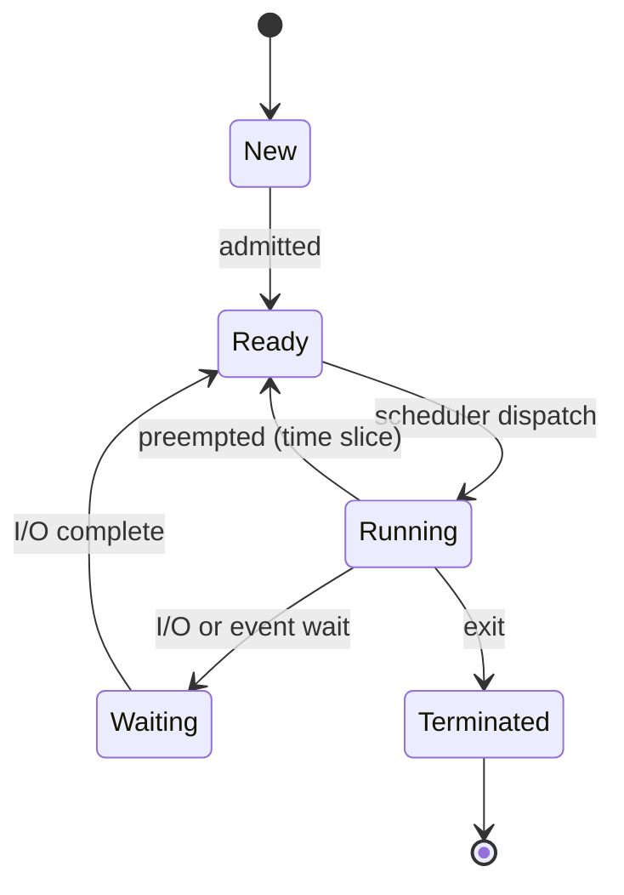

# 🧠 Theory of Processes and Threads

> [!abstract] Note of [[OS Theory and Architecture]]
> A **process** is a program in execution — the OS's fundamental unit of isolation and accounting. A **thread** is a unit of execution *within* a process. The rules that govern how they run, share, and switch are the root cause of an entire vulnerability class: **race conditions**.

## The Process Control Block (PCB)
Every process is tracked by a kernel structure — the **PCB** (`task_struct` on Linux, `EPROCESS` on Windows). It holds the process's identity and everything needed to pause and resume it:
- **PID/PPID**, owner/credentials (UID, token) → the basis of the privilege model.
- **Process state**, **program counter**, and **saved CPU registers**.
- **Memory map** (page tables / VAD), **open file descriptors/handles**, and IPC endpoints.

### Process states

A process oscillates between **Ready → Running → Waiting**. A **zombie** (terminated but un-reaped) and an **orphan** (parent died) are states attackers and defenders both watch.

## Threads and the TCB
Threads within a process **share** the address space, code, and file descriptors, but each has its **own** stack, registers, and program counter — tracked in a **Thread Control Block (TCB)**. This shared memory is what makes threads fast *and* dangerous.

- **User-level threads** (scheduled in userspace) vs **kernel-level threads** (scheduled by the OS). Modern systems map M user threads onto N kernel threads.
- **Concurrency** = tasks make progress *interleaved* on one core (illusion of simultaneity via time-slicing). **Parallelism** = tasks run *truly simultaneously* on multiple cores. Concurrency creates the timing windows; parallelism widens them.

## Context switching
To switch processes/threads, the CPU **saves** the current register state into the PCB/TCB and **loads** the next — a **context switch**. It's pure overhead (hundreds of ns to µs) and flushes caches/TLB, which is why excessive switching (thrashing) tanks performance and why switch timing leaks information in **side-channel attacks**.

## Inter-Process Communication (IPC)
Isolated processes cooperate via kernel-mediated channels — each an attack surface:
| Mechanism | Notes |
| --- | --- |
| **Pipes / named pipes (FIFOs)** | byte streams; Windows named pipes enable impersonation attacks |
| **Shared memory** | fastest; **no built-in synchronization** → race conditions |
| **Message queues** | structured messages |
| **Sockets** | local (Unix domain) or network |
| **Signals** | async notifications; unsafe signal handlers → re-entrancy bugs |

## Where this becomes a vulnerability
> [!warning] Race conditions & TOCTOU (authorized study)
> A **race condition** occurs when the result depends on the *timing* of concurrent access to shared state. The canonical security form is **TOCTOU (Time-Of-Check to Time-Of-Use)**: a program checks a condition, then acts — and an attacker changes the state in the gap.
> ```c
> if (access("/tmp/file", W_OK) == 0) {   // CHECK (as real user)
>     // ← attacker swaps /tmp/file for a symlink to /etc/shadow here
>     fd = open("/tmp/file", O_WRONLY);   // USE (as elevated SUID) → writes /etc/shadow
> }
> ```
> **Defenses:** atomic operations, **mutexes/semaphores** to serialize access, `open()` with `O_NOFOLLOW`, using file descriptors instead of re-resolving paths, and file locking. The same primitive (mutex) that fixes a correctness bug fixes the security bug.

**Thread hijacking** — an attacker suspends a thread in a target process, rewrites its registers/instruction pointer (`SetThreadContext`), and resumes it to run injected code — a stealthy process-injection technique that lives entirely in this theory.

> [!tip] Crook → Root
> **Root** sees a "checked then used" pattern and immediately asks *what happens in the gap?*; knows shared memory without a **mutex** is a race waiting to happen; and reads context-switch timing as a potential side channel.

---
> 🔼 Up: [[OS Theory and Architecture]]
