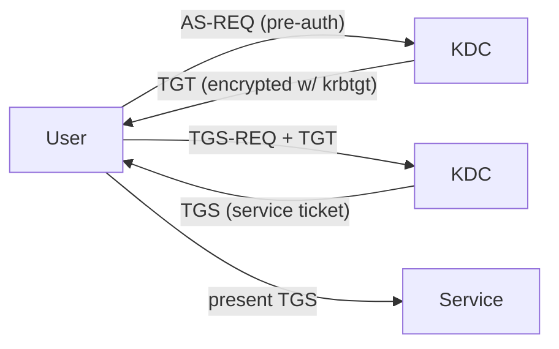

# 🪟 Windows Active Directory and Domains

> [!abstract] Note of [[Windows]]
> Active Directory is the identity backbone of ~90% of enterprises — one compromised domain often means every host. This note maps the structure, the two authentication protocols, and the abuse paths that make AD the crown jewel of red teaming.

> [!warning] Authorized engagements only
> AD attack techniques are for sanctioned assessments/labs and are paired with their detections.

## Structure
- **Forest → Domain → OU → objects** (users, computers, groups). The **Domain Controller (DC)** hosts the AD database `NTDS.dit`.
- **Global Catalog** indexes the forest; **trusts** link domains/forests (a common lateral path).
- Objects are queried over **LDAP** (389/636); **BloodHound** maps attack paths from this graph.

## Authentication: Kerberos & NTLM
**Kerberos** (the default) uses tickets from the DC's Key Distribution Center:

| Attack | Idea |
| --- | --- |
| **Kerberoasting** | request TGS for a service SPN → crack the service account's password offline |
| **AS-REP roasting** | users with "no pre-auth" → grab crackable AS-REP |
| **Golden Ticket** | forge any TGT with the stolen **krbtgt** hash → domain god-mode |
| **Silver Ticket** | forge a TGS for one service with its account hash |
| **Pass-the-Hash / Pass-the-Ticket** | reuse an NTLM hash / Kerberos ticket without the password |

**NTLM** (legacy challenge-response) is still everywhere and enables **relay** (`ntlmrelayx`) and **pass-the-hash**.

## SMB & LDAP in practice
```bash
# authorized recon
crackmapexec smb 10.10.10.0/24 -u user -p pass          # sweep, sessions, shares
ldapsearch -x -H ldap://dc01 -b "dc=corp,dc=local"      # dump directory
GetUserSPNs.py corp/user:pass -dc-ip 10.0.0.1 -request  # kerberoast
secretsdump.py corp/user@dc01                            # DCSync if privileged
```
**SMB** (445) carries file shares, named pipes, and `PsExec`-style execution; **null/guest sessions** and open shares are classic footholds.

## Group Policy (GPO)
GPOs push settings/scripts to OUs. **Write access to a GPO** linked to many machines = code execution across all of them (`SharpGPOAbuse`). Defenders monitor GPO changes and restrict who can edit them.

## Detection (bridge to Blue Team)
DC event logs: **4768/4769** (Kerberos TGT/TGS — spot roasting bursts), **4624/4625** (logons), **4662** (DCSync), plus honeytokens and BloodHound-driven tiering. See **Windows Logging and Auditing**.

> [!tip] Crook → Root
> **Root** treats AD as a graph: find a path from a low user to Domain Admin via Kerberoast → cracked service account → GPO/ACL abuse → DCSync — then hands the blue team the exact Event IDs that would have caught each hop.

---
> 🔼 Up: [[Windows]]
