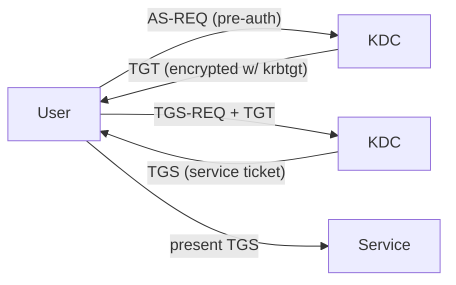
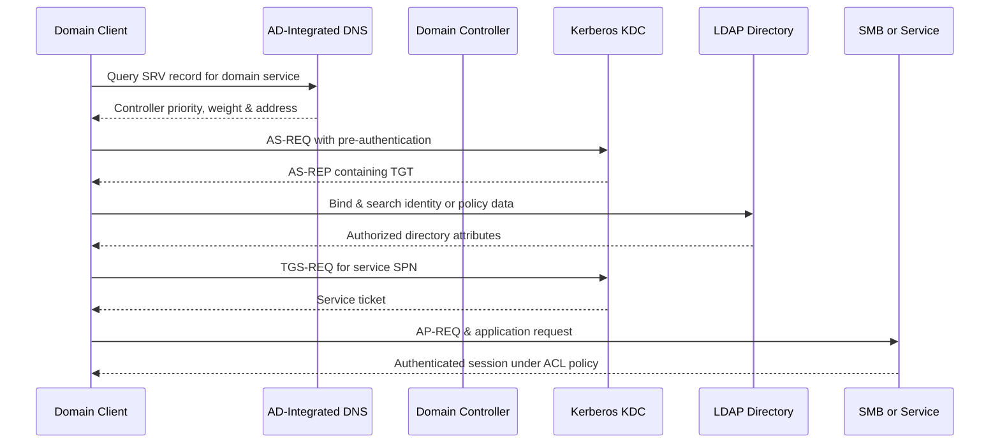

# 🪟 Windows Active Directory & Domains

> [!abstract] Note of [[Windows]]
> Active Directory is the identity backbone of ~90% of enterprises — one compromised domain often means every host. This note maps the structure, the two authentication protocols, and the abuse paths that make AD the crown jewel of red teaming.

> [!warning] Authorized engagements only
> AD attack techniques are for sanctioned assessments/labs and are paired with their detections.

## Parent Learning Order
Windows Architecture & Kernel -> Windows Memory Internals & Exploit Mitigations -> Windows Drivers I-O & Kernel Debugging -> Windows Processes, Services & Boot -> Windows File System & Registry -> Windows Networking Internals -> Windows Security & Access Control -> Windows Identity, Credentials & Authentication -> Windows Active Directory & Domains -> Windows CLI: CMD & PowerShell -> Windows Logging & Auditing -> Windows Diagnostics, Crash Dumps & Performance -> Windows Sysinternals & Troubleshooting

## Start at Zero: A Directory Is a Distributed Identity Database

A **workgroup** lets each computer maintain its own users; a **domain** centralizes identities, policy, authentication, and resource discovery. Active Directory Domain Services stores those objects in a replicated database on **domain controllers**. A user name is only a label: the durable identity is a SID, and access depends on group membership, credentials, tickets, and ACLs. Learn four nouns first: an **object** is a directory record, an **attribute** is one field on that record, a **distinguished name** locates it in the hierarchy, and a **domain controller** authenticates identities while replicating directory state. This mental model prevents the beginner mistake of treating AD as merely a list of users.

## Structure
- **Forest → Domain → OU → objects** (users, computers, groups). The **Domain Controller (DC)** hosts the AD database `NTDS.dit`.
- **Global Catalog** indexes the forest; **trusts** link domains/forests (a common lateral path).
- Objects are queried over **LDAP** (389/636); **BloodHound** maps attack paths from this graph.

## Authentication: Kerberos & NTLM
**Kerberos** (the default) uses tickets from the DC's Key Distribution Center:

| Attack | Idea |
| --- | --- |
| **Kerberoasting** | request TGS for a service SPN → crack the service account's password offline |
| **AS-REP roasting** | users with "no pre-auth" → grab crackable AS-REP |
| **Golden Ticket** | forge any TGT with the stolen **krbtgt** hash → domain god-mode |
| **Silver Ticket** | forge a TGS for one service with its account hash |
| **Pass-the-Hash / Pass-the-Ticket** | reuse an NTLM hash / Kerberos ticket without the password |

**NTLM** (legacy challenge-response) is still everywhere and enables **relay** (`ntlmrelayx`) and **pass-the-hash**.

## SMB & LDAP in practice
```bash
# authorized recon
crackmapexec smb 10.10.10.0/24 -u user -p pass          # sweep, sessions, shares
ldapsearch -x -H ldap://dc01 -b "dc=corp,dc=local"      # dump directory
GetUserSPNs.py corp/user:pass -dc-ip 10.0.0.1 -request  # kerberoast
secretsdump.py corp/user@dc01                            # DCSync if privileged
```
**SMB** (445) carries file shares, named pipes, and `PsExec`-style execution; **null/guest sessions** and open shares are classic footholds.

## Group Policy (GPO)
GPOs push settings/scripts to OUs. **Write access to a GPO** linked to many machines = code execution across all of them (`SharpGPOAbuse`). Defenders monitor GPO changes and restrict who can edit them.

## Detection (bridge to Blue Team)
DC event logs: **4768/4769** (Kerberos TGT/TGS — spot roasting bursts), **4624/4625** (logons), **4662** (DCSync), plus honeytokens and BloodHound-driven tiering. See **Windows Logging and Auditing**.

> [!tip] Crook → Root
> **Root** treats AD as a graph: find a path from a low user to Domain Admin via Kerberoast → cracked service account → GPO/ACL abuse → DCSync — then hands the blue team the exact Event IDs that would have caught each hop.

## Directory Architecture

Active Directory Domain Services is a multimaster, replicated directory with domains as core administrative and replication units. A forest shares schema, configuration, and global catalog. Domains have their own directory naming context and security boundary assumptions, while organizational units provide delegation and Group Policy scope—not isolation from domain administrators. Sites and subnets model network topology so clients locate nearby controllers and replication follows efficient links.

Every object has a distinguished name, object GUID, class, attributes, and security descriptor. The schema defines attribute syntax, indexing, replication behavior, and permissible classes. LDAP searches specify base DN, scope, filter, and requested attributes. Global Catalog servers hold a partial attribute set for every forest domain, enabling forest-wide searches and universal-group evaluation without storing every writable attribute.



Controllers replicate updates using per-attribute metadata, update sequence numbers, invocation IDs, and high-watermark vectors. Flexible Single Master Operations roles centralize operations that cannot safely be multimaster, such as schema changes, domain naming, RID allocation, authoritative time/PDC behavior, and selected cross-domain reference updates. A controller rollback or cloned identity error can threaten consistency, so supported virtualization and restore procedures matter.

```powershell
Get-ADForest | Select-Object RootDomain,Domains,GlobalCatalogs,SchemaMaster,DomainNamingMaster
Get-ADDomain | Select-Object DNSRoot,DomainMode,PDCEmulator,RIDMaster,InfrastructureMaster
repadmin /replsummary
```

Expected healthy summary pattern:

```text
Source DSA          largest delta    fails/total  %%   error
DC01                      00m:42s       0 / 10      0
DC02                      01m:03s       0 / 10      0
```

## DNS, Time & Service Discovery

AD depends on DNS SRV records such as LDAP and Kerberos service locations. Clients use DC Locator to combine DNS responses, site awareness, capability, and reachability. Registering clients against public or unrelated DNS servers breaks discovery even when IP connectivity is perfect. Secure dynamic updates and AD-integrated zones protect registration while allowing controllers to replicate zone data through the directory.

Kerberos requires time within policy tolerance. The forest-root PDC Emulator normally anchors domain time to a reliable external source; other domain members follow hierarchy. Large skew produces authentication failures that can masquerade as password or network problems.

## Kerberos Ticket Semantics

The Authentication Service exchange issues a TGT after validating pre-authentication. The Ticket Granting Service exchange issues a service ticket for an SPN. Tickets carry client and service identities, validity, flags, session keys, and authorization data. The service decrypts its ticket with account key material; a duplicate or incorrectly assigned SPN can therefore produce ambiguity or failure.

Roasting risks arise from offline verification. An account lacking pre-authentication allows an AS response whose encrypted component can be tested offline. A service account with an SPN permits authenticated users to request a service ticket encrypted using service-account key material. The root cause is not “Kerberos is broken”; it is weak account secrets, legacy encryption, unnecessary SPNs, or unsafe account policy. Managed service accounts and AES reduce exposure.

Delegation changes where credentials or identity can flow. Unconstrained delegation can expose forwardable tickets to a service host. Constrained delegation limits service targets, and resource-based constrained delegation lets the resource define trusted frontends. Protocol transition allows some services to obtain service identity for users without an initial Kerberos authentication. Review must consider service account compromise, SPNs, allowed-to-delegate attributes, target ownership, and computer-object creation rights as one graph.

```powershell
setspn -Q */files01.corp.example
klist
Get-ADComputer -Filter * -Properties TrustedForDelegation,PrincipalsAllowedToDelegateToAccount |
  Select-Object Name,TrustedForDelegation,PrincipalsAllowedToDelegateToAccount
```

Expected SPN result:

```text
CN=FILES01,OU=Servers,DC=corp,DC=example
        HOST/FILES01
        cifs/files01.corp.example
Existing SPN found!
```

## NTLM, LDAP & SMB Controls

NTLM remains a compatibility mechanism and can be relayed when the target protocol does not bind authentication to the intended channel or require message integrity. Reducing NTLM safely requires auditing dependencies, correcting SPNs and DNS, then enforcing restrictions in stages. SMB signing prevents undetected message alteration and frustrates many relay paths; SMB encryption adds confidentiality. LDAP signing protects integrity, while channel binding ties authentication to TLS channel properties where applicable.

LDAP bind type matters. Simple bind without protected transport exposes credentials. SASL mechanisms can use Kerberos or Negotiate and provide signing/sealing. Controllers can log unsigned or weak binds to support migration before enforcement. Network captures and directory diagnostics should be handled as sensitive because they expose identity structure and authentication metadata.

## Group Policy, ACLs & Administrative Tiering

Group Policy consists of a directory object and files in SYSVOL. Clients calculate scope using site, domain, OU order, security filtering, WMI filters, inheritance, enforcement, and loopback rules. SYSVOL replicates through DFS Replication in current domains. A mismatch between directory and file versions can cause inconsistent application.

Directory ACLs express granular rights such as create child, write property, reset password, modify group membership, change owner, and extended rights. GenericAll is shorthand for broad control, but subtle combinations such as write-owner followed by write-DACL can become equally powerful. Replication rights are particularly sensitive because directory replication interfaces can return credential-related attributes when the caller holds the required extended rights.

Tiering separates controller/identity administration from server and workstation administration. Privileged Access Workstations, protected groups, authentication policies, gMSAs, LAPS, constrained delegation, and just-enough delegated OUs reduce credential and control-path crossover. Forest recovery plans, offline backups, dual-control procedures, and tested `krbtgt` reset processes are part of security architecture.

## FSMO Roles, Replication Ownership & Failure Reasoning

Multi-master replication does not mean every domain controller may perform every change concurrently. Five **Flexible Single Master Operations** roles serialize operations that would otherwise create ambiguity. The **Schema Master** controls schema extension; the **Domain Naming Master** controls additions and removals of domains and application partitions. Each domain has a **RID Master**, which allocates RID pools used to construct unique SIDs; a **PDC Emulator**, which anchors time, urgent password-change convergence, lockout behavior, and compatibility functions; and an **Infrastructure Master**, which maintains selected cross-domain references.

Operators should locate role holders and distinguish a transiently unavailable holder from a permanently lost one:

```powershell
Get-ADForest | Select-Object SchemaMaster,DomainNamingMaster
Get-ADDomain | Select-Object RIDMaster,PDCEmulator,InfrastructureMaster
repadmin /replsummary
```

```text
Source DSA          largest delta  fails/total  %%  error
DC01                00h:03m:12s    0 / 10       0
DC02                00h:04m:01s    0 / 10       0
```

**Transfer** is the normal administrative handoff while both controllers are healthy. **Seizure** is a disaster-recovery operation performed only when the former holder will not return; reintroducing a controller after its role was seized risks conflicting authority. Replication troubleshooting begins with topology, DNS, time, RPC reachability, update sequence numbers, and directory-service events—not with indiscriminate metadata cleanup.

## Cybersecurity Implications

AD security is graph security. A low-privilege principal can become consequential through nested groups, delegated object rights, writable GPOs, service-account relationships, local administration, sessions, trusts, certificates, or replication privileges. Assessments should state the complete path and which edge is unintended. Removing the final privileged membership while leaving the first writable edge intact is not remediation.

Evidence spans controller Security events, directory-service changes, Kerberos service requests, NTLM validation, DNS, endpoint logons, SMB sessions, and administrative tooling. Useful events include 4768/4769/4771 for Kerberos, 4776 for NTLM validation, 4624/4625 for logons, 4728/4732 for group membership, 5136 for directory modification, and 4662 for audited directory-object access. Interpret with account, source, encryption, ticket options, SPN, object GUID, and expected workflow.

## Authorized Lab: Trace Domain Authentication

1. Use an isolated two-controller lab with one member workstation and ordinary user.
2. Verify DNS client configuration, SRV records, time hierarchy, site mapping, and replication health.
3. Clear only the lab user's Kerberos ticket cache, access a permitted share by hostname, and inspect resulting tickets with `klist`.
4. Query the user's group membership and the target share plus NTFS ACLs.
5. Inspect controller events for the TGT, service ticket, and workstation network logon.
6. Draw the path from DNS discovery through Kerberos, token construction, SMB session, share authorization, and NTFS authorization.

Expected chain:

```text
SRV discovery -> AS-REQ/AS-REP -> TGT
TGS-REQ for cifs/FILES01 -> service ticket
SMB session setup -> user token
Share ACL + NTFS ACL -> authorized file access
```

## Crook → Operator → Root Checkpoint

- **Crook:** Explain forest, domain, OU, controller, DNS, LDAP, Kerberos, NTLM, SMB, GPO, and trust.
- **Operator:** Diagnose discovery/replication/authentication, read tickets and SPNs, evaluate delegation, interpret directory ACLs, and correlate controller plus endpoint events.
- **Root:** Model the forest as control paths, remove unintended privilege edges, design tiering and protocol hardening, preserve recovery, and prove that authentication, authorization, delegation, replication, and policy remain functional after remediation.

---
> 🔼 Up: [[Windows]]
