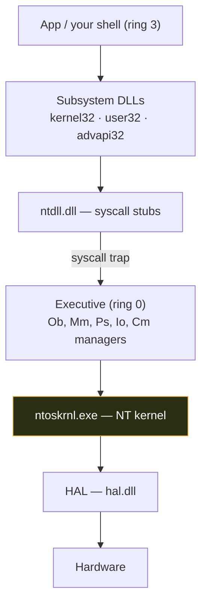

# 🪟 Windows Architecture and Kernel

> [!abstract] Note of [[Windows]]
> Windows is a layered NT operating system where a thin **kernel** mediates every action a program takes. Understanding that layering is what lets you reason about privilege boundaries, EDR hooks, and why an exploit runs in ring 0 or ring 3.

## User mode vs kernel mode (the ring boundary)
The CPU enforces two privilege rings that matter:
- **Ring 3 — user mode.** Applications, services, your shell. Isolated per-process virtual address space; a crash kills only that process; no direct hardware access.
- **Ring 0 — kernel mode.** The kernel, drivers, and the HAL. Full access to memory and hardware; a bug here is a **BSOD** bugcheck, and code here defeats most user-mode defenses.

A **syscall** is the guarded doorway: user code calls a stub in `ntdll.dll` (e.g. `NtCreateFile`), which executes the `syscall` instruction and traps into the kernel. Malware uses **direct/indirect syscalls** to skip `ntdll` hooks that EDR installs.



## The core components
| Component | Role |
| --- | --- |
| **HAL** (`hal.dll`) | Hardware Abstraction Layer — hides CPU/chipset differences so the kernel is portable |
| **NT Kernel** (`ntoskrnl.exe`) | Thread scheduling, interrupts, synchronization, low-level memory |
| **Executive** | The manager layer inside ntoskrnl: **Ob** (objects), **Mm** (memory), **Ps** (processes), **Io** (I/O), **Cm** (registry/config), **Se** (security) |
| **ntdll.dll** | The user-mode edge of the kernel — native API + syscall stubs |
| **Subsystem DLLs** | `kernel32`, `user32`, `gdi32`, `advapi32` — the Win32 API apps actually call |
| **Session Manager** (`smss.exe`) | First user-mode process; bootstraps sessions, `csrss`, `wininit` |

## Objects & handles
Almost everything in NT is an **object** managed by the Object Manager — processes, threads, files, registry keys, tokens, events. A program gets a **handle** (an index into its per-process handle table) with a granted access mask. This is why `Get-Process` can enumerate handles, and why a leaked handle to a privileged process can be abused.
```powershell
handle.exe -p lsass            # Sysinternals: list handles held by LSASS
Get-Process lsass | Select-Object Handles, Id
```

## Memory management (Mm)
- **Virtual memory:** each process sees a private flat address space (128 TB user on x64); the MMU + page tables map it to physical RAM or the pagefile.
- **VAD tree** (Virtual Address Descriptors): the kernel's per-process map of committed regions — malware analysts diff the VAD against the on-disk image to spot **injected / RWX** memory.
- **Pool memory:** kernel heap, split into **non-paged** (always resident, used at high IRQL) and **paged** pool — a favourite target for kernel exploit primitives.

> [!tip] Why this matters offensively & defensively
> **Offense (authorized):** process injection, `NtMapViewOfSection`, and unhooking all live at this boundary. **Defense:** EDR hooks `ntdll`/kernel callbacks (`PsSetCreateProcessNotifyRoutine`) here; knowing the layers tells you what a "kernel-mode driver" alert really means.

---
> 🔼 Up: [[Windows]]
