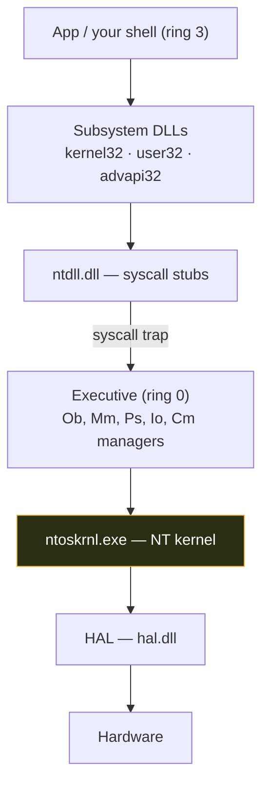
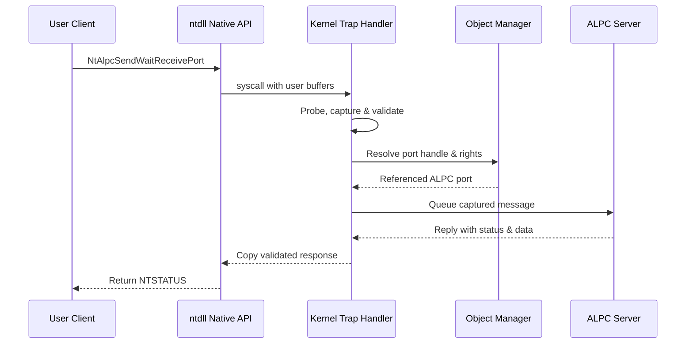

# 🪟 Windows Architecture & Kernel

> [!abstract] Note of [[Windows]]
> Windows is a layered NT operating system where a thin **kernel** mediates every action a program takes. Understanding that layering is what lets you reason about privilege boundaries, EDR hooks, and why an exploit runs in ring 0 or ring 3.

## Parent Learning Order
Windows Architecture & Kernel -> Windows Memory Internals & Exploit Mitigations -> Windows Drivers I-O & Kernel Debugging -> Windows Processes, Services & Boot -> Windows File System & Registry -> Windows Networking Internals -> Windows Security & Access Control -> Windows Identity, Credentials & Authentication -> Windows Active Directory & Domains -> Windows CLI: CMD & PowerShell -> Windows Logging & Auditing -> Windows Diagnostics, Crash Dumps & Performance -> Windows Sysinternals & Troubleshooting

## Start at Zero: What an Operating System Actually Does

An application cannot safely control a CPU, RAM, disk, or network card directly. Windows therefore acts as a privileged broker: it schedules threads, maps virtual memory, names resources as objects, checks access tokens, sends I/O to drivers, and converts hardware events into work software can consume. A **process** is a protected container for resources; a **thread** is an executable stream inside it; a **handle** is a process-local reference to a kernel object; and a **system call** is a controlled transition into privileged code. Keep those four definitions in view—nearly every NT subsystem in this note refines one of them.

## User mode vs kernel mode (the ring boundary)
The CPU enforces two privilege rings that matter:
- **Ring 3 — user mode.** Applications, services, your shell. Isolated per-process virtual address space; a crash kills only that process; no direct hardware access.
- **Ring 0 — kernel mode.** The kernel, drivers, and the HAL. Full access to memory and hardware; a bug here is a **BSOD** bugcheck, and code here defeats most user-mode defenses.

A **syscall** is the guarded doorway: user code calls a stub in `ntdll.dll` (e.g. `NtCreateFile`), which executes the `syscall` instruction and traps into the kernel. Malware uses **direct/indirect syscalls** to skip `ntdll` hooks that EDR installs.



## The core components
| Component | Role |
| --- | --- |
| **HAL** (`hal.dll`) | Hardware Abstraction Layer — hides CPU/chipset differences so the kernel is portable |
| **NT Kernel** (`ntoskrnl.exe`) | Thread scheduling, interrupts, synchronization, low-level memory |
| **Executive** | The manager layer inside ntoskrnl: **Ob** (objects), **Mm** (memory), **Ps** (processes), **Io** (I/O), **Cm** (registry/config), **Se** (security) |
| **ntdll.dll** | The user-mode edge of the kernel — native API + syscall stubs |
| **Subsystem DLLs** | `kernel32`, `user32`, `gdi32`, `advapi32` — the Win32 API apps actually call |
| **Session Manager** (`smss.exe`) | First user-mode process; bootstraps sessions, `csrss`, `wininit` |

## Objects & handles
Almost everything in NT is an **object** managed by the Object Manager — processes, threads, files, registry keys, tokens, events. A program gets a **handle** (an index into its per-process handle table) with a granted access mask. This is why `Get-Process` can enumerate handles, and why a leaked handle to a privileged process can be abused.
```powershell
handle.exe -p lsass            # Sysinternals: list handles held by LSASS
Get-Process lsass | Select-Object Handles, Id
```

## Memory management (Mm)
- **Virtual memory:** each process sees a private flat address space (128 TB user on x64); the MMU + page tables map it to physical RAM or the pagefile.
- **VAD tree** (Virtual Address Descriptors): the kernel's per-process map of committed regions — malware analysts diff the VAD against the on-disk image to spot **injected / RWX** memory.
- **Pool memory:** kernel heap, split into **non-paged** (always resident, used at high IRQL) and **paged** pool — a favourite target for kernel exploit primitives.

> [!tip] Why this matters offensively & defensively
> **Offense (authorized):** process injection, `NtMapViewOfSection`, and unhooking all live at this boundary. **Defense:** EDR hooks `ntdll`/kernel callbacks (`PsSetCreateProcessNotifyRoutine`) here; knowing the layers tells you what a "kernel-mode driver" alert really means.

## NT Executive From First Principles

The kernel image contains both the small NT Kernel and the larger Executive. The Kernel handles dispatching, traps, interrupts, exception delivery, and low-level synchronization. Executive managers provide higher abstractions: the Process Manager creates processes and threads; Memory Manager owns virtual memory; I/O Manager coordinates drivers; Object Manager gives kernel resources a uniform lifetime and naming model; Configuration Manager implements the Registry; Security Reference Monitor performs access checks; Cache Manager integrates cached file I/O; Plug and Play and Power managers coordinate devices.

The HAL is not a compatibility layer for applications. It abstracts interrupt controllers, timers, DMA interfaces, multiprocessor startup, and platform-specific hardware details from the kernel. Modern Windows still ships architecture-specific kernel and HAL behavior even when `hal.dll` appears as a normal module. Virtualization adds another boundary: Hyper-V can run below the normal kernel and enforce VBS-backed protections that a compromised ring-0 component cannot casually rewrite.

Windows supports multiple user-mode personalities historically, but modern application behavior is dominated by the Win32 subsystem. `csrss.exe` retains critical user-mode subsystem functions, while GUI and graphics system calls cross through `win32k` components. Services, packaged applications, containers, sessions, silos, jobs, and security tokens further partition execution without changing the fundamental user/kernel boundary.

## EPROCESS, ETHREAD, PEB & TEB

An `EPROCESS` is the kernel's process object. It references the address-space state, process identifier, active-process links, handle table, primary token, job membership, image information, quotas, mitigation state, and a list of threads. It is not the process itself; it is the kernel's control object for that process. An `ETHREAD` extends the scheduler's `KTHREAD` with executive state such as client IDs, thread-start information, impersonation, and I/O bookkeeping.

The Process Environment Block is user-mode process metadata. It points to loader data, process parameters, heaps, environment, and compatibility flags. The Thread Environment Block is per thread and records stack bounds, thread-local storage, last-error state, and a pointer to the PEB. Because user mode can alter its own PEB and TEB, kernel security decisions cannot trust them as authoritative. They remain invaluable to loaders, debuggers, compatibility components, and analysts.

```text
0: kd> !process 0 0 notepad.exe
PROCESS ffffbe0c91c9c080
    SessionId: 1  Cid: 2f84    Peb: 000000f6f04dd000
    ParentCid: 1c40
    DirBase: 1aa357000  ObjectTable: ffffc70a12b4dc40

0: kd> dt nt!_EPROCESS ffffbe0c91c9c080 UniqueProcessId Token ObjectTable
   +0x440 UniqueProcessId : 0x00000000`00002f84
   +0x4b8 Token           : _EX_FAST_REF
   +0x570 ObjectTable     : 0xffffc70a`12b4dc40 _HANDLE_TABLE
```

Offsets change by build. Typed symbols—not memorized offsets—are the defensible way to interpret these structures.

## Object Manager & Handle Semantics

Named objects live in the NT namespace beneath directories such as `\Device`, `\Driver`, `\Sessions`, and `\BaseNamedObjects`. Win32 paths are translated into this namespace; `C:` is ultimately a symbolic link to a volume device. Each object has a type defining valid operations and lifecycle callbacks. The object header carries reference and handle counts plus optional metadata.

A handle is a process-relative table entry containing an object reference and granted access. The same numeric handle in two processes can identify unrelated objects. `DuplicateHandle` can transfer access between processes, but the duplicated rights cannot normally exceed the source handle's granted mask. Kernel handles are protected from ordinary user-mode use. Handle inheritance, overbroad process handles, and services that duplicate privileged handles into untrusted clients are recurring security boundaries.

```powershell
Get-Process -Id $PID | Select-Object Id,HandleCount,Threads
```

Expected pattern:

```text
 Id HandleCount Threads
 -- ----------- -------
9048         612 {11248, 11960, 12504, ...}
```

Object lifetime persists while pointer references or handles remain. Closing a handle decrements a count; it does not guarantee immediate deletion if the kernel or another process still references the object. This is central to race-condition analysis and safe driver design.

## System Calls, Traps & Exceptions

Win32 APIs often validate and transform arguments before invoking Native API routines in `ntdll`. A syscall stub loads a service number and executes the architecture's syscall instruction. The processor switches privilege and stack context, the kernel validates user pointers and access mode, and a dispatch table selects the service routine. Service numbers are implementation details and can change across releases; supported software calls documented APIs rather than hard-coding them.

Exceptions likewise cross layers. The processor raises a fault or trap; kernel dispatch constructs an exception record and context. User-mode vectored and structured exception handling may process it. If unhandled, Windows Error Reporting can create a dump and terminate the process. Kernel exceptions that cannot be safely handled result in a bugcheck.

Direct-syscall discussions often oversimplify endpoint visibility. Skipping one user-mode wrapper does not bypass kernel access checks, object callbacks, WFP, minifilters, ETW providers, or behavior visible elsewhere. Security architecture must never depend on a single user-mode hook.

## Scheduling, IRQL, APC, DPC & ALPC

Windows uses preemptive priority scheduling. Threads have dynamic or real-time priorities, processor affinity, ideal-processor information, quantum state, and wait reasons. Dispatcher objects—events, mutexes, semaphores, timers, processes, and threads—coordinate waits. Priority boosts improve responsiveness after I/O or waits, while priority inversion must be controlled through careful synchronization.

IRQL is a kernel execution-priority mechanism, not a user security privilege. Higher IRQL masks lower-priority interrupts and restricts permitted operations. At `DISPATCH_LEVEL`, code cannot touch pageable memory or perform arbitrary blocking waits. Interrupt handlers perform minimal work and queue DPCs; DPCs finish urgent processing before ordinary threads run. APCs execute in a particular thread context and support asynchronous I/O completion and other mechanisms. Confusing IRQL, thread priority, and CPU privilege rings leads to fundamentally wrong kernel reasoning.

Advanced Local Procedure Call is a high-performance local IPC facility used by Windows components. Clients and servers exchange messages over ports, potentially transferring handles or using shared sections for larger data. RPC, COM, security services, and subsystem interactions can build above ALPC. Authorization must protect both initial port connection and message semantics; a trusted local client is not automatically a trusted message.



## Architectural Validation With a Debugger

Architecture becomes concrete when names are resolved to live objects. In an authorized debugging VM, WinDbg can identify the kernel, enumerate processes, and inspect one process object without changing it:

```text
0: kd> vertarget
Windows 11 Kernel Version 22621 MP (8 procs) Free x64
0: kd> !process 0 0 lsass.exe
PROCESS ffff9b0c`6a85a080  SessionId: 0  Cid: 02f8
    DirBase: 1aa002000  ObjectTable: ffffcc0a`35c4ba40
    Image: lsass.exe
0: kd> dt nt!_EPROCESS ffff9b0c`6a85a080 UniqueProcessId Token Peb
```

`vertarget` establishes build and symbol context. `!process` converts a familiar image name into an `EPROCESS` address; `dt` then interprets bytes using the matching type definition. A field offset copied from another build is not architecture knowledge—it is an unsupported assumption. Expert analysis records the exact build, symbol provenance, processor context, and whether an address is virtual, physical, user, or kernel before drawing conclusions.

## Cybersecurity Implications

Privilege escalation requires crossing a precise boundary: obtaining a stronger token, abusing a privileged handle, corrupting kernel state, or persuading a privileged service to perform an unauthorized operation. Data structures such as EPROCESS are not vulnerabilities; unsafe exposure or corruption of their security-relevant fields is. Kernel protections such as PatchGuard, HVCI, CFG, protected processes, signing, and callbacks raise the cost of tampering, but sound authorization and memory safety remain primary.

Analysts map observations to layers. A suspicious API call is user-mode evidence; a syscall trace proves transition; an object access check explains authorization; a driver callback or ETW event may show enforcement; a crash dump can reveal corrupted kernel state. This layered chain prevents both overclaiming and blind spots.

## Authorized Lab: Map One Process Across Layers

1. Start Notepad in a disposable VM and record PID, parent PID, token, handles, modules, and threads with built-in PowerShell.
2. Attach a user-mode debugger and locate the PEB, TEB, stacks, and loaded image list.
3. In a kernel-debugging lab, use `!process`, `!thread`, `!handle`, and typed `dt` commands against matching symbols.
4. Compare PEB loader entries with kernel process and VAD evidence; explain why neither source alone should be blindly trusted.
5. Open a file in Notepad and draw the path from Win32 call through Native API, Object Manager, I/O Manager, filesystem driver, and return status.

Expected conclusion:

```text
Process identity -> EPROCESS + primary token
User runtime state -> PEB/TEB
Resource authority -> handle table + granted access
Execution -> ETHREAD/KTHREAD selected by dispatcher
Kernel service -> validated syscall and manager-specific operation
```

## Crook → Operator → Root Checkpoint

- **Crook:** Name user mode, kernel mode, HAL, Kernel, Executive, Native API, process, thread, object, and handle.
- **Operator:** Interpret EPROCESS/ETHREAD/PEB/TEB roles, syscall transitions, dispatcher waits, IRQL, APCs, DPCs, and ALPC message flow.
- **Root:** Reconstruct an operation across every trust boundary, identify exactly where authorization or memory safety failed, validate the finding with symbols and debugger evidence, and design a control that survives user-mode tampering.

---
> 🔼 Up: [[Windows]]
