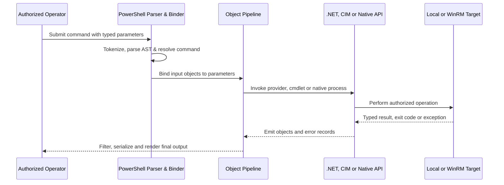

# 🪟 Windows CLI: CMD & PowerShell

> [!abstract] Note of [[Windows]]
> Windows administration spans two fundamentally different shells: **`cmd.exe`**, a text-oriented command interpreter built around native utilities and batch grammar, and **PowerShell**, a typed automation language built over .NET objects, providers, modules, CIM, and remoting.

> [!warning] Authorized use only
> Run administrative and remoting examples only on systems you own or are explicitly authorized to manage. Prefer read-only laboratories, least-privilege identities, `-WhatIf`, explicit cleanup, and approved change windows.

## Parent Learning Order
Windows Architecture & Kernel -> Windows Memory Internals & Exploit Mitigations -> Windows Drivers I-O & Kernel Debugging -> Windows Processes, Services & Boot -> Windows File System & Registry -> Windows Networking Internals -> Windows Security & Access Control -> Windows Identity, Credentials & Authentication -> Windows Active Directory & Domains -> Windows CLI: CMD & PowerShell -> Windows Logging & Auditing -> Windows Diagnostics, Crash Dumps & Performance -> Windows Sysinternals & Troubleshooting

## Start at Zero: Shell, Command & Output

A **shell** parses input, starts commands, and connects their streams. CMD primarily moves strings; PowerShell moves typed .NET objects. A command may be shell syntax, a built-in, an executable, a script, a function, an alias, or a cmdlet. Before automation, identify the parser and whether the next stage expects text or objects; this distinction explains most quoting, pipeline, and error-handling surprises.

## CMD Quick Start — Host Orientation
| Command | Reveals |
| --- | --- |
| `whoami /all` | user, groups, **privileges** (`SeImpersonatePrivilege`!), SID |
| `systeminfo` | OS build + hotfixes → match public exploits |
| `ipconfig /all` · `arp -a` | network, DNS, domain, neighbours |
| `net user` · `net localgroup administrators` | users / local admins |
| `netstat -abon` | connections + owning PID (spot C2) |
| `sc query` · `tasklist /v` | services / processes |

## PowerShell Quick Start — Objects, Not Text
Cmdlets are **`Verb-Noun`** and pass live .NET objects, so you filter on real properties:
```powershell
Get-Process | Where-Object CPU -gt 100 | Sort-Object CPU -Desc | Select -First 5
Get-CimInstance Win32_Service | Where-Object State -eq 'Running'
Get-ChildItem C:\Lab\Logs -File -Recurse | Sort-Object LastWriteTime -Descending | Select-Object -First 10
```

## Execution Policy — Scope & Limitations

Execution policy controls how PowerShell treats script files under scopes such as MachinePolicy, UserPolicy, Process, CurrentUser, and LocalMachine. Group Policy scopes take precedence. It reduces accidental execution but is not an authorization or isolation boundary:

```powershell
Get-ExecutionPolicy -List
Get-AuthenticodeSignature C:\Lab\Survey.ps1
Set-ExecutionPolicy -Scope Process -ExecutionPolicy RemoteSigned
```

## Remoting Quick Start — WinRM

PowerShell Remoting commonly uses **WinRM** over 5985/5986 to create authenticated remote runspaces. Authorization, endpoint configuration, authentication method, delegated identity, and network policy all matter:

```powershell
Invoke-Command -ComputerName DC01 -ScriptBlock { whoami; hostname }
Enter-PSSession -ComputerName SRV02 -Credential (Get-Credential)   # interactive
```

> [!tip] Security observability
> Script-block logging (event 4104), module logging, AMSI, transcription, process creation, and WinRM operational channels expose different parts of shell execution. Reproducible administration keeps a stable identity, correlation record, script hash, target list, and declared change window.

## CMD Parsing & Native Utilities

`cmd.exe` is a command interpreter whose parsing rules differ sharply from a Unix shell and from PowerShell. `%NAME%` expands environment variables during parsing, while delayed expansion uses `!NAME!` at execution time when enabled. Carets escape metacharacters, ampersands chain commands, double ampersands depend on success, double pipes depend on failure, pipes connect text streams, and redirection assigns standard handles. Parentheses group commands but introduce expansion subtleties.

```cmd
setlocal EnableDelayedExpansion
set COUNT=0
for /f "tokens=*" %L in ('tasklist /fi "STATUS eq running" ^| find /c ".exe"') do set COUNT=%L
echo Running image rows: !COUNT!
whoami /all > "%TEMP%\identity.txt" 2>&1
```

Expected pattern:

```text
Running image rows: 87
```

Quoting native Windows command lines is complicated because the operating system fundamentally gives a new process one command-line string; each runtime chooses how to split that string into arguments. `CreateProcess` does not provide an `argv` array. Applications using Microsoft C runtime rules, `cmd`, PowerShell, MSI, scheduled tasks, and service configuration can interpret quotes and backslashes differently. Security reviews must test the actual consumer rather than assume one universal escaping algorithm.

Core native utilities remain essential in recovery environments and constrained systems. `where`, `set`, `type`, `findstr`, `sort`, `forfiles`, `certutil` for certificate operations, `sc`, `schtasks`, `wevtutil`, `reg`, `icacls`, `netsh`, `route`, `nslookup`, `driverquery`, `fltmc`, `query`, and `w32tm` expose substantial host state. Prefer explicit output formats and record exit codes in automation.

```cmd
sc.exe query type= service state= all
if errorlevel 1 (echo Service query failed) else (echo Service query succeeded)
driverquery /v /fo csv > "%TEMP%\drivers.csv"
```

## PowerShell Object Pipeline

PowerShell transports .NET objects through pipelines until a formatting command renders text. `Select-Object`, `Where-Object`, `ForEach-Object`, `Group-Object`, `Measure-Object`, and `Sort-Object` therefore operate on typed properties. Formatting output too early destroys structure; `Format-Table | Export-Csv` exports formatting records rather than the original data.



Providers expose Registry, certificate stores, environment variables, aliases, variables, functions, and filesystems through consistent item cmdlets. This convenience does not erase provider-specific semantics. `Get-Acl` returns security objects; `Get-ItemProperty` accesses Registry values; `Test-Path` interpretation depends on provider.

```powershell
$services = Get-CimInstance Win32_Service | ForEach-Object {
  [pscustomobject]@{
    Name      = $_.Name
    Account   = $_.StartName
    State     = $_.State
    AutoStart = $_.StartMode -eq 'Auto'
    Path      = $_.PathName
  }
}
$services | Where-Object { $_.AutoStart -and $_.State -ne 'Running' } |
  Sort-Object Name | ConvertTo-Json -Depth 3
```

Expected excerpt:

```json
{
  "Name": "C2RLabService",
  "Account": "LocalSystem",
  "State": "Stopped",
  "AutoStart": true,
  "Path": "C:\\Lab\\service.exe"
}
```

Advanced functions should declare parameters, validate input, support `-WhatIf` for changes, produce objects rather than decorative text, and handle errors intentionally. Nonterminating errors require `-ErrorAction Stop` when a `catch` block must receive them. `$LASTEXITCODE` represents the last native program result; `$?` describes the last pipeline's success and has version-specific nuances.

```powershell
function Get-C2RListener {
  [CmdletBinding()]
  param([ValidateRange(1,65535)][int]$Port)
  try {
    Get-NetTCPConnection -State Listen -LocalPort $Port -ErrorAction Stop |
      Select-Object LocalAddress,LocalPort,OwningProcess
  } catch {
    [pscustomobject]@{LocalPort=$Port; Status='NotListening'; Detail=$_.Exception.Message}
  }
}
```

## PowerShell Language, Scope & Security Boundaries

PowerShell has lexical scopes, modules, script blocks, closures, classes, and a dynamic type system over .NET. Single-quoted strings are mostly literal; double-quoted strings expand variables and subexpressions. The call operator executes a resolved command; dot-sourcing runs a script in the current scope and can alter state. `Invoke-Expression` reparses text as code and should be avoided for data handling because robust quoting becomes nearly impossible.

Execution policy helps prevent accidental script execution but is not an authorization boundary. Authenticity comes from trusted signing, controlled repositories, application control, constrained administrative endpoints, language mode, and protected module paths. AMSI allows participating script engines to submit content for inspection. Script-block logging records parsed content, often after basic deobfuscation. Transcription records host-visible interaction but may not capture every API or noninteractive path.

PowerShell 7 and Windows PowerShell 5.1 differ in runtime, modules, remoting, and compatibility. Security tooling must identify the host actually used. Profiles can alter startup behavior; `-NoProfile` improves reproducibility but does not remove system policy or engine logging.

## WinRM & Remoting Internals

WinRM implements WS-Management. PowerShell remoting creates runspaces through configured session endpoints. Authentication commonly uses Kerberos in a domain, Negotiate, certificates, or carefully constrained alternatives. HTTP transport does not mean credentials are sent in cleartext: authentication can provide message confidentiality and integrity, but HTTPS also authenticates the server channel and simplifies some boundary cases.

The “second hop” arises when a remote session needs to access another network resource using the caller's identity but no delegable credential is available. Secure solutions include Kerberos constrained delegation, resource-based constrained delegation, certificate-based endpoints, or passing a narrowly scoped credential under explicit governance. Broad CredSSP usage expands credential exposure.

```powershell
Test-WSMan server01.corp.example
$s = New-PSSession -ComputerName server01.corp.example
Invoke-Command -Session $s -ScriptBlock {
  [pscustomobject]@{Host=$env:COMPUTERNAME; User=[Environment]::UserName; PS=$PSVersionTable.PSVersion.ToString()}
}
Remove-PSSession $s
```

Expected output:

```text
Host     User     PS
----     ----     --
SERVER01 analyst  5.1.22621.2506
```

Just Enough Administration endpoints expose selected commands through constrained virtual identities. The correct design controls who can connect, which language and commands exist, what identity executes, what resources that identity can reach, and where transcripts or logs are retained.

## CMD Command Resolution, Help & Shell State

CMD distinguishes **internal commands** implemented by `cmd.exe` from external executables resolved through the filesystem. `cd`, `set`, `if`, `for`, `call`, `shift`, `pushd`, `popd`, `echo`, and `setlocal` are internal. Utilities such as `whoami.exe`, `where.exe`, `findstr.exe`, and `wevtutil.exe` are separate programs. This distinction matters when diagnosing an error: `where cd` finds nothing because there is no `cd.exe`, while `help cd` documents the built-in.

Resolution follows the current directory and `PATH`, with extensions from `PATHEXT` such as `.COM`, `.EXE`, `.BAT`, and `.CMD`. Always inspect the resolved executable before using an ambiguous name in privileged automation.

```cmd
help set
where whoami
where /r C:\Windows whoami.exe
echo %COMSPEC%
echo %PATH:;=&echo.%
```

Expected excerpt:

```text
C:\Windows\System32\whoami.exe
C:\Windows\System32\cmd.exe
C:\Windows\system32
C:\Windows
...
```

`doskey /history` displays interactive history for the current console host. `cmd /d` disables AutoRun commands configured under Command Processor Registry keys, making troubleshooting more reproducible. `/s`, `/c`, and `/k` affect quote processing and whether the shell exits or remains open. In scripts, prefer `cmd.exe /d /c "..."` only when shell grammar is genuinely required; invoking a native executable directly avoids one parser layer.

The shell maintains a current directory **per drive**. `C:` changes the active drive but does not necessarily change its remembered directory; `cd /d D:\Evidence` changes both. `pushd` stores the previous location and can temporarily map a UNC path to a drive letter, while `popd` reverses it.

```cmd
cd /d C:\Windows\System32
pushd \\fileserver\IR-Lab
echo Working directory: %CD%
popd
```

## CMD Files, Text, Metadata & Permissions

CMD remains valuable in recovery environments because its native utilities expose files without requiring PowerShell. `dir` supports recursive enumeration, attributes, alternate short names, and timestamp ordering. `attrib` manipulates DOS attributes, `fsutil` exposes filesystem details, `compact` reports NTFS compression, and `cipher` reports Encrypting File System state. Use read-only forms unless change is explicitly intended.

```cmd
dir C:\ProgramData /a /s /b
dir C:\Windows\System32 /a:-d /o:-d /t:w | more
attrib C:\Lab\evidence.txt
fsutil file queryfileid C:\Lab\evidence.txt
fsutil hardlink list C:\Lab\evidence.txt
icacls C:\Lab\evidence.txt
```

Expected output:

```text
C:\Lab\evidence.txt NT AUTHORITY\SYSTEM:(F)
                    BUILTIN\Administrators:(F)
                    BUILTIN\Users:(RX)
Successfully processed 1 files; Failed processing 0 files
```

`copy` handles ordinary files, `xcopy` is legacy tree copying, and `robocopy` is the robust enterprise choice. Robocopy exit codes are a bit field: values below 8 can indicate successful copies plus differences, not simple failure. Automation must interpret the documented range instead of assuming every nonzero status is fatal.

```cmd
robocopy C:\Lab\Source D:\Evidence\Source /e /copyall /dcopy:t /r:1 /w:1 /xj /log:D:\Evidence\robocopy.log
set RC=%ERRORLEVEL%
if %RC% LSS 8 (echo Robocopy completed with status %RC%) else (echo Robocopy failed with status %RC%)
```

Text utilities operate on lines rather than typed records. `type` emits a file, `more` paginates, `find` searches literal text, `findstr` adds regular-expression-like matching, `sort` sorts lines, and `fc` compares files. `findstr` is not PCRE: its metacharacters and escaping rules are narrower.

```cmd
findstr /s /n /i /r "error fail denied" C:\Lab\Logs\*.log
fc /n C:\Lab\before.txt C:\Lab\after.txt
type C:\Lab\events.txt | find /c "4625"
```

For filenames supplied by users, quote expansions and use `%~fI`-style modifiers to canonicalize batch parameters. Do not concatenate untrusted text into a command expression; CMD metacharacters can be reinterpreted after expansion.

## CMD Variables, Expansion & Batch Control Flow

`set NAME=value` creates an environment variable. `%NAME%` is expanded when a compound command is parsed, which surprises scripts inside parenthesized blocks. Delayed expansion (`setlocal EnableDelayedExpansion`) evaluates `!NAME!` when each command executes. Delayed expansion has its own risk: literal exclamation marks in data can disappear or be interpreted. A robust batch script enables it only where required.

```cmd
@echo off
setlocal EnableExtensions DisableDelayedExpansion
set "ROOT=C:\Lab\Logs"

for %%F in ("%ROOT%\*.log") do (
  set "FILE=%%~fF"
  setlocal EnableDelayedExpansion
  echo Processing !FILE!
  endlocal
)

endlocal
exit /b 0
```

Interactive loops use a single percent (`%F`); batch files require doubled percent (`%%F`). `for` supports several modes:

- `for %%F in (...)` iterates values or glob expansions.
- `for /d` iterates directories.
- `for /r` recursively walks a tree.
- `for /l %%N in (start,step,end)` creates a numeric sequence.
- `for /f` parses lines from files, strings, or command output.

`for /f` skips blank lines and, by default, lines beginning with `;`. Options such as `tokens=`, `delims=`, `skip=`, `eol=`, and `usebackq` define parsing. Treat command substitution inside `for /f` carefully because it creates another CMD parse and requires escaping pipes or redirects.

```cmd
for /f "usebackq tokens=1,* delims=:" %%A in (`sc.exe query state^= all ^| findstr /b /c:"SERVICE_NAME"`) do echo Service: %%B

for /l %%N in (1,1,3) do echo Attempt %%N
for /r C:\Lab %%F in (*.evtx) do echo %%~zF bytes  %%~fF
```

Batch conditions include string comparison, numeric comparison (`EQU`, `NEQ`, `LSS`, `LEQ`, `GTR`, `GEQ`), file existence, command extension checks, variable definition, and exit status. `if errorlevel N` means “greater than or equal to N,” so test descending values or compare `%ERRORLEVEL%` explicitly.

```cmd
wevtutil.exe gli Security >nul 2>&1
if errorlevel 2 (
  echo Unexpected failure: %ERRORLEVEL%
) else if errorlevel 1 (
  echo Security log unavailable
) else (
  echo Security log readable
)
```

`call :label` implements subroutines. `%0` is the script, `%1`–`%9` are arguments, `%*` is all arguments, and `shift` advances positions. Modifiers such as `%~dp0` produce the script directory, `%~nx1` produces a filename plus extension, and `%~z1` returns size.

```cmd
@echo off
setlocal
if "%~1"=="" (echo Usage: %~nx0 PATH & exit /b 64)
call :Describe "%~1"
exit /b %ERRORLEVEL%

:Describe
if not exist "%~1" (echo Not found: %~1 & exit /b 2)
echo FullPath=%~f1
echo Name=%~nx1
echo Size=%~z1
exit /b 0
```

## CMD Streams, Encoding & Reliable Automation

Windows processes inherit standard handles 0, 1, and 2 for input, output, and error. `>` truncates, `>>` appends, `<` redirects input, `2>` redirects errors, and `2>&1` makes stderr point to the current stdout destination. Order matters: `command 2>&1 >file` does not mean the same as `command >file 2>&1`.

Pipelines launch commands concurrently and transport bytes/text through handles. Each side may use a different encoding. Classic console applications commonly use the active OEM code page; redirected output may differ; modern programs may emit UTF-8 or UTF-16. `chcp` reports or changes the console code page, but it cannot force every program’s encoding.

```cmd
chcp
ver
whoami /all > C:\Lab\identity.txt 2>&1
type C:\Lab\identity.txt
echo ExitCode=%ERRORLEVEL%
```

For dependable batch automation:

1. Begin with `@echo off`, `setlocal`, and explicit argument validation.
2. Quote assignments as `set "NAME=value"` so trailing spaces do not enter the value.
3. Use absolute paths for security-sensitive executables.
4. Redirect output deliberately and document encoding.
5. Capture `%ERRORLEVEL%` immediately before another command overwrites it.
6. Return meaningful codes with `exit /b N`.
7. Write temporary data under an access-controlled directory and clean it explicitly.

## Native Administration Command Families

The following families are worth mastering because they remain available when PowerShell modules are missing:

| Purpose | Commands | Typical evidence |
| --- | --- | --- |
| Identity | `whoami`, `net user`, `net localgroup`, `klist` | SID, groups, privileges, local accounts, Kerberos tickets |
| Processes | `tasklist`, `taskkill`, `wmic` on legacy builds | PID, session, modules, services hosted by process |
| Services | `sc.exe`, `net start` | service state, account, binary path, dependencies |
| Tasks | `schtasks.exe` | trigger, principal, action, last result |
| Network | `ipconfig`, `route`, `arp`, `netstat`, `nslookup`, `netsh` | addressing, routes, neighbors, sockets, DNS, policy |
| Events | `wevtutil` | channels, metadata, XML queries, exports |
| Registry | `reg.exe` | keys, values, remote or offline hive operations |
| Permissions | `icacls`, `takeown`, `whoami /priv` | DACLs, integrity, ownership, token privileges |
| Drivers | `driverquery`, `pnputil`, `fltmc` | loaded drivers, packages, filesystem filters |
| Boot/repair | `bcdedit`, `dism`, `sfc`, `reagentc` | boot entries, component health, recovery configuration |
| Time/domain | `w32tm`, `nltest`, `gpresult` | synchronization, trusts/DC discovery, applied policy |

A read-only service investigation demonstrates composition:

```cmd
sc.exe qc EventLog
sc.exe queryex EventLog
tasklist /svc /fi "SERVICES eq EventLog"
reg.exe query "HKLM\SYSTEM\CurrentControlSet\Services\EventLog"
```

Expected excerpt:

```text
SERVICE_NAME: EventLog
        TYPE               : 20  WIN32_SHARE_PROCESS
        START_TYPE         : 2   AUTO_START
        SERVICE_START_NAME : NT AUTHORITY\LocalService
STATE              : 4  RUNNING
PID                : 1680
```

## PowerShell Discovery, Syntax & the Parser

PowerShell is discoverable by design. `Get-Command` searches commands, aliases, functions, filters, scripts, applications, and cmdlets. `Get-Help` explains syntax and examples; `Get-Member` reveals the type and members of an emitted object. These three commands replace memorization with inspection.

```powershell
Get-Command -Verb Get -Noun '*Service*'
Get-Help Get-CimInstance -Full
Get-Service | Get-Member
(Get-Process -Id $PID).GetType().FullName
```

```text
TypeName: System.ServiceProcess.ServiceController
Name                MemberType Definition
----                ---------- ----------
Start               Method     void Start()
Status              Property   ServiceControllerStatus Status {get;}
Name                Property   string Name {get;}
```

The parser creates an AST before execution. It distinguishes expressions, arguments, statements, script blocks, type literals, attributes, and redirections. In **argument mode**, unquoted tokens are often expandable strings; in **expression mode**, operators and type conversions behave more like a programming language. Use the parser API to inspect scripts without running them:

```powershell
$tokens = $null; $errors = $null
$ast = [System.Management.Automation.Language.Parser]::ParseFile(
  'C:\Lab\Survey.ps1', [ref]$tokens, [ref]$errors)
$errors | Select-Object Message,Extent
$ast.FindAll({ param($node) $node -is [System.Management.Automation.Language.CommandAst] }, $true) |
  Select-Object -ExpandProperty Extent
```

Single quotes preserve literal text except doubled single quotes. Double quotes expand `$variables`, `${braced names}`, and `$()` subexpressions. Here-strings preserve multiline data but their closing marker must begin at the required position. The escape character is the backtick, though splatting and structured APIs are generally clearer than dense escaping.

```powershell
$name = 'LAB01'
'Literal $name'
"Expanded $name"
"Process path: $((Get-Process -Id $PID).Path)"

$query = @'
*[System[(EventID=4624 or EventID=4625)]]
'@
```

## PowerShell Types, Collections & Custom Objects

Variables can hold any .NET object. Type constraints validate or convert assignments and parameters. Arrays preserve order, hashtables map keys to values, ordered dictionaries preserve insertion order, generic lists support efficient growth, and `PSCustomObject` creates record-shaped output.

```powershell
[int]$port = 443
[datetime]$since = (Get-Date).AddHours(-1)
$ports = [System.Collections.Generic.List[int]]::new()
$ports.Add(443); $ports.Add(5986)

$record = [pscustomobject][ordered]@{
  ComputerName = $env:COMPUTERNAME
  CollectedAt  = Get-Date
  Port         = $port
  Listening    = [bool](Get-NetTCPConnection -State Listen -LocalPort $port -ErrorAction SilentlyContinue)
}
$record | Format-List
```

Expected output:

```text
ComputerName : WIN-LAB01
CollectedAt  : 7/31/2026 15:40:18
Port         : 443
Listening    : True
```

Operators include comparison (`-eq`, `-like`, `-match`, `-contains`, `-in`), logical (`-and`, `-or`, `-not`), type (`-is`, `-as`), replacement (`-replace`), and collection-aware variants (`-ceq` for case-sensitive comparison). Many operators enumerate the left-hand collection, which is useful but can surprise programmers expecting a single Boolean.

```powershell
'WinRM','W32Time','BITS' -match '^W'       # returns matching strings
443 -in @(80,443,5986)                    # returns True
'SERVER01' -replace '\d+$','02'           # returns SERVER02
```

## Pipeline Binding, Enumeration & Formatting

Pipeline input binds **by value** when the object type matches a receiving parameter, then **by property name** where enabled. Use `Get-Help Command -Parameter Name` to see whether a parameter accepts pipeline input. PowerShell automatically enumerates most collections, but strings and hashtables have special behavior. A unary comma prevents enumeration; `Write-Output -NoEnumerate` is another explicit option.

```powershell
Get-Service BITS | Stop-Service -WhatIf

[pscustomobject]@{ Name='BITS' } | Get-Service

Get-Process |
  Where-Object WorkingSet64 -gt 500MB |
  Sort-Object WorkingSet64 -Descending |
  Select-Object -First 5 Name,Id,@{n='WorkingSetMB';e={[math]::Round($_.WorkingSet64/1MB,1)}}
```

Formatting is a terminal operation. `Format-Table`, `Format-List`, `Out-String`, and host rendering should occur only after filtering, grouping, calculation, and serialization. Prefer `Export-Csv`, `ConvertTo-Json`, `Export-Clixml`, or database APIs on original objects.

`ForEach-Object` processes streaming input, whereas the language keyword `foreach` normally consumes an existing collection. Streaming reduces memory and latency for large event sets. `begin`, `process`, and `end` blocks let advanced functions initialize resources, process each input object, and finalize output.

## Functions, Parameters, Modules & Reuse

An advanced function uses `[CmdletBinding()]`, typed parameters, validation attributes, common parameters, and object output. Parameter sets express mutually exclusive modes. `SupportsShouldProcess` enables `-WhatIf` and `-Confirm` for changes.

```powershell
function Set-C2RServiceStartMode {
  [CmdletBinding(SupportsShouldProcess, ConfirmImpact='Medium')]
  param(
    [Parameter(Mandatory,ValueFromPipelineByPropertyName)]
    [ValidateNotNullOrEmpty()][string]$Name,

    [Parameter(Mandatory)]
    [ValidateSet('Automatic','Manual','Disabled')]
    [string]$StartupType
  )

  process {
    $service = Get-Service -Name $Name -ErrorAction Stop
    if ($PSCmdlet.ShouldProcess($service.Name, "Set startup type to $StartupType")) {
      Set-Service -Name $service.Name -StartupType $StartupType -ErrorAction Stop
      Get-Service -Name $service.Name
    }
  }
}

[pscustomobject]@{Name='C2RLabService'} | Set-C2RServiceStartMode -StartupType Manual -WhatIf
```

```text
What if: Performing the operation "Set startup type to Manual" on target "C2RLabService".
```

Modules package functions, classes, formats, types, and data. A module manifest (`.psd1`) declares version, compatible editions, dependencies, exported commands, and metadata. Avoid exporting every helper implicitly. `Import-Module -Verbose`, `Get-Module -ListAvailable`, and `Get-Command -Module Name` diagnose discovery.

Profiles are scripts loaded at shell startup for specific users and hosts. They are useful for interactive ergonomics but should not be hidden dependencies of production automation. Signed modules, controlled repositories, code review, semantic versioning, and repeatable tests are stronger foundations.

## Providers, Registry, Certificates & Access Control

Providers adapt hierarchical stores to item cmdlets. List them with `Get-PSProvider` and mounted drives with `Get-PSDrive`. Filesystem, Registry, Certificate, Environment, Variable, Alias, and Function providers share verbs but expose different properties and dynamic parameters.

```powershell
Get-PSProvider
Get-PSDrive
Get-ItemProperty 'HKLM:\SOFTWARE\Microsoft\Windows NT\CurrentVersion' |
  Select-Object ProductName,DisplayVersion,CurrentBuild
Get-ChildItem Cert:\LocalMachine\My |
  Select-Object Subject,Thumbprint,NotAfter,HasPrivateKey
Get-Acl C:\Lab | Format-List Owner,AccessToString
```

Expected excerpt:

```text
ProductName    : Windows 11 Enterprise
DisplayVersion : 24H2
CurrentBuild   : 26100
```

Registry values are not files despite path-like syntax. Specify value names with `Get-ItemPropertyValue`, create or change them only with explicit authorization, and account for 32-bit versus 64-bit Registry views. Certificate private-key accessibility depends on key storage provider and ACLs, not merely the presence of `HasPrivateKey=True`.

## CIM, Events & Enterprise Querying

CIM cmdlets use the Common Information Model and WS-Management by default for remote sessions. `Get-CimInstance` returns deserialized management objects suitable for querying services, processes, hardware, operating-system details, and configuration. Filter at the provider when possible instead of retrieving every instance and filtering locally.

```powershell
$session = New-CimSession -ComputerName SERVER01
Get-CimInstance -CimSession $session -ClassName Win32_LogicalDisk -Filter "DriveType=3" |
  Select-Object DeviceID,
    @{n='SizeGB';e={[math]::Round($_.Size/1GB,1)}},
    @{n='FreeGB';e={[math]::Round($_.FreeSpace/1GB,1)}}
Remove-CimSession $session
```

```text
DeviceID SizeGB FreeGB
-------- ------ ------
C:        237.4   91.8
D:        500.0  402.6
```

`Get-WinEvent` is preferred over `Get-EventLog` for modern channels and XML queries. Filter hashtables perform server-side selection by log, provider, ID, level, and time.

```powershell
$start = (Get-Date).AddHours(-2)
Get-WinEvent -FilterHashtable @{LogName='System'; Level=1,2; StartTime=$start} -ErrorAction Stop |
  Select-Object TimeCreated,Id,ProviderName,LevelDisplayName,Message |
  Export-Csv C:\Lab\system-errors.csv -NoTypeInformation -Encoding utf8
```

For event data embedded in XML, call `.ToXml()` and parse the `EventData` nodes rather than scraping the localized message. This produces stable field names across display languages.

## Jobs, Parallelism & Long-Running Operations

PowerShell supports background jobs, remote jobs, thread jobs where available, asynchronous events, and version-specific parallel pipelines. `Start-Job` launches a separate process and serializes results; thread jobs share a process and therefore have lower isolation. `Invoke-Command -AsJob` creates remote jobs. Always receive, inspect, and remove jobs.

```powershell
$job = Start-Job -ScriptBlock {
  Get-CimInstance Win32_OperatingSystem |
    Select-Object CSName,Caption,Version,LastBootUpTime
}
Wait-Job $job | Out-Null
Receive-Job $job
Remove-Job $job
```

```text
CSName   Caption               Version      LastBootUpTime
------   -------               -------      --------------
WIN-LAB  Microsoft Windows 11  10.0.26100   7/30/2026 08:14:03
```

In PowerShell 7, `ForEach-Object -Parallel` uses runspaces and a throttle limit. Parallelism can overwhelm endpoints, reorder output, complicate credentials, and introduce thread-safety problems. Measure first, cap concurrency, attach a computer name and correlation ID to every object, and design idempotent retry behavior.

## Native Process Interoperability

PowerShell must bridge its object world to programs that accept command-line strings and emit text. In PowerShell 7, `$PSNativeCommandArgumentPassing` influences argument passing; behavior differs from Windows PowerShell 5.1. Never assume a command that prints correctly is passed identically to a native runtime.

Use the call operator with an executable path and an argument array for clarity:

```powershell
$exe = "$env:SystemRoot\System32\wevtutil.exe"
$arguments = @('gli','Security','/f:xml')
& $exe @arguments
$nativeCode = $LASTEXITCODE
if ($nativeCode -ne 0) { throw "wevtutil failed with exit code $nativeCode" }
```

`Start-Process` is useful for alternate credentials, window control, waiting, and file redirection, but its `-ArgumentList` still becomes a command-line string. For complex quoting, understand the target program’s parser and test adversarial filenames in a lab.

PowerShell has six redirectable streams in addition to success output: error, warning, verbose, debug, information, and progress behavior. `*>` redirects all redirectable streams. `Write-Host` writes to the information stream in modern versions but is still inappropriate for data that callers must consume.

Encoding defaults differ between Windows PowerShell and PowerShell 7 and among cmdlets. Specify `-Encoding utf8` or another required encoding at file boundaries, and inspect byte-order marks when interoperating with legacy Windows utilities.

## Error Handling, Debugging & Testing

PowerShell errors are structured `ErrorRecord` objects containing exception, category, target, invocation info, script stack, and fully qualified ID. Nonterminating errors continue by default; `-ErrorAction Stop` converts them into terminating errors suitable for `try/catch/finally`.

```powershell
try {
  $item = Get-Item 'C:\Lab\required.json' -ErrorAction Stop
  $data = Get-Content $item.FullName -Raw -ErrorAction Stop | ConvertFrom-Json -ErrorAction Stop
} catch [System.Management.Automation.ItemNotFoundException] {
  Write-Error "Required input is missing: $($_.Exception.Message)"
  exit 2
} catch {
  Write-Error ("Unexpected {0}: {1}" -f $_.Exception.GetType().FullName,$_.Exception.Message)
  exit 1
} finally {
  Write-Verbose 'Collection attempt complete'
}
```

Use `Set-PSDebug`, breakpoints (`Set-PSBreakpoint`), `Get-PSCallStack`, verbose/debug streams, transcripts in approved environments, and an editor debugger to inspect flow. Strict mode catches references to nonexistent variables and some unsafe assumptions:

```powershell
Set-StrictMode -Version Latest
$ErrorActionPreference = 'Stop'
Set-PSBreakpoint -Script C:\Lab\Survey.ps1 -Line 42
```

Pester supports unit, integration, and infrastructure tests. Mock external dependencies, validate object schemas, test failure paths, and assert that changing functions honor `-WhatIf`. Security-sensitive automation should test hostile strings, Unicode paths, missing privileges, remote failures, partial results, and cleanup.

## PowerShell Remoting at Enterprise Depth

Before creating a session, identify transport, authentication, endpoint configuration, authorization, and delegated identity. `Get-PSSessionConfiguration` lists local endpoints; `Test-WSMan` validates WS-Management; `New-PSSessionOption` controls timeouts, idle behavior, culture, and limits. Persistent sessions preserve remote variables and loaded modules; one-shot `Invoke-Command` calls do not share state unless a session is reused.

```powershell
$option = New-PSSessionOption -OpenTimeout 10000 -OperationTimeout 60000
$session = New-PSSession -ComputerName SERVER01 -ConfigurationName Microsoft.PowerShell -SessionOption $option

Invoke-Command -Session $session -ScriptBlock {
  [pscustomobject]@{
    Host        = $env:COMPUTERNAME
    User        = [System.Security.Principal.WindowsIdentity]::GetCurrent().Name
    LanguageMode= $ExecutionContext.SessionState.LanguageMode
    ProcessId   = $PID
  }
}

Remove-PSSession $session
```

```text
Host     User          LanguageMode ProcessId
----     ----          ------------ ---------
SERVER01 CORP\analyst  FullLanguage      4820
```

PowerShell serializes most remoting output into `Deserialized.*` objects that retain properties but not live methods. Perform method-dependent operations remotely, then return purpose-built records. Copying files through `Copy-Item -ToSession` or `-FromSession` is explicit and auditable. Fan-out with `Invoke-Command -ComputerName` must use a throttle limit and per-host error handling.

JEA endpoint design begins with a role capability: permitted cmdlets, functions, providers, parameters, external commands, and visible aliases. It then maps connecting identities to a virtual or group-managed service identity. A secure endpoint exposes task-specific functions instead of a broad language surface, writes transcripts to protected storage, and cannot use an overprivileged execution identity to escape its intended resource boundary.

## PowerShell Security Model & Reproducibility

Execution policy prevents accidental execution under some workflows; it does not authorize a user or contain malicious code. Production trust should combine code signing, controlled repositories, WDAC or AppLocker policy, least privilege, constrained endpoints, protected module paths, AMSI integration, logging, and review.

Language mode can be `FullLanguage`, `ConstrainedLanguage`, `RestrictedLanguage`, or `NoLanguage` depending on host and policy. Constrained Language Mode reduces access to arbitrary types and APIs when applied through a supported application-control design. It is not equivalent to running as a lower-privileged identity.

For reproducible automation, record `$PSVersionTable`, edition, architecture, language mode, module versions, culture, time zone, and operating-system build. Avoid aliases and implicit profile dependencies in shared scripts. Pin module versions where compatibility matters and sign release artifacts after testing.

```powershell
[pscustomobject]@{
  PSVersion    = $PSVersionTable.PSVersion.ToString()
  PSEdition    = $PSVersionTable.PSEdition
  Architecture = [System.Runtime.InteropServices.RuntimeInformation]::OSArchitecture
  LanguageMode = $ExecutionContext.SessionState.LanguageMode
  Culture      = [cultureinfo]::CurrentCulture.Name
  ComputerName = $env:COMPUTERNAME
} | ConvertTo-Json
```

## Cybersecurity Implications

Shell fluency is security fluency because command lines encode intent, but string matching alone is weak. Analysts correlate process ancestry, user and token, host, script-block content, module loads, network destinations, file writes, and remoting events. Operators produce structured, timestamped, minimally privileged scripts with dry-run behavior and explicit cleanup, reducing both operational risk and ambiguous evidence.

Avoiding dangerous primitives is better than trying to quote them perfectly. Pass typed arguments to APIs, use `Start-Process -ArgumentList` cautiously because it ultimately constructs a string, validate paths after canonicalization, and never concatenate untrusted data into a command or script block. Use CIM rather than deprecated WMI cmdlets where practical, and remoting rather than ad hoc remote service creation for supported administration.

## Authorized Lab: Build a Reproducible Host Survey

1. In a disposable VM, collect hostname, OS build, interfaces, routes, listeners, local users, services, tasks, and recent critical events.
2. Implement the survey first with native commands, then as a PowerShell function returning one structured object.
3. Export JSON and CSV, preserving types until the final serialization stage.
4. Cause one controlled error, catch it, and include an error object rather than silently discarding it.
5. If a second lab VM exists, run the read-only function through WinRM and compare local versus remote identity.
6. Review PowerShell operational logs to identify what the exercise recorded.

Expected summary:

```text
Host: WIN-LAB01
Build: 22631
Listeners: 17
RunningServices: 142
CollectionErrors: 0
RemoteIdentity: CORP\analyst
```

## Crook → Operator → Root Checkpoint

- **Crook:** Navigate CMD and PowerShell, redirect streams, query core host state, and understand objects versus rendered text.
- **Operator:** Write validated functions, preserve structured data, handle native exit codes and PowerShell errors, reason about quoting, and use authenticated WinRM safely.
- **Root:** Design auditable least-privilege automation and JEA endpoints, explain the second hop, map shell activity to telemetry, and eliminate command-injection classes through typed APIs and strict data/code separation.

---
> 🔼 Up: [[Windows]]
