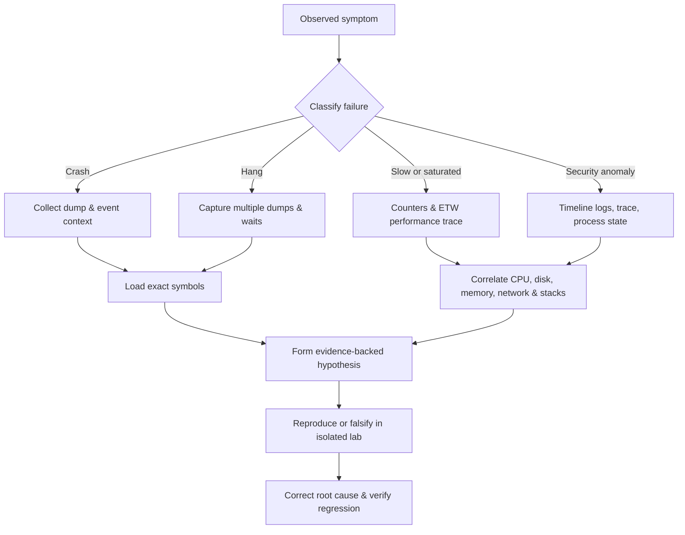

# 🪟 Windows Diagnostics Crash Dumps & Performance

> [!abstract] Note of [[Windows]]
> Expert Windows troubleshooting replaces guesses with evidence. This note builds a disciplined path from symptoms through counters, traces, dumps, symbols, stacks, wait analysis, and defensible root-cause conclusions.

## Parent Learning Order
Windows Architecture & Kernel -> Windows Memory Internals & Exploit Mitigations -> Windows Drivers I-O & Kernel Debugging -> Windows Processes, Services & Boot -> Windows File System & Registry -> Windows Networking Internals -> Windows Security & Access Control -> Windows Identity, Credentials & Authentication -> Windows Active Directory & Domains -> Windows CLI: CMD & PowerShell -> Windows Logging & Auditing -> Windows Diagnostics, Crash Dumps & Performance -> Windows Sysinternals & Troubleshooting

## Start at Zero: Symptom, Evidence & Cause

A **symptom** is what a user observes; a **fault** is the incorrect state that produced it; the **root cause** is the earliest actionable condition in the chain. A crash is abrupt termination, a hang is failure to make progress, and a performance problem is progress at unacceptable latency or resource cost. A **counter** samples a changing quantity, a **trace** records events over time, and a **dump** freezes selected memory state. Experts choose evidence according to the question instead of collecting everything indiscriminately.

## A Diagnostic Evidence Model

Start by classifying the failure: crash, hang, resource exhaustion, latency, correctness error, or security anomaly. Then establish scope, onset, frequency, affected identities, recent changes, and a reproducible trigger. A single screenshot or log line rarely establishes cause. Good analysis correlates wall-clock time, monotonic duration, process and thread identity, operating-system state, application telemetry, and a known baseline.

Windows offers complementary evidence sources. Event Logs retain structured operational records. Performance counters sample numeric state over time. Event Tracing for Windows records high-volume timestamped events and stack samples. Process or kernel dumps preserve memory and execution state at a point in time. Procmon captures file, Registry, process, thread, and selected network operations. None is universally best: a dump freezes one moment, while a trace reveals sequence and duration.



## Crash Dumps & Bugchecks

User-mode dumps range from minidumps to full dumps. A minidump can contain exception, thread, module, and selected memory information; a full dump provides richer heap and object analysis at greater size and sensitivity. Kernel crash-dump options include small, kernel, automatic, active-memory, and complete dumps. Configure storage capacity and access control before an incident, because dumps can contain credentials, keys, personal data, and proprietary content.

An exception record identifies code and parameters; the context record preserves registers at the failure; stacks reveal the calling path. For access violation `0xC0000005`, parameter zero indicates operation type and parameter one the attempted address. The instruction pointer shows where the fault surfaced, which may be later than the original corruption. Heap corruption often damages metadata during one operation and crashes during a later allocation or free.

Bugchecks stop the kernel when continuing would risk corruption. The stop code and arguments narrow the class, but third-party driver blame from an automated line is only a hypothesis. Verify stack, trap frame, IRQL, memory validity, module timestamps, black-box data, verifier state, and recurrence across dumps.

```text
0:000> .symfix
0:000> .reload /f
0:000> !analyze -v
EXCEPTION_CODE: (NTSTATUS) 0xc0000005 - The instruction referenced memory that could not be read.
FAULTING_IP:
sample!ParseRecord+0x2a
00007ff6`1200102a 488b01          mov rax,qword ptr [rcx]

0:000> .exr -1
ExceptionAddress: 00007ff61200102a (sample!ParseRecord+0x2a)
ExceptionCode: c0000005 (Access violation)
Parameter[0]: 0000000000000000
Parameter[1]: 0000000000000018
```

The attempted read at `0x18` strongly suggests a null base pointer plus field offset, but source, disassembly, and object lifetime must confirm it.

## Symbols, Modules & Stack Fidelity

Symbols map addresses to module, function, type, and sometimes source information. Public Microsoft symbols support operating-system analysis; private application symbols provide local variables and exact types. Symbol identity must match the binary's build identifiers. A stack with wrong or missing symbols can mislabel frames and hide inlining.

Core commands include `lm` for modules, `k` variants for stacks, `r` for registers, `dv` for locals where available, `dt` for types, `!address` for mappings, `!heap` for heap state, `!handle`, `!thread`, and `!process`. In kernel debugging, `.trap` switches to a trap frame and `.cxr` to a context record. Always preserve the original dump and record symbol path, debugger version, extension versions, and commands used.

```text
0: kd> lmvm suspectdriver
start             end                 module name
fffff805`72a00000 fffff805`72a4a000   suspectdriver
    Image path: \SystemRoot\System32\drivers\suspectdriver.sys
    Timestamp:   Mon Jul 20 09:41:17 2026

0: kd> kv
 # Child-SP          RetAddr               Call Site
00 ffffac01`c812e7d8 nt!KeBugCheckEx
01 ffffac01`c812e7e0 nt!KiBugCheckDispatch
02 ffffac01`c812e920 suspectdriver!CompleteRequest+0x6e
```

## Hang & Deadlock Analysis

A hang is absence of expected progress. Capture two or more dumps separated by a meaningful interval. If the same threads retain identical stacks and wait objects, the evidence is stronger than one snapshot. Threads may wait legitimately on events, mutexes, I/O completion, message queues, or timers. A deadlock requires a cycle of ownership and dependency; high CPU spinning is a livelock or busy loop, not a blocked deadlock.

User-mode analysis uses `~* k` to inspect all stacks, `!locks` for critical sections where supported, managed-runtime extensions for managed locks, and wait-chain traversal tools. Kernel analysis uses `!thread`, `!locks`, `!irp`, and scheduler state. ALPC or RPC hangs may require inspecting both client and server processes because the blocked caller is only the visible endpoint.

## Performance Counters

Performance Monitor samples counters from providers. CPU analysis distinguishes total utilization from processor queueing, privileged time, interrupts, DPCs, and per-process consumption. Memory analysis distinguishes available bytes, commit, paging, hard faults, pool usage, and working sets. Disk analysis examines latency, queue, throughput, and I/O size together. Network analysis combines throughput, retransmissions, errors, and application latency.

Counter interpretation requires context. High CPU is healthy during intentional parallel work if throughput meets the objective. A high disk queue can be normal on a high-throughput array yet pathological on a low-latency workload. A page-fault rate includes cheap soft faults, so it is not equivalent to pagefile I/O.

```powershell
Get-Counter '\Processor(_Total)\% Processor Time',
            '\Memory\Available MBytes',
            '\Memory\Committed Bytes',
            '\PhysicalDisk(_Total)\Avg. Disk sec/Transfer' -SampleInterval 2 -MaxSamples 3
```

Expected pattern:

```text
Timestamp                 CounterSamples
---------                 --------------
7/31/2026 14:10:02        \\host\processor(_total)\% processor time : 18.4
                          \\host\memory\available mbytes : 7218
                          \\host\physicaldisk(_total)\avg. disk sec/transfer : 0.0041
```

## WPR, WPA & ETW

Windows Performance Recorder captures ETW profiles with CPU sampling, context switches, disk I/O, file I/O, networking, memory, power, and application providers. Windows Performance Analyzer visualizes timelines and attributes cost to process, thread, stack, file, or operation. Stack walking turns “CPU was high” into “these call paths consumed CPU.” Context-switch and ready-thread analysis can expose lock contention or scheduler delay even when total CPU is low.

Trace only what the question requires; broad traces increase overhead and may collect sensitive data. Use circular buffers for intermittent issues and stop soon after reproduction. Record system build, profile, trace duration, trigger, and time zone. Compare against a healthy baseline on comparable hardware and load.

```cmd
wpr -start GeneralProfile -filemode
rem reproduce the authorized performance problem once
wpr -stop C:\Lab\general.etl
```

Expected output:

```text
The trace was successfully saved to C:\Lab\general.etl.
```

In WPA, inspect CPU Usage (Sampled), CPU Usage (Precise), Disk Usage, File I/O, and Generic Events as relevant. A useful conclusion names the expensive stack or blocked dependency and quantifies its contribution.

## Wait Chains, Pool Pressure & Command-Line Trace Capture

A hung process may be waiting correctly on a resource held elsewhere. **Wait Chain Traversal** follows thread waits across synchronization objects and COM/RPC relationships to expose a blocking chain. Task Manager and Resource Monitor provide a first view; repeated dumps prove whether instruction pointers and waits remain stable. In WinDbg, `!analyze -hang`, `~* k`, `!locks`, and object-specific extensions help separate a deadlock from legitimate long-running I/O.

Kernel memory pressure needs pool attribution. `poolmon.exe /b` sorts pool tags by byte use; a steadily growing nonpaged tag suggests a driver leak but does not identify the driver by itself. Map the tag to binaries and corroborate with traces, verifier settings, and controlled reproduction.

```text
Memory:  Nonp Allocations  Nonp Frees  Nonp Diff  Nonp Bytes
Tag  Type     Allocs       Frees       Diff       Bytes
C2R1 Nonp      84210       2100       82110    336322560
```

For reproducible command-line performance capture, Windows Performance Recorder and the older `xperf` interface can start selected ETW profiles, stop into ETL, and preserve stack data when symbols and stack walking are configured. Capture the shortest interval that contains the problem, record the profile and build, and inspect CPU usage by stack, disk service time, ready-thread delay, hard faults, and DPC/ISR activity in WPA. A large ETL without a hypothesis is expensive noise.

## Cybersecurity Implications

Diagnostics artifacts are security-sensitive. Dumps may hold tokens, secrets, decrypted content, and private keys. ETW traces can contain command lines, paths, hostnames, URLs, and user identifiers. Collection procedures need authorization, encryption, retention limits, chain of custody, and controlled deletion.

The same evidence reveals malicious behavior: unsigned modules, anomalous parentage, injected executable memory, unusual network destinations, vulnerable drivers, log-tampering gaps, and persistence activity. Conversely, attackers may induce resource exhaustion to hide within operational noise. Analysts should establish whether a symptom is accidental load, defective software, hostile input, or deliberate suppression of telemetry.

## Authorized Lab: Diagnose a Controlled Failure

1. Use a disposable VM and a small test application that can intentionally consume CPU or raise a null-pointer exception.
2. Record a 30-second counter baseline while idle.
3. Start WPR, trigger the CPU workload once, stop the trace, and identify the hottest process plus stack in WPA.
4. Trigger the controlled crash and open the dump in WinDbg.
5. Run `.symfix`, `.reload`, `!analyze -v`, `.exr -1`, `.ecxr`, `r`, and `kv`.
6. Write a one-page finding containing symptom, evidence, causal chain, competing hypothesis, corrective action, and regression check.

Success criteria:

```text
Observation: CPU saturation and later access violation
Evidence: ETW hot stack + matching exception context
Root cause: named function and invalid object state
Verification: corrected build lacks hot loop and survives original trigger
```

## Crook → Operator → Root Checkpoint

- **Crook:** Distinguish logs, counters, traces, and dumps; read a basic exception code and stack.
- **Operator:** Capture fit-for-purpose evidence, load matching symbols, analyze crashes and hangs, and attribute CPU/disk/memory cost to specific call paths.
- **Root:** Correlate multiple evidence classes, protect sensitive artifacts, falsify competing hypotheses, identify the earliest causal defect, and prove remediation with a reproducible regression test.

### Root Review Questions

Before closing an incident, prove that the dump matches the deployed binary, symbols match that image, system time and trace time align, and the suspected frame is causal rather than merely where corruption surfaced. State whether the conclusion rests on one observation or recurs across independent captures. Preserve exact commands and debugger output so another analyst can reproduce the reasoning without access to your memory or assumptions.

---
> 🔼 Up: [[Windows]]
