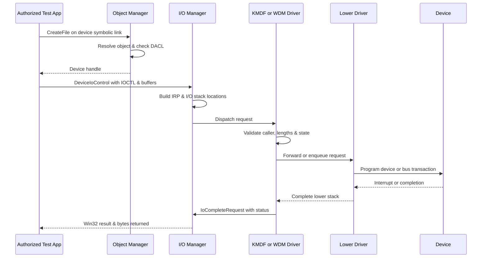

# 🪟 Windows Drivers I-O & Kernel Debugging

> [!abstract] Note of [[Windows]]
> Drivers translate user requests into privileged operations. This note follows an I/O request through the Object Manager, I/O Manager, IRP stack, framework queues, hardware boundary, filesystem minifilters, and a kernel debugger.

## Parent Learning Order
Windows Architecture & Kernel -> Windows Memory Internals & Exploit Mitigations -> Windows Drivers I-O & Kernel Debugging -> Windows Processes, Services & Boot -> Windows File System & Registry -> Windows Networking Internals -> Windows Security & Access Control -> Windows Identity, Credentials & Authentication -> Windows Active Directory & Domains -> Windows CLI: CMD & PowerShell -> Windows Logging & Auditing -> Windows Diagnostics, Crash Dumps & Performance -> Windows Sysinternals & Troubleshooting

## Start at Zero: Why Drivers Exist

Applications ask for operations such as “read this file” or “send this frame,” but hardware speaks device-specific protocols. A **driver** translates between Windows I/O conventions and a device or virtual facility. A **device object** represents an endpoint in the kernel object namespace; an **IRP** carries one I/O operation through a stack of drivers; an **IOCTL** is a device-specific control request; and a **device stack** lets bus, function, and filter drivers cooperate. Kernel drivers share the operating system’s privilege, so one unchecked length or stale pointer can become a system-wide integrity failure.

## Driver Trust Boundary

A kernel-mode driver executes with the operating system's authority. It can map device memory, process interrupts, inspect kernel objects, and corrupt the machine if it mishandles a pointer. User-mode drivers reduce blast radius for suitable device classes, but many storage, network, security, and performance-sensitive components still require kernel participation. Signing, Secure Boot, Memory Integrity, and vulnerable-driver blocklists attempt to ensure that only trusted code reaches this boundary.

Windows exposes devices through the NT object namespace. A driver creates a device object such as `\Device\C2RSample` and may publish a symbolic link such as `\DosDevices\C2RSample`, which user mode opens as `\\.\C2RSample`. The device object's security descriptor determines who may obtain a handle. That authorization check is the first defense; an IOCTL handler must still validate every length, method, state transition, and semantic assumption.



## I/O Manager & IRPs

The I/O Manager converts Win32 operations into I/O Request Packets. An IRP has a major function such as create, read, write, device control, cleanup, or close; an I/O status block; one stack location per participating driver; and buffer metadata. Layered drivers each inspect their stack location, optionally install a completion routine, and pass the request downward.

Buffer-transfer method is security-critical. Buffered I/O copies data through a kernel buffer. Direct I/O pins user pages in memory and supplies an MDL describing them. `METHOD_NEITHER` passes raw user pointers, leaving validation, probing, exception handling, process context, and lifetime entirely to the driver. Historical vulnerabilities frequently combine `METHOD_NEITHER`, integer overflow, missing access checks, and unsafe copies.

IOCTL values encode device type, function, transfer method, and required handle access. A secure design gives sensitive operations explicit access requirements and checks requestor mode plus authorization. It never treats possession of any device handle as permission to read arbitrary kernel memory, write model-specific registers, map physical pages, or terminate protected processes.

```powershell
$src = @'
using System;
using System.Runtime.InteropServices;
public static class DeviceProbe {
  [DllImport("kernel32.dll", SetLastError=true, CharSet=CharSet.Unicode)]
  public static extern IntPtr CreateFile(string n, uint a, uint s,
    IntPtr sa, uint c, uint f, IntPtr t);
}
'@
Add-Type $src
$h = [DeviceProbe]::CreateFile('\\.\C2RSample',0x80000000,3,[IntPtr]::Zero,3,0,[IntPtr]::Zero)
"Handle={0} LastError={1}" -f $h,[Runtime.InteropServices.Marshal]::GetLastWin32Error()
```

Expected result on a lab without that driver:

```text
Handle=-1 LastError=2
```

Error 2 means the device path was not found. Error 5 would mean the object exists but the DACL denied access—a materially different observation.

## Device Stacks, Interrupts & IRQL

Plug and Play builds device stacks from bus, function, and optional filter drivers. The physical device object represents the bus-enumerated device; a function device object implements the device's primary behavior; filter device objects observe or modify traffic. Drivers must forward unsupported requests and preserve stack contracts. A missing completion, double completion, stale cancel routine, or remove-lock error can produce hangs, use-after-free, or bugchecks.

Hardware raises an interrupt serviced by a short Interrupt Service Routine at elevated IRQL. Lengthy work is deferred through a DPC. General asynchronous work that may block or touch pageable memory runs later at `PASSIVE_LEVEL`, often through work items. Code at `DISPATCH_LEVEL` cannot wait arbitrarily or access pageable memory. The resulting `IRQL_NOT_LESS_OR_EQUAL` bugcheck is often evidence that a driver touched invalid or pageable memory at an elevated IRQL.

APCs execute in a thread context under specific conditions, while DPCs execute per processor without a normal process context. Confusing these mechanisms leads to deadlocks and security bugs. An attacker who controls a kernel callback or function pointer at high IRQL gains powerful execution but must respect the same constraints to avoid an immediate crash.

## Driver Models & Frameworks

WDM exposes low-level dispatch, Plug and Play, power, cancellation, and synchronization responsibilities directly. KMDF wraps those mechanics in reference-counted objects, queues, request callbacks, and state machines. It reduces boilerplate but cannot validate business logic automatically. UMDF hosts compatible drivers in user mode, reducing the consequence of memory corruption and simplifying recovery.

Storage and filesystem filtering use specialized models. A filesystem minifilter registers with Filter Manager and receives operations at selected altitudes. Antivirus, encryption, DLP, and backup products inspect creates, reads, writes, section synchronization, and metadata changes here. Altitude controls ordering. Re-entrancy, name normalization, oplocks, transactions, and memory-mapped I/O make filtering significantly more complex than merely watching `CreateFile`.

```text
fltmc filters

Filter Name                     Num Instances    Altitude    Frame
------------------------------  -------------  ------------ -----
WdFilter                                  8       328010         0
FileInfo                                  8        45000         0
Wof                                       4        40700         0
```

## Kernel Debugging With WinDbg

Kernel debugging should use an isolated virtual machine with snapshots and a separate host debugger. Symbols convert raw addresses into functions, structures, and source context. Microsoft's symbol server is commonly configured through `.symfix` followed by `.reload`. Useful commands include `lm` for modules, `!drvobj` and `!devstack` for driver objects, `!irp` for a request, `!thread`, `!process`, `!locks`, `!pool`, `!verifier`, and `!analyze -v`.

```text
0: kd> .symfix
0: kd> .reload /f
0: kd> !devstack \Device\HarddiskVolume3
  !DevObj           !DrvObj            !DevExt           ObjectName
  ffffbd0c`91a1a8d0 \Driver\volsnap    ffffbd0c`91a1aa20
  ffffbd0c`8e6418d0 \Driver\volmgr     ffffbd0c`8e641a20

0: kd> !analyze -v
IRQL_NOT_LESS_OR_EQUAL (a)
Arg1: ffff800000000020, memory referenced
Arg2: 0000000000000002, IRQL
Arg3: 0000000000000000, read operation
```

Driver Verifier stresses selected drivers through pool tracking, IRQL checks, I/O verification, deadlock detection, and other policies. It is intentionally destabilizing and belongs only on a test system. A verifier-induced crash is useful because it stops nearer the first contract violation rather than allowing corruption to surface later in unrelated code.

## Driver Initialization, Dispatch & Network Placement

For a traditional WDM driver, `DriverEntry` is the loader-invoked initialization routine. It establishes unload behavior where appropriate, registers dispatch routines, creates or discovers device relationships, and returns an NTSTATUS. The framework equivalent still performs initialization, but KMDF owns more lifetime, queue, synchronization, and Plug and Play mechanics. A robust driver does not perform unbounded work in `DriverEntry`; it creates explicit objects, assigns cleanup ownership, and unwinds every successfully allocated resource if a later step fails.

```c
NTSTATUS DriverEntry(PDRIVER_OBJECT DriverObject, PUNICODE_STRING RegistryPath) {
    UNREFERENCED_PARAMETER(RegistryPath);
    DriverObject->MajorFunction[IRP_MJ_CREATE] = C2RCreateClose;
    DriverObject->MajorFunction[IRP_MJ_CLOSE]  = C2RCreateClose;
    DriverObject->MajorFunction[IRP_MJ_DEVICE_CONTROL] = C2RDeviceControl;
    return STATUS_SUCCESS;
}
```

The I/O stack also differs by subsystem. Storage and filesystem requests commonly appear as IRPs through class, port, miniport, filesystem, and minifilter layers. Networking uses **NDIS** to connect protocol, filter, and miniport drivers; Windows Filtering Platform supplies policy-aware inspection points above and within that path. An NDIS network buffer list is not an ordinary user buffer, and ownership, IRQL, offload state, and asynchronous completion rules all matter. Debugging begins by identifying the subsystem’s ownership contract before interpreting a pointer or completion routine.

## Cybersecurity Implications

A vulnerable signed driver can become a bridge from administrator to kernel even when the original vendor utility is absent. Risk assessment therefore considers exposed device ACLs, reachable IOCTLs, arbitrary memory primitives, firmware interfaces, mapping capabilities, and whether platform blocklists recognize the driver. Defenders inventory loaded drivers, verify signatures and versions, enable Memory Integrity where compatible, and monitor unexpected service-based driver loading.

Driver telemetry is also a defensive root of trust. Endpoint products rely on process, thread, image, registry, object, network, and minifilter callbacks. A kernel attacker may target callback arrays, filter registration, protected-process enforcement, or telemetry buffers. Debugging knowledge is required to distinguish malicious tampering from normal callback ownership and to avoid treating every undocumented structure as stable across builds.

## Authorized Lab: Trace an I/O Path

1. Use a disposable Windows VM and create a snapshot.
2. Run `fltmc filters` and identify each filesystem filter's altitude.
3. Open a harmless text file while Procmon records the operation; correlate the user request with create, query-information, read, cleanup, and close events.
4. Configure kernel debugging, load symbols, and run `!process 0 0`, `lm`, and `!devstack` for a noncritical volume device.
5. Inspect—but do not modify—one pending IRP with `!irp` if available.
6. Explain the driver stack, buffering model, completion path, execution IRQL, and the security descriptor protecting the device.

Expected learning result:

```text
User request -> object authorization -> IRP allocation -> layered dispatch
-> hardware/filesystem completion -> I/O status -> user-mode result
```

## Crook → Operator → Root Checkpoint

- **Crook:** Define a driver, device object, handle, IOCTL, IRP, ISR, DPC, and kernel bugcheck.
- **Operator:** Read a device stack, distinguish buffering methods, reason about IRQL constraints, and use symbols plus core WinDbg extensions.
- **Root:** Audit an IOCTL attack surface, identify a memory-corruption or authorization primitive, reconstruct its IRP path from a dump, and specify framework, ACL, validation, signing, and platform mitigations.

### Root Review Questions

For every exposed operation, document the device security descriptor, required IOCTL access bits, requestor mode, buffer method, minimum and maximum lengths, integer-arithmetic checks, cancellation behavior, execution IRQL, object lifetime, and completion owner. Then ask what happens during surprise removal, concurrent close, process termination, power transition, malformed output length, and partial lower-stack failure. A driver is not secure merely because the normal vendor application sends well-formed requests; the kernel boundary must remain correct under hostile ordering and arbitrary user buffers.

Require a minimal reproducer, matching public and private symbols, complete crash context, and source-to-binary traceability before assigning root cause. If verifier changes the failure mode, document which invariant it surfaced and why normal timing delayed detection.

Root-level analysis explains the violated kernel contract, not merely the final bugcheck code.

---
> 🔼 Up: [[Windows]]
