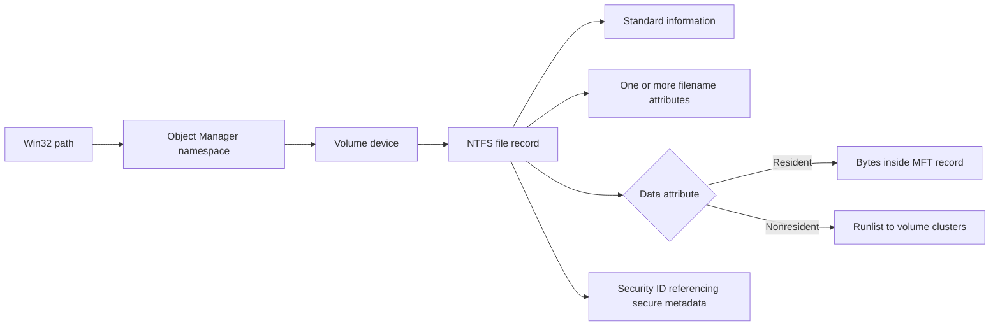

# 🪟 Windows File System & Registry

> [!abstract] Note of [[Windows]]
> Two places hold the truth on a Windows host: **NTFS** (where files and their hidden metadata live) and the **Registry** (the central config/state database). Both are goldmines for attackers and the primary hunting ground for defenders and forensics.

## Parent Learning Order
Windows Architecture & Kernel -> Windows Memory Internals & Exploit Mitigations -> Windows Drivers I-O & Kernel Debugging -> Windows Processes, Services & Boot -> Windows File System & Registry -> Windows Networking Internals -> Windows Security & Access Control -> Windows Identity, Credentials & Authentication -> Windows Active Directory & Domains -> Windows CLI: CMD & PowerShell -> Windows Logging & Auditing -> Windows Diagnostics, Crash Dumps & Performance -> Windows Sysinternals & Troubleshooting

## Start at Zero: Persistent Names & State

A file system turns blocks on storage into named byte streams with metadata and permissions. A **volume** is a formatted storage region, a **file record** describes one file, a **directory** maps names to records, and a **stream** stores bytes associated with a record. The Registry is different: it is a hierarchical configuration database whose **keys** resemble folders, **values** hold typed data, and **hives** are independently backed stores. NTFS and the Registry both cache and journal state, so what is visible through Explorer or Registry Editor is only one view of a deeper transactional system.

## NTFS internals
- **$MFT (Master File Table):** every file/dir is a record in this table. Small files live *inside* their MFT record (resident data). Forensic timelines are rebuilt from MFT `$STANDARD_INFORMATION` vs `$FILE_NAME` timestamps — and **timestomping** manipulates exactly these.
- **Metafiles:** `$LogFile` (journaling), `$UsnJrnl` (USN change journal — records every file change; anti-forensics tries to clear it), `$Bitmap`, `$Secure` (ACL store).
- **Permissions:** NTFS ACLs (ACEs) are separate from share permissions; `icacls file` reads/sets them.

### Alternate Data Streams (ADS)
NTFS files can carry hidden extra streams `file:stream` — invisible to `dir` and Explorer:
```cmd
echo malicious > report.txt:hidden.txt        :: write a hidden stream
more < report.txt:hidden.txt                  :: read it
dir /r                                         :: reveal streams
Get-Item report.txt -Stream *                  :: PowerShell
```
The **`Zone.Identifier`** ADS is the "Mark of the Web" (MotW) that flags internet-downloaded files — attackers strip it to dodge SmartScreen.

## The Registry
A hierarchical database of keys/values under root hives:
| Root | Holds |
| --- | --- |
| `HKLM` | machine-wide config (the important one) |
| `HKCU` | current user's settings (`NTUSER.DAT`) |
| `HKCR` / `HKU` / `HKCC` | file associations / all users / current hardware |

### The hives that matter for credentials
On disk under `C:\Windows\System32\config\`:
| Hive | Contains |
| --- | --- |
| **SAM** | local user **password hashes** (NTLM) |
| **SECURITY** | LSA secrets, cached domain creds, service account passwords |
| **SYSTEM** | the **boot key** needed to decrypt SAM, plus services & config |
| **SOFTWARE** | installed software, autoruns |

> [!warning] Authorized simulation
> With SYSTEM access, dumping `SAM`+`SYSTEM` yields crackable local hashes (offline attack — see the Cryptography tree's cracking notes). Detection: access to these hives by non-system processes.
```cmd
reg save HKLM\SAM sam.hiv & reg save HKLM\SYSTEM sys.hiv     :: then secretsdump offline
```

### Persistence & recon in the Registry
```cmd
reg query "HKLM\Software\Microsoft\Windows\CurrentVersion\Run"       :: autoruns
reg query HKLM\SYSTEM\CurrentControlSet\Services                     :: services
```
Run/RunOnce keys, service `ImagePath`s, and Winlogon `Userinit`/`Shell` are classic **persistence** footholds — and exactly what **Autoruns** (see **Windows Sysinternals and Troubleshooting**) enumerates.

> [!tip] Crook → Root
> **Crook** browses `C:\`. **Root** reads the **$MFT** for the real timeline, hides tools in an **ADS**, and knows the three hives (**SAM/SYSTEM/SECURITY**) that turn one foothold into every credential on the box.

## NTFS On-Disk Architecture

An NTFS volume begins with a boot sector describing geometry and the location of the Master File Table. The MFT is itself a file composed of fixed-size records. Each record begins with a header and carries attributes such as `$STANDARD_INFORMATION`, `$FILE_NAME`, `$DATA`, `$SECURITY_DESCRIPTOR`, `$INDEX_ROOT`, or `$ATTRIBUTE_LIST`. Attributes can be resident inside the record or nonresident, in which case runlists map virtual clusters to logical clusters on disk.

Directories are indexes, not ordinary flat files. Small indexes can remain resident; larger directories use B-tree-like index allocation. Hard links create multiple filename attributes referencing the same file record. Reparse points redirect namespace interpretation and underpin junctions, symbolic links, mount points, cloud placeholders, and other features. Security tooling must normalize final paths because a visually harmless path can traverse reparse points into a sensitive location.



Update Sequence Arrays help detect torn multi-sector writes in metadata records. `$LogFile` journals metadata transactions for filesystem consistency; it is not a complete user-action audit trail. The USN journal records change reasons and file references, enabling efficient indexing, replication, and forensic triage. It proves that a change class occurred but may not preserve the exact previous content or actor.

```powershell
fsutil fsinfo ntfsinfo C:
fsutil usn queryjournal C:
Get-Item C:\Windows\System32\notepad.exe | Format-List FullName,Length,CreationTimeUtc,LastWriteTimeUtc
```

Expected excerpt:

```text
Bytes Per Sector  :                512
Bytes Per Cluster :               4096
Bytes Per FileRecord Segment    : 1024
Usn Journal ID   : 0x01da...
First Usn        : 0x00000000...
Next Usn         : 0x00000000...
```

## Timestamps, Deletion & Forensic Limits

NTFS commonly exposes creation, modification, MFT-change, and access timestamps in multiple attributes. Timestamp semantics depend on API, caching, tunneling, copy/move behavior, and filesystem settings. A discrepancy is a clue rather than automatic proof of timestomping. Deletion removes namespace references and marks metadata/storage reusable; recoverability depends on reuse, TRIM, encryption, and storage implementation.

ACLs are stored efficiently through shared security descriptors. Final access over SMB combines share permissions with NTFS permissions, effectively applying the more restrictive result. Encryption through EFS ties file encryption keys to certificates; BitLocker protects volumes at rest but normally exposes plaintext to authorized code after unlock. Compression, sparse files, deduplication, and cloud placeholders alter physical storage without changing the logical file contract.

## ReFS & Modern Storage

ReFS emphasizes metadata integrity, checksums, large-scale operation, and integration with Storage Spaces. It uses copy-on-write metadata updates and can repair corruption when redundant data is available. ReFS is not a drop-in forensic equivalent to NTFS: metadata structures, feature support, boot use, streams, and tooling differ by Windows edition and release. Enterprise architects choose filesystem and storage policy based on workload, recovery, integrity, compatibility, and evidence requirements.

Volume Shadow Copy snapshots preserve point-in-time blocks used by backup and recovery. They may retain older versions of files and Registry hives but are not guaranteed evidence: retention is finite and administrative or storage events can remove snapshots. Treat backup infrastructure as a high-value security boundary.

## Registry Internals

The Configuration Manager presents hives through a unified namespace. A hive consists of base blocks, bins, cells, key nodes, value records, subkey lists, and security records. Transaction logs support recovery after interrupted writes. Loaded user hives map into `HKEY_USERS`; `HKCU` is a contextual view of the current user's hive. `HKCR` is a merged compatibility view combining machine and user class-registration data, which matters when analyzing per-user overrides.

Control sets deserve special attention. `HKLM\SYSTEM\Select` identifies current, default, failed, and last-known control sets, while `CurrentControlSet` is a runtime link. Services, driver start values, networking, and many boot settings live under the selected control set. Offline analysis must determine which numbered control set was active rather than assume `ControlSet001`.

Registry value types include strings, expandable strings, multi-strings, binary data, links, and 32/64-bit integers. WOW64 presents redirected views to 32-bit applications. An analyst querying only one view can miss application state or persistence. Registry virtualization may redirect legacy writes for compatibility, further separating apparent from actual location.

```powershell
Get-ItemProperty 'HKLM:\SYSTEM\Select'
Get-ChildItem 'Registry::HKEY_USERS' | Select-Object Name
reg.exe query "HKLM\SOFTWARE\Microsoft\Windows\CurrentVersion\Run" /reg:64
reg.exe query "HKLM\SOFTWARE\Microsoft\Windows\CurrentVersion\Run" /reg:32
```

Expected control-set output:

```text
Current      : 1
Default      : 1
Failed       : 0
LastKnownGood: 1
```

## Snapshots, Hive Recovery & Recovery Expectations

**Volume Shadow Copy Service (VSS)** coordinates point-in-time volume snapshots through requesters, writers, and providers. A snapshot can preserve earlier file and Registry-hive state even after the live volume changes, but it is not automatically a complete or application-consistent backup. Writers must quiesce participating applications, snapshots can be deleted, and retention depends on storage policy. Inventory snapshots read-only before mounting or exposing them:

```cmd
vssadmin list shadows
```

```text
Contents of shadow copy set ID: {7b...}
   Shadow Copy Volume: \\?\GLOBALROOT\Device\HarddiskVolumeShadowCopy12
   Originating Machine: LAB-WIN11
```

Registry recovery is similarly transactional. Hive primary files are supported by transaction logs such as `SYSTEM.LOG1` and `SYSTEM.LOG2`; recovery can replay committed changes after interruption. The historical `RegBack` location exists on many systems but modern Windows does not guarantee periodic full hive backups there by default. An empty `RegBack` directory is therefore not evidence of tampering. Forensic or recovery work should preserve the primary hive, transaction logs, acquisition time, volume state, and any snapshot source together. Loading a copied hive for inspection is safer than repairing the only original.

## Cybersecurity Implications

Filesystem and Registry findings need provenance. A suspicious executable in a startup path becomes stronger evidence when MFT, USN, Zone.Identifier, signer, task/service configuration, and process telemetry converge. Conversely, an ADS, unsigned file, or Run value can be legitimate. Root-cause reporting separates observation, interpretation, confidence, and missing evidence.

Hardening combines least-privilege ACLs, safe path handling, controlled reparse-point traversal, application control, protected backups, BitLocker, service/task path integrity, Registry auditing on high-value keys, and centralized telemetry. Clearing a journal or deleting a file does not erase copies already forwarded, snapshotted, cached, backed up, or recorded in another subsystem.

## Authorized Lab: Build a File-to-Registry Timeline

1. In a disposable VM, create `C:\Lab\report.txt` and a benign ADS named `note`.
2. Use `dir /r`, `Get-Item -Stream *`, and `Get-Content -Stream note` to inspect both streams.
3. Create a harmless per-user Registry value under a dedicated `HKCU\Software\Crook2RootLab` key.
4. Query volume and USN metadata, then record UTC timestamps and file identifier information.
5. Export only the lab Registry key, delete the lab artifacts, and verify cleanup.
6. Explain which artifacts would survive in MFT, USN, transaction logs, Event Logs, shadow copies, or backups and where certainty is impossible.

Expected output:

```text
report.txt
report.txt:note:$DATA

PSPath       : Microsoft.PowerShell.Core\Registry::HKEY_CURRENT_USER\Software\Crook2RootLab
Purpose      : Authorized filesystem-registry exercise
```

## Crook → Operator → Root Checkpoint

- **Crook:** Explain files, directories, MFT records, streams, hives, keys, values, and basic ACLs.
- **Operator:** Interpret resident/nonresident attributes, runlists, USN evidence, reparse points, control sets, WOW64 views, and Registry transaction state.
- **Root:** Reconstruct a defensible cross-source timeline, explain filesystem and Registry evidence limits, identify the writable trust boundary behind persistence, and implement controls that preserve integrity plus recovery.

### Root Review Questions

For each conclusion, identify whether it came from live API state, raw metadata, a journal, a snapshot, or forwarded telemetry. Explain timestamp semantics, collection time, possible reuse, parser limitations, and whether encryption or storage optimization changed visibility. A professional finding states what the artifact proves, what it merely suggests, and which independent source would raise confidence.

---
> 🔼 Up: [[Windows]]
