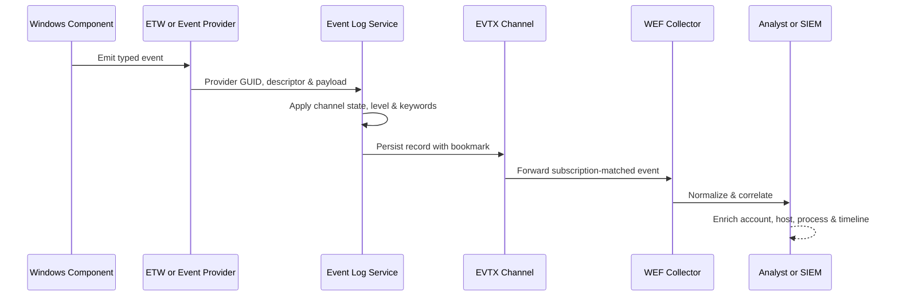

# 🪟 Windows Logging & Auditing

> [!abstract] Note of [[Windows]]
> Windows records almost everything — if auditing is configured. This note is the defender's core telemetry map (and the attacker's guide to what they leave behind).

## Parent Learning Order
Windows Architecture & Kernel -> Windows Memory Internals & Exploit Mitigations -> Windows Drivers I-O & Kernel Debugging -> Windows Processes, Services & Boot -> Windows File System & Registry -> Windows Networking Internals -> Windows Security & Access Control -> Windows Identity, Credentials & Authentication -> Windows Active Directory & Domains -> Windows CLI: CMD & PowerShell -> Windows Logging & Auditing -> Windows Diagnostics, Crash Dumps & Performance -> Windows Sysinternals & Troubleshooting

## Start at Zero: Event, Provider, Channel & Policy

An **event** is a timestamped record emitted by a **provider**. A **channel** is a routed stream of related events, and an EVTX file persists channel records. An **audit policy** decides which security-relevant successes and failures Windows asks providers to record; it does not retroactively recover events that were never enabled. ETW is the general event transport beneath many diagnostics, while Event Log channels, Sysmon, and forwarded subscriptions package selected data for retention. Event IDs only have meaning together with provider, version, fields, host, and time context.

## The Event Log
Logs live under `%SystemRoot%\System32\winevt\Logs\*.evtx`, grouped into channels: **Security**, **System**, **Application**, and **PowerShell/Sysmon** operational logs.
```powershell
Get-WinEvent -LogName Security -MaxEvents 20
Get-WinEvent -FilterHashtable @{LogName='Security'; Id=4625} -MaxEvents 50   # failed logons
wevtutil qe Security /c:5 /f:text
```

## The Event IDs that matter
| ID | Meaning |
| --- | --- |
| **4624 / 4625** | successful / failed logon (watch **Type 3** network, **Type 10** RDP) |
| **4672** | special privileges assigned (admin logon) |
| **4688** | process creation (enable **command-line auditing**!) |
| **4720 / 4732** | user created / added to a privileged group |
| **4768 / 4769 / 4771** | Kerberos TGT / TGS / pre-auth failed (roasting) |
| **7045** | new service installed (persistence) |
| **4698** | scheduled task created |
| **1102** | **audit log cleared** — one of the highest-fidelity alerts in the SOC |
| **4104** | PowerShell **script-block logging** (deobfuscated script text) |

## ETW — the firehose under everything
**Event Tracing for Windows** is the low-level telemetry bus that most EDR consumes (providers like `Microsoft-Windows-Threat-Intelligence`, DNS, WMI). Attackers attempt **ETW patching/blinding** (patching `EtwEventWrite` in their own process) — defenders detect the resulting telemetry gaps and protect key providers.

## Sysmon — the essential add-on
System Monitor (Sysinternals) writes rich events to `Microsoft-Windows-Sysmon/Operational`:
| Sysmon ID | Captures |
| --- | --- |
| **1** | process creation + **full command line + hashes + parent** |
| **3** | network connection (with process) |
| **7** | image/DLL load (catch unsigned/suspicious DLLs) |
| **8 / 10** | CreateRemoteThread / process access (injection, LSASS reads) |
| **11 / 13** | file create / registry set (drops & persistence) |
| **22** | DNS query |
Deploy with a curated config (e.g. SwiftOnSecurity/Olaf's) and forward to a SIEM.

## The golden rules
- **Command-line + script-block logging on**, or 4688/4104 are near-useless.
- **Forward logs off-host in real time** (WEF/agent) — a cleared local log (**1102**) can't erase what already left the box. This neutralises most anti-forensics before it starts.
- Alert on the **absence** of expected logs (a silenced source is itself an IOC).

> [!tip] Blue-team takeaway
> Every offensive move in the Windows tree — LSASS reads, new services, Kerberoasting, log clearing — maps to an Event ID above. Detection engineering is turning this table into alerts (see the Defensive Security domain).

## Eventing Architecture

Modern Windows Event Log uses publishers, providers, channels, manifests, templates, and the Windows Event Log service. A provider emits an event identified by provider, channel, ID, version, level, task, opcode, keywords, timestamp, process/thread context, and payload fields. The rendered message is produced from provider metadata; missing message resources can make an event look cryptic even though structured XML remains usable.

Channels are administrative, operational, analytic, or debug. Administrative channels target broadly actionable events. Operational channels support component troubleshooting. Analytic and debug channels can be extremely verbose and are often disabled by default. Classic logs coexist with manifest-based eventing. `.evtx` files are chunked binary containers with records and checksums; direct file copying while active is less reliable than supported export APIs.



Use XML when exact field names matter. `Get-WinEvent` can filter server-side by log, provider, ID, time, level, or XML/XPath query. `Get-EventLog` is legacy and should not be the default for modern channels.

```powershell
$start = (Get-Date).AddHours(-1)
Get-WinEvent -FilterHashtable @{LogName='Security'; Id=4688; StartTime=$start} |
  Select-Object -First 3 TimeCreated,Id,MachineName,
    @{N='Xml';E={$_.ToXml()}}
```

Expected metadata:

```text
TimeCreated : 7/31/2026 13:21:44
Id          : 4688
MachineName : WIN-LAB01.corp.example
Xml         : <Event xmlns='http://schemas.microsoft.com/win/2004/08/events/event'>...
```

Event-ID meaning is scoped by provider and version. “Event 1” from Sysmon is not Event 1 from another provider. Field presence also depends on audit policy, OS version, and provider configuration.

## Security Auditing & Policy

Advanced Audit Policy divides telemetry into subcategories such as Logon, Account Logon, Process Creation, Object Access, Policy Change, Privilege Use, Detailed Tracking, and Directory Service Access. Group Policy can enforce subcategory settings and prevent legacy category policy from overriding them. Audit success and failure selectively; indiscriminate enablement creates noise and storage pressure.

Object-access auditing requires both an enabled subcategory and a matching SACL on the target object. Event 4656 represents a handle request, 4663 an attempted operation using a handle, and 4658 handle closure. Correlate subject logon ID, process ID, object name, access mask, and time. Failure to see 4663 does not prove no access occurred if policy or SACL was absent.

```cmd
auditpol /get /category:*
auditpol /get /subcategory:"Process Creation"
wevtutil gl Security
```

Expected excerpt:

```text
System audit policy
Detailed Tracking
  Process Creation                    Success
  Process Termination                 No Auditing
```

Command-line inclusion for process creation is a separate policy. Sensitive arguments can appear in logs, so developers should avoid command-line secrets and defenders must protect log access.

## ETW Internals

ETW separates controllers, providers, and consumers. A controller starts a session and selects provider level, keywords, buffer configuration, and stack-walking options. Providers write compact events into per-processor buffers. Consumers process live events or read ETL files. Kernel providers expose scheduling, process, thread, image, file, disk, network, and profile data with performance suitable for production when configured responsibly.

ETW loss matters. If buffers fill faster than consumers drain them, events can be lost. Session statistics, sequence gaps, collector health, time synchronization, and expected-provider heartbeats should be monitored. “No event” is meaningful only after collection health is established.

Threat telemetry may come from protected or security-oriented providers, AMSI, Defender, WFP, Script Block Logging, and application-specific sources. User-mode patching of one provider call cannot erase already persisted events or independent kernel/network/file evidence. Robust visibility is intentionally redundant.

## Sysmon Engineering

Sysmon extends endpoint telemetry but is not a SIEM and does not declare activity malicious. Its configuration selects events and filters. Poor configurations either flood storage or exclude the context needed for investigation. Process Create should retain parent, command line, hashes, user, integrity, and identifiers. Process GUID helps correlate across PID reuse. Network events are valuable but high volume. Image-load telemetry requires selective inclusion. Process Access can illuminate credential or injection behavior but needs careful source/target filters.

```powershell
Get-WinEvent -FilterHashtable @{
  LogName='Microsoft-Windows-Sysmon/Operational'; Id=1
} -MaxEvents 1 | Format-List TimeCreated,Message
```

Expected excerpt:

```text
Process Create:
ProcessGuid: {2bf1a630-...}
ProcessId: 9048
Image: C:\Windows\System32\WindowsPowerShell\v1.0\powershell.exe
ParentImage: C:\Windows\explorer.exe
IntegrityLevel: Medium
```

Configuration changes themselves are security events. Version configurations, peer-review exclusions, test on representative systems, and measure events per second plus storage before broad deployment.

## WEF, Retention & Evidence Quality

Windows Event Forwarding uses subscriptions to send selected events to collectors. Source-initiated subscriptions scale through Group Policy; collector-initiated subscriptions suit smaller controlled sets. RenderedText simplifies downstream use but increases payload size; Events format preserves structured data and relies on provider metadata at the consumer.

Collectors need capacity planning, TLS/authentication policy, access control, monitoring, and onward forwarding. Bookmarking and delivery modes balance latency against bandwidth. Local maximum log sizes and retention should cover disconnection windows. Security logs and archives require integrity controls and time synchronization.

A normalized event should retain original provider, channel, record ID, computer, UTC timestamp, event XML, collection time, and collector identity. SIEM pipelines that flatten away logon ID, process GUID, access mask, ticket options, or source port can make expert investigation impossible.

## Cybersecurity Implications

Telemetry design begins with a question: what event proves the security-relevant transition? Process start, token assignment, object access, service creation, ticket issuance, policy change, network connection, file creation, and code-signing decision are different transitions. High-confidence analytics chain several rather than overfit one string.

Adversaries may clear logs, stop services, alter policy, overwhelm channels, corrupt time, or exploit collection exclusions. Resilience comes from off-host forwarding, protected policy, redundant sensors, immutable storage, collector-health alerts, and clock monitoring. Event 1102 is important, but detection should not depend on the attacker helpfully generating it.

## Authorized Lab: Build One Correlated Timeline

1. In a disposable VM, confirm process-creation and command-line auditing state.
2. Run `cmd.exe /c echo C2R-TELEMETRY>%TEMP%\c2r-telemetry.txt`.
3. Query Security 4688, Sysmon 1 and 11 if available, and PowerShell operational events if PowerShell initiated the command.
4. Export matching events as XML without clearing any log.
5. Correlate timestamp, user, logon ID, PID/process GUID, parent, command line, and created path.
6. Document which fields are missing and the exact policy or sensor required to produce them.

Expected timeline:

```text
13:21:44.101 powershell.exe starts cmd.exe (4688 / Sysmon 1)
13:21:44.128 cmd.exe creates c2r-telemetry.txt (Sysmon 11 if configured)
13:21:44.141 cmd.exe exits (process termination if configured)
```

## Crook → Operator → Root Checkpoint

- **Crook:** Locate channels, query recent records, name core security events, and distinguish Event Log from ETW.
- **Operator:** Configure targeted audit policy, parse event XML, engineer Sysmon filters, validate WEF delivery, and correlate identifiers across sources.
- **Root:** Design a loss-aware enterprise telemetry architecture, identify collection blind spots, preserve evidentiary context, and express detections as security transitions with measurable coverage and false-positive control.

---
> 🔼 Up: [[Windows]]
