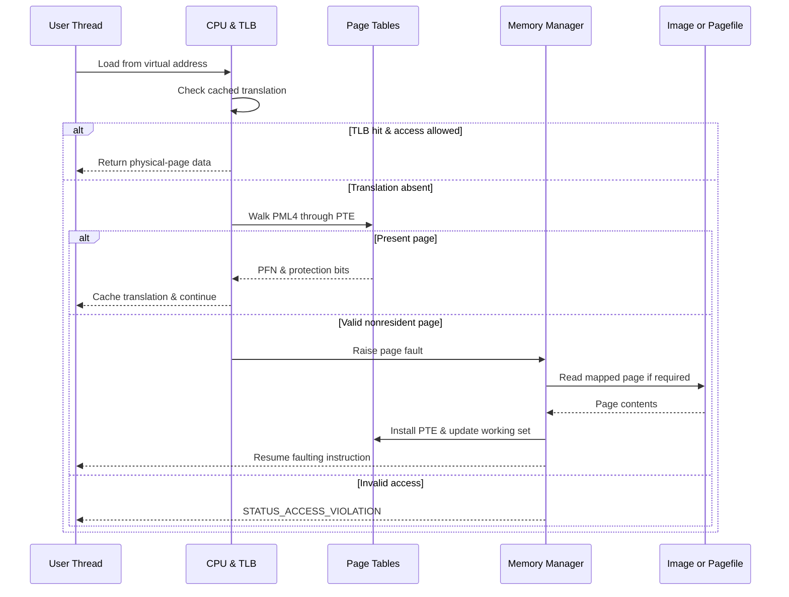

# 🪟 Windows Memory Internals & Exploit Mitigations

> [!abstract] Note of [[Windows]]
> Windows memory is a contract between the Memory Manager, processor page tables, image loader, and security mitigations. This masterclass builds that contract from virtual addresses to VADs, sections, heaps, kernel pools, and modern exploit resistance.

## Parent Learning Order
Windows Architecture & Kernel -> Windows Memory Internals & Exploit Mitigations -> Windows Drivers I-O & Kernel Debugging -> Windows Processes, Services & Boot -> Windows File System & Registry -> Windows Networking Internals -> Windows Security & Access Control -> Windows Identity, Credentials & Authentication -> Windows Active Directory & Domains -> Windows CLI: CMD & PowerShell -> Windows Logging & Auditing -> Windows Diagnostics, Crash Dumps & Performance -> Windows Sysinternals & Troubleshooting

## Start at Zero: Address, Page & Mapping

Memory is not one flat collection of bytes. A **virtual address** is the number a process uses, a **physical page** is a fixed-size frame in RAM, a **page-table entry** describes a translation and its permissions, and a **mapping** connects a virtual range to RAM, a file, an image, or reserved address space. A process may own a valid address that is not currently resident. The Memory Manager resolves that condition through a page fault. This indirection gives isolation, sharing, copy-on-write, demand loading, and the policy points used by exploit mitigations.

## Address Spaces From Zero

Every process receives a private virtual address space. A pointer is therefore not a physical RAM address: it is a virtual address translated by page-table entries maintained by the processor and Windows Memory Manager. On 64-bit Windows, user processes have a very large user-mode range while kernel mappings occupy a separate canonical range. The exact split depends on the build and configuration, but the security principle is stable: user mode cannot directly dereference kernel pages because the page-table permissions and processor privilege level reject the access.

Translation proceeds through multi-level page tables. A page-table entry records whether a page is present, writable, executable, user-accessible, dirty, or accessed. The Translation Lookaside Buffer caches recent translations. A TLB miss causes a hardware page-table walk; a reference to a valid but nonresident page raises a page fault so the kernel can make the data resident. A soft fault can resolve from a standby list or another process's shared page. A hard fault requires storage I/O from an image, mapped file, or pagefile and is dramatically slower.



## VADs, Sections & Working Sets

The Virtual Address Descriptor tree records ranges reserved or committed in a process. A VAD describes protection, backing type, inheritance, and whether the region represents private memory, an image, or a mapped file. Page tables answer “where is this page now?” while VADs answer “what is this range supposed to be?” This distinction matters in incident response: an executable private region with no corresponding image file is not automatically malicious, but it deserves explanation.

A section object represents memory that can be shared or backed by a file. The image loader maps executable images as sections, preserving per-section protections such as read-execute for code and read-write for data. Two processes mapping the same section can share physical pages while retaining private page tables. Copy-on-write lets them initially share a page; the first writer receives a private copy. This is why a debugger can place a software breakpoint without globally modifying every process mapping the same DLL.

The working set is the subset of a process's pages currently resident in RAM. Windows balances working sets under pressure, moving pages among active, standby, modified, and free lists. Commit charge represents promised private memory that must have backing capacity, not physical RAM currently consumed. A machine can therefore have available RAM yet fail a very large commit if the system commit limit is exhausted.

```powershell
Get-Process | Sort-Object WorkingSet64 -Descending |
  Select-Object -First 5 Name,Id,
    @{N='WorkingMB';E={[math]::Round($_.WorkingSet64/1MB,1)}},
    @{N='PrivateMB';E={[math]::Round($_.PrivateMemorySize64/1MB,1)}}
```

Expected output:

```text
Name       Id WorkingMB PrivateMB
----       -- --------- ---------
MsMpEng  4180     412.7     516.1
chrome   12240     286.4     231.8
powershell 9048     96.2      74.9
```

Working set and private bytes are related but not interchangeable. Shared DLL pages may be resident in the working set without being private; committed private pages may be paged out and therefore absent from the working set.

## User Heaps, Stacks & Kernel Pools

Each thread has a stack with a reserved region, committed pages, and a guard page that allows controlled growth. The Thread Environment Block stores user-mode thread metadata, including stack boundaries. Stack exhaustion repeatedly crosses guard pages until the reserved range is consumed, producing a stack-overflow exception. Stack corruption is dangerous because return addresses, saved registers, exception metadata, and local objects may coexist there.

Dynamic allocations usually come from the process heap or segment heap. Allocators maintain metadata and size classes to recycle blocks efficiently. Use-after-free, double-free, out-of-bounds writes, and integer-overflowed allocation sizes can corrupt object state or allocator metadata. Modern Windows heaps add encoded metadata, randomized placement, termination on corruption, and segment-heap designs, but application logic must still enforce object lifetime.

Kernel allocations use paged and nonpaged pools. Nonpaged memory must remain resident because code at elevated IRQL cannot take a page fault. Drivers tag allocations with four-character pool tags, allowing investigators to attribute leaks. A nonpaged-pool leak can destabilize the entire machine; malformed driver I/O that corrupts adjacent pool objects can turn a device-interface bug into kernel execution.

```text
0: kd> !vm
Physical Memory:      16306792 ( 65227168 Kb)
Available Pages:       5210041 ( 20840164 Kb)
NonPagedPool Usage:     184922 (   739688 Kb)
PagedPool Usage:        247613 (   990452 Kb)

0: kd> !poolused 2
 Tag  Allocs     Frees      Diff       Bytes  Per Alloc
 File  81234     79001      2233      714560        320
```

## Exploit Mitigations

Data Execution Prevention marks data pages non-executable using the processor NX bit. It converts a direct jump into injected stack or heap bytes into an access violation, but does not prevent reuse of existing executable code. Address Space Layout Randomization relocates images, stacks, heaps, and other mappings; its strength depends on entropy and collapses when a memory disclosure reveals a useful address. High-entropy ASLR and mandatory relocation improve coverage, while non-ASLR modules can anchor a reuse chain.

Control Flow Guard instruments indirect calls and validates targets against a bitmap of legitimate entry points. Hardware-enforced stack protection through Intel CET adds a shadow stack that tracks return addresses independently from the normal stack, making conventional return-address overwrite chains harder. Arbitrary Code Guard can prohibit dynamically generated executable memory. Code Integrity Guard can restrict image loading. Export Address Filtering, import filtering, and font or child-process restrictions harden specific application classes.

Virtualization-Based Security creates isolated trust boundaries backed by the hypervisor. Hypervisor-Protected Code Integrity validates kernel code and restricts executable kernel memory. Credential Guard places selected secrets in an isolated environment rather than exposing them directly to the normal kernel. These controls do not make bugs disappear; they increase the quality and number of primitives an exploit must obtain.

```powershell
Get-ProcessMitigation -Name notepad.exe
```

Expected excerpt:

```text
DEP:
    Enable: ON
    EmulateAtlThunks: OFF
ASLR:
    BottomUp: ON
    HighEntropy: ON
CFG:
    Enable: ON
UserShadowStack:
    Enable: ON
```

### Dynamic-Code & Image-Loading Policies: ACG and CIG

DEP answers whether a page may execute, but modern applications need stronger invariants. **Arbitrary Code Guard (ACG)** prevents a protected process from making writable memory executable or modifying executable pages. A brokered design can move trusted compilation to another process and map the resulting code under controlled policy. **Code Integrity Guard (CIG)** restricts image loading to appropriately signed binaries, reducing the value of planting an unsigned DLL in a search path. These controls complement **Control Flow Guard**, which validates indirect call targets, and CET shadow stacks, which protect return-address integrity.

Inspect effective process mitigations instead of assuming a machine-wide default applies:

```powershell
Get-ProcessMitigation -Name msedge.exe
Get-ProcessMitigation -System
```

```text
Payload:
  EnableExportAddressFilter : ON
DynamicCode:
  ProhibitDynamicCode       : ON
ImageLoad:
  MicrosoftSignedOnly       : ON
```

ACG can break JIT compilers and instrumentation that legitimately generate code; CIG can break plug-in ecosystems. Deployment therefore requires compatibility testing, staged enforcement, and an explicit exception model. Their expert value is architectural: they remove entire classes of post-corruption transitions rather than attempting to recognize every payload.

## Cybersecurity Implications

An exploit developer reasons in primitives: controlled read, controlled write, instruction-pointer control, address disclosure, and a valid execution path through mitigations. A defender reasons from the same model: an RX private mapping, an unexpected protection transition from RW to RX, a thread start address outside a signed image, or a process opening another process with virtual-memory rights. Memory scanners should compare VAD intent, page protections, image backing, thread entry points, and call stacks rather than merely search byte strings.

Crash triage also depends on this model. `0xC0000005` identifies an access violation, but the parameters distinguish read, write, and execute attempts. A faulting address near zero suggests a null-derived pointer; a patterned address suggests controlled data; execute access in heap memory suggests corrupted control flow. Reproducibility under page heap, Application Verifier, or sanitizers helps convert a symptom into root cause.

## Authorized Lab: Inspect & Harden a Process

1. Start Notepad and record its PID: `Start-Process notepad -PassThru`.
2. Capture working-set and private-memory values with `Get-Process`.
3. Run `Get-ProcessMitigation -Name notepad.exe` and identify DEP, ASLR, CFG, and shadow-stack state.
4. In an administrator WinDbg session attached to the lab process, run `!address -summary`, `!vad`, and `lm` without modifying memory.
5. Map each executable range to a loaded module. Explain any executable range that is not file-backed.
6. Create a controlled crash in a disposable test program, then inspect `.exr -1`, `.ecxr`, `r`, `kv`, and `!analyze -v`.

Expected debugger pattern:

```text
(1b40.246c): Access violation - code c0000005 (first chance)
Attempt to read from address 0000000000000000
0:000> .exr -1
ExceptionCode: c0000005 (Access violation)
Parameter[0]: 0000000000000000
Parameter[1]: 0000000000000000
```

The exercise is complete when you can distinguish reserve from commit, working set from private bytes, image mappings from private mappings, and mitigation presence from mitigation effectiveness.

## Crook → Operator → Root Checkpoint

- **Crook:** Explain virtual versus physical memory, page faults, stack versus heap, and why DEP blocks execution from data pages.
- **Operator:** Interpret VADs, sections, working sets, copy-on-write, pool tags, crash exception parameters, and process mitigation output.
- **Root:** Reconstruct a memory-corruption failure from dump evidence, identify the exploit primitives required under ASLR/CFG/CET/HVCI, and prescribe code plus platform controls that remove the primitive rather than merely hide the crash.

---
> 🔼 Up: [[Windows]]
