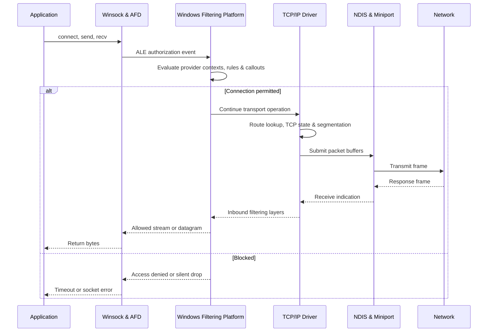

# 🪟 Windows Networking Internals

> [!abstract] Note of [[Windows]]
> Windows networking spans application APIs, the Ancillary Function Driver, TCP/IP transport, Windows Filtering Platform, firewall policy, NDIS, adapters, and enterprise name-resolution services. This note traces packets through those layers and turns the path into a troubleshooting and security model.

## Parent Learning Order
Windows Architecture & Kernel -> Windows Memory Internals & Exploit Mitigations -> Windows Drivers I-O & Kernel Debugging -> Windows Processes, Services & Boot -> Windows File System & Registry -> Windows Networking Internals -> Windows Security & Access Control -> Windows Identity, Credentials & Authentication -> Windows Active Directory & Domains -> Windows CLI: CMD & PowerShell -> Windows Logging & Auditing -> Windows Diagnostics, Crash Dumps & Performance -> Windows Sysinternals & Troubleshooting

## Start at Zero: From Name to Packet

An application usually starts with a **name** and a service intent, not a packet. Name resolution produces an address; routing selects an interface and next hop; a **socket** binds application state to a transport endpoint; TCP or UDP forms transport units; IP carries them between networks; and an adapter emits frames on a link. Windows inserts authorization and filtering at several layers. Distinguish a **listening endpoint** from an established connection, an **interface** from an IP address, and a **route** from a DNS answer—the same word “network problem” can describe failure at any of those boundaries.

## The Windows Network Stack

Applications usually begin with Winsock. A socket call enters `ws2_32.dll`, reaches the kernel through the Ancillary Function Driver for Winsock, and is handled by the TCP/IP driver. Transport protocols construct segments or datagrams, route lookup selects an interface and next hop, and NDIS connects protocol drivers to miniport drivers representing physical or virtual adapters. Virtual switches, VPNs, containers, Hyper-V, and packet-capture filters add layers but preserve the conceptual flow.



TCP maintains a state machine per connection: `SYN-SENT`, `SYN-RECEIVED`, `ESTABLISHED`, FIN states, and `TIME-WAIT`. Windows exposes endpoints through `Get-NetTCPConnection`, `netstat`, and IP Helper APIs. UDP has no handshake and therefore cannot prove remote reachability merely because a local endpoint exists. ICMP reports network errors and diagnostics; blocking all ICMP can interfere with path MTU discovery and make connectivity failures mysterious.

The routing table uses longest-prefix match, then metric. Host routes beat subnet routes, which beat the default route. Interface metrics combine automatic and configured costs. Neighbor Discovery resolves IPv6 next hops; ARP resolves IPv4 neighbors. DNS selects names, while the DNS Client service provides cache and policy behavior. Enterprise Windows may also encounter LLMNR, NetBIOS name service, and mDNS; unnecessary fallback protocols expand spoofing and credential-relay exposure.

```powershell
Get-NetIPConfiguration
Get-NetRoute -AddressFamily IPv4 | Sort-Object DestinationPrefix,RouteMetric
Get-NetTCPConnection -State Listen | Sort-Object LocalPort |
  Select-Object LocalAddress,LocalPort,OwningProcess
Get-DnsClientCache | Select-Object -First 5 Entry,RecordName,RecordType,Data
```

Expected excerpt:

```text
LocalAddress LocalPort OwningProcess
------------ --------- -------------
0.0.0.0             135           980
0.0.0.0             445             4
127.0.0.1          5985          1280
```

Listening on `0.0.0.0` exposes a service on every IPv4 interface unless filtering prevents reachability. A loopback-only listener is locally reachable but not remotely exposed.

## Windows Filtering Platform & Firewall

Windows Filtering Platform provides filtering layers from IP packet processing through transport and application-layer enforcement. Base Filtering Engine stores and arbitrates policy. Providers contribute filters; sublayers establish ordering; callouts permit advanced inspection or modification. Application Layer Enforcement layers can authorize connections using executable identity, package identity, user, service, protocol, address, and port—not merely a five-tuple.

Windows Defender Firewall is a policy consumer of WFP. Profiles—Domain, Private, and Public—allow different rule sets based on network categorization. Inbound traffic is normally blocked unless permitted; outbound behavior is often permissive in default enterprise deployments but can be constrained. Rule precedence is more nuanced than “first match”: explicit block rules generally dominate conflicting allow rules, and policy sources can include local, Group Policy, mobile-device management, and service-hardening rules.

```powershell
Get-NetConnectionProfile
Get-NetFirewallProfile | Select-Object Name,Enabled,DefaultInboundAction,DefaultOutboundAction
Get-NetFirewallRule -Enabled True -Direction Inbound |
  Where-Object Action -eq Allow | Select-Object -First 10 DisplayName,Profile
```

Expected output:

```text
Name    Enabled DefaultInboundAction DefaultOutboundAction
----    ------- -------------------- ---------------------
Domain     True                Block                 Allow
Private    True                Block                 Allow
Public     True                Block                 Allow
```

Firewall logging can record dropped packets and successful connections. WFP auditing can emit Security events such as 5156 for permitted connections and 5157 for blocked connections when the relevant audit subcategories are enabled. High-volume auditing must be filtered and centralized carefully.

## Enterprise Protocols

SMB uses TCP 445 for file, printer, and named-pipe access. Modern SMB negotiates dialect and capabilities, establishes a session authenticated by Kerberos or NTLM, connects to a share, and opens file or pipe objects. SMB signing protects message integrity; encryption protects confidentiality for supported dialects. Disabling obsolete SMBv1 removes a historically dangerous parser and negotiation surface.

RPC uses endpoint mapping on TCP 135 and usually allocates dynamic server ports. Blocking only 135 does not fully model RPC reachability, while allowing all high ports broadly creates unnecessary exposure. WinRM uses HTTP or HTTPS transports, typically 5985 and 5986, but its security comes from authentication, message protection, authorization, and endpoint configuration rather than assuming HTTPS alone solves identity.

Domain environments rely on DNS records for controllers, Kerberos, LDAP, and global catalogs. Time synchronization is a security dependency because Kerberos rejects excessive clock skew. Network troubleshooting therefore includes name resolution, route selection, firewall state, TCP handshake, authentication negotiation, service authorization, and application protocol—not simply “ping works.”

## Packet Path Diagnostics

Use `Test-NetConnection` for a bounded reachability check, `Resolve-DnsName` for resolver behavior, `Get-NetNeighbor` for link-layer state, and `pktmon` or `netsh trace` for packet and component evidence. A TCP reset means a host actively rejected or closed a connection; repeated SYN retransmissions suggest silent loss, filtering, or an unreachable path. An established TCP connection followed by an application error proves the problem is above transport.

```powershell
Test-NetConnection server01.corp.example -Port 445 -InformationLevel Detailed
Resolve-DnsName _ldap._tcp.dc._msdcs.corp.example -Type SRV
Get-NetNeighbor -AddressFamily IPv4 | Where-Object State -ne Unreachable
```

Expected excerpt:

```text
ComputerName     : server01.corp.example
RemoteAddress    : 10.20.30.40
RemotePort       : 445
InterfaceAlias   : Ethernet
SourceAddress    : 10.20.30.25
TcpTestSucceeded : True
```

## NRPT, QUIC & Modern Name-to-Transport Policy

The **Name Resolution Policy Table (NRPT)** applies namespace-specific rules before ordinary DNS resolution completes. Enterprises use it for DirectAccess, DNSSEC requirements, and split-name behavior. A host may therefore resolve the same suffix differently depending on policy, tunnel state, interface, or corporate connectivity. Inspect policy and resolver evidence before blaming the DNS server:

```powershell
Get-DnsClientNrptPolicy -Effective
Resolve-DnsName app.corp.example -DnsOnly
Get-NetRoute -AddressFamily IPv6
```

Modern Windows also carries HTTP/3 over **QUIC**, which runs encrypted streams over UDP—commonly port 443—rather than TCP. QUIC combines transport security and multiplexing, handles stream loss without TCP head-of-line blocking, and supports connection migration through connection IDs. Consequently, a browser session may continue across address changes, and a TCP-only capture or firewall rule can miss the actual transport. Validation requires endpoint ownership, UDP flow evidence, TLS/QUIC negotiation context, and policy at the appropriate Windows Filtering Platform layers.

```powershell
Get-NetUDPEndpoint | Sort-Object LocalPort
pktmon filter add -p 443
pktmon start --etw -m real-time
```

The operational lesson is not that UDP/443 is suspicious; it is that name policy, route policy, filtering layer, and application protocol must be tested as one path.

## Cybersecurity Implications

Attack surface is the combination of listener, reachable interface, routing, filtering, protocol configuration, authentication, and authorization. A service bound globally but blocked by a host firewall is not externally reachable today, yet a later policy change can expose it. A firewall permit does not imply the application safely parses input. A secure assessment records every layer so remediation targets the actual boundary.

Network telemetry supports both detection and root-cause analysis. Correlating process identity with destination, DNS query, user session, firewall decision, and packet capture distinguishes an approved management connection from unexpected beaconing. WFP callout drivers and endpoint filters are themselves privileged software; bugs or incompatible ordering can cause outages or security bypasses. Operational baselines should include expected listeners, remote-management paths, DNS servers, routes, profiles, and policy sources.

## Authorized Lab: Trace One Connection

1. On an isolated Windows VM, start a loopback listener using a benign local test server.
2. Record the listener with `Get-NetTCPConnection -State Listen` and map its owning PID.
3. Test it with `Test-NetConnection localhost -Port <port>` and observe `ESTABLISHED` plus `TIME-WAIT` states.
4. Add a narrowly scoped temporary firewall block rule for that executable or port, repeat the test, and record the changed result.
5. Inspect firewall policy source and capture a trace with `pktmon start --capture --pkt-size 0`, reproduce once, then stop and format the trace.
6. Remove only the lab rule and verify the original state returns.

Expected interpretation:

```text
Before rule: TCP handshake completes -> application responds
During rule: WFP denies -> client times out or receives access failure
After removal: handshake completes again
```

## Crook → Operator → Root Checkpoint

- **Crook:** Explain sockets, listeners, routes, DNS, TCP state, and host-firewall profiles.
- **Operator:** Trace a connection through Winsock, AFD, WFP, TCP/IP, NDIS, and the adapter; distinguish DNS, routing, filtering, transport, authentication, and application failures.
- **Root:** Design least-privilege enterprise network policy, validate WFP decisions with packet and process evidence, harden SMB/RPC/WinRM/name resolution, and diagnose failures without disabling security controls globally.

### IPv6, IPsec & Virtual Networking

IPv6 is a first-class Windows protocol, not an optional curiosity. Link-local addresses, router advertisements, Neighbor Discovery, temporary addresses, DNS AAAA records, and transition mechanisms can produce paths that an IPv4-only review misses. Disabling IPv6 without understanding domain and platform dependencies is unsupported in many scenarios; govern it with equivalent routes, firewall policy, monitoring, and name resolution.

Windows IPsec integrates with WFP to authenticate and protect IP traffic. Connection Security Rules negotiate security associations through IKE or AuthIP, then apply integrity or encryption. IPsec policy is distinct from an ordinary permit rule: a packet may match routing and firewall policy yet fail because peer authentication, certificate trust, proposal suites, or identity policy disagree.

Hyper-V virtual switches connect virtual NICs to internal, private, or external networks. Extensions can filter, capture, or forward frames. Container networking adds namespaces, host-network service policy, NAT, overlays, and virtual endpoints. Troubleshooting must identify the network compartment and virtual switch rather than assume every endpoint belongs to the default host stack.

```powershell
Get-NetIPConfiguration -AllCompartments
Get-NetIPsecMainModeSA
Get-VMSwitch -ErrorAction SilentlyContinue | Select-Object Name,SwitchType
```

Expected interpretation:

```text
Compartment 1: host management interfaces
Additional compartment: container or isolated network stack
Main-mode SA present: authenticated IPsec peer and negotiated cryptographic suite
External vSwitch: VM traffic can reach the physical network through bound adapter
```

Root-level troubleshooting correlates every result with its owning process, compartment, policy source, route, and packet path.

---
> 🔼 Up: [[Windows]]
