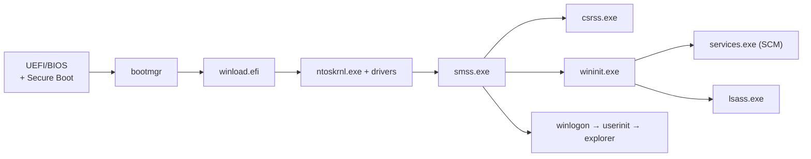

# 🪟 Windows Processes, Services & Boot

> [!abstract] Note of [[Windows]]
> From power-on to a running desktop, Windows builds a chain of trust and a tree of processes. Knowing that chain tells you where persistence hides, which parent-child relationships are normal, and why a `winword.exe → powershell.exe` is a red flag.

## Parent Learning Order
Windows Architecture & Kernel -> Windows Memory Internals & Exploit Mitigations -> Windows Drivers I-O & Kernel Debugging -> Windows Processes, Services & Boot -> Windows File System & Registry -> Windows Networking Internals -> Windows Security & Access Control -> Windows Identity, Credentials & Authentication -> Windows Active Directory & Domains -> Windows CLI: CMD & PowerShell -> Windows Logging & Auditing -> Windows Diagnostics, Crash Dumps & Performance -> Windows Sysinternals & Troubleshooting

## Start at Zero: Boot Chain, Process & Service

The **boot chain** is the ordered handoff from firmware to boot manager, loader, kernel, and first user-mode processes. A **process** owns an address space, handles, identity token, and other resources; a **thread** is what the scheduler actually executes. A **service** is a long-lived workload managed by the Service Control Manager, not a special kind of executable. A **scheduled task** is a trigger-plus-action definition. Parent-child process relationships record creation, but they do not by themselves prove trust—each stage must also be evaluated by image path, signer, token, session, command line, and timing.

## The boot process

- **UEFI + Secure Boot** verifies the bootloader signature (defeats bootkits).
- `bootmgr` → `winload` loads the kernel + boot drivers → `ntoskrnl` initialises the Executive.
- **`smss.exe`** (Session Manager) spawns `csrss` and `wininit`; `wininit` starts **`services.exe`** (the SCM) and **`lsass.exe`**.
- A healthy tree: `System(4) → smss → wininit → services → svchost`. Deviations are IOCs.

## Services & the SCM
The **Service Control Manager** (`services.exe`) launches background services, many hosted in shared **`svchost.exe`** groups. Each service has an `ImagePath`, a start type, and a **run-as account** (often `SYSTEM`).
```cmd
sc query type=service state=all
sc qc <svc>                        :: config: binary path + account
tasklist /svc                      :: which services run in which PID
```
> [!warning] Classic service privesc (authorized)
> **Unquoted service paths** (`C:\Program Files\My App\svc.exe` without quotes) let a planted `C:\Program.exe` run as SYSTEM. **Weak service permissions** (`sc config` writable by a low-priv user) let you swap the binary. Enumerate with `accesschk.exe -uwcqv "Users" *`.

## Task Scheduler
Scheduled tasks (`\Windows\System32\Tasks\*.xml`) run code on triggers as any account — a top persistence and privesc vector:
```powershell
Get-ScheduledTask | Where-Object State -eq 'Ready' | Select TaskName, TaskPath
schtasks /create /tn Updater /tr C:\payload.exe /sc onlogon /ru SYSTEM   :: (authorized lab)
```

## Threads, DLLs and hijacking
A **process** is a container (address space + handles + token); **threads** are the units the scheduler runs. Processes load code from **DLLs**.
- **DLL search order:** an app that loads a DLL by name (not full path) searches the app dir first — drop a malicious DLL there for **DLL hijacking / proxying**.
- **DLL injection / `LoadLibrary` + `CreateRemoteThread`**, and **reflective loading** are how implants run inside a trusted process.
```powershell
Get-Process notepad | Select-Object -Expand Modules | Select ModuleName, FileName
```

> [!tip] Crook → Root / Blue-team
> **Root** reads the process tree like a sentence and knows which service accounts, unquoted paths, and DLL search dirs convert a foothold to SYSTEM. **Defenders** baseline the normal boot tree and alert on parent-child anomalies and new services/tasks (see **Windows Logging and Auditing**).

## Firmware, BCD & Trusted Boot

On UEFI systems, firmware selects Windows Boot Manager from the EFI System Partition. Secure Boot verifies signatures against firmware trust databases before executing boot components. Boot Manager reads the Boot Configuration Data store, selects an entry, and invokes `winload.efi` for normal startup or `winresume.efi` for hibernation resume. BCD settings control loader path, kernel options, recovery, hypervisor launch, debugging, and integrity behavior; careless changes can weaken security or make the machine unbootable.

The loader prepares page tables, loads the kernel, HAL, boot-start drivers, registry SYSTEM hive, and boot parameters. The kernel initializes processor and executive subsystems, mounts the system volume, starts later driver groups, and creates the System process plus first user-mode Session Manager. Measured Boot extends component measurements into the TPM so attestation can evaluate boot integrity rather than merely trust a self-report.

```cmd
bcdedit /enum {current}
```

Expected excerpt:

```text
Windows Boot Loader
-------------------
identifier              {current}
path                    \Windows\system32\winload.efi
systemroot              \Windows
nx                      OptIn
bootmenupolicy          Standard
```

Treat BCD as sensitive configuration. Inventory is safe; modification belongs in a recovery-tested lab with BitLocker keys available.

## Session Creation & Canonical Process Trees

`smss.exe` initializes session-specific state, creates pagefiles according to configuration, processes pending file-renames, and starts subsystem processes. The initial system session launches `csrss.exe` and `wininit.exe`; interactive sessions receive their own `csrss.exe` and `winlogon.exe`. `wininit.exe` starts services, Local Security Authority, and local session management. `winlogon.exe` coordinates secure attention, credential-provider interaction, profile startup, and the user shell.

Canonical parentage is a strong hypothesis but not a complete detector. Parent identifiers can be influenced through supported process-creation attributes, processes can exit before analysis, and modern Windows isolates services or applications in specialized hosts. Verify image path, signer, command line, token, session, creation time, and process-start telemetry together.

```powershell
Get-CimInstance Win32_Process |
  Select-Object ProcessId,ParentProcessId,Name,ExecutablePath |
  Sort-Object ParentProcessId,ProcessId
```

Expected relationships include:

```text
System -> smss.exe
smss.exe -> wininit.exe
wininit.exe -> services.exe
wininit.exe -> lsass.exe
services.exe -> svchost.exe
winlogon.exe -> userinit.exe -> explorer.exe
```

## Process & Thread Lifecycle

Process creation combines an executable section, virtual address space, handle table, primary token, process parameters, initial thread, and notifications to registered subsystems. The loader maps the executable and dependent DLLs, applies relocations, resolves imports, initializes thread-local storage, calls initialization routines, and eventually reaches the program entry point. A process can exist while no thread is actively running; threads are the scheduler's executable units.

Threads transition among running, ready, waiting, transition, and terminated states. Wait reasons explain whether a thread is sleeping for I/O, synchronization, executive work, or user input. Jobs group processes for limits and lifecycle control. Services and application sandboxes use jobs to constrain memory, CPU, process creation, and termination behavior.

DLL loading is security-sensitive because search paths, side-by-side assemblies, KnownDLLs, API sets, manifests, and package identity affect resolution. Safe loading specifies trusted absolute paths where possible, uses modern search flags, removes writable directories from search order, and verifies signature or content when the trust model requires it. A `NAME NOT FOUND` event is merely a failed lookup, not proof that placing a DLL there will produce execution; architecture, exports, load context, and permissions still matter.

## Service Architecture

The Service Control Manager database is stored beneath the system services Registry key. Each service has type, start mode, error control, binary path, dependencies, account, privileges, failure actions, and security descriptor. Own-process services receive a dedicated process; share-process services run in `svchost.exe` groups. Service isolation can specify a service SID, restricted token, required privileges, network restrictions, and protected-service characteristics.

```powershell
Get-CimInstance Win32_Service |
  Select-Object Name,State,StartMode,StartName,PathName |
  Sort-Object Name
sc.exe sdshow EventLog
```

Expected service-security output begins with SDDL:

```text
D:(A;;CCLCSWRPWPDTLOCRRC;;;SY)(A;;CCDCLCSWRPWPDTLOCRSDRCWDWO;;;BA)...
```

Assess service risk by combining writable binary or directory, modifiable configuration, start rights, restart ability, account privilege, quoting, environment expansion, and recovery behavior. An unquoted path is exploitable only when a candidate path is writable and resolution reaches it before the legitimate binary.

## Tasks, Startup Extension Points & Recovery

Task Scheduler stores task definitions and metadata, evaluates calendar and event triggers, applies principals and conditions, and launches actions through its service. Security analysis covers task ACL, author, run-as identity, logon type, action path, working directory, arguments, and whether referenced scripts or directories are writable.

Other startup paths include Run keys, Startup folders, Winlogon values, service DLLs, shell extensions, WMI subscriptions, and application-specific plug-ins. Their mere presence is not malicious; provenance and authorization matter. Recovery components such as Windows Recovery Environment, Last Known Good-style control-set selection, Safe Mode, servicing stack, and automatic repair are part of operational resilience and must remain tested under BitLocker and Secure Boot policies.

```powershell
Get-ScheduledTask | ForEach-Object {
  [pscustomobject]@{
    Path=$_.TaskPath; Name=$_.TaskName; User=$_.Principal.UserId
    Actions=($_.Actions.Execute -join ';')
  }
} | Select-Object -First 10
```

## Cybersecurity Implications

Persistence and privilege escalation exploit transitions where privileged components resolve mutable configuration or code. The durable fix is least-writable paths, restricted service and task ACLs, service SIDs, minimal privileges, signed code policy, protected boot configuration, safe DLL loading, and auditable administrative workflows. Merely deleting one suspicious service without correcting the authorization path invites recurrence.

Boot and process-tree evidence also supports incident reconstruction. Events 12 and 13 from the Kernel-General provider mark startup and shutdown context; 4688 records process creation when enabled; System event 7045 records service installation; Security event 4698 records scheduled-task creation under suitable auditing. ETW and endpoint telemetry can add parent, signer, hashes, token, stack, and lifetime.

## Authorized Lab: Build a Boot-to-Desktop Timeline

1. Snapshot an isolated Windows VM and record BCD with `bcdedit /enum {current}`.
2. Reboot once, then export startup-related System events with `Get-WinEvent`.
3. Capture the canonical process tree and service inventory after logon.
4. Create a benign scheduled task running `cmd.exe /c echo C2R-LAB>%TEMP%\c2r-task.txt` as your own user, trigger it, verify output, and delete the task.
5. Correlate the task definition, process creation, parentage, file output, and event timestamps.
6. Inspect one service's SDDL and identify which principals can query, start, stop, or change it.

Expected artifact:

```text
C:\Users\Analyst\AppData\Local\Temp\c2r-task.txt
C2R-LAB
```

## Crook → Operator → Root Checkpoint

- **Crook:** Recite firmware-to-desktop boot order and distinguish process, thread, service, task, and DLL.
- **Operator:** Interpret BCD, process lineage, service configuration/SDDL, task principals, loader search behavior, and startup evidence.
- **Root:** Reconstruct a trusted-boot and execution timeline, identify a mutable privileged dependency, prove reachability safely, and harden the exact ACL, loading rule, service identity, or boot policy that caused exposure.

---
> 🔼 Up: [[Windows]]
