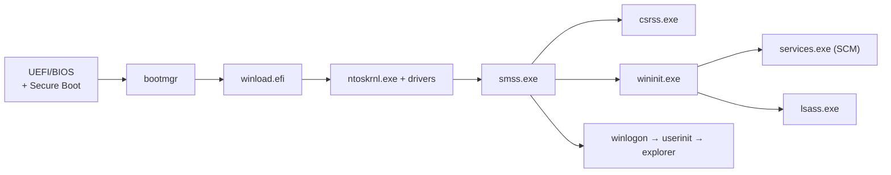

# 🪟 Windows Processes, Services and Boot

> [!abstract] Note of [[Windows]]
> From power-on to a running desktop, Windows builds a chain of trust and a tree of processes. Knowing that chain tells you where persistence hides, which parent-child relationships are normal, and why a `winword.exe → powershell.exe` is a red flag.

## The boot process

- **UEFI + Secure Boot** verifies the bootloader signature (defeats bootkits).
- `bootmgr` → `winload` loads the kernel + boot drivers → `ntoskrnl` initialises the Executive.
- **`smss.exe`** (Session Manager) spawns `csrss` and `wininit`; `wininit` starts **`services.exe`** (the SCM) and **`lsass.exe`**.
- A healthy tree: `System(4) → smss → wininit → services → svchost`. Deviations are IOCs.

## Services & the SCM
The **Service Control Manager** (`services.exe`) launches background services, many hosted in shared **`svchost.exe`** groups. Each service has an `ImagePath`, a start type, and a **run-as account** (often `SYSTEM`).
```cmd
sc query type=service state=all
sc qc <svc>                        :: config: binary path + account
tasklist /svc                      :: which services run in which PID
```
> [!warning] Classic service privesc (authorized)
> **Unquoted service paths** (`C:\Program Files\My App\svc.exe` without quotes) let a planted `C:\Program.exe` run as SYSTEM. **Weak service permissions** (`sc config` writable by a low-priv user) let you swap the binary. Enumerate with `accesschk.exe -uwcqv "Users" *`.

## Task Scheduler
Scheduled tasks (`\Windows\System32\Tasks\*.xml`) run code on triggers as any account — a top persistence and privesc vector:
```powershell
Get-ScheduledTask | Where-Object State -eq 'Ready' | Select TaskName, TaskPath
schtasks /create /tn Updater /tr C:\payload.exe /sc onlogon /ru SYSTEM   :: (authorized lab)
```

## Threads, DLLs and hijacking
A **process** is a container (address space + handles + token); **threads** are the units the scheduler runs. Processes load code from **DLLs**.
- **DLL search order:** an app that loads a DLL by name (not full path) searches the app dir first — drop a malicious DLL there for **DLL hijacking / proxying**.
- **DLL injection / `LoadLibrary` + `CreateRemoteThread`**, and **reflective loading** are how implants run inside a trusted process.
```powershell
Get-Process notepad | Select-Object -Expand Modules | Select ModuleName, FileName
```

> [!tip] Crook → Root / Blue-team
> **Root** reads the process tree like a sentence and knows which service accounts, unquoted paths, and DLL search dirs convert a foothold to SYSTEM. **Defenders** baseline the normal boot tree and alert on parent-child anomalies and new services/tasks (see **Windows Logging and Auditing**).

---
> 🔼 Up: [[Windows]]
