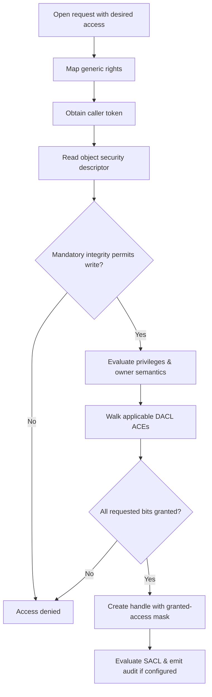

# 🪟 Windows Security & Access Control

> [!abstract] Note of [[Windows]]
> Every access decision on Windows comes down to a **token** meeting a **security descriptor**. Master this model and privilege escalation stops being magic — it becomes "which token do I need, and how do I get it?"

> [!warning] Authorized simulation only
> Credential-access and token techniques below are for sanctioned engagements/labs, paired with their detections.

## Parent Learning Order
Windows Architecture & Kernel -> Windows Memory Internals & Exploit Mitigations -> Windows Drivers I-O & Kernel Debugging -> Windows Processes, Services & Boot -> Windows File System & Registry -> Windows Networking Internals -> Windows Security & Access Control -> Windows Identity, Credentials & Authentication -> Windows Active Directory & Domains -> Windows CLI: CMD & PowerShell -> Windows Logging & Auditing -> Windows Diagnostics, Crash Dumps & Performance -> Windows Sysinternals & Troubleshooting

## Start at Zero: Who, What & Which Operation

Windows access control answers a three-part question: which **subject** is requesting which **operation** on which **object**? The subject is represented by a token containing SIDs, privileges, integrity state, and restrictions. The object carries a security descriptor containing owner, control flags, and access-control lists. An **ACE** is one rule inside an ACL; a **right** is permission defined by the object type; a **privilege** is system-wide authority held in a token. Rights and privileges are not interchangeable, and authentication alone grants neither.

## The players
- **LSA / `lsass.exe`:** the Local Security Authority — validates logons, stores secrets, and holds credential material in memory. The #1 credential-theft target.
- **SAM:** local account database (NTLM hashes).
- **SIDs:** every principal is a **Security Identifier**, e.g. `S-1-5-21-…-500` (the built-in Administrator RID **500**; Domain Admins **512**).

## Access tokens
When you log on, LSA builds an **access token** attached to your processes, containing your SID, group SIDs, **privileges**, and **integrity level**. Access checks compare the token against an object's **DACL** (list of ACEs).
- **Primary token** (the process identity) vs **impersonation token** (a thread acting as another principal) — impersonation is the heart of many escalations.
```cmd
whoami /priv        :: your privileges
whoami /groups      :: group SIDs + integrity level
```

## Privileges (`SeXxxPrivilege`) — the escalation keys
| Privilege | Why it's dangerous |
| --- | --- |
| **SeImpersonatePrivilege** | held by service accounts → **Potato** attacks impersonate SYSTEM |
| **SeDebugPrivilege** | open *any* process → read LSASS memory, inject |
| **SeBackupPrivilege** | read any file (bypass DACL) → copy SAM/SYSTEM |
| **SeTakeOwnership / SeRestore** | seize/replace protected objects |
```text
# Authorized lab: a service account with SeImpersonate → SYSTEM via a "Potato"
PrintSpoofer.exe -i -c cmd        # abuses SeImpersonate to spawn SYSTEM shell
```
Credential material is pulled from LSASS (`mimikatz sekurlsa::logonpasswords`, or `comsvcs.dll MiniDump`) — **detection:** handle opens to `lsass.exe`, protected by **Credential Guard / PPL / RunAsPPL**.

## Integrity levels
Processes run at an **integrity level**: Low → Medium (normal user) → High (elevated admin) → System. A Medium process can't write to a High object even as the same user — this underpins UAC and sandboxing.

## UAC
UAC splits an admin logon into **two tokens**: a filtered Medium token for normal use and a full High token available only after an **elevation** consent. UAC is a convenience boundary, not a security one — **bypasses** abuse auto-elevating binaries and hijacked registry keys (e.g. `fodhelper.exe`). **Defense:** set UAC to "Always Notify", monitor auto-elevation abuse.

> [!tip] Crook → Root
> **Crook** clicks "Run as administrator". **Root** reads `whoami /priv`, spots `SeImpersonate` or `SeDebug`, and turns a service account into SYSTEM — while the defender who understands tokens has already alarmed on the LSASS handle.

## Security Reference Monitor & Access Checks

The Security Reference Monitor in kernel mode enforces object-access decisions. An object security descriptor contains owner and primary group SIDs, a discretionary ACL, a system ACL, and control flags. The DACL determines permitted or denied access. The SACL selects security auditing and can carry mandatory integrity labels. A null DACL grants broad access; an empty DACL grants none—an essential distinction.

Each Access Control Entry has a type, flags, mask, and trustee SID. Explicit deny, explicit allow, inherited deny, and inherited allow entries have canonical ordering expectations. Object-specific ACEs can limit rights to properties or child object classes. Inheritance flags determine whether containers propagate ACEs to files, subcontainers, or both. Protected ACLs stop inheritance. Owners can normally rewrite a DACL even without an ordinary write-DACL ACE, which makes ownership a security-relevant privilege.



Generic rights such as read, write, execute, and all are mapped differently by each object type. A process's `PROCESS_VM_WRITE` and a file's `FILE_WRITE_DATA` are not interchangeable despite both looking like “write.” Handles retain the access granted at open time; later ACL changes do not necessarily revoke already-open handles.

## SDDL From Syntax to Meaning

Security Descriptor Definition Language serializes owner, group, DACL, and SACL. `O:` defines owner, `G:` group, `D:` DACL, and `S:` SACL. An ACE such as `(A;;FA;;;SY)` means allow file-all access to Local System. Abbreviations like `BA`, `BU`, `AU`, `WD`, and `SY` represent common SIDs. Rights abbreviations depend on object type, so decode with context.

```cmd
icacls C:\Lab
sc.exe sdshow EventLog
```

Expected file output:

```text
C:\Lab NT AUTHORITY\SYSTEM:(OI)(CI)(F)
       BUILTIN\Administrators:(OI)(CI)(F)
       BUILTIN\Users:(OI)(CI)(RX)
Successfully processed 1 files; Failed processing 0 files
```

`OI` and `CI` propagate to files and subdirectories; `F` is full control and `RX` read plus execute. Always inspect inherited and explicit origin before editing production ACLs.

## Token Construction & Impersonation

LSA creates a logon session after authentication and assembles group membership, privileges, claims, and policy into a token. The token also records authentication ID, token type, impersonation level, session, default DACL, integrity label, elevation state, and restrictions. Group SIDs can be enabled, deny-only, mandatory, or disabled. A group visible in `whoami /groups` does not necessarily grant allow rights.

Primary tokens define process identity. Impersonation tokens let individual threads temporarily adopt client security context. Levels range from anonymous through identification and impersonation to delegation. A server should impersonate only around the operation requiring client authorization, revert reliably, and never trust a client-controlled path after reverting.

Restricted tokens remove privileges or convert SIDs to deny-only. AppContainer tokens add capability SIDs and strong isolation. Service SIDs identify individual services even when several share a host process. Jobs, silos, package identity, and lowbox objects provide additional containment dimensions beyond a simple user SID.

```powershell
whoami /all
Get-Process -Id $PID -IncludeUserName | Select-Object Id,UserName,Path
```

Expected token clues:

```text
Mandatory Label\Medium Mandatory Level     Label  S-1-16-8192
BUILTIN\Administrators                     Group  Deny only
SeChangeNotifyPrivilege                    Enabled
```

An administrator SID marked deny-only demonstrates the filtered UAC token.

## UAC, Integrity & Privileges

Mandatory Integrity Control applies a “no write up” policy by default. Low-integrity content cannot write to medium-integrity objects even if a permissive DACL would otherwise allow it. UAC Admin Approval Mode gives administrators a filtered token for routine work and an elevated token after consent or credential approval. It reduces accidental elevation but does not turn two tokens for one administrator into separate security identities.

Privileges authorize system-wide operations that do not fit ordinary object ACLs. `SeBackupPrivilege` and `SeRestorePrivilege` support backup semantics; `SeDebugPrivilege` can bypass many process DACL limits; `SeImpersonatePrivilege` permits certain server impersonation paths; `SeLoadDriverPrivilege`, `SeTakeOwnershipPrivilege`, and `SeTcbPrivilege` are especially sensitive. Privilege presence, enabled state, operation semantics, and target protection all matter. A named privilege is not automatically an exploit.

Protected Process Light restricts which signers can open or inject into protected processes. LSA protection uses this model for LSASS. VBS and Credential Guard move selected secrets behind a virtualization boundary. HVCI enforces kernel code integrity. These controls address different layers and should be combined with least privilege rather than viewed as substitutes.

## Secure Design Patterns

Services should create securable objects with explicit descriptors, avoid world-writable namespaces, validate impersonation level, and authorize each operation after canonicalizing object identity. Named pipes and RPC endpoints need ACLs plus message-level authorization. Temporary files require unpredictable names, safe creation flags, restricted directories, and reparse-point defenses. Administrative interfaces need explicit operator groups rather than broad `Authenticated Users` access.

Access-control review asks four questions: who can obtain a handle, what exact access mask is granted, what privileged operation becomes reachable, and can the object identity change between check and use? This turns vague “permission issue” findings into auditable causal chains.

## AuthZ, MIC & Compound Access Decisions

The kernel **Security Reference Monitor** performs core access checks, while user-mode components can use the **AuthZ** API to evaluate access for applications and policy engines. A conventional discretionary check maps generic rights, evaluates mandatory policy, processes deny and allow ACEs against enabled token SIDs, considers privileges where the object manager defines them, and returns granted access. The exact algorithm depends on object type, requested access mask, inheritance, callback or conditional ACEs, restricted SIDs, capabilities, and whether the caller is opening a new handle or using rights already granted to an existing one.

**Mandatory Integrity Control (MIC)** is a second policy layer. Objects may carry a mandatory label in the SACL. The default “no write up” policy can prevent a medium-integrity subject from modifying a high-integrity object even when the DACL appears permissive. AppContainer capabilities, restricted tokens, service SIDs, and access-check callbacks add further constraints.

```cmd
whoami /groups
icacls C:\ProgramData\C2R-Lab
sc sdshow C2RSample
```

```text
Mandatory Label\Medium Mandatory Level  Label  S-1-16-8192
C:\ProgramData\C2R-Lab BUILTIN\Users:(RX)
```

Expert troubleshooting asks which token was effective on the thread, which access mask was requested, which object type interpreted it, and which policy layer denied it. “The user is an administrator” is not an access analysis.

## Cybersecurity Implications

Privilege escalation usually exploits one of four conditions: an overpowered token, a permissive object descriptor, confused impersonation, or mutable privileged configuration. The corrective control belongs at that exact condition. Removing a payload without correcting a writable service ACL, named-pipe authorization flaw, or delegated group right does not remediate the vulnerability.

Security events 4672, 4673, and 4674 can illuminate privileged logons and sensitive privilege use; 4656 and 4663 can audit object access when SACLs are configured; 4688 records process creation. Excessive object auditing can overwhelm systems, so protect high-value objects and correlate subject SID, logon ID, process, requested rights, result, and downstream effect.

## Authorized Lab: Prove an Access Decision

1. Create `C:\Lab\Access` in a disposable VM and record inherited ACLs with `icacls`.
2. Add a local lab user and grant that user read-only access to the folder.
3. Using `runas`, verify reading succeeds and creating a file fails.
4. Enable a narrowly scoped audit ACE for write attempts on the lab folder and reproduce one denied write.
5. Correlate the denied operation with Security log evidence, then remove the audit ACE, user, and folder.
6. Write the decision as token SIDs + integrity + requested mask + DACL walk + audit result.

Expected result:

```text
Read test.txt: SUCCESS
Create new.txt: Access is denied.
Security audit: subject lab SID requested write data; access denied
```

## Crook → Operator → Root Checkpoint

- **Crook:** Define SID, token, privilege, security descriptor, DACL, SACL, ACE, integrity level, and UAC.
- **Operator:** Decode SDDL, distinguish primary and impersonation tokens, calculate an access decision, inspect inheritance, and explain filtered versus elevated tokens.
- **Root:** Model an entire authorization boundary, identify handle or impersonation confusion, prove exploitability without destructive action, and redesign descriptors, privileges, service identities, isolation, and auditing as one coherent control system.

---
> 🔼 Up: [[Windows]]
