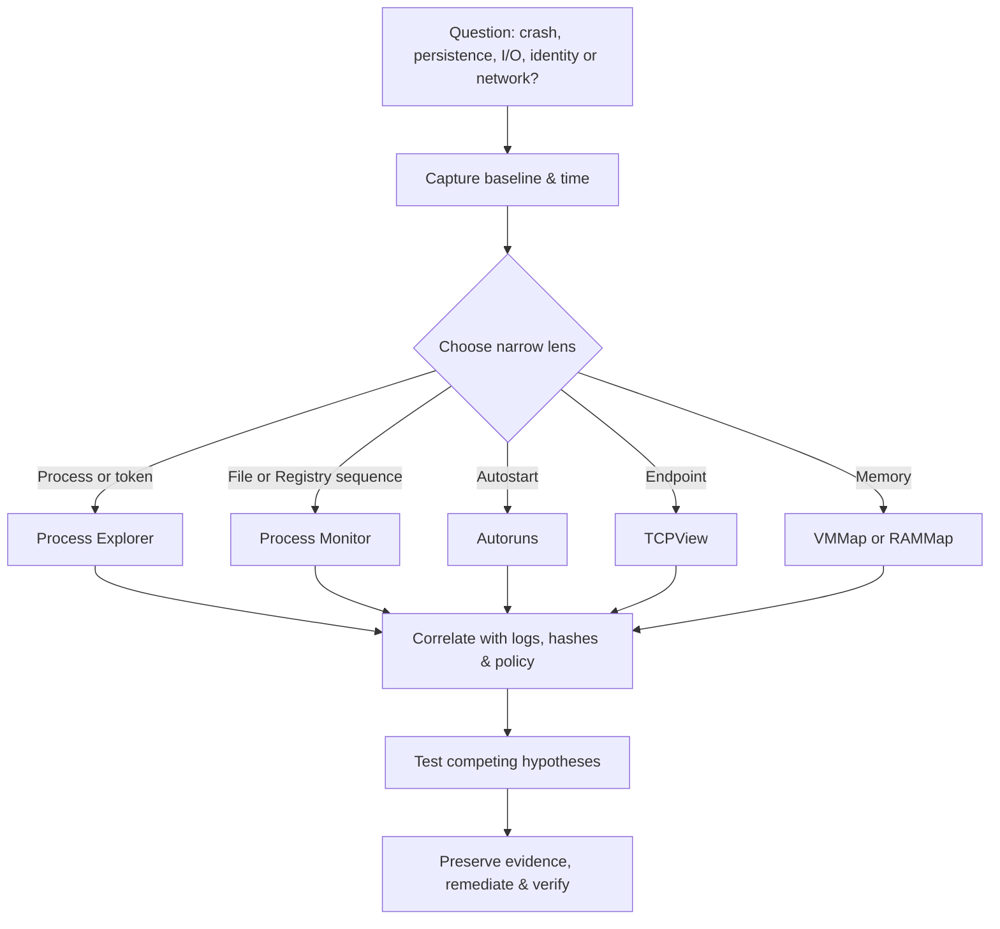

# 🪟 Windows Sysinternals & Troubleshooting

> [!abstract] Note of [[Windows]]
> The **Sysinternals Suite** (Mark Russinovich's tools, now Microsoft) is the deepest free window into a live Windows system. Incident responders, malware analysts, and admins all live in these tools — they surface what Task Manager hides.

## Parent Learning Order
Windows Architecture & Kernel -> Windows Memory Internals & Exploit Mitigations -> Windows Drivers I-O & Kernel Debugging -> Windows Processes, Services & Boot -> Windows File System & Registry -> Windows Networking Internals -> Windows Security & Access Control -> Windows Identity, Credentials & Authentication -> Windows Active Directory & Domains -> Windows CLI: CMD & PowerShell -> Windows Logging & Auditing -> Windows Diagnostics, Crash Dumps & Performance -> Windows Sysinternals & Troubleshooting

## Start at Zero: Observation Before Intervention

Troubleshooting is controlled hypothesis testing. Establish the symptom and time window, capture volatile evidence, form one falsifiable explanation, collect the narrowest evidence that can disprove it, and change one variable at a time. Sysinternals tools expose different object types: processes and handles, file and Registry operations, autostart configuration, endpoints, signatures, and memory maps. Their output is evidence—not a verdict. “Unsigned,” “remote,” or “unusual parent” raises a question; provenance, baseline, access context, and correlated timing answer it.

## The essential toolkit
| Tool | What it does | Security use |
| --- | --- | --- |
| **Process Explorer** (`procexp`) | supercharged Task Manager — full process **tree**, DLLs/handles per process, VirusTotal column, signer verification | spot injected/unsigned processes, find who holds a locked file, verify parentage |
| **Process Monitor** (`procmon`) | real-time **file, registry, process, network** events with stack traces | trace malware behaviour, find DLL-hijack search misses (`NAME NOT FOUND`), config issues |
| **Autoruns** | every **auto-start** location — Run keys, services, tasks, drivers, WMI, logon | hunt persistence; hide-Microsoft + VirusTotal to isolate suspicious entries |
| **TCPView** | live TCP/UDP endpoints with owning process | spot beacons/C2 and unexpected listeners |
| **PsExec** | run processes on remote hosts (SMB + a service) | admin remoting — **and** a classic lateral-movement tool (heavily monitored) |
| **Handle / ListDLLs** | enumerate open handles / loaded DLLs | find LSASS handle abuse, injected modules |
| **Sigcheck** | verify signatures + VirusTotal hash lookup | triage unknown binaries |
| **Sysmon** | persistent event logging (see **Windows Logging and Auditing**) | the telemetry backbone |
| **RAMMap / VMMap** | physical & per-process memory maps | find RWX regions, memory pressure |

## Investigation workflows
**"Is this box compromised?"**
```text
1. Process Explorer → sort by company/signer; flag unsigned + odd parents (e.g. services.exe → cmd)
2. Autoruns → Options: Hide Microsoft entries → scan the rest with VirusTotal
3. TCPView → any process talking to a weird IP/port?
4. Procmon → filter on the suspect PID → watch file/registry/network in real time
5. Strings/Sigcheck the suspect binary; submit hash
```
**"DLL hijack hunt":** run the app under **Procmon**, filter `Result is NAME NOT FOUND` + `Path ends with .dll` — every miss is a writable location where a planted DLL would load.

## Enterprise applicability
- **IR triage** on a suspect endpoint before pulling it off the network.
- **Malware analysis** in a lab (Procmon + Process Explorer + a network sniffer = behavioural analysis without a debugger).
- **Baseline & harden:** Autoruns exports a persistence baseline to diff against later.

> [!warning] Dual-use
> `PsExec` is admin gold *and* attacker gold — its use is a monitored event (service creation **7045**, `PSEXESVC`). Know that running it lights up the SIEM.

> [!tip] Crook → Root
> **Crook** opens Task Manager and gives up. **Root** runs Process Explorer + Procmon + Autoruns and reconstructs exactly what a binary did, where it persists, and who it talks to — the same skill whether you're hunting malware or checking your own implant's footprint.

## Evidence-First Live Response

Live troubleshooting changes the system. Launching a utility creates processes, modules, files, Registry reads, network traffic, page faults, and timestamps. An expert records time, host, user, tool version, command, output destination, and hashes before drawing conclusions. Use the least intrusive source that answers the question; preserve volatile evidence before remediation; and export results to a controlled location.

Sysinternals utilities expose supported and semi-internal Windows interfaces with consistent operational value, but they do not replace kernel debugging or forensic imaging. Process Explorer observes live process, token, handle, module, job, mitigation, and signature state. Procmon consumes event streams from a driver and presents high-volume activity. Autoruns enumerates known extensibility points. TCPView maps endpoints to processes. Each is a lens with collection limits.



## Process Explorer Deep Triage

Start with process tree, creation time, image path, verified signer, command line, user, integrity, parent, job, and VirusTotal status if organizational policy permits external hash lookup. A valid Microsoft signature proves publisher and file integrity relative to that signature, not benign runtime behavior. An unsigned binary can be legitimate internal software. Context matters.

The lower pane shows DLLs or handles. Modules reveal unexpected load paths, architecture, signer, and base addresses. Handles reveal access to files, Registry keys, events, sections, tokens, processes, and named pipes. Process properties expose DEP, ASLR, CFG, environment, TCP/IP, threads, stack samples, and security token. Thread start addresses and stacks can explain CPU use or unexpected execution, but symbol quality determines readability.

```text
procexp.exe /t
```

Expected investigation record:

```text
Image: powershell.exe
PID: 9048
Parent: explorer.exe (PID 3180)
User: CORP\analyst
Integrity: Medium
Verified Signer: Microsoft Windows
Command Line: powershell.exe -NoProfile
```

Do not terminate a process merely because its parent looks unusual. Capture properties, open network endpoints, loaded modules, handles, hashes, and associated events first unless immediate containment is required.

## Process Monitor Filter Engineering

Procmon events include time, process, PID, operation, path, result, detail, and optionally stack. Capturing everything quickly becomes unmanageable. Begin with a short unfiltered baseline, then filter by PID, path prefix, operation, or result. Excluding routine noise is useful, but save the filter and recognize that an exclusion can hide the cause.

`NAME NOT FOUND` is normal during search behavior. For DLL troubleshooting, establish the application's requested DLL name, search sequence, architecture, and writable path. For Registry troubleshooting, compare successful opens with access denied or not-found results and inspect WOW64 view. For performance, use duration and stack rather than raw event count.

```text
Recommended lab filters:
Process Name is c2rlab.exe             Include
Operation is CreateFile                Include
Operation is RegOpenKey                Include
Operation is Load Image                Include
Result is NAME NOT FOUND               Include
```

Expected sequence:

```text
c2rlab.exe  CreateFile  C:\Lab\config.json  NAME NOT FOUND
c2rlab.exe  RegOpenKey  HKCU\Software\C2RLab SUCCESS
c2rlab.exe  Load Image  C:\Windows\System32\kernel32.dll SUCCESS
```

Stacks identify which module requested an operation. Export PML to preserve full fidelity and CSV/XML for interoperability. Backing files can grow rapidly and contain sensitive paths or data, so choose storage and retention deliberately.

## Autoruns & Persistence Validation

Autoruns inventories logon entries, Explorer extensions, services, drivers, scheduled tasks, AppInit, image hijacks, Winsock providers, WMI, Office add-ins, codecs, boot execution, and more. “Hide Microsoft entries” reduces volume but can hide a compromised or replaced Microsoft-path artifact. Compare signed baseline to current state, inspect referenced path and arguments, verify publisher and hash, check ACLs, and correlate creation time with change records.

An orphaned entry, missing file, or unsigned module is a triage lead. Disable only after preserving evidence and confirming business impact. Offline scanning of another Windows installation can reduce interference from active malware, but path mappings and loaded-user hives need careful setup.

## Network & Memory Lenses

TCPView presents local/remote endpoints, state, process, and byte counters. Validate remote addresses through approved DNS and network records rather than rely on a single reputation label. Short-lived connections may disappear before observation, making ETW or endpoint telemetry better for history.

VMMap divides a process into image, mapped file, heap, stack, private data, shareable memory, and free regions. It exposes commit, working set, protection, and fragmentation. Executable private memory or RWX pages warrant explanation but can arise from JIT runtimes. RAMMap explains system physical-memory categories, file cache, driver allocations, standby lists, and file-backed pages. Emptying caches is diagnostic intervention, not routine optimization.

```cmd
tcpvcon.exe -acn
handle.exe -p notepad.exe
listdlls.exe notepad.exe
sigcheck.exe -accepteula -h -q C:\Lab\sample.exe
```

Expected hash output:

```text
C:\Lab\sample.exe:
        Verified:       Signed
        Signing date:   7:12 AM 7/20/2026
        SHA256:          8F4C...D19A
```

## PsTools & Remote Administration Boundaries

PsExec, PsService, PsList, PsLoggedOn, and related utilities use normal Windows administrative mechanisms. PsExec typically connects over SMB, copies or references a binary, creates a temporary service, launches it, and communicates through named pipes. This creates durable telemetry and requires administrative rights. It is not “fileless” or invisible.

Remote administration should use approved endpoints, named administrator accounts, firewall restrictions, signing, and centralized logs. Avoid passing secrets on command lines. Service creation on production systems needs change authorization and cleanup validation. A failed PsExec attempt can leave services or binaries behind, so record final state.

## ProcDump & Triggered Evidence Capture

**ProcDump** captures process dumps manually or when a measurable trigger occurs. This is useful when a crash, CPU spike, exception, or hang is too brief for interactive debugging. Trigger selection determines evidentiary value: a full dump contains more memory—including potentially sensitive secrets—while a smaller dump may omit the heap or state required for root cause.

```cmd
procdump -accepteula -ma -e -w C2RDemo.exe C:\Evidence
procdump -ma -h C2RDemo.exe C:\Evidence
procdump -ma -c 85 -s 10 C2RDemo.exe C:\Evidence
```

```text
Waiting for process named C2RDemo.exe...
Process: C2RDemo.exe (6420)
Exception: E06D7363.CLR
Dump written: C:\Evidence\C2RDemo.exe_260731_143201.dmp
```

The first command waits for the process and captures an unhandled exception; the second captures on a hung-window condition; the third requires CPU above the threshold for the specified duration. In an enterprise workflow, write dumps to an access-controlled evidence directory, hash them, record command line and ProcDump version, protect them as sensitive data, and analyze copies. A dump is a memory disclosure by design, so collection authority and retention policy matter as much as syntax.

## Cybersecurity Implications

Live-response tools are dual-use because operating-system introspection is dual-use. Defenders use process access and remote-service telemetry to identify abuse; authorized operators use the same telemetry to prove their activity stayed in scope. The goal is not to “avoid logs” but to understand evidence, minimize unnecessary footprint, and preserve an accountable timeline.

An investigation becomes defensible when several sources agree: Process Explorer identifies image and token, TCPView identifies endpoint, Procmon identifies file/Registry behavior, Autoruns identifies persistence, Sigcheck establishes signer/hash, and Event Logs establish historical context. Disagreement is valuable—it may expose collection gaps, race conditions, PID reuse, or tampering.

## Authorized Lab: Reconstruct a Benign Program

1. Snapshot a VM and launch a benign application such as Notepad.
2. Record process tree, token integrity, signer, modules, and selected handles in Process Explorer.
3. Filter Procmon to the PID, save a file, and identify create/write/rename/close sequence plus call stacks.
4. Use TCPView to confirm the application has no unexpected listener or connection.
5. Use Autoruns to verify it created no startup entry; use Sigcheck to record the executable hash and signer.
6. Export evidence and write a timeline before closing the process.

Expected conclusion:

```text
Signed notepad.exe launched by explorer.exe at Medium integrity.
One user-selected file created through normal NTFS operations.
No persistence entry and no network endpoint observed during test window.
```

## Crook → Operator → Root Checkpoint

- **Crook:** Navigate Process Explorer, Procmon, Autoruns, TCPView, Handle, and Sigcheck without changing system state unnecessarily.
- **Operator:** Design precise filters, interpret stacks and result codes, correlate process/token/module/handle/network/persistence evidence, and preserve exports with provenance.
- **Root:** Lead a live-response investigation, quantify tool-induced change, reconcile conflicting evidence, distinguish anomaly from causality, and verify remediation against a captured baseline.

---
> 🔼 Up: [[Windows]]
