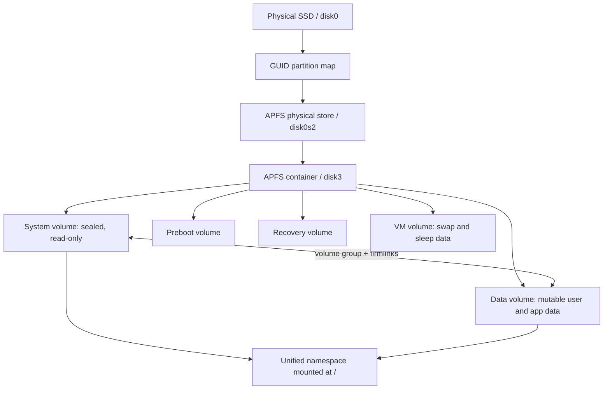

# 🍎 macOS APFS & File System

> [!abstract] Note of [[macOS]]
> APFS is a copy-on-write, snapshot-aware, encryption-capable filesystem whose volume groups make modern macOS appear simpler than it is. This masterclass connects containers, volumes, clones, snapshots, firmlinks, metadata, FileVault, and the Signed System Volume to administration, security engineering, and forensic reconstruction.

## Parent Learning Order
macOS Darwin & XNU Kernel -> macOS CLI & Unix Backend -> macOS APFS & File System -> macOS Processes & Daemons -> macOS Identity, Keychain & Credentials -> macOS Networking Internals -> macOS Security Mechanisms -> macOS Binaries & Runtime Loading -> macOS Observability, Incident Response & Forensics

## Crook — From Physical Store to Namespace

### Vocabulary & First Mental Model

A **disk** is the storage device presented to the operating system. A **partition map** divides its address space into regions. An APFS **container** is a storage pool built on one or more physical stores; an APFS **volume** is a mountable filesystem that shares the container's free space. A **mount point** attaches a volume to the pathname tree. A file's **metadata** describes it—name, owner, permissions, timestamps, attributes, and allocation—while its **extents** identify storage ranges containing data. A **clone** shares extents through copy-on-write; a **snapshot** preserves a volume's earlier logical state.

Think in layers: hardware stores blocks, GPT identifies a physical store, an APFS container allocates shared capacity, volumes organize files, and the VFS presents those volumes as one pathname hierarchy. Finder normally hides these layers. `diskutil`, `mount`, `stat`, and snapshot tools reveal them, which is why an investigator must never equate “the path I see” with “one ordinary file on one ordinary partition.”

A physical SSD is exposed as a disk, partitioned with GPT, and typically contains an **APFS container**. The container is a shared storage pool. Multiple APFS **volumes** draw space from that pool dynamically rather than receiving fixed partitions. A normal system may contain System, Data, Preboot, Recovery, and VM volumes. The visible root filesystem is synthesized from more than one volume.



Inspect the layers without changing them:

```bash
diskutil list
diskutil apfs list
diskutil info /
mount | grep ' on / '
df -h /
```

Typical output identifies a synthesized container and volume group:

```text
/dev/disk3 (synthesized):
   0: APFS Container Scheme                  +494.4 GB disk3
   1: APFS Volume Macintosh HD                15.4 GB disk3s1
   5: APFS Volume Macintosh HD - Data        210.8 GB disk3s5

APFS Volume Group 8D4B...
  APFS Volume Disk (Role): disk3s1 (System)
  APFS Volume Disk (Role): disk3s5 (Data)
```

APFS uses **copy-on-write (CoW)** metadata. Instead of overwriting an active metadata block, APFS writes a new version and atomically advances references. A transaction checkpoint represents a consistent filesystem state. This design reduces corruption risk during sudden power loss, though it is not a substitute for backup.

Files are represented by object identifiers and metadata records in B-trees. Relevant metadata includes names, object IDs, timestamps, logical size, physical allocation, extended attributes, clone relationships, and encryption state. APFS commonly uses nanosecond timestamps, but applications may rewrite or omit metadata, and user-space timestamp displays depend on locale and timezone.

## Operator — Clones, Snapshots, Encryption & Firmlinks

### Clones & Sparse Allocation

An APFS clone initially shares physical extents with its source. Modified blocks diverge through CoW, so a large file can be duplicated instantly with little immediate space cost. Logical sizes therefore do not equal unique physical consumption.

```bash
mkdir -p ~/macos-apfs-lab
mkfile 100m ~/macos-apfs-lab/original.bin
cp -c ~/macos-apfs-lab/original.bin ~/macos-apfs-lab/clone.bin
ls -lh ~/macos-apfs-lab
du -sh ~/macos-apfs-lab
```

Expected behavior:

```text
-rw-r--r--  1 analyst staff 100M ... clone.bin
-rw-r--r--  1 analyst staff 100M ... original.bin
100M    /Users/analyst/macos-apfs-lab
```

Both files report 100 MB logically while shared extents keep initial physical use near one copy. Editing `clone.bin` allocates only changed blocks.

### Snapshots

A snapshot preserves a point-in-time view of a volume's metadata and referenced blocks. Time Machine uses APFS snapshots; macOS updates use system snapshots; administrators may create controlled snapshots through supported workflows. A snapshot is not an independent offline backup because it remains on the same physical storage.

```bash
tmutil listlocalsnapshots /
diskutil apfs listSnapshots /
```

Output resembles:

```text
Snapshots for volume group containing disk /:
com.apple.TimeMachine.2026-07-31-104501.local
Name:        com.apple.os.update-7E3D...
XID:         9821441
Purgeable:   No
```

Forensics can compare current state with an earlier snapshot to recover configuration or persistence evidence that was later removed. Preservation must account for snapshot purging under storage pressure. Record snapshot UUID/name, transaction identifier, volume UUID, and acquisition time before analysis.

### Native Encryption & FileVault

APFS supports per-volume and per-file cryptographic key hierarchy. FileVault protects the Data volume using keys released after authorized preboot authentication; on Apple Silicon, hardware-backed key handling and Secure Enclave policy strengthen the chain. Encryption protects powered-off storage, not data already unlocked for a logged-in user or process with access.

```bash
fdesetup status
diskutil apfs listCryptoUsers /
```

Do not print or store personal recovery keys during routine audit. A safe output is:

```text
FileVault is On.
FileVault master keychain appears to be installed: No
```

### Signed System Volume & Firmlinks

The System volume is read-only and cryptographically sealed. Its root hash authenticates a tree of filesystem content, and the boot chain verifies the expected seal. The paired Data volume contains mutable state. **Firmlinks** join selected Data locations into the System namespace, producing a single apparent root. They are not ordinary symbolic links; they operate at the filesystem namespace level.

```bash
mount | egrep 'Macintosh HD|/System/Volumes/Data'
ls -lO /
csrutil authenticated-root status
```

This architecture means `/System` and most of `/usr` are poor persistence targets. Writable surfaces such as `/Library`, `/Applications`, `/Users`, and `/usr/local` deserve more attention. A root account cannot silently replace a sealed system binary while authenticated root remains enforced.

## Root — Hierarchy, Bundles, Metadata & DFIR

### Security-Relevant Paths

| Path | Purpose | Investigation value |
| --- | --- | --- |
| `/System/Library` | Apple platform content on sealed volume | establish trusted baseline |
| `/Library` | machine-wide settings, extensions, agents, daemons | persistence, security tooling, logs |
| `~/Library` | per-user preferences, containers, caches, agents | user-scoped execution and application evidence |
| `/Applications` | system-wide app bundles | provenance, signatures, update state |
| `~/Applications` | per-user applications | unsigned or user-installed software |
| `/private/var/db` | system databases and durable state | TCC, configuration, security state |
| `/private/var/log` | selected traditional logs and audit data | event reconstruction |
| `/System/Volumes/Preboot` | boot support files per system volume | boot configuration and FileVault context |

An application bundle is a directory with a conventional structure:

```text
Example.app/
└── Contents/
    ├── Info.plist
    ├── MacOS/Example
    ├── Frameworks/
    ├── PlugIns/
    ├── Resources/
    ├── XPCServices/
    └── _CodeSignature/CodeResources
```

Inspect rather than execute unknown bundles:

```bash
target='/Applications/TextEdit.app'
plutil -p "$target/Contents/Info.plist" | sed -n '1,40p'
find "$target/Contents" -maxdepth 2 -type f -print | sed -n '1,40p'
codesign --verify --deep --strict --verbose=2 "$target"
codesign -d --entitlements :- "$target" 2>/dev/null
spctl --assess --type execute -vv "$target"
```

Extended attributes can record quarantine provenance, Finder metadata, and application-specific information:

```bash
ls -leO@ ~/Downloads/example.dmg
xattr -l ~/Downloads/example.dmg
mdls ~/Downloads/example.dmg | sed -n '1,40p'
```

Expected quarantine evidence resembles:

```text
com.apple.quarantine: 0083;66a1f182;Safari;5A7D...
kMDItemWhereFroms = (
    "https://downloads.example.invalid/example.dmg"
)
```

Treat metadata as evidence requiring corroboration, not unquestionable truth. A privileged process can alter many timestamps and attributes. Correlate filesystem metadata with Unified Logs, FSEvents, quarantine databases, browser history, code signatures, and snapshots.

### Property Lists

Property lists can be XML, binary, or JSON-compatible representations. `plutil` validates structure and converts formats; `defaults` interacts with preference domains. Launch jobs, application preferences, helper configuration, and managed profiles frequently use plist data.

```bash
plutil -lint ~/Library/Preferences/com.apple.finder.plist
plutil -p ~/Library/Preferences/com.apple.finder.plist
plutil -convert xml1 -o - ~/Library/Preferences/com.apple.finder.plist | sed -n '1,40p'
```

Never infer execution merely because a plist exists. Verify whether its label is loaded, whether the referenced executable exists, its signature, ownership, timestamps, quarantine origin, and process evidence.

### Space Accounting, TRIM & Recovery Limits

APFS reports several different notions of space: a file's logical length, blocks allocated to that file, unique physical blocks after clone sharing, purgeable container space, and capacity shared among volumes. Sparse files, compression, clones, snapshots, and delayed deletion make a single `du` or `df` value incomplete. Investigations should preserve both file-level and container-level accounting.

```bash
stat -f 'logical=%z bytes blocks=%b block_size=%k' ~/macos-apfs-lab/original.bin
du -A -h ~/macos-apfs-lab/original.bin
diskutil apfs list | grep -E 'Capacity|Purgeable|Free Space'
```

SSD **TRIM** tells storage that deleted blocks are no longer needed. Copy-on-write, snapshots, encryption, and TRIM mean classic undelete expectations from older filesystems are unreliable. A deleted file may remain referenced by a snapshot, may have clone-shared extents, or may become cryptographically and physically unrecoverable. Do not promise recovery from filename deletion alone. Preserve the powered state, snapshot inventory, encryption context, and source device before deciding on acquisition strategy.

APFS also supports quotas and reserve sizes per volume. A reserve guarantees minimum space; a quota limits maximum growth. These settings can explain application failures even when the container appears to have free capacity:

```bash
diskutil apfs listVolumeGroups
diskutil info /System/Volumes/Data | egrep 'Volume Free|Allocation Block|File System Personality'
```

## Hands-On Authorized Lab & Debugging Exercise

1. Capture `diskutil list`, `diskutil apfs list`, mount state, FileVault status, and snapshot inventory into a case directory.
2. Create the harmless 100 MB file and APFS clone shown above. Compare `ls` and `du`, modify one 1 MB region, then compare again.
3. Select one Apple app bundle. Record its bundle identifier, executable path, architectures, signature authority, and entitlements.
4. Select one downloaded non-sensitive file. Record its extended attributes and Spotlight metadata.
5. Create a simple XML plist in the lab directory, convert it to binary with `plutil -convert binary1`, validate it, then convert a copy back to XML.
6. Remove only `~/macos-apfs-lab` after documenting results.

Expected validation:

```text
/Users/analyst/macos-apfs-lab/lab.plist: OK
Executable=/System/Applications/TextEdit.app/Contents/MacOS/TextEdit
Identifier=com.apple.TextEdit
Format=app bundle with Mach-O thin (arm64e)
```

## Troubleshooting Workflow

When an APFS symptom is ambiguous, identify the physical store, container, volume role, mount point, encryption state, and snapshot state before changing anything. Compare `diskutil apfs list`, `mount`, `df -h`, `tmutil listlocalsnapshots /`, and a read-only `fsck_apfs -n` result from an appropriate recovery context. A path that appears missing may be hidden behind a firmlink, another Data/System volume relationship, or an unmounted encrypted volume rather than deleted. Preserve timestamps and snapshot identifiers before repair, and never run destructive filesystem repair against the only evidence copy.

## Cybersecurity Implications

- CoW clones and snapshots complicate secure deletion and storage accounting.
- FileVault protects data at rest but not an unlocked session.
- The Signed System Volume shifts persistence hunting toward mutable Data-volume paths.
- Firmlinks explain why apparent root paths may physically reside on another volume.
- APFS snapshots can preserve deleted evidence, but retention is not guaranteed.
- Bundle structure, signatures, entitlements, quarantine, and plist configuration must be interpreted together.

## Crook → Operator → Root Checkpoint

- **Crook:** Distinguish disks, containers, volumes, volume groups, files, and snapshots.
- **Operator:** Inspect APFS layout, clone behavior, FileVault, firmlinks, bundles, plists, and metadata without changing evidence.
- **Root:** Reconstruct how a file reached the host, where its blocks and metadata live, whether the boot chain trusts it, how snapshots preserve it, and which independent artifacts corroborate the timeline.

---
> 🔼 Up: [[macOS]]
