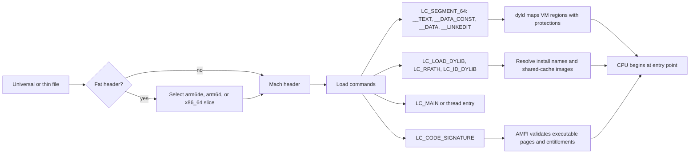

# 🍎 macOS Binaries & Runtime Loading

> [!abstract] Note of [[macOS]]
> Mach-O is the executable contract among compilers, `dyld`, AMFI, Hardened Runtime, and the Apple Silicon CPU. This masterclass dissects headers, load commands, segments, symbols, universal binaries, shared caches, relocations, code signatures, entitlements, and safe static/runtime inspection.

## Parent Learning Order
macOS Darwin & XNU Kernel -> macOS CLI & Unix Backend -> macOS APFS & File System -> macOS Processes & Daemons -> macOS Identity, Keychain & Credentials -> macOS Networking Internals -> macOS Security Mechanisms -> macOS Binaries & Runtime Loading -> macOS Observability, Incident Response & Forensics

## Crook — Read the Mach-O Map

### Vocabulary & First Mental Model

An **executable format** is the structured contract that tells the operating system how bytes on disk become code and data in memory. A Mach-O **header** identifies architecture and file type. A **load command** describes mappings, dependencies, entry information, fixups, or signature data. A **segment** is a virtual-memory region with protections; a **section** is a compiler/linker subdivision within a segment. A **symbol** names code or data. A **relocation** or **fixup** adjusts an address for its runtime location. A dynamic library's **install name** is the path-like identity used by the loader. A universal binary **slice** is one complete Mach-O image for one CPU architecture.

The loading model is: the kernel recognizes the file and architecture, maps initial regions, hands dynamic work to `dyld`, `dyld` maps dependencies and the shared cache, rebases and binds references, AMFI validates signed code, and execution reaches the entry point. Static inspection reads the contract before launch; runtime inspection confirms which choices and mappings actually occurred.

macOS uses **Mach-O** rather than ELF or PE. A thin Mach-O begins with a magic value and header describing CPU type, file type, number of load commands, command-byte size, and flags. Load commands then describe how the loader maps segments, finds dependencies, establishes entry points, applies code signatures, and performs dynamic linking. File content follows at offsets named by those commands.



Common file types include `MH_EXECUTE`, `MH_DYLIB`, `MH_BUNDLE`, `MH_OBJECT`, and `MH_CORE`. An application bundle is a directory whose main executable is usually under `Contents/MacOS`; plug-ins, frameworks, XPC services, and extensions may contain additional Mach-O files with independent signatures and entitlements.

Start with non-executing inspection:

```bash
target=/bin/ls
file "$target"
lipo -info "$target"
otool -hv "$target"
otool -l "$target" | sed -n '1,120p'
otool -L "$target"
nm -m "$target" | sed -n '1,30p'
strings -a "$target" | sed -n '1,30p'
```

Expected output on a recent Apple Silicon system may resemble:

```text
/bin/ls: Mach-O universal binary with 2 architectures: [x86_64] [arm64e]
Architectures in the fat file: /bin/ls are: x86_64 arm64e
Mach header
      magic  cputype cpusubtype  caps    filetype ncmds sizeofcmds flags
0xfeedfacf 16777228          2  0x80           2    21       2008 NOUNDEFS DYLDLINK TWOLEVEL PIE
/usr/lib/libutil.dylib (compatibility version 1.0.0, current version 1.0.0)
/usr/lib/libSystem.B.dylib (compatibility version 1.0.0, current version 1351.0.0)
```

`__TEXT` normally contains executable code and read-only constants. `__DATA_CONST` contains data writable during fixups but protected afterward. `__DATA` contains mutable global state. `__LINKEDIT` holds symbol, relocation, export, and signature-related tables. Segment virtual sizes may exceed file sizes because zero-filled sections require memory but no stored bytes.

## Operator — Loading, Fixups & Shared Cache

The dynamic loader, **dyld**, selects a compatible architecture slice, maps segments, resolves dependent image install names, applies rebases and binds, runs initializers, and transfers control to the program entry. Dependencies can be expressed as absolute paths, `@rpath`, `@loader_path`, or `@executable_path`. These tokens support relocatable application bundles but can create risk when a signed program resolves a library from an attacker-writable path.

Modern systems place most platform libraries in the **dyld shared cache**. A path such as `/usr/lib/libSystem.B.dylib` remains a logical install name even when no standalone file appears at that path. The cache reduces disk use, startup work, and memory duplication. Static analysts must therefore understand cache extraction or use tools capable of resolving cache images.

```bash
dyld_info -dependents /bin/ls 2>/dev/null || otool -L /bin/ls
dyld_info -exports /bin/ls 2>/dev/null | sed -n '1,30p'
vmmap $$ | grep -E 'dyld|shared cache' | sed -n '1,20p'
```

Position-independent executables (`MH_PIE`) cooperate with ASLR. Rebasing adjusts pointers for the chosen slide. Binding resolves imported symbols to exports. Newer chained fixups compactly encode pointer adjustments and can integrate pointer authentication on `arm64e`. Lazy binding defers some resolution until first call, while modern toolchains increasingly use eager or chained mechanisms.

Universal, or **fat**, binaries contain a fat header plus architecture slices. Do not assume every slice has equivalent behavior or security properties. Intel code may execute under Rosetta 2 on Apple Silicon; translated execution changes process architecture evidence and can affect plug-in compatibility.

```bash
arch
file /Applications/Example.app/Contents/MacOS/Example
lipo -archs /Applications/Example.app/Contents/MacOS/Example
sysctl -in sysctl.proc_translated 2>/dev/null || echo 'native process'
```

Avoid extracting a slice in-place from a signed bundle because that invalidates the signature. Work on a copied evidence file and hash both source and derivative.

### Symbols, Objective-C Metadata & Swift

Symbol tables may expose functions and globals, while stripped release binaries retain fewer names. Dynamic exports, imported APIs, Objective-C class/method metadata, Swift reflection strings, and selectors still provide behavioral clues. `nm`, `otool`, `strings`, and `dyld_info` offer an initial map; a disassembler or decompiler can then follow code flow. Static strings are clues, not proof of execution.

```bash
nm -u /Applications/Example.app/Contents/MacOS/Example | sed -n '1,40p'
otool -ov /Applications/Example.app/Contents/MacOS/Example | sed -n '1,80p'
otool -tvV /Applications/Example.app/Contents/MacOS/Example | sed -n '1,60p'
```

## Root — Code Signatures, Entitlements & Runtime Boundaries

An embedded signature includes a CodeDirectory with hashes for executable pages, identifier, flags, special-slot hashes, and optional entitlements. A CMS signature links that CodeDirectory to a certificate chain. The **designated requirement** defines identity across updates. Bundle resource sealing protects selected non-code resources. `LC_CODE_SIGNATURE` points into signature data usually stored in `__LINKEDIT`.

```bash
app=/Applications/Safari.app
codesign --verify --deep --strict --verbose=4 "$app"
codesign -dv --verbose=4 "$app" 2>&1
codesign -d -r- "$app" 2>&1
codesign -d --entitlements :- "$app" 2>/dev/null
spctl --assess --type execute -vv "$app"
```

Expected fields:

```text
Executable=/Applications/Safari.app/Contents/MacOS/Safari
Identifier=com.apple.Safari
Format=app bundle with Mach-O universal (x86_64 arm64e)
CodeDirectory v=20500 size=... flags=0x12000(runtime,kill)
Authority=Software Signing
TeamIdentifier=not set
Sealed Resources version=2 rules=13 files=...
```

Entitlements are capabilities interpreted by kernel and user-space services. Important classes include App Sandbox, application groups, network client/server, keychain access groups, hardened-runtime exceptions, Endpoint Security client, DriverKit families, and TCC-related privileges reserved for Apple or managed software. An entitlement is not automatically active merely because a string appears in the file; it must be validly signed and honored by the enforcing subsystem.

Hardened Runtime and library validation restrict dynamic library injection and debugger attachment. Environment variables such as `DYLD_INSERT_LIBRARIES` are not universal bypasses: protected and hardened processes sanitize or reject unsafe behavior. A legitimate application that disables library validation or permits unsigned executable memory increases attack surface and deserves architectural justification.

### Safe Dependency-Risk Review

For every non-system load command:

1. Resolve `@rpath`, `@loader_path`, and `@executable_path` in actual launch context.
2. Determine directory ownership and ACLs.
3. Verify the loaded library's signature and team identity.
4. Check whether Hardened Runtime and library validation apply.
5. Compare runtime mappings with static expectations.

```bash
otool -l "$app/Contents/MacOS/Safari" | awk '/LC_RPATH/{p=1} p&&/path/{print; p=0}'
otool -L "$app/Contents/MacOS/Safari"
vmmap "$(pgrep -x Safari | head -1)" 2>/dev/null | sed -n '1,40p'
```

Never “prove” a path-hijack risk by placing a library into a production directory. Permission analysis, controlled copies, and an isolated unsigned lab program are sufficient for safe validation.

### Crash Reports as Loader Evidence

Crash and diagnostic reports bridge static format with runtime state. They can reveal architecture, translated execution, exception type, faulting thread, loaded images, code-signing identity, and termination reason. A missing-library error, invalid code signature, PAC failure, or illegal instruction points to different boundaries.

```bash
ls -lt ~/Library/Logs/DiagnosticReports /Library/Logs/DiagnosticReports 2>/dev/null | head
log show --last 1h --predicate 'process == "ReportCrash" OR process == "runningboardd"' --style compact
```

In a report, match every image UUID to the exact binary used for symbolication. ASLR means a runtime address must be interpreted with its image load address or slide. Rosetta reports can include translated x86_64 code on an arm64 host. Never symbolize against a merely similar application version; one rebuilt slice can move functions and invalidate the conclusion.

Load failures also appear through dyld diagnostics such as `Library not loaded`, `image not found`, or code-signature rejection. Preserve the entire report and environment context before relaunching the application, because an updater or cache refresh can alter the evidence.

## Hands-On Authorized Lab & Debugging Exercise

Compile a harmless program in a disposable developer environment:

```c
#include <stdio.h>
int main(void) {
    puts("Crook2Root Mach-O lab");
    return 0;
}
```

```bash
mkdir -p ~/macos-macho-lab
cc -Wall -Wextra -o ~/macos-macho-lab/hello ~/macos-macho-lab/hello.c
file ~/macos-macho-lab/hello
otool -hv ~/macos-macho-lab/hello
otool -L ~/macos-macho-lab/hello
codesign -dv --verbose=4 ~/macos-macho-lab/hello 2>&1
~/macos-macho-lab/hello
```

Expected output:

```text
Mach-O 64-bit executable arm64
/usr/lib/libSystem.B.dylib (compatibility version 1.0.0, current version ...)
Signature=adhoc
TeamIdentifier=not set
Crook2Root Mach-O lab
```

Then answer: Which load command identifies the entry point? Which segment is executable? Which dependency supplies libc? Is the binary PIE? Is it ad hoc signed? How would a Developer ID signature change identity? Remove only the lab directory after recording hashes and observations.

## Cybersecurity Implications

- Load commands are executable policy: they define mappings, dependencies, entry, fixups, and signature location.
- Universal slices may differ and Rosetta can change runtime evidence.
- `@rpath` flexibility becomes dangerous when resolution reaches writable locations.
- Code signatures protect integrity and identity; entitlements define privileged capability; Hardened Runtime constrains mutation.
- Shared-cache awareness prevents analysts from mistaking absent standalone libraries for missing dependencies.
- Static imports and strings suggest behavior but require runtime or forensic corroboration.

## Crook → Operator → Root Checkpoint

- **Crook:** Identify a Mach-O header, load commands, segments, dependencies, and architecture slices.
- **Operator:** Resolve install names, inspect symbols, verify signatures, interpret entitlements, and compare static layout with runtime mappings.
- **Root:** Explain the complete chain from fat-slice selection through dyld fixups, shared-cache resolution, AMFI validation, Hardened Runtime policy, and Apple Silicon pointer authentication—then assess dependency and entitlement risk without executing untrusted code.

---
> 🔼 Up: [[macOS]]
