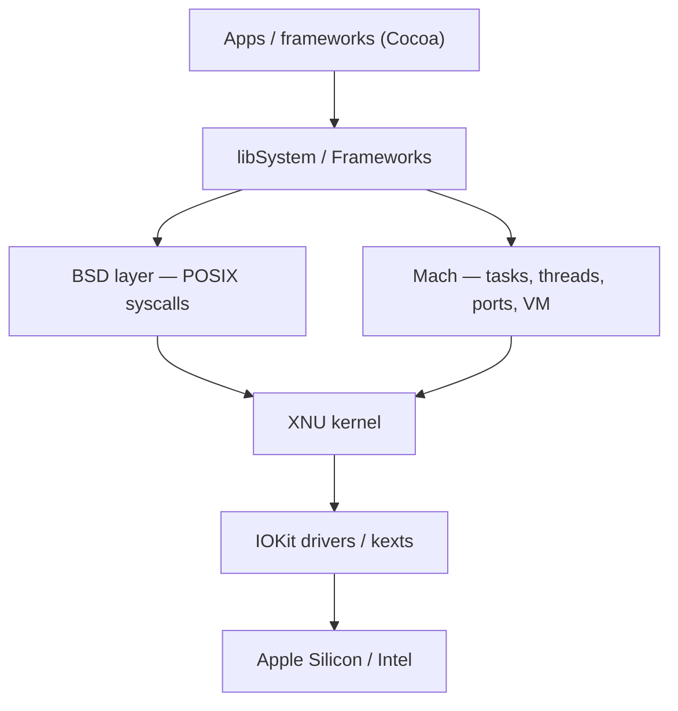

# 🍎 macOS Darwin and XNU Kernel

> [!abstract] Note of [[macOS]]
> Under the polished UI, macOS is **Darwin** — an open-source, Unix-certified OS whose kernel, **XNU**, is a hybrid of the Mach microkernel and a BSD layer. Knowing this hybrid explains everything from `launchd` to code-signing enforcement.

## Darwin & XNU
**XNU** ("X is Not Unix") fuses two lineages:
- **Mach** — the microkernel core: **tasks** (≈ processes), **threads**, virtual memory, and **Mach ports** for IPC. Ports are capabilities — holding a port to another task lets you read/write its memory (the basis of `task_for_pid`, which SIP now restricts).
- **BSD (from FreeBSD)** — the Unix personality: POSIX syscalls, processes/signals, users/permissions, the VFS, and the network stack. This is why `ps`, `kill`, and `fork()` all work.
- **IOKit** — the C++ driver framework for hardware.

## Kernel extensions & their modern replacements
Historically the kernel was extended with **kexts** (`.kext` bundles) — powerful but a huge attack surface. Apple has locked this down hard:
- **kexts now require user approval + SIP** and are being deprecated.
- Modern equivalents run in **user space**: **System Extensions** (`.systemextension`) and **Endpoint Security (ES) framework** — how modern macOS EDR watches process/file/exec events without a kext.
- **DriverKit** replaces I/O kexts.

## Apple Silicon note
On **Apple Silicon (arm64e)**, the **Secure Enclave**, **pointer authentication (PAC)**, and a signed **boot chain** (iBoot) raise the bar significantly versus Intel Macs — many older kernel exploits simply don't apply, and the boot policy is per-OS-install.

## Why it matters
- **Offense (authorized):** Mach ports + `task_for_pid` were the classic path to reading another process's memory; SIP and hardened runtime now gate it.
- **Defense/DFIR:** the **Endpoint Security framework** is where macOS telemetry comes from; understanding Mach vs BSD tells you which events are even observable.

> [!tip] Crook → Root
> **Root** knows macOS is BSD-on-Mach: reach for Unix tools for the userland, but remember that memory access, IPC, and driver loading answer to **Mach ports, SIP, and code-signing** — not `sudo` alone.

---
> 🔼 Up: [[macOS]]
