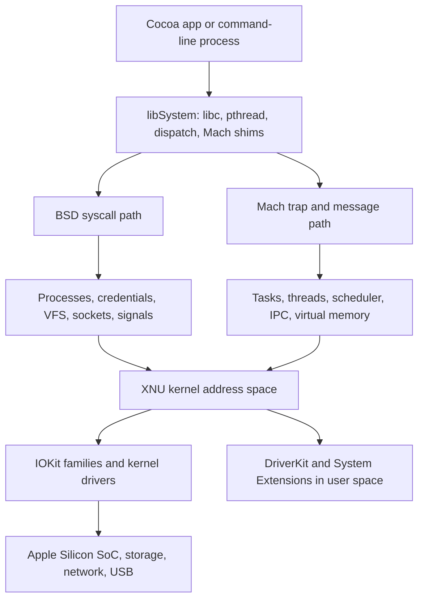

# 🍎 macOS Darwin & XNU Kernel

> [!abstract] Note of [[macOS]]
> macOS is built on Darwin and the XNU hybrid kernel. This masterclass follows execution from an application through Mach, BSD, virtual memory, IPC, drivers, and the Apple Silicon boot chain, then turns the architecture into practical debugging and security intuition.

## Parent Learning Order
macOS Darwin & XNU Kernel -> macOS CLI & Unix Backend -> macOS APFS & File System -> macOS Processes & Daemons -> macOS Identity, Keychain & Credentials -> macOS Networking Internals -> macOS Security Mechanisms -> macOS Binaries & Runtime Loading -> macOS Observability, Incident Response & Forensics

## Crook — Build the Kernel Mental Model

### Vocabulary & First Mental Model

A **kernel** is the privileged software that shares the CPU, memory, and devices among programs. **User space** is where ordinary applications run with restricted authority; **kernel space** is where XNU enforces system-wide policy. A **process** is the Unix-visible container for a running program, while a **thread** is one schedulable path of execution inside it. A **system call** is a controlled request from user space to the kernel. A **virtual address** is the address a process sees; the memory-management unit translates it to physical memory. **IPC** means inter-process communication. A **driver** translates generic operating-system requests into device-specific operations.

The simplest useful picture is: an application asks through a library, XNU validates the request, a kernel subsystem performs or rejects it, and the result returns to the application. Every later concept in this note—Mach messages, BSD file descriptors, virtual-memory faults, IOKit calls, and security checks—is a more precise description of one stage in that loop.

**Darwin** is the open-source foundation beneath macOS. Its kernel, **XNU** ("X is Not Unix"), is hybrid rather than a textbook microkernel or monolithic Unix kernel. Mach supplies scheduling, tasks, threads, virtual memory, and capability-style IPC. The BSD layer supplies the POSIX process model, credentials, sockets, signals, the virtual file system, and most interfaces familiar to Unix operators. IOKit supplies an object-oriented driver model. These components execute in one privileged kernel address space, so an error in any kernel subsystem can affect the whole machine.

A user-space program normally reaches XNU through `libSystem`, which unifies libc, libpthread, libdispatch, and low-level syscall shims. A call such as `read()` enters the BSD syscall layer; a Mach message uses a Mach trap; an Objective-C framework may use both. The split matters during incident response: `ps`, file descriptors, UIDs, and sockets are BSD concepts, while task ports, exception ports, and VM regions are Mach concepts.



## Operator — Mach Tasks, Threads, VM & IPC

A **task** is a resource container: an address space, port namespace, and collection of threads. It resembles a process but does not itself execute. A **thread** owns register state, scheduling state, and a kernel stack. BSD overlays a process identity, credentials, signals, and file descriptors onto the Mach task. Context switching saves one thread's architectural state and restores another's; on Apple Silicon this includes security-relevant state such as pointer-authentication context.

Mach virtual memory represents mappings as regions backed by memory objects. Copy-on-write lets `fork()` initially share physical pages; a write fault causes the kernel to create a private copy. Page permissions—read, write, execute—are enforced through page tables. The `vm_map` abstraction records regions and protections, while the hardware MMU and translation lookaside buffers enforce them. Security mitigations build on this layer: W^X prevents writable executable pages, ASLR randomizes mappings, and code-signing policy constrains executable pages.

Mach IPC uses **ports**, but a port is not a TCP/UDP endpoint. It is a kernel-managed message queue plus rights held in per-task namespaces. A task may hold:

- a **receive right**, which is unique and permits dequeuing messages;
- one or more **send rights**, which permit enqueueing messages;
- **send-once rights**, often used for replies;
- port-set membership, which lets one receiver wait on several ports.

Messages can carry scalar data, out-of-line memory, and port rights. Transferring a right delegates authority, which makes Mach IPC capability-oriented. Bootstrap services publish selected receive rights through `launchd`; clients resolve a service name and obtain a send right. XPC wraps this machinery with typed objects, serialization, lifecycle management, and audit-token metadata.

Exception handling is also port based. A task or thread can register an exception port. Faults such as bad memory access or illegal instructions become messages delivered to an exception handler before normal Unix signal translation. Debuggers use this model: attaching grants sufficient task control, sets exception ports, reads registers, and manipulates memory. That power is why `task_for_pid()` is guarded by code-signing, entitlements, developer-mode rules, Hardened Runtime, and System Integrity Protection.

Use these read-only commands to connect theory to a live host:

```bash
uname -a
sysctl kern.osrelease kern.version hw.model hw.optional.arm64
ps -M -p $$
vmmap $$ | sed -n '1,25p'
vm_stat
```

Expected output on Apple Silicon resembles:

```text
Darwin lab-mac 24.5.0 Darwin Kernel Version 24.5.0 ... arm64
kern.osrelease: 24.5.0
hw.optional.arm64: 1
USER   PID   TT   %CPU STAT PRI     STIME     UTIME COMMAND
analyst 918 ttys001 0.0 S    31T   0:00.03  0:00.01 -zsh
Mach Virtual Memory Statistics: (page size of 16384 bytes)
Pages free:                              18421.
Pages active:                           296104.
Pages wired down:                       121887.
```

The 16 KiB page size commonly seen on Apple Silicon changes exploit assumptions originally developed around 4 KiB Intel pages. `vmmap` also reveals shared-cache mappings, guard pages, stacks, heaps, and code-signature-backed executable regions.

## Root — Zones, Drivers & Apple Silicon Trust

XNU allocates many fixed-size kernel objects from **zones**. A zone groups objects of one type, controls caching, and supports accounting and hardening. Zone confusion, stale pointers, double frees, and out-of-bounds access historically turned memory-safety defects into kernel compromise. Modern kernels add typed zones, randomization, guard pages, poisoning, and stronger metadata checks. Understanding the allocator remains essential when interpreting a panic report: the faulting address, zone name, allocation backtrace, and PAC failure can distinguish corruption from a driver bug.

IOKit models devices as C++ objects in a registry. Families provide reusable behavior for USB, networking, storage, graphics, and human-interface devices. User clients expose controlled methods to user space; historically, weak validation in a user client produced dangerous kernel attack surfaces. Traditional **kernel extensions** run inside XNU and therefore require strong signing and policy approval. Apple now prefers **DriverKit** extensions and **System Extensions**, which move code to user space where failure is containable. Endpoint Security extensions subscribe to process and file events; Network Extensions implement approved filters, VPNs, and proxies.

Apple Silicon adds hardware-rooted trust. Boot ROM verifies the next boot stage, iBoot verifies the operating system, and the Signed System Volume verifies system content through a cryptographic hash tree. **Secure Enclave** isolates key operations and biometric secrets. **Pointer Authentication Codes (PAC)** place keyed integrity bits into otherwise unused pointer bits; return addresses and selected function pointers can be authenticated before use. PAC does not fix memory corruption, but it makes arbitrary pointer substitution substantially harder. `arm64e` extends this model throughout system binaries.

The boot policy is tied to a particular OS installation and managed from Recovery. Reduced Security can permit legacy kernel extensions, but that decision changes the threat model. A professional assessment records boot policy, Secure Boot state, SIP state, FileVault state, and whether external boot is allowed rather than assuming every Mac has identical controls.

```bash
system_profiler SPHardwareDataType SPiBridgeDataType
csrutil status
kmutil showloaded | sed -n '1,20p'
systemextensionsctl list
ioreg -l -p IODeviceTree | sed -n '1,30p'
```

Typical observations:

```text
System Integrity Protection status: enabled.
1 extension(s)
--- com.apple.system_extension.endpoint_security
* * TEAMID com.vendor.agent (1.4/104) Vendor Endpoint Extension [activated enabled]
```

### Kernel Panic Triage

A panic report normally provides the panic string, faulting thread, backtrace, loaded extensions, hardware model, and OS build. Start by preserving the original report, matching addresses against the correct kernel collection, and identifying whether third-party extensions are present. Repeated panics in the same routine suggest deterministic corruption or faulty hardware; unrelated fault sites can indicate broader memory corruption.

```bash
log show --last 24h --predicate 'eventMessage CONTAINS[c] "panic"' --style compact
ls -lt /Library/Logs/DiagnosticReports/*panic* 2>/dev/null | head
```

Do not disable SIP or load an unsigned extension merely to make a lab easier. A safe lab uses built-in observability and a disposable test account.

## Hands-On Authorized Lab & Debugging Exercise

1. Record architecture, Darwin release, SIP status, and loaded System Extensions.
2. Start a harmless process: `sleep 300 &` and save its PID with `lab_pid=$!`.
3. Run `vmmap "$lab_pid"` and identify `__TEXT`, `__DATA`, stack, shared cache, and guard regions.
4. Run `sample "$lab_pid" 1 1` and identify its thread state and kernel wait path.
5. Compare `ps -M -p "$lab_pid"` with the Mach-oriented output. Explain which fields come from BSD identity and which describe threads.
6. Terminate only the lab process with `kill "$lab_pid"`.

Expected sample excerpt:

```text
Process:         sleep [1042]
Path:            /bin/sleep
Architecture:    arm64e
Thread 0:
  1000 start_wqthread + 0
  1000 __semwait_signal + 8
```

The exercise proves that a simple Unix process is simultaneously a BSD process, a Mach task, one or more Mach threads, and a set of protected VM mappings.

## Cybersecurity Implications

- **Memory acquisition:** task-port policy determines whether one process may inspect another; root alone is not always sufficient.
- **Local privilege boundaries:** privileged XPC services and IOKit user clients must authenticate callers and validate every serialized field.
- **Kernel defense:** PAC, W^X, signed code, hardened zones, and a verified boot chain compound rather than replace one another.
- **EDR architecture:** Endpoint Security and Network Extension are policy-controlled user-space interfaces, while kernel events originate in XNU.
- **Forensics:** Darwin build, CPU architecture, page size, boot policy, and third-party extensions are essential case context.

## Crook → Operator → Root Checkpoint

- **Crook:** Explain why XNU is hybrid and distinguish a BSD process from a Mach task.
- **Operator:** Interpret task, thread, VM-region, port-right, System Extension, and panic-report evidence using native commands.
- **Root:** Trace an event across libSystem, BSD or Mach entry, XNU policy, driver interaction, and Apple Silicon hardware trust—then identify the precise security boundary that allowed or denied it.

---
> 🔼 Up: [[macOS]]
