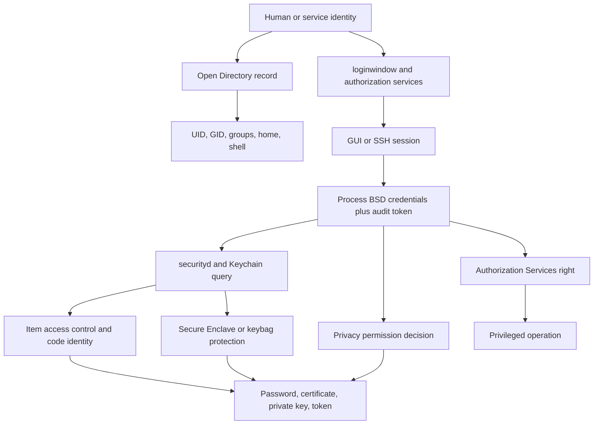

# 🍎 macOS Identity, Keychain & Credentials

> [!abstract] Note of [[macOS]]
> macOS identity spans Unix credentials, Open Directory records, authorization rights, Keychain access control, Secure Enclave-backed keys, enterprise tokens, and application code identity. This masterclass explains each boundary and provides safe workflows for authorization review and credential forensics.

## Parent Learning Order
macOS Darwin & XNU Kernel -> macOS CLI & Unix Backend -> macOS APFS & File System -> macOS Processes & Daemons -> macOS Identity, Keychain & Credentials -> macOS Networking Internals -> macOS Security Mechanisms -> macOS Binaries & Runtime Loading -> macOS Observability, Incident Response & Forensics

## Crook — Identity Is More Than a Username

### Vocabulary & First Mental Model

An **identity** is the entity a system believes is acting. An **account** is a stored record representing a user or service. **Authentication** proves a claimed identity; **authorization** decides what that identity may do. A **credential** is evidence used during authentication, such as a password, key, certificate, token, or biometric-backed assertion. A **principal** is an identity named by an authentication system. A Unix **UID** and **GID** identify users and groups to BSD access checks. A **session** is an authenticated operating context. A Keychain **item** combines secret material, searchable attributes, and an access-control policy. An application **entitlement** is a signed capability claim evaluated by a platform service.

The practical model is a chain rather than a single “logged-in user”: a directory record establishes account attributes; login creates a session; each process receives BSD credentials and code identity; a service then evaluates the process, user, authorization right, Keychain policy, TCC state, and hardware-backed restrictions relevant to one request. Administrative membership influences the chain but does not erase its other gates.

A macOS process has BSD credentials: real and effective user IDs, group IDs, supplementary groups, and an audit identity. A graphical login also has a session, bootstrap namespace, Keychain unlock state, TCC decisions, and application identities. Root is powerful in the Unix layer but does not automatically possess every Keychain secret, Secure Enclave private key, TCC grant, or entitlement.

Local users are managed through **Open Directory**. Directory Services combines local records with configured enterprise directories. `/etc/passwd` contains compatibility entries but is not the authoritative account database for normal users. The local node stores user and group attributes; authentication authority can reference salted hashes, SecureToken state, network identity, or other mechanisms.



Start with read-only identity inspection:

```bash
whoami
id
groups
dscl . -read /Users/$(id -un) UniqueID PrimaryGroupID NFSHomeDirectory UserShell
dscacheutil -q user -a name "$(id -un)"
dscl . -list /Groups PrimaryGroupID | sed -n '1,30p'
```

Expected output:

```text
analyst
uid=501(analyst) gid=20(staff) groups=20(staff),12(everyone),80(admin),701(com.apple.sharepoint.group.1)
UniqueID: 501
PrimaryGroupID: 20
NFSHomeDirectory: /Users/analyst
UserShell: /bin/zsh
```

UID membership and administrator-group membership are different from an active root process. `sudo` evaluates policy, credentials, timestamp state, and command rules. Authorization Services can present an authentication dialog for a named right without granting a general root shell.

## Operator — Keychain, securityd & Authorization Services

### Keychain Architecture

The Keychain stores generic passwords, internet passwords, certificates, cryptographic keys, and identities. Common locations include the user's login keychain and system keychains. `securityd` mediates requests; applications use Security.framework APIs rather than parsing keychain databases directly.

An item has a class, attributes, secret data, and access-control policy. Attributes may include service, account, server, protocol, access group, label, synchronizable state, and creation/modification dates. Access control can require code identity, user presence, device passcode, biometry, or Secure Enclave policy. A successful query depends on item match, keychain availability, calling code, session state, and user authorization.

```bash
security list-keychains -d user
security default-keychain -d user
security show-keychain-info ~/Library/Keychains/login.keychain-db
security find-certificate -a -p /Library/Keychains/System.keychain \
  | openssl x509 -noout -subject -issuer -dates 2>/dev/null | sed -n '1,20p'
```

Typical output:

```text
"/Users/analyst/Library/Keychains/login.keychain-db"
"/Library/Keychains/System.keychain"
Keychain "/Users/analyst/Library/Keychains/login.keychain-db" lock-on-sleep timeout=300s
subject=CN=Example Enterprise Root CA,O=Example Corp
issuer=CN=Example Enterprise Root CA,O=Example Corp
notBefore=Jul  1 00:00:00 2025 GMT
notAfter=Jul  1 00:00:00 2035 GMT
```

Avoid commands that print secret values during routine audit. `security find-generic-password -w` outputs a password and should not appear in collection scripts. Prefer metadata-only queries, approved APIs, or a forensic copy governed as sensitive evidence.

### Certificates, Keys & Identities

A certificate binds a public key to a subject. A private key may live in software storage or be generated as non-exportable in Secure Enclave. An **identity** is a certificate plus its matching private key. Trust evaluation builds a chain to a trust anchor while checking time, policy, key usage, revocation information, and local trust settings.

```bash
security find-identity -v -p codesigning
security find-identity -v -p ssl-client
security dump-trust-settings -d 2>/dev/null | sed -n '1,80p'
profiles show -type configuration | grep -A8 -i certificate
```

Expected identity inventory:

```text
  1) A1B2C3D4... "Apple Development: Analyst (TEAMID1234)"
     1 valid identities found
```

Unexpected enterprise roots, user-added trust overrides, expired client identities, exportable private keys, or certificates with excessive usage require review. A root certificate is high impact because it can affect TLS and code trust, but installation provenance and MDM policy must be established before labeling it malicious.

### Authorization Services & authorizationdb

Authorization Services evaluates named rights such as system preference changes. Rights are stored in the authorization policy database and can require administrator authentication, user presence, group membership, rules, or mechanisms. The database is not a sudoers replacement; it serves graphical and API-driven privileged workflows.

```bash
security authorizationdb read system.preferences 2>/dev/null
security authorizationdb read system.install.software 2>/dev/null
sudo -l
```

Output may be XML containing fields such as `class`, `group`, `authenticate-user`, `shared`, and `timeout`. Read operations are appropriate for audit. Writing rights can destabilize authorization and must not be performed outside controlled engineering change.

The safest privileged architecture separates an unprivileged UI from a narrowly scoped helper. The helper obtains caller identity from the XPC audit token, evaluates a named right or code requirement, validates all parameters, uses safe filesystem APIs, and records an attributable result. A caller-supplied “authorized=true” field has no security value.

## Root — SecureToken, FileVault, Enterprise Identity & Credential Forensics

**SecureToken** is an authorization attribute associated with volume ownership and FileVault workflows. On modern Macs, Bootstrap Token can be escrowed to MDM and used for selected account and security operations. These concepts interact with APFS cryptographic users but are not interchangeable with administrator-group membership.

```bash
sysadminctl -secureTokenStatus "$(id -un)"
diskutil apfs listCryptoUsers /
fdesetup list -extended 2>/dev/null
profiles status -type bootstraptoken
```

Expected managed-host evidence:

```text
Secure token is ENABLED for user analyst
Bootstrap Token supported on server: YES
Bootstrap Token escrowed to server: YES
FileVault is On.
```

Do not collect recovery keys or password hashes for a baseline audit. Treat token membership and escrow state as sensitive configuration. A departing user's SecureToken, orphaned FileVault unlock identity, or missing Bootstrap Token can become an availability and lifecycle-management problem.

Enterprise authentication may involve Kerberos tickets, platform SSO, smart cards, identity-provider tokens, client certificates, and network account records. The specific architecture depends on MDM and identity provider. Inventory should identify enabled extensions and policies without dumping reusable credentials:

```bash
klist 2>/dev/null
app-sso platform -s 2>/dev/null || true
systemextensionsctl list | grep -i 'credential\|sso' || true
profiles show -type configuration | grep -A12 -Ei 'Kerberos|ExtensibleSingleSignOn|PlatformSSO'
```

Credential forensics prioritizes evidence preservation and minimum disclosure:

- preserve keychain database files and related metadata only under legal authority;
- capture lock state, search list, file ownership, ACLs, hashes, and timestamps;
- record active user and login session because access behavior is session-dependent;
- enumerate certificate metadata without exporting private keys;
- identify suspicious `security` command execution from process or shell history evidence;
- correlate account changes with Open Directory, MDM, authentication, and Unified Log events;
- protect collected artifacts as authentication material even when secrets were not intentionally extracted.

Common root causes include hard-coded secrets in scripts, overly broad keychain ACLs, unlocked long-lived sessions, weak helper authorization, user-installed trust anchors, service accounts used interactively, and applications storing tokens outside Keychain. Remediation should remove the root cause and rotate exposed credentials; deleting one artifact is not enough.

### Defensive Coding Pattern

Security.framework queries should request only the intended item and should avoid broad access groups:

```swift
let query: [String: Any] = [
    kSecClass as String: kSecClassGenericPassword,
    kSecAttrService as String: "com.example.enterprise.client",
    kSecAttrAccount as String: "device-registration",
    kSecReturnData as String: true,
    kSecMatchLimit as String: kSecMatchLimitOne
]
var result: CFTypeRef?
let status = SecItemCopyMatching(query as CFDictionary, &result)
guard status == errSecSuccess else {
    throw CredentialError.lookup(status)
}
```

The application should use an access-control object appropriate to data sensitivity, avoid logging secret bytes, handle locked-keychain errors, and rotate the item through a documented lifecycle.

## Hands-On Authorized Lab & Debugging Exercise

Use a disposable local account and a non-sensitive lab item.

```bash
security add-generic-password -a c2r-lab -s com.example.c2r.lab \
  -w 'temporary-nonproduction-value' ~/Library/Keychains/login.keychain-db
security find-generic-password -a c2r-lab -s com.example.c2r.lab
security delete-generic-password -a c2r-lab -s com.example.c2r.lab
```

Expected metadata-only result:

```text
keychain: "/Users/analyst/Library/Keychains/login.keychain-db"
class: "genp"
attributes:
    "acct"<blob>="c2r-lab"
    "svce"<blob>="com.example.c2r.lab"
password has been deleted.
```

Then complete a read-only identity report: UID/groups, directory record, `sudo -l`, SecureToken status, FileVault state, keychain search list, code-signing identities, and trusted enterprise roots. Redact usernames, certificate serials, and organization details before sharing the report.

## Troubleshooting Workflow

Separate identity, authorization, and credential-storage failures. First confirm the effective UID, groups, directory-service record, SecureToken/FileVault status, and active console user. Then inspect the target keychain’s search list, lock state, item access-control policy, code-signing requirement, and TCC context without exporting secrets. A successful Unix login does not prove Keychain access, and `sudo` does not automatically satisfy an application-bound access-control list. Record the exact process identity and error code before changing Keychain or authorization settings.

## Cybersecurity Implications

- UID 0, administrator membership, Keychain access, Secure Enclave authority, TCC grants, and entitlements are distinct powers.
- Keychain safety depends on item matching, access control, calling code identity, session state, and key protection.
- SecureToken and Bootstrap Token are lifecycle-critical enterprise controls, not ordinary passwords.
- Authorization Services must be applied to narrow operations; privileged helpers must authenticate XPC callers independently.
- Credential evidence must be handled like live authentication material and exposure requires rotation.

## Crook → Operator → Root Checkpoint

- **Crook:** Explain UID/GID, Directory Services, Keychain item classes, certificates, and administrator membership.
- **Operator:** Audit identity, keychain metadata, signing identities, authorization rights, SecureToken, and FileVault without revealing secrets.
- **Root:** Trace one privileged request from user session and code identity through XPC, Authorization Services, Keychain access control, Secure Enclave policy, and enterprise identity—then prove the exact authority granted at each boundary.

---
> 🔼 Up: [[macOS]]
