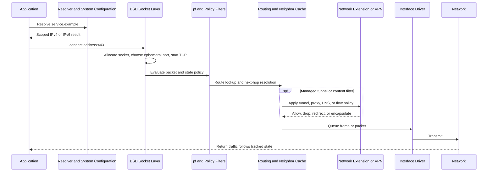

# 🍎 macOS Networking Internals

> [!abstract] Note of [[macOS]]
> macOS combines the XNU BSD network stack with dynamic System Configuration, scoped DNS, `pf`, the Application Firewall, and Network Extension. This masterclass follows packets from applications to interfaces and teaches safe diagnosis, filtering architecture, VPN/proxy design, and security interpretation.

## Parent Learning Order
macOS Darwin & XNU Kernel -> macOS CLI & Unix Backend -> macOS APFS & File System -> macOS Processes & Daemons -> macOS Identity, Keychain & Credentials -> macOS Networking Internals -> macOS Security Mechanisms -> macOS Binaries & Runtime Loading -> macOS Observability, Incident Response & Forensics

## Crook — Follow One Packet

### Vocabulary & First Mental Model

A **packet** is a network-layer unit, while a link-layer **frame** carries it across one local medium. An **interface** is the operating system's attachment point to a network path. A macOS **network service** is user-facing configuration associated with an interface, not the interface itself. An IP **address** identifies an endpoint in a network scope; a transport **port** identifies a service endpoint inside that host. A **socket** is the kernel object an application uses for communication. A **route** chooses the next hop and interface. A **resolver** converts a name into addresses. A stateful **firewall** remembers flows and applies policy to packets in context.

Follow one request in this order: the application asks the resolver for addresses, opens a socket, XNU selects a source address and route, policy layers inspect the flow, the neighbor cache resolves the local next hop, and the driver transmits a frame. Return traffic reverses those layers. Failures should therefore be localized—name, socket, route, policy, tunnel, link, or remote application—instead of being labeled generically as “the network.”

A socket-using application enters the BSD networking layer through `libSystem`. XNU manages socket state, protocol control blocks, TCP congestion and retransmission, UDP delivery, routing, interfaces, and packet queues. The selected route identifies an interface and next hop; neighbor discovery maps local next-hop addresses to link-layer addresses. Network drivers and the hardware transmit frames.

Configuration is dynamic. **System Configuration** tracks services, interfaces, reachability, DNS, proxies, and VPN state. A “network service” such as `Wi-Fi` is not the same object as a BSD interface such as `en0`. Interfaces can change roles across hardware generations. Never hard-code `en0` as Wi-Fi without mapping hardware ports.



Build a baseline:

```bash
networksetup -listallhardwareports
networksetup -listallnetworkservices
ifconfig
route -n get default
netstat -rn -f inet
netstat -rn -f inet6
scutil --dns
scutil --proxy
```

Expected mapping:

```text
Hardware Port: Wi-Fi
Device: en0
Ethernet Address: 3c:22:fb:xx:xx:xx

route to: default
destination: default
gateway: 192.0.2.1
interface: en0
```

IPv6 is enabled by default and often preferred. Link-local addresses use an interface scope, DNS may return IPv6 first, and privacy addresses can rotate. An IPv4-only investigation can miss real listeners or connections.

## Operator — DNS, Sockets, Routes & Packet Evidence

### Scoped DNS & Proxies

macOS uses a multi-client resolver. DNS configurations can be scoped to an interface, VPN, or domain. `/etc/resolv.conf` is generated compatibility data and may not describe split DNS. `scutil --dns` is the primary diagnostic view.

```bash
scutil --dns | sed -n '1,140p'
dscacheutil -q host -a name example.com
dig example.com A
dig example.com AAAA
networksetup -getdnsservers Wi-Fi
scutil --proxy
```

Typical scoped resolver:

```text
resolver #1
  search domain[0] : corp.example
  nameserver[0] : 10.20.0.53
  if_index : 15 (utun4)
  flags    : Scoped, Request A records, Request AAAA records
```

That output explains why a corporate name resolves only while the tunnel is active. Proxy settings can be global, per-service, automatic through PAC, or application-specific. Record all layers before concluding that traffic bypassed a proxy.

### Sockets & State

```bash
lsof -nP -iTCP -sTCP:LISTEN
lsof -nP -iUDP
netstat -anv -p tcp | sed -n '1,40p'
nettop -m tcp -L 1 -P -n -J bytes_in,bytes_out,state 2>/dev/null | sed -n '1,30p'
```

Expected listener:

```text
COMMAND PID USER FD TYPE DEVICE SIZE/OFF NODE NAME
sshd    812 root  3u IPv6 ...       0t0  TCP *:22 (LISTEN)
```

An IPv6 wildcard listener may also accept IPv4 depending on socket options. A listening socket does not prove external reachability; host policy, interface binding, upstream filtering, NAT, and service authentication still apply.

### Packet Capture

`tcpdump` uses BPF capture interfaces. Capture only authorized traffic and minimize sensitive payload collection:

```bash
sudo tcpdump -D
sudo tcpdump -ni en0 -c 20 'arp or icmp or icmp6'
sudo tcpdump -ni en0 -c 30 'tcp port 443' -w ~/macos-net-lab.pcap
tcpdump -nn -tttt -r ~/macos-net-lab.pcap | sed -n '1,30p'
```

Expected TCP metadata:

```text
2026-07-31 14:10:21.123456 IP 192.0.2.25.53144 > 198.51.100.20.443: Flags [S], seq 1832, win 65535, options [mss 1460,sackOK,TS val 42 ecr 0], length 0
2026-07-31 14:10:21.143991 IP 198.51.100.20.443 > 192.0.2.25.53144: Flags [S.], seq 991, ack 1833, win 65535, length 0
```

Capture points matter. A tunnel interface such as `utun4` may show inner traffic while a physical interface shows encrypted outer transport. `lo0` shows local IPC over IP. `pktap` can include process metadata when supported. Document interface, filter, snap length, timestamps, and system clock source.

## Root — pf, Application Firewall & Network Extension

### Packet Filter

macOS includes **pf**, a stateful packet filter inherited from the BSD family and adapted by Apple. Rules can filter, translate, normalize, redirect, tag, anchor, and maintain state. Apple services manage anchors dynamically, so replacing the whole active ruleset with a generic BSD example can break system features.

Read-only inspection:

```bash
sudo pfctl -s info
sudo pfctl -sr
sudo pfctl -sn
sudo pfctl -sa | sed -n '1,160p'
sudo pfctl -a '*' -sr 2>/dev/null | sed -n '1,120p'
```

Typical state:

```text
Status: Enabled for 4 days 02:11:17          Debug: Urgent
State Table                          Total             Rate
  current entries                     128
  searches                        1458291            4.1/s
```

`pf` evaluates network tuples and state; it is not principally an application-identity firewall. Rule order, `quick`, interface direction, address family, fragments, state, and anchors determine behavior. Validate custom rules with `pfctl -vnf` against a lab file before loading anything.

### Application Firewall

The Application Firewall controls inbound connections based largely on signed application identity and service policy. It is configured through system settings and the `socketfilterfw` utility.

```bash
/usr/libexec/ApplicationFirewall/socketfilterfw --getglobalstate
/usr/libexec/ApplicationFirewall/socketfilterfw --getstealthmode
/usr/libexec/ApplicationFirewall/socketfilterfw --listapps
```

Expected output:

```text
Firewall is enabled. (State = 1)
Firewall stealth mode is on
Total number of apps = 4
```

It complements rather than replaces `pf`. Application Firewall addresses inbound app/service policy; `pf` addresses packet/state policy; external controls address network segmentation.

### Network Extension

Network Extension is the supported user-space framework for VPNs, DNS proxies, app proxies, content filters, packet tunnels, and transparent proxies. Major provider models include:

- packet tunnel providers that process IP packets through virtual `utun` interfaces;
- app proxy providers that mediate TCP/UDP flows;
- DNS proxy/settings providers that control name-resolution paths;
- content filters that evaluate flow metadata and, where permitted, data;
- transparent proxies that redirect selected traffic without app modification.

Extensions require signed entitlements, user or MDM approval, and System Extension lifecycle management where applicable. Architecture should define fail-open/fail-closed behavior, event backpressure, privacy minimization, update safety, and health telemetry. A filter crash or stale policy must not silently create an unknown security state.

```bash
systemextensionsctl list
scutil --nc list
ifconfig | grep -E '^[a-z].*:|utun'
profiles show -type configuration | grep -A12 -Ei 'VPN|DNS|Filter|Proxy'
```

### Troubleshooting Decision Tree

1. **Name resolution:** inspect scoped resolvers and query A/AAAA.
2. **Route:** inspect selected route, interface, and VPN state.
3. **Listener:** prove local bind address and process.
4. **Packet path:** capture at loopback, tunnel, and physical interfaces as applicable.
5. **Policy:** inspect Application Firewall, `pf`, Network Extension, proxy, and upstream controls.
6. **Protocol:** distinguish timeout, reset, ICMP rejection, TLS failure, and application error.

A timeout does not prove firewall filtering. It can result from unresolved neighbor discovery, black-holed route, remote service loss, packet loss, proxy failure, or deliberate drop. A reset proves an active endpoint or middlebox responded but does not identify which one without capture context.

## Hands-On Authorized Lab & Debugging Exercise

1. Start a loopback-only service: `python3 -m http.server 8765 --bind 127.0.0.1`.
2. Confirm the listener with `lsof -nP -iTCP:8765 -sTCP:LISTEN`.
3. Capture five loopback packets: `sudo tcpdump -ni lo0 -c 5 tcp port 8765`.
4. Request `curl -v http://127.0.0.1:8765/` and identify SYN, SYN-ACK, ACK, request, and response.
5. Record DNS scopes, default routes, Application Firewall state, `pf` state, active `utun` interfaces, proxies, and Network Extensions.
6. Stop only the lab server and delete only the lab capture after recording its hash.

Expected HTTP evidence:

```text
* Connected to 127.0.0.1 (127.0.0.1) port 8765
> GET / HTTP/1.1
< HTTP/1.0 200 OK
< Server: SimpleHTTP/0.6 Python/3.x
```

Explain why the physical interface sees none of this loopback exchange and how binding to `0.0.0.0` would change exposure.

## Cybersecurity Implications

- Service names, BSD interfaces, tunnel interfaces, and physical ports are distinct objects.
- Scoped DNS and proxies can create paths invisible to `/etc/resolv.conf` or basic route checks.
- `pf`, Application Firewall, Network Extension, and upstream controls enforce different layers.
- Packet capture location determines whether analysts see inner, outer, loopback, or no traffic.
- A listener proves local state, not remote reachability or secure authentication.
- Network extensions are privileged policy components requiring identity, health, privacy, and fail-state engineering.

## Crook → Operator → Root Checkpoint

- **Crook:** Map an application socket to DNS, route, interface, and remote endpoint.
- **Operator:** Diagnose listeners, scoped DNS, IPv4/IPv6 routes, proxies, VPNs, and packet captures using native tools.
- **Root:** Explain an end-to-end flow through XNU state, `pf`, Application Firewall, Network Extension, tunnel encapsulation, and physical transmission—then identify the exact control responsible for an allow, drop, reset, redirect, or leak.

---
> 🔼 Up: [[macOS]]
