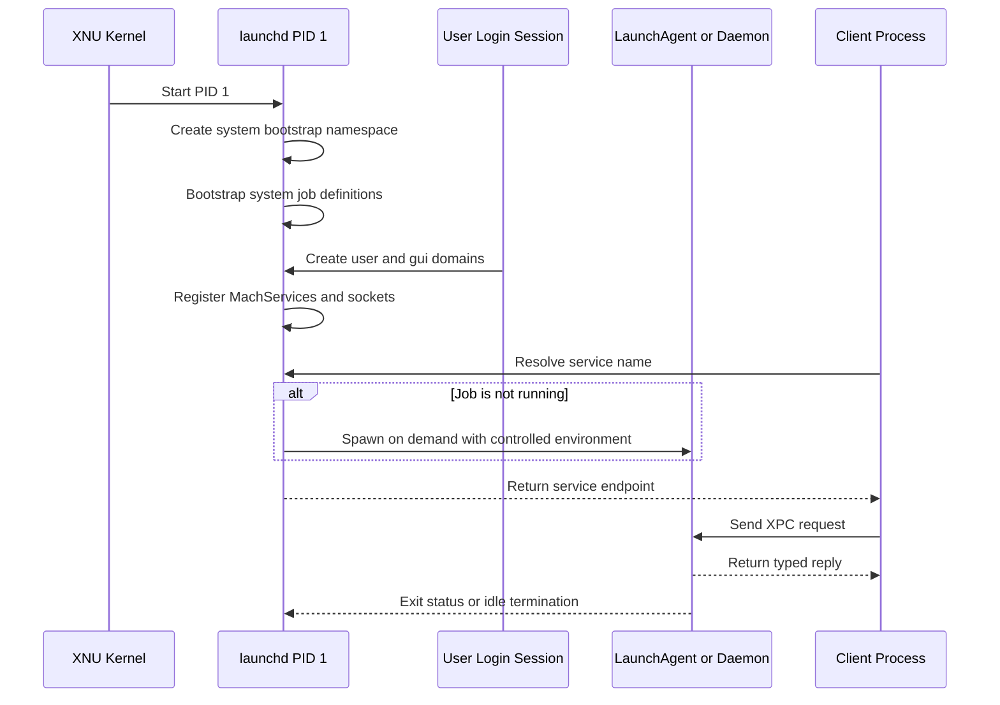

# 🍎 macOS Processes & Daemons

> [!abstract] Note of [[macOS]]
> `launchd` is PID 1, a service broker, a job supervisor, and the owner of macOS bootstrap namespaces. This masterclass explains process lifecycle, job domains, modern `launchctl`, agents, daemons, XPC, privileged helpers, persistence analysis, and safe service debugging.

## Parent Learning Order
macOS Darwin & XNU Kernel -> macOS CLI & Unix Backend -> macOS APFS & File System -> macOS Processes & Daemons -> macOS Identity, Keychain & Credentials -> macOS Networking Internals -> macOS Security Mechanisms -> macOS Binaries & Runtime Loading -> macOS Observability, Incident Response & Forensics

## Crook — Process Lifecycle & PID 1

### Vocabulary & First Mental Model

A **program** is executable code stored on disk; a **process** is a running instance with memory, credentials, open resources, and a process identifier. A **daemon** is a background service not tied to one interactive terminal. A **LaunchDaemon** is normally system-scoped, while a **LaunchAgent** runs in a user or graphical-login context. A job's **property list** is its configuration, not proof that it is running. A **bootstrap domain** is a namespace in which service names are registered. **XPC** is Apple's higher-level message system built largely over Mach IPC. A **socket-activated** or **Mach-activated** job can remain stopped until a client requests its published endpoint.

The beginner's model has four separate objects: a plist declares a job, `launchd` registers and supervises it, a process may be created when policy requires it, and a client communicates through a named endpoint. Investigations become unreliable when these are collapsed into one idea. A file can exist without registration, a job can be registered without a PID, and a short-lived process can execute between two process-list snapshots.

At boot, the kernel starts `launchd` as PID 1. It creates the system bootstrap namespace, loads Apple and third-party system jobs, and later creates per-user and graphical-login domains. Unlike a traditional init script runner, `launchd` is demand-oriented: it can hold sockets or Mach service names and start a process when a client first requests the resource. A job can therefore be loaded but have no current PID.

Processes still follow Unix semantics: a parent creates a child, executable loading replaces an address space, and exit produces a status. `launchd` adds supervision, throttling, resource publication, and lifecycle policy. Correct analysis distinguishes a **job definition** from a **running process** and a **registered service endpoint**.



`ps` shows processes. `launchctl` interrogates launch domains. The domain-target syntax is fundamental:

- `system` — system-wide jobs, commonly daemons;
- `user/<uid>` — user context independent of a GUI login;
- `gui/<uid>` — graphical login session and agents;
- `pid/<pid>` — process-local bootstrap context in advanced debugging.

```bash
ps -p 1 -o pid,ppid,user,state,lstart,command
launchctl print system | sed -n '1,50p'
launchctl print gui/$(id -u) | sed -n '1,50p'
launchctl manageruid
```

Expected PID 1 evidence:

```text
 PID PPID USER STATE STARTED                     COMMAND
   1    0 root Ss    Thu Jul 31 09:14:02 2026    /sbin/launchd
system = {
    type = system
    handle = 0
    active count = 412
}
```

## Operator — Job Definitions, Domains & Debugging

### Agents, Daemons & Search Paths

| Definition path | Typical domain | Identity | Trust notes |
| --- | --- | --- | --- |
| `/System/Library/LaunchDaemons` | system | system service | sealed Apple content |
| `/Library/LaunchDaemons` | system | root or declared user | machine-wide third party |
| `/System/Library/LaunchAgents` | gui/user | logged-in user | Apple session service |
| `/Library/LaunchAgents` | gui/user | logged-in user | machine-wide third party |
| `~/Library/LaunchAgents` | gui/user | owning user | user-writable persistence surface |

A job plist normally contains `Label`, `Program` or `ProgramArguments`, and optional activation/lifecycle keys. `MachServices` and `Sockets` enable demand activation. `KeepAlive` is more expressive than “always restart”; dictionaries can condition behavior on successful exit, network state, or paths. `ThrottleInterval` prevents crash loops. `ProcessType` and resource-limit keys influence scheduling behavior.

Use `plutil` to validate a definition before drawing conclusions:

```bash
plutil -lint ~/Library/LaunchAgents/com.example.lab.plist
plutil -p ~/Library/LaunchAgents/com.example.lab.plist
launchctl print gui/$(id -u)/com.example.lab
```

Typical service state:

```text
gui/501/com.example.lab = {
    active count = 1
    path = /Users/analyst/Library/LaunchAgents/com.example.lab.plist
    state = running
    program = /usr/bin/logger
    pid = 4912
    last exit code = 0
}
```

Modern lifecycle verbs are explicit:

```bash
launchctl bootstrap gui/$(id -u) /path/to/job.plist
launchctl kickstart -k gui/$(id -u)/com.example.lab
launchctl kill TERM gui/$(id -u)/com.example.lab
launchctl bootout gui/$(id -u)/com.example.lab
```

Legacy `load` and `unload` commands obscure domain semantics. In a production incident, do not boot out a job before preserving its plist, executable, process tree, open files, code signature, hash, and current `launchctl print` state.

The launched environment is intentionally sparse. Job definitions should use absolute executable paths and explicit environment variables. Relative paths and shell metacharacters are not interpreted unless the job deliberately launches a shell. `ProgramArguments` is an argument vector, not a command line string.

### Process Observation

```bash
pgrep -alf 'target-name'
ps -axo pid,ppid,uid,gid,state,start,time,command
proc_pidpath 4912 2>/dev/null || true
lsof -nP -p 4912
sample 4912 3 1
sudo fs_usage -w -f filesystem 4912
```

`sample` captures user-space stack traces and is useful for hangs. `spindump` provides broader system diagnostics. `fs_usage` shows live filesystem calls but can be noisy and requires privilege. Activity Monitor provides a graphical view but should not replace recorded command output during an investigation.

## Root — XPC, Privileged Helpers & Persistence Analysis

**XPC** wraps Mach IPC in typed dictionaries, arrays, primitives, file descriptors, and endpoint objects. A service advertises a name, `launchd` brokers activation, and the client sends messages over an XPC connection. The service obtains an **audit token** describing the peer's effective identity and code-signing context. Secure privileged services authorize each sensitive request; they do not trust a caller-supplied username, PID, path, or “isAdmin” field.

An application may embed an XPC service under `Contents/XPCServices`. Privileged helper tools are commonly installed under `/Library/PrivilegedHelperTools` with corresponding launch definitions. Newer ServiceManagement APIs and managed background-task controls have replaced portions of older `SMJobBless` workflows, but legacy helpers remain common in enterprise software.

Security review asks:

1. Who can resolve and connect to the service?
2. Does the service derive identity from the audit token?
3. Does it verify signing identifier, team identifier, designated requirement, UID, or entitlement as appropriate?
4. Are message types, lengths, paths, and state transitions validated?
5. Are filesystem operations resistant to symlink and TOCTOU races?
6. Does the helper run with more privilege than required?

Persistence review must correlate definition, registration, and execution:

```bash
find ~/Library/LaunchAgents /Library/LaunchAgents /Library/LaunchDaemons \
  -type f -name '*.plist' -print 2>/dev/null
sfltool dumpbtm 2>/dev/null | sed -n '1,120p'
ls -la /Library/PrivilegedHelperTools
launchctl print-disabled system
```

For each non-Apple item, extract the executable path, arguments, working directory, environment, triggers, ownership, ACLs, signature, notarization, hashes, and timestamps:

```bash
job='/Library/LaunchDaemons/com.vendor.agent.plist'
plutil -p "$job"
exe=$(/usr/libexec/PlistBuddy -c 'Print :Program' "$job" 2>/dev/null)
ls -leO@ "$job" "$exe"
codesign --verify --strict --verbose=2 "$exe"
codesign -dv --verbose=4 "$exe" 2>&1
spctl --assess --type execute -vv "$exe"
shasum -a 256 "$job" "$exe"
```

A plist in `~/Library/LaunchAgents` is not automatically malicious. Updaters, synchronization tools, developer software, and enterprise agents use the same mechanism. Suspicion grows when the path is user-writable, label imitates Apple, executable is unsigned or ad hoc signed, arguments decode hidden content, timestamps conflict with installation records, or the job has no accountable owner.

### Safe XPC Architecture Pattern

```swift
// Defensive design sketch: authorization must derive from connection metadata.
final class ListenerDelegate: NSObject, NSXPCListenerDelegate {
    func listener(_ listener: NSXPCListener,
                  shouldAcceptNewConnection connection: NSXPCConnection) -> Bool {
        // Validate the peer's audit token and signing requirement here.
        // Expose only a narrow protocol; validate every path and argument again.
        connection.exportedInterface = NSXPCInterface(with: LabProtocol.self)
        connection.exportedObject = LabService()
        connection.resume()
        return true
    }
}
```

The sketch intentionally omits a security-sensitive implementation. Its lesson is architectural: connection acceptance, message validation, authorization, and filesystem safety are separate controls.

### Crash Loops, Transactions & Resource Pressure

`launchd` records last exit status and throttles jobs that terminate repeatedly. A rapidly respawning service may indicate a bad update, missing dependency, corrupted configuration, or deliberate persistence; the process list alone can miss it between launches. Correlate `launchctl print`, crash reports, and Unified Logs.

```bash
launchctl print system/com.vendor.agent | egrep 'state|runs|last exit|throttle|pid'
log show --last 30m --predicate 'process == "launchd" AND eventMessage CONTAINS[c] "com.vendor.agent"' --style compact
```

XPC transactions can keep a demand-launched process alive while work is outstanding, after which it may exit normally. This is not necessarily instability. Analysts should distinguish on-demand idle exit, clean completion, signal termination, jetsam/resource pressure, and crash. A service's expected lifecycle is part of its baseline.

## Hands-On Authorized Lab & Debugging Exercise

Create a user-only job that writes one message through `/usr/bin/logger`; do not use persistence on a shared or production host.

```bash
labdir="$HOME/macos-launchd-lab"
mkdir -p "$labdir"
```

Create `com.example.c2r.lab.plist` in that directory with `Label`, `ProgramArguments` containing `/usr/bin/logger` and `C2R launchd lab executed`, plus `RunAtLoad` set to true. Then:

```bash
plutil -lint "$labdir/com.example.c2r.lab.plist"
launchctl bootstrap gui/$(id -u) "$labdir/com.example.c2r.lab.plist"
launchctl print gui/$(id -u)/com.example.c2r.lab
log show --last 2m --predicate 'eventMessage CONTAINS "C2R launchd lab"' --style compact
launchctl bootout gui/$(id -u)/com.example.c2r.lab
rm "$labdir/com.example.c2r.lab.plist"
rmdir "$labdir"
```

Expected result includes `last exit code = 0` and one log message. If bootstrap reports `Input/output error`, inspect the plist with `plutil`, verify file ownership, and use `launchctl print` for an existing registration before changing anything.

## Cybersecurity Implications

- Job definitions are durable configuration; bootstrap namespaces are runtime authority; processes are evidence of execution.
- User LaunchAgents are easy to create but limited to user privilege, while system daemons and helpers carry greater impact.
- XPC converts service names and port rights into a modern IPC model, but authorization remains the service's responsibility.
- `ProgramArguments`, environment, writable paths, and helper validation are high-value audit points.
- Investigation should preserve state before unloading, killing, or deleting a suspicious service.

## Crook → Operator → Root Checkpoint

- **Crook:** Distinguish a process, launch job, agent, daemon, and XPC service.
- **Operator:** Navigate system, user, and GUI domains; validate plists; inspect lifecycle state; and debug a harmless user job.
- **Root:** Trace client lookup through bootstrap namespace and XPC transport into a privileged helper, prove the caller-authorization boundary, and reconstruct persistence from configuration, registration, process, signature, and log evidence.

---
> 🔼 Up: [[macOS]]
