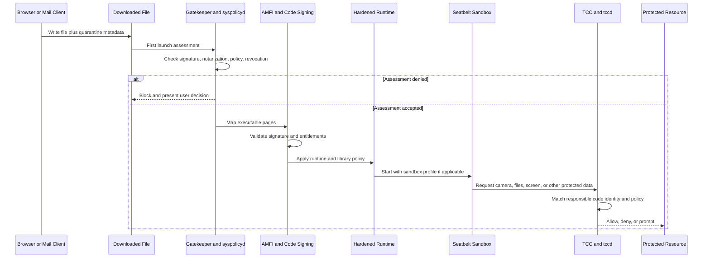

# 🍎 macOS Security Mechanisms

> [!abstract] Note of [[macOS]]
> macOS security is a chain of independent controls rather than one shield. This masterclass explains where Gatekeeper, notarization, XProtect, AMFI, Hardened Runtime, SIP, TCC, Seatbelt, FileVault, Endpoint Security, and Apple Silicon hardware trust act—and how to validate each layer without weakening it.

## Parent Learning Order
macOS Darwin & XNU Kernel -> macOS CLI & Unix Backend -> macOS APFS & File System -> macOS Processes & Daemons -> macOS Identity, Keychain & Credentials -> macOS Networking Internals -> macOS Security Mechanisms -> macOS Binaries & Runtime Loading -> macOS Observability, Incident Response & Forensics

## Crook — Layered Trust From Download to Data

### Vocabulary & First Mental Model

**Provenance** describes where an artifact came from. **Identity** describes who signed or is running it. **Integrity** asks whether protected bytes changed. **Authorization** decides whether a particular actor may perform an operation. **Containment** limits what already-running code can reach. **Confidentiality** keeps data unreadable to unauthorized actors. **Attestation** is evidence about software or device state supplied to another decision-maker. A **policy decision point** evaluates evidence; an **enforcement point** allows, denies, prompts, or constrains the operation.

Use a layered mental model: secure boot establishes the operating system, quarantine and Gatekeeper assess acquired software, AMFI and code signing police executable code, Hardened Runtime limits mutation, Seatbelt limits application reach, TCC guards privacy classes, SIP and the Signed System Volume protect platform integrity, FileVault protects powered-off storage, and XProtect or security products inspect activity. The same action can pass one layer and fail another because each control answers a different question.

Security questions become clearer when mapped to execution stages. Quarantine records provenance. Gatekeeper evaluates first launch of quarantined content. Notarization provides Apple-issued evidence that submitted software passed automated checks at a point in time. Code signing identifies sealed code and entitlements. **AMFI** (Apple Mobile File Integrity) enforces code-signing policy. Hardened Runtime constrains dynamic modification. Seatbelt limits sandboxed operations. **TCC** controls access to privacy-sensitive resources. SIP protects platform files and processes even from root. FileVault protects offline data. XProtect and its remediation components detect known threats. Endpoint Security exposes security events to approved products.



No single layer guarantees benign behavior. A validly signed and notarized application can later become vulnerable or malicious. An unsigned local development binary may be legitimate but carry more risk. A TCC grant authorizes a category of access; it does not validate what the application does with the data.

## Operator — Mechanisms & Validation

### Quarantine, Gatekeeper & Notarization

Applications that download files through quarantine-aware APIs attach `com.apple.quarantine`. The semicolon-delimited value commonly includes flags, timestamp, agent, and event identifier. LaunchServices and Gatekeeper use this provenance during first execution.

```bash
xattr -p com.apple.quarantine ~/Downloads/Example.dmg
mdls -name kMDItemWhereFroms -name kMDItemDownloadedDate ~/Downloads/Example.dmg
spctl --assess --type open --context context:primary-signature -vv ~/Downloads/Example.dmg
spctl --assess --type execute -vv /Applications/Example.app
stapler validate /Applications/Example.app
```

Expected assessment styles:

```text
/Applications/Example.app: accepted
source=Notarized Developer ID
origin=Developer ID Application: Example Corp (TEAMID1234)
```

`spctl` acceptance is one observation, not blanket trust. Record signature chain, team identifier, notarization status, quarantine provenance, hash, version, and distribution source. Do not clear quarantine during validation; that destroys useful context and changes policy behavior.

### Code Signing, AMFI & Hardened Runtime

Mach-O code signatures cover executable pages and selected bundle resources. The designated requirement expresses code identity. Entitlements are signed claims consumed by system services. AMFI validates code before execution and constrains dynamic code. Hardened Runtime opts software into stronger protections such as library validation, debugger restrictions, and limits on unsigned executable memory, with narrowly scoped entitlements for legitimate exceptions.

```bash
codesign --verify --deep --strict --verbose=4 /Applications/Safari.app
codesign -dv --verbose=4 /Applications/Safari.app 2>&1
codesign -d --entitlements :- /Applications/Safari.app 2>/dev/null
csreq -r- -t < <(codesign -d -r- /Applications/Safari.app 2>&1 | sed 's/^designated => //')
```

Expected details include:

```text
Identifier=com.apple.Safari
Format=app bundle with Mach-O universal (x86_64 arm64e)
CodeDirectory v=20500 size=... flags=0x12000(runtime,kill)
TeamIdentifier=not set
Runtime Version=...
```

Apple platform binaries use Apple trust semantics and may not show a third-party TeamIdentifier. Dangerous entitlements—debugging, unsigned executable memory, disabled library validation, broad device access—require context rather than automatic condemnation.

### SIP & Authenticated Root

SIP restricts writes to protected filesystem locations, attachment to protected processes, loading of untrusted kernel code, and selected system modifications even for UID 0. Authenticated root extends integrity to the sealed System volume. Both are configured from Recovery, which creates a meaningful administrative boundary.

```bash
csrutil status
csrutil authenticated-root status
ls -ldO /System /usr /usr/local
```

Expected secure state:

```text
System Integrity Protection status: enabled.
Authenticated Root status: enabled.
drwxr-xr-x  restricted ... /System
```

Do not disable these controls for routine troubleshooting. If a vendor demands reduced security, record the exact business requirement, scope, compensating controls, and rollback plan.

### TCC

Transparency, Consent & Control governs privacy-sensitive services such as camera, microphone, contacts, calendars, screen capture, accessibility, automation, developer tools, and protected file locations. `tccd` evaluates the responsible code identity, service, user, MDM policy, and prior decision. User and system TCC databases record decisions, but direct modification is unsupported and protected.

```bash
# Read only within authorized forensic scope; access may require Full Disk Access.
sqlite3 "$HOME/Library/Application Support/com.apple.TCC/TCC.db" \
  'SELECT service,client,auth_value,auth_reason,last_modified FROM access ORDER BY last_modified DESC LIMIT 20;'
log show --last 30m --predicate 'subsystem == "com.apple.TCC"' --style compact
```

Schema changes across OS versions, so queries must be validated against a forensic copy. MDM Privacy Preferences Policy Control profiles can pre-authorize or deny selected enterprise software. A grant to Accessibility or Full Disk Access deserves stronger review because it can expose broad interaction or data surfaces.

### Seatbelt, App Sandbox & Profiles

Seatbelt is the sandbox enforcement technology. Sandboxed applications carry `com.apple.security.app-sandbox` and related entitlements. Container directories isolate application data; extension and temporary entitlements mediate specific resources. A sandbox rule is independent of Unix permissions and TCC. Access succeeds only when every applicable control allows it.

```bash
codesign -d --entitlements :- /Applications/App.app 2>/dev/null
ps -axo pid,user,command | grep -i sandbox
sandbox-exec -p '(version 1)(deny default)(allow process*)' /usr/bin/true
```

`sandbox-exec` is deprecated as an application design interface but remains useful for understanding policy in a controlled lab. Never infer an active profile solely from a bundle location; inspect signed entitlements and runtime behavior.

### XProtect & Endpoint Security

XProtect applies Apple-managed detection rules and remediation. Security content updates independently from major OS releases. Endpoint Security clients receive structured AUTH and NOTIFY events for process and filesystem activity, subject to entitlement and user approval. AUTH events can permit or deny before completion; NOTIFY events report completed actions. Muting and caching improve performance but can create visibility tradeoffs.

```bash
system_profiler SPInstallHistoryDataType | grep -A3 -E 'XProtect|Gatekeeper'
systemextensionsctl list
log show --last 24h --predicate 'process CONTAINS[c] "XProtect"' --style compact
```

Endpoint Security is not itself an antivirus. It is a controlled telemetry and enforcement API used by security products. Product quality depends on event selection, policy, cache behavior, health monitoring, and protected data pipeline.

## Root — FileVault, Secure Enclave & Control Composition

FileVault protects the APFS Data volume at rest. On Apple Silicon, key release integrates with Secure Enclave and boot policy. Recovery mechanisms must be escrowed and governed; a lost recovery key can become an availability incident, while an exposed institutional key undermines confidentiality.

```bash
fdesetup status
profiles status -type enrollment
system_profiler SPHardwareDataType | egrep 'Chip|Activation Lock|Hardware UUID'
```

Controls compose as an intersection. For an application to read a protected file, it may need valid code, successful Gatekeeper assessment, allowed runtime behavior, sandbox permission, Unix permission, and a TCC grant. For a kernel modification, code-signing, SIP, boot policy, and hardware trust all matter. Modeling the failed layer prevents counterproductive “fixes” such as granting Full Disk Access when the actual problem is a sandbox entitlement.

| Objective | Primary gates | Evidence |
| --- | --- | --- |
| launch downloaded app | quarantine, Gatekeeper, notarization, signing | xattrs, `spctl`, policy logs |
| load library into app | AMFI, Hardened Runtime, library validation | signature flags, entitlements, crash logs |
| read protected user data | sandbox, Unix ACL, TCC | entitlements, TCC decisions, access events |
| alter platform files | SIP, SSV, authenticated root | `csrutil`, mount flags, seal state |
| protect powered-off data | FileVault, Secure Enclave, recovery policy | `fdesetup`, escrow records, boot policy |

## Hands-On Authorized Lab & Debugging Exercise

1. Choose one Apple app and one approved third-party app.
2. Record signature verification, designated requirement, runtime flags, entitlements, and Gatekeeper assessment.
3. Inspect quarantine only for a non-sensitive downloaded installer; preserve the original xattr.
4. Record SIP, authenticated-root, FileVault, MDM enrollment, System Extensions, and recent XProtect update evidence.
5. Trigger a harmless TCC request from a trusted test application, select **Deny**, and correlate the prompt time with TCC logs. Do not reset or alter production grants.
6. Build a control matrix explaining which layers apply before launch, during mapping, and during protected-resource access.

Expected secure baseline:

```text
System Integrity Protection status: enabled.
Authenticated Root status: enabled.
FileVault is On.
source=Notarized Developer ID
valid on disk
satisfies its Designated Requirement
```

## Cybersecurity Implications

- Valid signing and notarization establish identity and distribution checks, not permanent innocence.
- Root does not bypass SIP, authenticated root, Hardened Runtime, or every TCC decision.
- TCC, Seatbelt, Unix permissions, and code-signing policy are separate gates that must be diagnosed separately.
- Quarantine and policy logs are evidence; removing metadata before collection damages the investigation.
- Hardware-backed boot and storage protections raise attacker cost but depend on secure recovery and fleet configuration.

## Crook → Operator → Root Checkpoint

- **Crook:** Name each security layer and the stage where it acts.
- **Operator:** Validate signing, notarization, quarantine, SIP, TCC, FileVault, and extension state with native commands and interpret expected output.
- **Root:** Model a complete access decision across provenance, code identity, runtime, sandbox, privacy, filesystem, boot, and hardware controls—then identify the minimum safe remediation without disabling unrelated protections.

---
> 🔼 Up: [[macOS]]
