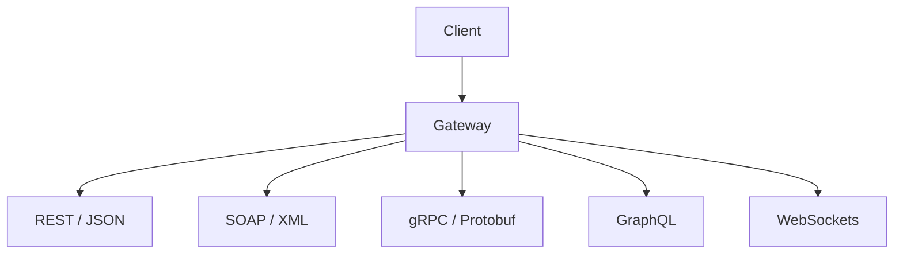

# API & Modern Protocol Testing

> [!abstract] Lifecycle branch
> Test machine-to-machine trust, object authorization, schema boundaries, state, identity, and resource controls across modern application protocols.

## 🗺️ Zero-to-Mastery Learning Path

1. [[REST API Security Testing]]
2. [[WSDL Security Testing]]
3. [[SOAP Security Testing]]
4. [[XML API Security Testing]]
5. [[GraphQL Security Testing]]
6. [[gRPC & Protocol Buffers Security Testing]]
7. [[WebSocket Security Testing]]
8. [[API Authorization Testing]]
9. [[API Rate Limit Security]]
10. [[API Business Logic Security]]

---
> 🔼 Up: [[Penetration Testing]]
