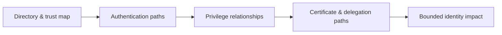

# Active Directory & Identity Exploitation

> [!warning] Authorized enterprise testing
> Identity attacks can affect every trusted system. Use canary principals, explicit lockout limits, bounded proofs, and immediate cleanup.

## 🗺️ Zero-to-Mastery Learning Path

1. [[Active Directory Architecture for Operators]]
2. [[Kerberos Attack Methodology]]
3. [[NTLM Attack Methodology]]
4. [[Active Directory Enumeration & Attack Paths]]
5. [[Active Directory Delegation Abuse]]
6. [[Active Directory ACL & ACE Abuse]]
7. [[Group Policy Object Abuse]]
8. [[NTLM Relay & Authentication Coercion]]
9. [[Active Directory Certificate Services Security]]
10. [[Domain Persistence]]
11. [[Trust Abuse]]

---
> 🔼 Up: [[Penetration Testing]]
