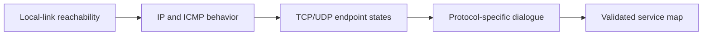

# Active Reconnaissance & Port Scanning

> [!abstract] Methodology
> Active reconnaissance sends controlled probes to answer bounded questions: Is the host reachable? Which transport endpoints respond? What does filtering reveal about the network path? Which services deserve protocol-specific enumeration? The discipline is packet interpretation, uncertainty, and safe coverage—not memorizing scanner flags.

> [!danger] Authorized traffic only
> Discovery can trigger alerts, fill firewall state tables, lock fragile devices, or violate provider policy. Written scope must define source addresses, targets, rates, windows, prohibited systems, stop conditions, and escalation contacts.

## Layered discovery

Active recon proceeds from low-cost questions to higher-detail interaction:



Each layer can fail independently. A host may ignore ICMP but accept HTTPS; a firewall may answer on behalf of a host; a load balancer may expose one service while origins remain hidden.

## Host-discovery theory

On a local Ethernet, address resolution is authoritative for same-subnet communication: a host must resolve a link-layer address before frames can be delivered. Across routers, discovery relies on IP-layer behavior:

- ICMP echo replies indicate reachability but are commonly filtered.
- ICMP timestamp or address-mask behavior may vary by operating system and policy.
- TCP SYN to common listening ports can elicit SYN/ACK or RST.
- TCP ACK can reveal whether a path permits established-looking traffic.
- ICMP unreachable messages may identify routers, filters, or closed UDP endpoints.

No response is ambiguous: the host may be down, the probe may be filtered, the return path may differ, or rate limiting may suppress the answer.

## TCP state inference

The three-way handshake creates distinct observable transitions:

```text
Client                         Server
  SYN  ------------------------>
       <------------------ SYN/ACK     listening endpoint
  ACK  ------------------------>       established connection
```

For a closed endpoint, a reachable stack commonly returns RST. A stateful firewall may silently discard the SYN, actively reject it, proxy the handshake, rate-limit it, or present a tarpitted response.

### Full-connect versus half-open discovery

- A **full-connect** probe completes the handshake and is processed like a normal application connection. It is reliable and application-visible.
- A **half-open SYN** probe interprets SYN/ACK, then avoids establishing a sustained session. It reduces application interaction but remains obvious to network sensors.
- **ACK probes** test filtering state rather than listener state.
- **FIN/NULL/Xmas-style probes** rely on expected RFC behavior for unexpected flag combinations. Many stacks and middleboxes make their results ambiguous.

"Stealth scan" is a historical label, not an operational guarantee. Modern controls correlate packet patterns regardless of whether the final ACK is sent.

## TCP flags and interpretation

| Observation | Likely interpretation | Alternative explanations |
|---|---|---|
| SYN/ACK after SYN | Listening TCP socket or proxy | SYN proxy, load balancer, deception service |
| RST after SYN | Reachable host, closed socket | Active reject by firewall |
| Silence after SYN | Filtered or lost | Host down, asymmetric path, rate limiting |
| RST after ACK | Path unfiltered to a TCP stack | Firewall-generated reset |
| Silence after FIN | Open or filtered under RFC inference | Nonconforming stack, loss |

Confidence increases when multiple probe types and vantage points agree.

## UDP state inference

UDP has no handshake. A protocol-specific response strongly indicates an open service. ICMP port-unreachable usually indicates closed. Silence remains `open or filtered` because:

- The service may accept only valid application payloads.
- The firewall may drop the datagram.
- The response may be lost.
- ICMP error generation may be rate-limited.

Therefore UDP coverage should prioritize high-value protocols, use valid protocol probes, allow longer timeouts, and avoid interpreting silence as evidence of absence.

## Dropping versus rejecting

A firewall **drop** produces silence. A **reject** actively returns RST or an ICMP administrative prohibition. Their operational implications differ:

- Drop obscures topology but lengthens client timeouts and scanning.
- Reject gives faster failure and clearer troubleshooting.
- Inconsistent behavior across ports or paths can reveal policy boundaries.
- A firewall may normalize fragments, proxy TCP, or rate-limit responses.

Filtering state is itself intelligence: it shows where trust changes, which protocols are intentionally exposed, and whether internal and external vantage points see different policy.

## TTL, hop count, and path inference

IP TTL decreases at every routed hop. The observed TTL can suggest an initial value and approximate path length, but it is not a reliable operating-system fingerprint by itself. Common initial values overlap, middleboxes terminate sessions, tunnels add complexity, and routes change.

Path-expiry responses can locate routing boundaries. Compare forward and return behavior, repeat over time, and avoid treating a single hop sequence as a complete topology.

## Port selection as threat modeling

Scanning every endpoint gives coverage; prioritization gives speed. High-value categories include:

- Remote administration and terminal access.
- Identity, directory, and authentication services.
- File sharing and remote procedure calls.
- Databases, message queues, and caches.
- Web, API, orchestration, and management interfaces.
- Name resolution, monitoring, and network-management protocols.
- Industrial, embedded, and backup services where availability risk is high.

A lucrative port is not necessarily vulnerable. Its value comes from the capability behind it: authentication, privileged management, data access, trust brokerage, or lateral movement.

## Service and operating-system inference

Endpoint state should be followed by controlled protocol dialogue. Service identity can derive from:

- Banner and greeting structure.
- TLS certificate and negotiated protocol.
- Supported methods, extensions, or dialects.
- Error messages and response timing.
- Packet-stack characteristics.
- Authenticated package/build evidence supplied by the client.

Version strings are weak evidence because proxies rewrite them and vendors backport patches. Fingerprinting should produce a confidence level and competing explanations.

## Rate, timing, and scan geometry

Scan design balances coverage, duration, reliability, and impact:

- **Horizontal scan:** a small port set across many hosts; useful for exposure patterns.
- **Vertical scan:** many ports on one host; useful for deep host inventory.
- **Distributed scan:** multiple approved sources; useful for scale but harder to correlate safely.
- **Low-and-slow scan:** reduces instantaneous load but extends the detection and change window.

More speed increases packet loss, firewall-state pressure, endpoint load, and false negatives. Start with a representative canary, observe production health, and expand in waves.

## Vantage points

The same asset should be considered from relevant trust zones:

- Public internet.
- Corporate user network.
- Server or data-center segment.
- Management network.
- Cloud workload network.
- VPN or partner connection.

Differences reveal segmentation and access-control intent. Never introduce a new vantage point without explicit authorization.

## Evidence model

For each observation record:

```text
Asset and owner hypothesis
Source and destination vantage points
Protocol/port and packet pattern
Observed state and timestamp
Retries, loss, and confidence
Filtering interpretation
Potential service role
Next protocol-specific question
```

The root-level operator understands that port scanning is inference under imperfect visibility. They distinguish host state from path behavior, listener state from application identity, and a useful lead from a proven vulnerability.

---
> 🔼 Up: [[Network Penetration Testing]]
