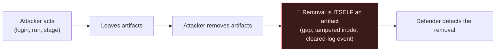

# Anti-Forensics & ShadowStep

> [!danger] Authorized Red Team Simulation / Incident-Response Training only
> This chapter documents **anti-forensics** — the techniques an intruder uses to remove evidence — for one purpose: **so defenders and IR teams can detect them.** Every technique is mapped to the artifact it leaves and the alert it fires (**Module 3.5**). Running these actions is legal only within a **sanctioned red-team engagement on systems you are contracted to test** or your **own IR lab**. Tampering with logs or destroying evidence on systems you don't own is a serious crime (obstruction, unauthorized modification). *You cannot build detections for what you don't understand — that is why this is here.*

> [!abstract] The Masterclass
> After escalation, a red-team operator emulating an advanced adversary will try to **minimise their forensic footprint** — the MITRE ATT&CK tactic **Defense Evasion → Indicator Removal (T1070)**. This chapter covers where evidence lives, and features **ShadowStep**, an open-source anti-forensics toolkit, as the practical example — precisely so the **Advanced Defenses** chapter can show how each move is caught. **`#level/root`**

> [!tip] Chapter Map
> **** · **** · **** · ****

---

## Anti-Forensics & the Attacker's Dilemma

Anti-forensics aims to **disrupt, delay, or defeat** an investigation by removing or corrupting the artifacts a responder would rely on. But it rests on a paradox the defender exploits:



> **The core lesson:** *the act of covering tracks leaves tracks.* A cleared log is more suspicious than a full one; a shredded file leaves a hole in the filesystem timeline. Anti-forensics buys **time**, not invisibility — and against **off-host log forwarding**, it buys almost nothing.

---

## Where the Evidence Lives

Know the targets before you understand the tooling:

| Artifact | Location (Linux) | What it proves |
| --- | --- | --- |
| **Auth log** | `/var/log/auth.log`, `secure` | logins, `sudo`, SSH sessions |
| **utmp / wtmp / btmp** | `/var/run/utmp`, `/var/log/wtmp`, `btmp` | who's logged in now / login history / failed logins (`who`, `last`, `lastb`) |
| **lastlog** | `/var/log/lastlog` | each user's last login |
| **Shell history** | `~/.bash_history`, `~/.zsh_history` | commands run |
| **Syslog / journald** | `/var/log/syslog`, `journalctl` | system + service events |
| **File MAC times** | inode metadata | Modified/Accessed/Changed timeline |
| **Windows** | Security/System/PowerShell Event Logs, Prefetch, `$MFT`, USN journal, AmCache | logons, execution, file activity |

---

## ShadowStep — the Anti-Forensics Toolkit

> [!info] What ShadowStep is
> **ShadowStep** is an open-source, **Python-based anti-forensics command-line toolkit** distributed through the package-distribution platforms. It's a *modular* front-end that unifies three post-engagement clean-up capabilities behind one interface — **Log Manipulation**, **Data Shredding**, and **Network Identity Masking** — so a red team can consistently emulate an advanced adversary's evasion behaviour (and a blue team can rehearse detecting it). It is a **teaching / red-team-emulation** tool: each command below is annotated with the trace it *cannot* hide.

```bash
pipx install shadowstep          # PyPI (isolated CLI)
sudo apt install shadowstep      # Debian/Kali repositories
shadowstep --version
```
```shell-session
$ shadowstep --version
ShadowStep 2.1.0  (authorized-engagement use only)
```

### Capability 1 — Log Manipulation
Selectively removes an engagement's entries from host logs and wipes login records. Illustrative session (authorized engagement, scoped to the operator's own test IP):
```shell-session
# Remove only the engagement's source-IP lines from the auth log:
$ sudo shadowstep log clean --file /var/log/auth.log --filter "203.0.113.10" --backup
[i] 14 matching entries found · original backed up to /root/.ss/auth.log.bak
[✓] entries removed · file re-written
[!] ARTIFACT: file mtime updated; a forwarded copy may already exist on the SIEM

# Wipe binary login records (who / last / lastb):
$ sudo shadowstep log wipe --utmp --wtmp --btmp
[✓] cleared /var/run/utmp, /var/log/wtmp, /var/log/btmp
[!] ARTIFACT: zeroed records leave a session gap; wtmp inode ctime changes
```
> These write over `sed -i` / `utmpdump`-style edits. **What it can't hide:** the gap in continuous log sequence numbers, the changed file `ctime`, journald's own tamper hints, and — decisively — anything already **forwarded off-host**.

### Capability 2 — Data Shredding
Securely destroys staged tools and payloads so they can't be carved back (beyond a simple `rm`, which only unlinks):
```shell-session
$ shadowstep shred /tmp/payload.elf --passes 3
[✓] /tmp/payload.elf overwritten (3 passes) + unlinked
$ shadowstep shred --dir /opt/staging --recursive
[✓] 6 files shredded in /opt/staging
[!] ARTIFACT: filesystem timeline shows a deletion event; journaling FS / SSD wear-levelling may retain blocks
```
> Wraps `shred`/`wipe` semantics. **What it can't hide:** on journaling filesystems (ext4) and SSDs (wear levelling / TRIM timing), secure overwrite is unreliable; the `$MFT`/USN (Windows) or inode timeline still records that *something* was deleted.

### Capability 3 — Network Identity Masking
Changes host-level network identifiers so post-engagement pivoting isn't trivially tied to one machine:
```shell-session
$ sudo shadowstep mask --mac eth0            # randomise MAC (macchanger-style)
[✓] eth0 MAC 00:0c:29:ab:cd:ef → 02:1a:3b:4c:5d:6e
$ sudo shadowstep mask --hostname "wks-04"   # transient hostname change
[✓] hostname masked
$ sudo shadowstep mask --restore eth0        # revert at end of engagement
[!] ARTIFACT: switch/NAC logs the MAC change; DHCP lease + ARP tables record both identities
```
> **What it can't hide:** managed switches, **NAC (802.1X)**, DHCP servers, and ARP tables all log identity changes; a new MAC on a known port is itself an alert.

---

## Why Anti-Forensics Fails (→ Detection)

Assemble the annotations above into the defender's advantage — this is the bridge to **Module 3.5**:

| Anti-forensic action | The trace it leaves (the detection) |
| --- | --- |
| Clear/edit `auth.log` | **Off-host forwarded copy** already on the SIEM; sequence gap; mtime change |
| Wipe `wtmp`/`utmp` | Session gap; inode `ctime` anomaly; `last` output stops abruptly |
| Clear Windows Security log | **Event ID 1102** ("audit log cleared") — a top-priority alert |
| Shred payloads | Deletion event in FS timeline / USN journal; EDR already captured the file hash on write |
| Mask MAC/hostname | NAC/switch/DHCP logs; ARP anomaly |
| Stop/disable logging (auditd, Sysmon) | Service-stop event; sudden telemetry silence ("the dog that didn't bark") |

> **Immutable, off-host, real-time-forwarded logging is the counter to all of it.** An attacker can own the host, but not the SIEM they never touched. The single most valuable defensive control against everything in this chapter is **shipping logs off the endpoint the instant they're written.** Detections: **Advanced Defenses (Detecting Anti-Forensics)**.

---

## 🔗 Related Master Notes & Deep-Dives
- **Advanced Defenses (Detecting Anti-Forensics)** — how every action above is caught
- **Windows and OS Internals (Windows Event Logs)** — the logs targeted (Event ID 1102)
- **3.1 Privilege Escalation & Living off the Land** — the access that precedes clean-up
- **OWASP Top 10 (A09 Security Logging and Monitoring Failures)** — why logging matters
- [[Red Team Operations]] — domain hub
