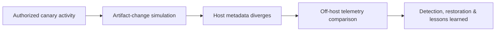

# Anti-Forensics Methodology

> [!danger] Incident-response training only
> Anti-forensics testing requires explicit authorization, disposable canary data, off-host evidence preservation, an immutable activity ledger, and a complete restoration plan. Never alter production evidence needed for legal, regulatory, or operational investigations.

## Core Concept

Anti-forensics attempts to reduce, alter, delay, or confuse evidence about an action. Atomic study focuses on four mechanics: artifact removal, timestamp or metadata manipulation, telemetry interruption, and identity or traffic ambiguity. Every host-side action creates secondary evidence, so the professional objective is to validate whether defenders can detect inconsistency—not to promise impossible invisibility.

## Visual Attack Flow



## Practical Payloads & Execution

Use a synthetic log fixture rather than a live security log. Record hashes before and after the controlled transformation and compare the result with the immutable collector copy.

```text
fixture=/lab/logs/auth-canary.log
original_sha256=8f0c...c214
authorized_action=remove event_id C2R-CANARY-17 from working copy
immutable_copy=collector://rt-2026/C2R-CANARY-17
impact_ceiling=one synthetic record
```

### Expected output

```text
working_copy_event=absent
working_copy_hash=54ab...9120
collector_event=present
sequence_gap_detected=true
file_metadata_changed=true
restoration_verified=true
```

The discrepancy proves the defensive requirement: endpoints cannot be the sole authority for their own audit history. Data shredding and network-identity masking are evaluated with the same canary-first method. Product installation, flags, and operational manuals—including those for **ShadowStep**—remain in the Tooling domain.

## Real-World Scenario

During an authorized red-team exercise, a canary administrator session generates a uniquely tagged authentication event. The team modifies only a laboratory working copy, while defenders compare endpoint state with forwarded SIEM data, filesystem metadata, identity-provider records, DHCP history, and endpoint telemetry. The exercise stops after the detection path is proven and restores the fixture from its signed baseline.

## Defensive Engineering & Retest

Use immutable off-host collection, authenticated time, sequence validation, write-once retention, protected sensor health, redundant identity and network telemetry, file-integrity monitoring, and alerts for log clearing or sudden silence. Retesting must confirm both detection of the canary discrepancy and preservation of legitimate administrative workflows.

---
> 🔼 Up: [[C2 Infrastructure & Operational Security]]
