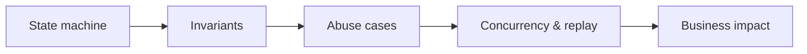

# Business Logic & Workflow Security

## 🗺️ Zero-to-Mastery Learning Path

1. [[Business Logic Testing]]
2. [[Multi-Tenant Isolation Testing]]
3. [[Payment Workflow Security]]
4. [[Entitlement Security Testing]]
5. [[Race Condition & Concurrency Testing]]

---
> 🔼 Up: [[Web Application Penetration Testing]]
